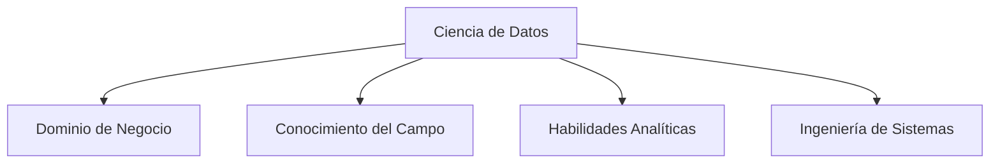
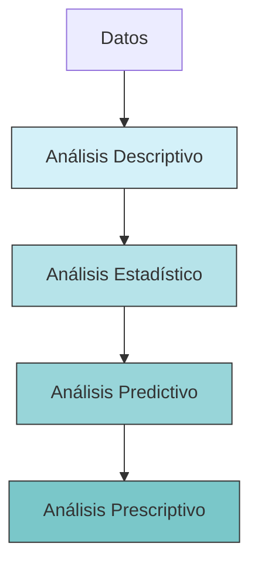

# 📊 Presentación de la Materia: Ciencia de Datos

> [!info] Recursos de la materia
> Los libros estarán disponibles en el repositorio de GitHub (enlace pendiente)
> 
> Libro principal de referencia: **Creating a Data-Driven Organization - Carl Anderson**

👉 [Laboratorio 1](lab1.md)

---

## 🔍 ¿Qué es la Ciencia de Datos?

La ciencia de datos es la **intersección de múltiples disciplinas** que permite extraer conocimiento valioso a partir de datos.

### Áreas principales que confluyen:

1. **Domain Expertise** (Conocimiento del dominio)
2. **Data Analytics** (Análisis de datos)
3. **Engineering Competences** (Competencias de ingeniería)

> [!note] Definición simplificada
> La ciencia de datos es la capacidad de **extraer valor de los datos**, incluyendo análisis, modelado y predicción.

### Enfoque en conceptos, no herramientas

> [!tip] Consejo importante
> No importa tanto qué herramienta aprendas, sino que entiendas los **conceptos fundamentales** que puedas aplicar con diferentes tecnologías.

---

## 🎯 Política DDD (Data Driven Decision Making)

> [!info] Definición
> Es un enfoque organizacional que utiliza datos como base para tomar decisiones informadas, en lugar de basarse únicamente en intuición o experiencia.

### Roles clave en una organización orientada a datos

| Rol | Siglas | Responsabilidad principal |
|-----|--------|---------------------------|
| Chief Data Officer | CDO | Liderar la estrategia de datos |
| Chief Technology Officer | CTO | Supervisar la tecnología y su implementación |
| Chief Information Officer | CIO | Gestionar los sistemas de información |

#### Responsabilidades del CDO
- Desarrollar la estrategia de datos
- Supervisar la recolección, almacenamiento y análisis
- Garantizar que los datos se utilicen para informar decisiones
- Promover una cultura basada en datos

### Prerequisitos para una organización orientada a datos

1. **Recolección sistemática de datos**
2. **Datos con características clave**:
   - **Accesibles**: Disponibles para quienes los necesiten de forma rápida y eficiente
   - **Consultables**: Fáciles de interrogar y analizar
   - **Compartibles**: Pueden distribuirse entre departamentos y equipos
   - **Joinables (Unibles)**: Capacidad de combinarse para crear vistas integradas

> [!example] Ejemplo de "joinable"
> Si el departamento de ventas tiene datos de clientes identificados por ID y el departamento de soporte tiene tickets asociados a IDs de clientes, ambos conjuntos de datos pueden unirse para analizar la relación entre compras y problemas reportados.

---

## 📝 Data Storytelling

> [!quote] 
> Es el "cómo" contar los datos para **transmitir** *un mensaje*

### ¿Qué es?
Es la capacidad de **narrar una historia convincente** usando datos como evidencia. Combina análisis de datos, visualización y narrativa para comunicar hallazgos efectivamente.

### Importancia
- Facilita la **comprensión** de información compleja
- **Persuade** a la audiencia con evidencia concreta
- Impulsa la **toma de decisiones informadas**
- Ayuda a identificar **oportunidades de mejora**
- Contribuye a **reducir costos** y aumentar eficiencia

---

## 📈 Evolución y Analítica de los Datos

### Reporting vs. Analysis

| **Reporting** | **Analysis** |
|---------------|--------------|
| Presenta datos de manera efectiva | Descubre patrones y tendencias |
| Crea informes y visualizaciones | Aplica técnicas estadísticas y ML |
| Responde "¿Qué está pasando?" | Responde "¿Por qué está pasando?" |
| Orientado a la comunicación | Orientado al descubrimiento |

### Evolución de la analítica

> [!info] Jerarquía de sofisticación analítica
> La capacidad analítica de una organización evoluciona desde lo descriptivo hacia lo prescriptivo.

#### 1️⃣ Análisis Descriptivo
- **Enfoque**: ¿Qué pasó?
- **Componentes**:
  - Datos crudos → Datos limpios
  - Consultas y reportes básicos
  - OLAP (Procesamiento Analítico en Línea)

#### 2️⃣ Análisis Estadístico
- **Enfoque**: ¿Por qué pasó?
- **Técnicas**: Data mining, correlaciones, análisis factorial

#### 3️⃣ Análisis Predictivo
- **Enfoque**: ¿Qué pasará?
- **Técnicas**: Machine learning, modelos estadísticos avanzados

#### 4️⃣ Análisis Prescriptivo
- **Enfoque**: ¿Qué queremos que pase?
- **Técnicas**: Optimización, simulación, sistemas de recomendación

## 🗄️ Data Management

> [!info] Definición
> Es el proceso integral de recolectar, almacenar, organizar y analizar datos a lo largo de su ciclo de vida.

### Componentes clave:
- Diseño e implementación de bases de datos
- Estrategias de almacenamiento
- Técnicas de consulta eficiente
- Generación de informes
- Políticas de seguridad y privacidad
- Gobierno de datos