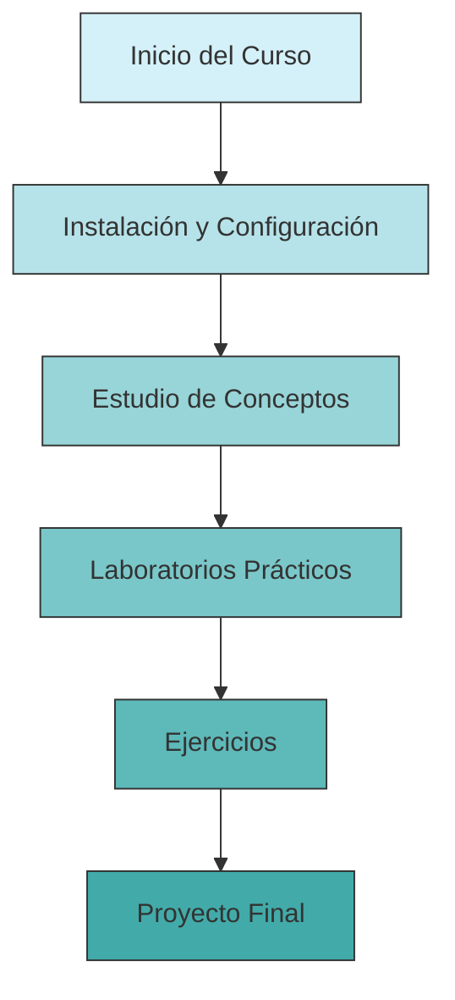

# 📊 Ciencia de Datos - Laboratorio 1

> [!info] Bienvenida al Laboratorio
> Este repositorio contiene material para el curso de Ciencia de Datos, incluyendo apuntes, notebooks y laboratorios prácticos.

## 🚀 Inicio Rápido

### Requisitos Previos
- Python 3.8 o superior
- Conocimientos básicos de línea de comandos

### 📥 Instalación y Configuración

#### Clonar el repositorio
```bash
git clone https://github.com/usuario/cdd.git 
cd cdd
```

#### Crear y activar entorno virtual

<details>
<summary><b>📂 Windows</b></summary>

```powershell
# Crear entorno virtual
python -m venv venv

# Activar entorno
.\venv\Scripts\activate

# Instalar dependencias
pip install -r requirements.txt
```
</details>

<details>
<summary><b>🐧 Linux/macOS</b></summary>

```bash
# Crear entorno virtual
python3 -m venv venv

# Activar entorno
source venv/bin/activate

# Instalar dependencias
pip install -r requirements.txt
```
</details>

> [!tip] Recomendación
> Utiliza `pip list` para verificar que todas las dependencias se han instalado correctamente.

---

## 📁 Estructura del Repositorio

```
.
├── lab1.md                                # Guía del Laboratorio 1
├── notebooks/                             # Jupyter Notebooks
│   ├── demo_faith_no_more.ipynb           # Notebook de demostración
│   ├── ejercicios_faith_no_more.ipynb     # Ejercicios prácticos
│   └── Laboratorio_PyDataBook_Equipos.ipynb # Laboratorio principal
├── README.md                              # Este archivo
├── requirements.txt                       # Dependencias del proyecto
└── Resumen Capitulo 7 Libro.md           # Apuntes del capítulo 7
```

---

## 📝 Contenido del Curso

### Laboratorios
- [Laboratorio 1](lab1.md) - Introducción a la manipulación de datos con pandas

### Material de Referencia
- [Resumen Capítulo 7](Resumen%20Capitulo%207%20Libro.md) - Limpieza y Preparación de Datos

### Notebooks Prácticos
Estos notebooks contienen ejemplos y ejercicios para poner en práctica los conceptos aprendidos:

1. **demo_faith_no_more.ipynb**: Demostración de análisis de datos utilizando un dataset de ejemplo
2. **ejercicios_faith_no_more.ipynb**: Serie de ejercicios para practicar lo aprendido
3. **Laboratorio_PyDataBook_Equipos.ipynb**: Trabajo práctico completo basado en el libro Python para Data Science

---

## 📚 Referencias y Bibliografía

- **Creating a Data-Driven Organization** - Carl Anderson
- **Python para Data Science** - McKinney, W.

> [!note] Sobre los datasets
> Los datasets utilizados en los ejercicios se cargan directamente desde los notebooks o se incluyen instrucciones para su descarga.

---

## 🔧 Solución de Problemas

<details>
<summary><b>Error al importar módulos</b></summary>

Verifica que:
1. Tu entorno virtual esté activado
2. Todas las dependencias estén instaladas correctamente
3. Estés ejecutando el código desde la carpeta raíz del proyecto

Si persisten los problemas, intenta reinstalar las dependencias:
```
pip install --force-reinstall -r requirements.txt
```
</details>

<details>
<summary><b>Problemas con Jupyter Notebook</b></summary>

Si Jupyter no se inicia correctamente:

```bash
# Verifica que jupyter esté instalado
pip show jupyter

# Instalación manual si es necesario
pip install jupyter

# Iniciar jupyter notebook
jupyter notebook
```
</details>

---

## 🤝 Contribución

Si encuentras errores o deseas mejorar el contenido:

1. Crea un fork del repositorio
2. Crea una nueva rama (`git checkout -b feature/mejora`)
3. Realiza tus cambios
4. Haz commit de tus cambios (`git commit -m 'Añade mejora X'`)
5. Sube tus cambios (`git push origin feature/mejora`)
6. Abre un Pull Request

---



> [!warning] Importante
> Recuerda mantener tu entorno virtual activo cuando trabajes en este proyecto para asegurar la compatibilidad de versiones.
