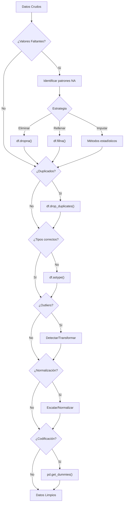

# 📊 Capítulo 7: Limpieza y Preparación de Datos

> [!info] Concepto Clave
> La preparación de datos consume aproximadamente el **80% del tiempo** en proyectos de ciencia de datos. Pandas junto con Python proporcionan herramientas eficientes para esta tarea crítica.

---

## 7.1 Manejo de Datos Faltantes

> [!tip] Buena práctica
> Las estadísticas descriptivas en pandas excluyen automáticamente los datos faltantes por defecto.

### Representaciones de valores faltantes

| Tipo de dato       | Representación | Descripción                      |
| ------------------ | -------------- | -------------------------------- |
| `float64`          | `NaN`          | Not a Number                     |
| Python nativo      | `None`         | Tratado como NA                  |
| Tipos de extensión | `<NA>`         | Usa `pd.NA` como valor centinela |

### Identificación de datos faltantes

```python
# Verificar valores nulos (devuelve una Serie booleana)
df.isna()      # True donde hay valores faltantes
df.notna()     # True donde NO hay valores faltantes

# Verificar si alguna columna tiene valores nulos
df.isna().any()
```

### Filtrado de datos faltantes

```python
# Eliminar filas con valores NA
df_limpio = df.dropna()

# Eliminar solo filas donde TODOS los valores son NA
df_limpio = df.dropna(how="all")

# Eliminar columnas con NA
df_limpio = df.dropna(axis="columns")

# Mantener filas con al menos N valores no-NA
df_limpio = df.dropna(thresh=3)  # Al menos 3 valores no-NA
```

> [!warning] Precaución
> `dropna()` devuelve un nuevo objeto y no modifica el original, a menos que uses `inplace=True`.

### Relleno de datos faltantes

```python
# Rellenar con un valor constante
df_relleno = df.fillna(0)

# Rellenar con valores específicos por columna
df_relleno = df.fillna({'A': 0, 'B': -1, 'C': 'desconocido'})

# Rellenar usando el método forward fill (propaga el último valor válido)
df_relleno = df.fillna(method='ffill')

# Rellenar usando el método backward fill (usa próximo valor válido)
df_relleno = df.fillna(method='bfill')

# Limitar el número de rellenos consecutivos
df_relleno = df.fillna(method='ffill', limit=3)

# Rellenar con estadísticas
df_relleno = df.fillna(df.mean())  # Rellenar con la media
```

---

## 7.2 Transformación de Datos

### Eliminación de duplicados

```python
# Verificar filas duplicadas (devuelve Serie booleana)
duplicados = df.duplicated()

# Eliminar filas duplicadas
df_sin_duplicados = df.drop_duplicates()

# Considerar solo ciertas columnas
df_sin_duplicados = df.drop_duplicates(subset=['A', 'B'])

# Mantener la última ocurrencia en vez de la primera
df_sin_duplicados = df.drop_duplicados(keep='last')
```

### Transformación con map()

```python
# Usando función
serie_transformada = serie.map(lambda x: x * 2)

# Usando diccionario
mapeo = {'M': 'Masculino', 'F': 'Femenino'}
df['genero_completo'] = df['genero'].map(mapeo)
```

> [!example] Ejemplo de transformación con map()
> ```python
> # Convertir códigos de países a nombres completos
> paises = {'US': 'Estados Unidos', 'UK': 'Reino Unido', 'ES': 'España'}
> df['pais_nombre'] = df['codigo_pais'].map(paises)
> ```

### Reemplazo de valores

```python
# Reemplazar un valor específico
df_limpio = df.replace(999, np.nan)

# Reemplazar múltiples valores con el mismo valor
df_limpio = df.replace([999, -999, 0], np.nan)

# Reemplazos personalizados con diccionario
df_limpio = df.replace({
    'columna1': {'valor_viejo': 'valor_nuevo'},
    'columna2': {0: 'cero', 1: 'uno'}
})
```

> [!warning] No confundir
> `df.replace()` cambia valores completos, mientras que `df['col'].str.replace()` busca y reemplaza texto dentro de cadenas.

### Renombrado de índices de ejes

```python
# Transformar índices con map
df.index = df.index.map(str.upper)

# Renombrar selectivamente algunas columnas
df_renombrado = df.rename(
    columns={'old_name1': 'new_name1', 'old_name2': 'new_name2'}
)

# Renombrar usando una función
df_renombrado = df.rename(columns=str.lower)
```

### Discretización y agrupamiento (Binning)

```python
# Crear bins de igual ancho
edad_bins = [0, 18, 35, 50, 100]
etiquetas = ['Menor', 'Joven', 'Adulto', 'Senior']
df['grupo_edad'] = pd.cut(df['edad'], bins=edad_bins, labels=etiquetas)

# Bins de igual frecuencia (cuantiles)
df['percentil'] = pd.qcut(df['puntuacion'], q=4)  # Cuartiles
df['decil'] = pd.qcut(df['puntuacion'], q=10)     # Deciles
```

> [!info] Intervalos en binning
> - `(18, 35]` significa mayor que 18 hasta 35 inclusive
> - Para cambiar la inclusividad use `right=False`: `[18, 35)`

### Detección y filtrado de outliers

```python
# Enfoque estadístico: Z-score
from scipy import stats
z_scores = stats.zscore(df['columna_numerica'])
abs_z_scores = np.abs(z_scores)
outliers = abs_z_scores > 3  # Z-score > 3 (o el umbral deseado)

# Enfoque IQR (Rango Intercuartil)
Q1 = df['columna'].quantile(0.25)
Q3 = df['columna'].quantile(0.75)
IQR = Q3 - Q1
filtro_bajo = df['columna'] >= (Q1 - 1.5 * IQR)
filtro_alto = df['columna'] <= (Q3 + 1.5 * IQR)
df_sin_outliers = df[filtro_bajo & filtro_alto]

# Limitación de outliers (capping)
limite_superior = df['columna'].quantile(0.95)
limite_inferior = df['columna'].quantile(0.05)
df['columna_limitada'] = df['columna'].clip(limite_inferior, limite_superior)
```

### Permutación y muestreo aleatorio

```python
# Reordenar aleatoriamente un DataFrame
df_aleatorio = df.sample(frac=1).reset_index(drop=True)

# Muestreo sin reemplazo
muestra = df.sample(n=100)  # 100 filas aleatorias
muestra = df.sample(frac=0.1)  # 10% de las filas

# Muestreo con reemplazo (bootstrap)
bootstrap = df.sample(n=len(df), replace=True)

# Muestreo estratificado
by_group = {}
for name, group in df.groupby('categoria'):
    by_group[name] = group.sample(n=10)
    
df_estratificado = pd.concat(by_group.values())
```

### Cálculo de variables indicadoras/dummy

```python
# One-hot encoding básico
dummies = pd.get_dummies(df['categoria'])

# Con prefijo para nombres claros
dummies = pd.get_dummies(df['categoria'], prefix='cat')

# One-hot en todo el DataFrame
df_dummies = pd.get_dummies(df, columns=['categoria1', 'categoria2'])

# Para variables con múltiples categorías por fila (separadas por comas)
df['multiples_tags'] = df['tags'].str.get_dummies(sep=',')
```

---

## 7.3 Tipos de Datos de Extensión

> [!info] Ventajas
> Los tipos de extensión solucionan limitaciones de NumPy:
> - Manejo adecuado de valores faltantes en enteros/booleanos
> - Mejor eficiencia de memoria para strings
> - Soporte nativo para tipos especializados (intervalos, zonas horarias)

### Tipos de extensión comunes

| Tipo | Descripción | Sintaxis |
|------|-------------|----------|
| `Int64Dtype` | Enteros con soporte para NA | `df['col'] = df['col'].astype('Int64')` |
| `StringDtype` | Cadenas eficientes | `df['col'] = df['col'].astype('string')` |
| `BooleanDtype` | Booleanos con NA | `df['col'] = df['col'].astype('boolean')` |
| `CategoricalDtype` | Variables categóricas | `df['col'] = df['col'].astype('category')` |
| `Float64Dtype` | Float con NA semántico | `df['col'] = df['col'].astype('Float64')` |

```python
# Convertir múltiples columnas a tipos de extensión
df = df.astype({
    'id': 'Int64',
    'nombre': 'string',
    'activo': 'boolean',
    'categoria': 'category',
    'puntuacion': 'Float64'
})
```

> [!tip] Buena práctica
> Convertir a tipos de extensión temprano en el flujo de trabajo mejora la eficiencia y evita problemas de manejo de valores faltantes.

---

## 7.4 Manipulación de Cadenas

### Métodos Python integrados (recordatorio)

```python
# Ejemplos clave de manipulación de strings en Python
texto = " Hola, Mundo! "
texto.strip()                   # "Hola, Mundo!"
texto.lower()                   # " hola, mundo! "
texto.upper()                   # " HOLA, MUNDO! "
texto.replace("Mundo", "Python")  # " Hola, Python! "
"Mundo" in texto                # True
texto.split(",")                # [" Hola", " Mundo! "]
"-".join(["a", "b", "c"])       # "a-b-c"
```

### Expresiones Regulares con re

```python
import re

texto = "La fecha es 2023-07-15 y el código es ABC-123"

# Buscar patrones
re.findall(r'\d{4}-\d{2}-\d{2}', texto)  # ['2023-07-15']
re.findall(r'[A-Z]+-\d+', texto)         # ['ABC-123']

# Extraer componentes con grupos
match = re.search(r'(\d{4})-(\d{2})-(\d{2})', texto)
if match:
    año, mes, dia = match.groups()  # '2023', '07', '15'

# Sustituir con referencias a grupos
nuevo_texto = re.sub(r'(\d{4})-(\d{2})-(\d{2})', r'\2/\3/\1', texto)
# "La fecha es 07/15/2023 y el código es ABC-123"
```

> [!example] Patrones regex comunes
> - `\d`: Dígito, `\w`: Carácter alfanumérico, `\s`: Espacio en blanco
> - `+`: 1 o más, `*`: 0 o más, `?`: 0 o 1
> - `{n}`: Exactamente n veces, `{n,m}`: Entre n y m veces
> - `^`: Inicio de cadena, `$`: Fin de cadena

### Funciones de cadena en pandas (.str)

```python
# Detección de patrones
contiene_fecha = df['texto'].str.contains(r'\d{4}-\d{2}-\d{2}')

# Extracción con regex
fechas = df['texto'].str.findall(r'\d{4}-\d{2}-\d{2}')
primer_fecha = fechas.str[0]  # Primera fecha encontrada en cada fila

# Extracción estructurada con grupos
df_fechas = df['texto'].str.extract(r'(\d{4})-(\d{2})-(\d{2})')
df_fechas.columns = ['año', 'mes', 'dia']

# Operaciones comunes
df['texto_limpio'] = df['texto'].str.lower().str.strip()
df['palabras'] = df['texto'].str.split()
df['num_palabras'] = df['palabras'].str.len()
```

> [!tip] Encadenamiento de métodos
> Los métodos `.str` se pueden encadenar para operaciones complejas:
> ```python
> df['url_limpia'] = df['url'].str.lower().str.replace('http://', '').str.replace('www.', '')
> ```

---

## 7.5 Datos Categóricos

> [!info] Beneficios de datos categóricos
> - **Rendimiento**: Operaciones más rápidas en datos categorizados
> - **Memoria**: Representación más compacta para valores repetitivos
> - **Semántica**: Preservación de orden y estructura en categorías

### Análisis y conversión

```python
# Exploración previa
valores_unicos = df['categoria'].unique()
conteo = df['categoria'].value_counts()

# Convertir a categórica
df['categoria'] = df['categoria'].astype('category')

# Ver estructura interna
codigos = df['categoria'].cat.codes          # Representación entera
categorias = df['categoria'].cat.categories  # Valores únicos
```

### Trabajando con categorías (.cat)

```python
# Definir un orden
df['nivel'] = df['nivel'].astype(
    pd.CategoricalDtype(categories=['Bajo', 'Medio', 'Alto'], ordered=True)
)

# Ordenar según el orden categórico
df_ordenado = df.sort_values('nivel')  # Respeta el orden Bajo → Medio → Alto

# Modificar categorías
df['categoria'] = df['categoria'].cat.add_categories(['Nueva'])
df['categoria'] = df['categoria'].cat.remove_categories(['Obsoleta'])
df['categoria'] = df['categoria'].cat.rename_categories({'Viejo': 'Nuevo'})

# Eliminar categorías no usadas después de filtrar
df_filtrado = df[df['pais'] == 'España']
df_filtrado['categoria'] = df_filtrado['categoria'].cat.remove_unused_categories()
```

### One-hot encoding para modelado

```python
# Crear variables dummy (one-hot)
df_dummies = pd.get_dummies(df['categoria'])

# Integrar con el DataFrame original
df_final = pd.concat([df.drop('categoria', axis=1), df_dummies], axis=1)
```

> [!example] Flujo completo
> ```python
> # Convertir a categórica, ordenar categorías y crear dummies
> df['nivel_educativo'] = df['nivel_educativo'].astype('category')
> df['nivel_educativo'] = df['nivel_educativo'].cat.reorder_categories(
>     ['Primaria', 'Secundaria', 'Universidad', 'Postgrado'], 
>     ordered=True
> )
> nivel_dummies = pd.get_dummies(df['nivel_educativo'], prefix='nivel')
> ```

---

## 📝 Diagrama: Flujo de limpieza de datos



> [!tip] Checklist de limpieza de datos
> - [ ] Identificar y manejar valores faltantes
> - [ ] Eliminar o consolidar duplicados
> - [ ] Convertir a tipos de datos adecuados
> - [ ] Normalizar formatos de texto
> - [ ] Detectar y manejar outliers
> - [ ] Discretizar variables continuas si es necesario
> - [ ] Codificar variables categóricas para modelos
> - [ ] Documentar transformaciones realizadas


-----
### Capítulo 7: Limpieza y Preparación de Datos

Este capítulo se centra en las herramientas de pandas para la **preparación de datos**, una tarea que a menudo consume el 80% o más del tiempo de un analista. pandas, junto con las características del lenguaje Python, ofrece un conjunto de herramientas flexibles y rápidas para manipular los datos a la forma deseada.

#### 7.1 Manejo de Datos Faltantes

Los datos faltantes son comunes y pandas busca facilitar su manejo. Por defecto, las estadísticas descriptivas en objetos pandas excluyen los datos faltantes.

- **Representación**:
    
    - Para tipos de datos `float64`, pandas utiliza el valor **NaN** (Not a Number).
    - El valor `None` incorporado de Python también se trata como NA (Not Available).
    - En tipos de datos de extensión más recientes (como `Int64Dtype` o `StringDtype`), el valor faltante se representa como **`<NA>`**, utilizando el valor centinela especial `pd.NA`.
- **Identificación de Datos Faltantes**:
    
    - El método **`isna()`** devuelve una Serie booleana con `True` donde los valores son nulos (faltantes).
    - **`notna()`** es la negación de `isna()`, devolviendo `True` para valores no-NA.
- **Filtrado de Datos Faltantes**:
    
    - El método **`dropna()`** filtra etiquetas de ejes basándose en la presencia de datos faltantes.
    - En una `Series`, `dropna()` devuelve la Serie solo con los datos no nulos.
    - En un `DataFrame`, `dropna()` por defecto elimina cualquier fila que contenga un valor faltante.
    - Pasando `how="all"` se eliminan solo las filas que son **completamente NA**.
    - Para eliminar columnas, se usa `axis="columns"`.
    - El argumento `thresh` permite mantener filas que contengan al menos un cierto número de observaciones no faltantes.
    - Estas funciones devuelven nuevos objetos por defecto y no modifican el original.
- **Relleno de Datos Faltantes**:
    
    - El método **`fillna()`** es la función principal para rellenar "huecos".
    - Se puede llamar con un valor constante para reemplazar los valores faltantes.
    - Con un diccionario, se puede usar un valor de relleno diferente para cada columna.
    - Se pueden usar métodos de interpolación como **`"ffill"`** (forward fill) o **`"bfill"`** (backward fill).
    - El argumento `limit` restringe el número máximo de períodos consecutivos a rellenar para los métodos de relleno.
    - También se puede usar `fillna()` con estadísticas como la media o la mediana de los datos.

#### 7.2 Transformación de Datos

Esta sección cubre operaciones importantes para limpiar y transformar datos.

- **Eliminación de Duplicados**:
    
    - El método **`duplicated()`** de un `DataFrame` devuelve una `Series` booleana que indica si cada fila es un duplicado exacto de una fila anterior.
    - **`drop_duplicates()`** devuelve un `DataFrame` filtrando las filas duplicadas.
    - Por defecto, ambos métodos consideran todas las columnas, pero se puede especificar un subconjunto con el argumento `subset`.
    - Por defecto, se mantiene la primera combinación de valores observada. Pasando `keep="last"` se conserva la última.
- **Transformación de Datos Usando una Función o Mapeo**:
    
    - El método **`map()`** en una `Series` acepta una función o un objeto tipo diccionario que contiene un mapeo para transformar valores. Esto es útil para transformaciones elemento a elemento.
- **Reemplazo de Valores**:
    
    - El método **`replace()`** ofrece una forma sencilla y flexible de reemplazar valores.
    - Puede reemplazar un valor único.
    - Puede reemplazar múltiples valores a la vez pasando una lista de valores a reemplazar y un valor sustituto.
    - Se puede usar un diccionario para especificar un reemplazo diferente para cada valor.
    - Es importante diferenciarlo de `data.str.replace`, que realiza sustituciones de cadenas elemento por elemento.
- **Renombrado de Índices de Eje**:
    
    - Las etiquetas de los ejes pueden transformarse de manera similar a los valores de una `Series` utilizando el método **`map()`** en el atributo `index` o `columns` del `DataFrame`.
    - También se pueden modificar los ejes _in situ_ asignando al atributo `index` o `columns`.
    - El método **`rename()`** es útil para crear una versión transformada de un conjunto de datos sin modificar el original, aceptando funciones o diccionarios para los argumentos `index` y `columns`.
- **Discretización y Agrupamiento (Binning)**:
    
    - **`pd.cut()`** se utiliza para discretizar datos continuos en "bins" de longitud fija.
        - Los límites de los bins se especifican en una lista.
        - El objeto devuelto es un **objeto `Categorical` especial**.
        - Los paréntesis `()` indican lados abiertos (exclusivos) y los corchetes `[]` lados cerrados (inclusivos); `right=False` cambia el lado cerrado.
        - Se pueden proporcionar etiquetas personalizadas para los bins con el argumento `labels`.
        - Si se pasa un número entero de bins, `pd.cut()` computará bins de igual longitud basados en los valores mínimos y máximos.
    - **`pd.qcut()`** divide los datos basándose en **cuantiles de la muestra**, resultando en bins de tamaño aproximadamente igual.
- **Detección y Filtrado de Outliers (Valores Atípicos)**:
    
    - Se pueden identificar valores que exceden un umbral usando operaciones de array y el método **`abs()`**.
    - Para seleccionar filas con valores atípicos en cualquier columna, se puede usar **`.any(axis="columns")`** en un `DataFrame` booleano.
    - Los valores atípicos se pueden limitar (capping) estableciéndolos a un valor umbral, utilizando funciones como **`np.sign()`** para mantener el signo original.
- **Permutación y Muestreo Aleatorio**:
    
    - La función **`numpy.random.permutation()`** se utiliza para reordenar aleatoriamente una `Series` o las filas de un `DataFrame`.
    - El array resultante se puede usar con indexación `iloc` o el método **`take()`**.
    - Para seleccionar un subconjunto aleatorio sin reemplazo, se usa el método **`sample()`**.
    - Para generar una muestra con reemplazo (permitir repeticiones), se pasa `replace=True` a `sample()`.
- **Cálculo de Variables Indicadoras/Dummy**:
    
    - La función **`pd.get_dummies()`** convierte una variable categórica en una matriz de indicadores (one-hot encoding).
    - Se puede añadir un prefijo a los nombres de las columnas resultantes con el argumento `prefix`.
    - Para datos donde una fila pertenece a múltiples categorías (codificadas como una cadena delimitada), se usa el método **`Series.str.get_dummies()`**. Esto puede combinarse con `add_prefix()` y `join()`.

#### 7.3 Tipos de Datos de Extensión

pandas ha desarrollado un sistema de tipos de extensión para superar las limitaciones de los tipos basados en NumPy, especialmente en el manejo de datos faltantes y la eficiencia de memoria.

- **Limitaciones de NumPy**:
    
    - Manejo incompleto de datos faltantes para enteros y booleanos (conversión a `float64` y uso de `np.nan`).
    - Cadenas de datos computacionalmente costosas y que consumen mucha memoria.
    - Soporte ineficiente para tipos como intervalos de tiempo o fechas con zonas horarias.
- **Solución con Tipos de Extensión**:
    
    - Permiten agregar nuevos tipos de datos no soportados nativamente por NumPy.
    - Ejemplos incluyen `pd.Int64Dtype()` (o `'Int64'`) para enteros nulos, que usa `<NA>` para valores faltantes.
    - **`pd.StringDtype()`** (o `'string'`) para cadenas, que usa menos memoria y es más eficiente.
    - El método **`astype()`** permite convertir fácilmente a estos tipos de extensión como parte del proceso de limpieza de datos.
    - Otros tipos incluyen `BooleanDtype`, `CategoricalDtype`, `Float32Dtype`, `Float64Dtype`, etc..

#### 7.4 Manipulación de Cadenas

Python es un lenguaje potente para el procesamiento de texto, y pandas extiende estas capacidades para trabajar con arrays de datos, manejando también los datos faltantes.

- **Métodos Integrados de Objetos String de Python**:
    
    - **`split()`**: Divide una cadena en una lista de subcadenas usando un delimitador.
    - **`strip()`**, `lstrip()`, `rstrip()`: Recortan espacios en blanco (incluidos saltos de línea) de ambos lados, izquierda o derecha.
    - **`join()`**: Concatena una secuencia de cadenas usando la cadena como delimitador.
    - **`in`**: El operador `in` es la mejor manera de detectar una subcadena.
    - `index()` y `find()`: Localizan subcadenas. `index()` lanza una excepción si no se encuentra; `find()` devuelve -1.
    - **`count()`**: Devuelve el número de ocurrencias de una subcadena.
    - **`replace()`**: Sustituye ocurrencias de un patrón por otro, también usado para eliminar patrones pasando una cadena vacía.
    - `lower()`, `upper()`, `casefold()`: Convierten caracteres a minúsculas o mayúsculas.
- **Expresiones Regulares (`re` módulo)**:
    
    - Proporcionan una forma flexible de buscar o coincidir patrones de cadena complejos.
    - Las funciones del módulo `re` se dividen en tres categorías: coincidencia de patrones, sustitución y división.
    - **`re.split()`**: Divide una cadena usando un patrón de expresión regular.
    - **`re.compile()`**: Compila una expresión regular en un objeto reutilizable para mejorar el rendimiento si se aplica a muchas cadenas.
    - **`findall()`**: Devuelve una lista de todas las coincidencias del patrón en una cadena.
    - **`search()`**: Devuelve un objeto `match` para la _primera_ coincidencia en cualquier parte de la cadena.
    - **`match()`**: Solo coincide si el patrón ocurre al _principio_ de la cadena.
    - **`sub()`**: Devuelve una nueva cadena con las ocurrencias del patrón reemplazadas por una nueva cadena. Permite el uso de grupos `\1`, `\2`, etc. para hacer referencia a componentes del patrón.
    - Los paréntesis `()` en un patrón regex crean **grupos** que se pueden extraer con `match.groups()` o `findall()`.
- **Funciones de Cadena en pandas (`.str` accessor)**:
    
    - pandas proporciona métodos orientados a arrays para operaciones de cadenas a través del atributo **`.str`** de una `Series`, que **salta y propaga los valores NA**.
    - **`str.contains()`**: Devuelve un array booleano indicando si cada cadena contiene un patrón.
    - **`str.findall()`**: Calcula una lista de todas las ocurrencias de un patrón/regex para cada cadena.
    - **`str.get()` o indexación en `str`**: Permite recuperar elementos vectorizados de una lista de resultados o cortar cadenas.
    - **`str.extract()`**: Devuelve los grupos capturados de una expresión regular como un `DataFrame`.
    - Existen muchos otros métodos como `str.cat`, `str.startswith`, `str.endswith`, `str.lower`, `str.upper`, `str.replace`, etc..

#### 7.5 Datos Categóricos

Esta sección introduce el tipo `Categorical` de pandas para mejorar el rendimiento y el uso de memoria, especialmente con datos de texto repetitivos.

- **Conceptos y Motivación**:
    
    - Columnas con valores repetidos son comunes. `unique()` y `value_counts()` ayudan a extraer valores distintos y sus frecuencias.
    - La **representación categórica o codificada por diccionario** utiliza claves enteras que referencian una tabla de valores distintos (las **categorías** o **niveles**). Los valores enteros se llaman **códigos de categoría**.
    - Esta representación ofrece **mejoras significativas en el rendimiento** para análisis y un menor uso de memoria.
- **Tipo de Extensión `Categorical` en pandas**:
    
    - pandas tiene un tipo `Categorical` especial para esta codificación basada en enteros.
    - Se convierte una columna a categórica con **`.astype('category')`**.
    - Un objeto `Categorical` tiene atributos **`categories`** (los valores únicos) y **`codes`** (las representaciones enteras).
    - Se puede crear `pd.Categorical` directamente o usando `pd.Categorical.from_codes()`.
    - El argumento **`ordered=True`** en la creación o el método **`as_ordered()`** permite indicar si las categorías tienen un orden significativo.
- **Cómputos con Categóricas**:
    
    - Generalmente, se comportan igual que los datos no codificados, pero algunas funciones como `groupby()` rinden mejor con categóricas.
    - Las funciones de binning como `pd.qcut()` devuelven un `pd.Categorical`, y se pueden usar etiquetas para los bins.
    - El rendimiento con categóricas es notablemente mejor, especialmente para `value_counts()` en grandes conjuntos de datos.
- **Métodos Categóricos (`.cat` accessor)**:
    
    - Las `Series` con datos categóricos tienen un atributo especial **`.cat`** para acceder a métodos categóricos.
    - **`cat.codes`** y **`cat.categories`**.
    - **`set_categories()`**: Permite cambiar el conjunto real de categorías.
    - **`remove_unused_categories()`**: Elimina las categorías que ya no aparecen en los datos después de un filtrado, por ejemplo.
    - Otros métodos incluyen `add_categories`, `remove_categories`, `rename_categories`, `reorder_categories`.
- **Creación de Variables Dummy para Modelado**:
    
    - **`pd.get_dummies()`** es la función principal para convertir datos categóricos unidimensionales en un `DataFrame` de variables dummy (one-hot encoding).

