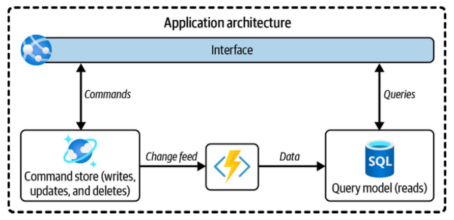

El "Capítulo 4: Data Product Management" de Piethein Strengholt es uno de los más importantes del libro porque aborda el concepto central de los "productos de datos". Vamos a desglosarlo paso a paso.

## La Idea Principal: Dejar de Confundir la Mentalidad con la Arquitectura

El capítulo empieza aclarando una confusión muy común. Hay dos términos que suenan parecidos pero son diferentes:

1.  **"Datos como Producto" (Data as a Product)**: Esto es una **mentalidad**, una forma de pensar. Significa que los equipos que crean datos (los "productores") deben dejar de verlos como un residuo de sus aplicaciones. En cambio, deben tratarlos como un producto de primera clase. Deben pensar en los otros equipos que usarán esos datos como sus "clientes" y esforzarse por ofrecerles una experiencia excelente: datos limpios, bien documentados, fáciles de encontrar y confiables.
2.  **"Producto de Datos" (Data Product)**: Esto se refiere a la **arquitectura**, a la "cosa" técnica que se construye para hacer realidad esa mentalidad. Es el paquete tangible (o digital) que se entrega a los consumidores de datos.

El resto del capítulo se centra en definir qué es exactamente este "producto de datos" y cómo construirlo correctamente.

---

## ¿Qué es Exactamente un "Producto de Datos"? El Debate

Aquí el autor explica que la comunidad de datos no se pone de acuerdo.

*   **Una visión (la de Dehghani)**: Un producto de datos es un "quantum arquitectónico", una especie de "caja" o "contenedor" que incluye **todo**: los datos, el código para procesarlos, los metadatos (la información sobre los datos) y la infraestructura (los servidores donde vive todo).
*   **Otra visión (la de Accenture)**: Un producto de datos es simplemente la representación física de los datos, como un conjunto de datos (dataset), un informe o un modelo analítico, sin incluir necesariamente el código o la infraestructura.

El autor, Piethein Strengholt, argumenta que la primera visión de "meter todo en una caja" es **demasiado ingenua y problemática en el mundo digital real**.

### El Problema de "Meter Todo en una Caja" (La Analogía de las Flores)

Para explicar por qué, usa una excelente analogía: la subasta de flores de Aalsmeer en los Países Bajos, la más grande del mundo.

*   En la subasta, las flores (los datos) y su información (los metadatos, como origen, productor, precio, etc., en un código de barras) viajan siempre juntas físicamente. La etiqueta está pegada a la caja de flores.
*   En el mundo digital, esto no funciona así. Los **metadatos** suelen vivir en un lugar centralizado (como un "catálogo de datos"), mientras que los **datos físicos** están almacenados en muchos otros lugares.

Intentar pegar los metadatos a cada copia de los datos crearía un caos:

1.  **Duplicación y consistencia**: Si copias un producto de datos, tendrías que duplicar sus metadatos. Si necesitas actualizar algo (como el dueño del dato), tendrías que hacerlo en todas las copias al mismo tiempo, lo cual es una pesadilla.
2.  **Consultas complejas**: Sería muy difícil hacer preguntas generales como "¿De dónde vienen todos los datos de 'clientes' en la empresa?" porque tendrías que consultar dentro de cientos de "cajas" individuales.
3.  **Separación física**: La realidad de las plataformas de datos es que los datos y los metadatos se gestionan por separado.

### La Definición del Autor: Un Producto de Datos es una Entidad Lógica

Debido a estos problemas, el autor propone una definición mucho más flexible y poderosa:

> Un **producto de datos es una entidad lógica y autónoma que describe datos destinados al consumo**.

Piensa en ello como una "ficha de catálogo" o la tarjeta de un libro en una biblioteca. La ficha (el producto de datos lógico) te dice todo lo que necesitas saber:

*   El nombre lógico del conjunto de datos (ej: "Clientes Activos").
*   Quién es el dueño y de qué dominio de negocio viene.
*   Una descripción de lo que contiene (sus "elementos de datos" como "Nombre", "Email", etc.).
*   Lo más importante: **referencias (punteros) a dónde se encuentran los activos de datos físicos**.

Esta ficha lógica no contiene los datos, solo los describe y te dice dónde encontrarlos. Un mismo producto de datos lógico puede apuntar a múltiples representaciones físicas (por ejemplo, los mismos datos de clientes pueden estar en formato Parquet y en formato Delta Lake).

---

## El Patrón de Diseño Clave: CQRS

Para que los productos de datos sean útiles, deben estar optimizados para la lectura. Sacar grandes volúmenes de datos de un sistema operacional en vivo (donde se registran las transacciones) es peligroso y lento.

Por eso, el autor dice que la arquitectura de productos de datos debe inspirarse en un patrón de diseño de software llamado **CQRS (Command Query Responsibility Segregation)**.

*   **La idea es simple**: Separar las operaciones de **escritura** (Comandos: crear, actualizar, borrar datos) de las operaciones de **lectura** (Consultas: leer datos).
*   **¿Por qué?**: Las operaciones de escritura son lentas y complejas (requieren bloqueos, validaciones, etc.). Las de lectura son más sencillas. Al separarlas, podemos crear una base de datos específica y optimizada solo para leer, que no interfiere con el sistema principal.
*   **Conexión con los Productos de Datos**: Los **productos de datos son, en esencia, estas réplicas de solo lectura optimizadas**. Son copias de los datos del sistema original, pero limpias, transformadas y listas para ser consumidas intensivamente.

---

## Principios de Diseño para Buenos Productos de Datos

El capítulo presenta una lista larga pero fundamental de principios. Aquí están los más importantes, agrupados para que sean más fáciles de estudiar:

### 1. Enfocados en el Consumidor y Fáciles de Usar
*   **Diseño Orientado a Recursos y Optimizado para Lectura**: Los datos deben estar agrupados lógicamente por temas (ej: "Productos", "Clientes") y estar pre-calculados y desnormalizados. El objetivo es que el consumidor no tenga que hacer `joins` complejos y costosos.
*   **No entregar Datos Crudos**: Un producto de datos es lo opuesto a los datos crudos. Debe entregar datos limpios, procesados y listos para usar para evitar que cada consumidor repita el mismo trabajo de limpieza.
*   **Uso del Lenguaje Ubicuo**: Todos en la empresa deben usar los mismos términos para las mismas cosas. Un "cliente" debe significar lo mismo para todos. Esta información se guarda en el catálogo de datos.

### 2. Confiables y de Alta Calidad
*   **Los Datos son Inmutables**: Los productos de datos son de solo lectura. Una vez publicados, no se modifican. Si hay datos nuevos, se crea una nueva versión. Esto garantiza que todos vean la misma "verdad" y que los análisis se puedan regenerar de forma consistente.
*   **Captura Directa desde el Origen (Golden Source)**: Los datos deben tomarse siempre del sistema de origen para garantizar que son la fuente única de verdad.
*   **Propiedad Clara**: Cada producto de datos pertenece a un único dominio de negocio, que es responsable de su calidad.

### 3. Bien Gobernados y Seguros
*   **Estándares Claros de Interoperabilidad**: Se debe definir cómo se entregan los datos (ej: archivos en formato Delta, APIs, etc.) y estandarizar las interfaces para que el consumo no sea un caos.
*   **No Externalizar la Lógica de Negocio**: La lógica de negocio (ej: cómo se calcula el "ingreso total") debe permanecer en el dominio que la posee. No se debe obligar al producto de datos a incluir cálculos que no le corresponden.
*   **Establecer un Metamodelo**: Crear un modelo claro de cómo se relacionan las distintas entidades (dominios, productos de datos, dueños, datos físicos) en el catálogo de datos.

---

## Arquitectura de Productos de Datos

### Balance entre Centralización y Descentralización
*   **Enfoque totalmente federado**: Cada equipo elige su propia tecnología. Esto es flexible pero conduce al caos, costos altos y falta de control.
*   **Enfoque totalmente centralizado**: Un equipo central controla todo. Es ordenado pero lento y rígido.
*   **La solución recomendada**: Un **enfoque de gobernanza central con plataformas estandarizadas**. Un equipo central provee "plantillas" o "blueprints" de infraestructura, pero cada dominio las utiliza para construir y gestionar sus propios productos de datos de forma aislada.

### Ejemplo del Mundo Real: Una Arquitectura Lakehouse en Azure
Para hacerlo concreto, el autor diseña una arquitectura en Azure:

*   **Capas (Contenedores) de Datos (Diseño Medallion)**:
    1.  **Bronze**: Aquí se copian los datos crudos tal como vienen del sistema original.
    2.  **Silver**: Los datos se limpian, se filtran y se estandarizan (ej: usando un tipo de tabla SCD tipo 2).
    3.  **Gold**: Los datos se integran, se agregan y se modelan para crear los **productos de datos finales**, optimizados para el consumo.
*   **Tecnologías**:
    *   **Ingesta**: Azure Data Factory (ADF) para copiar los datos a la capa Bronze.
    *   **Almacenamiento**: Azure Data Lake Storage (ADLS).
    *   **Transformación**: Azure Databricks con `dbt` para transformar los datos de Bronze a Silver y de Silver a Gold.
    *   **Gobernanza**: Microsoft Purview para el catálogo de datos y el linaje.
*   **Publicación y Autoservicio**: Los dominios publican sus productos de datos (los de la capa Gold) en el catálogo de forma automatizada (usando una función que se ejecuta en sus pipelines de CI/CD). Los consumidores pueden descubrir y solicitar acceso a través de este catálogo.

### Alineación con Cuentas de Almacenamiento y Pipelines (Consideraciones de Escalado)
*   **Cuentas de Almacenamiento**: Recomienda un **enfoque híbrido**. Cada dominio tiene una cuenta de almacenamiento interna y dedicada para su procesamiento (Bronze y Silver), y luego publica el resultado final (Gold) en una cuenta de almacenamiento central compartida para la distribución.
*   **Pipelines**: La mejor práctica es tener **un único pipeline por sistema de origen**, que procese todos los datos de esa aplicación y genere varios productos de datos al final. Tener un pipeline dedicado para cada pequeño producto de datos es ineficiente y causa problemas de integridad.

---

## Capacidades para Servir y Consumir Datos
La plataforma debe ofrecer diversas formas de consumir los datos, ya que no todos los usuarios necesitan lo mismo. Puede ofrecer:

*   Acceso a archivos (para análisis ad-hoc).
*   Endpoints relacionales (para BI).
*   Bases de datos de grafos o de documentos si es necesario.

También debe incluir servicios clave como:

*   **Servicio de De-Identificación**: Para proteger datos sensibles mediante técnicas como tokenización o enmascaramiento.
*   **Orquestación Distribuida**: Un equipo de plataforma central que ofrezca herramientas estandarizadas para automatizar y monitorear los pipelines.

---

## ¿Cómo Empezar?
La transición es un desafío cultural y técnico. Se recomienda:

1.  **Empezar de a poco**: Escoger uno o dos dominios comprometidos y crear los primeros productos de datos con ellos.
2.  **Crear una definición consistente**: Asegurarse de que toda la organización entienda qué es un producto de datos.
3.  **Gobernanza equilibrada**: Empezar con lo fundamental (propiedad, metadatos, estándares) sin ahogar la productividad.
4.  **No construir una plataforma para todo a la vez**: Empezar con un tipo de ingesta (ej: por lotes) y un formato de consumo (ej: Parquet).
5.  **Permitir la colaboración**: Al principio, el equipo central puede ayudar a los equipos de dominio a crear sus primeros productos.

## Conclusión (Wrapping Up)
*   **"Datos como producto" es la mentalidad** que deben tener los equipos de dominio: ser dueños de sus datos y servirlos de manera útil.
*   Un **"producto de datos" es el concepto** que se debe estandarizar, preferiblemente como un **constructo lógico** que describe y apunta a los datos físicos, en lugar de ser solo la representación física.
*   El objetivo de este capítulo es **hacer que los datos estén disponibles**. Cómo convertirlos en valor real es un tema para capítulos posteriores.
