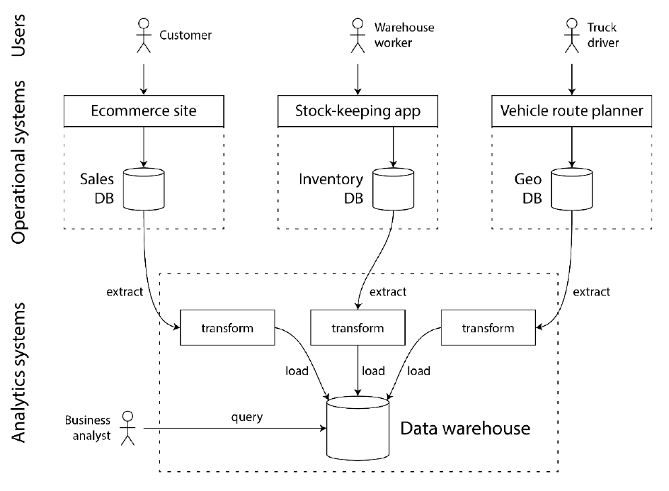
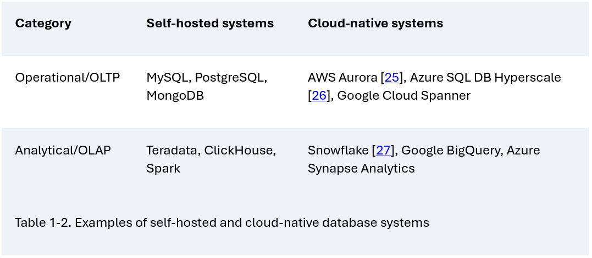

## La Idea Principal: "No Hay Soluciones, Solo Trade-offs"

El capítulo comienza con una cita que es la idea central de todo el libro: **en la arquitectura de sistemas de datos, no existe una tecnología o un enfoque que sea "el mejor" para todo**. Cada decisión que tomas es un **trade-off** (un compromiso o un intercambio). Siempre ganas algo a cambio de perder otra cosa. Por ejemplo, puedes ganar velocidad de lectura a cambio de hacer más lentas las escrituras.

El objetivo de un buen arquitecto de datos no es encontrar la "solución perfecta", sino entender profundamente estos trade-offs para poder elegir el **mejor compromiso posible** para las necesidades específicas de su aplicación.

Este capítulo introduce los grandes trade-offs y la terminología fundamental que se usará en el resto del libro.

---

## *Trade-off* n.°1: Sistemas Operacionales vs. Analíticos (OLTP vs. OLAP)

Esta es la primera y más importante distinción que hace el libro. En cualquier empresa, hay dos formas fundamentalmente diferentes de usar los datos.

Piensa en un supermercado:

1.  **El Cajero (Operacional)**: Su sistema necesita ser muy rápido para procesar **una transacción a la vez** (registrar tu compra, actualizar el inventario de esa lata de tomates). Interactúa directamente con el cliente y modifica los datos en tiempo real. Este es un sistema **OLTP (Online Transaction Processing)**.
2.  **El Gerente (Analítico)**: Al final del día, el gerente no mira venta por venta. Quiere un reporte que responda preguntas como: "¿Cuál fue el total de ventas de plátanos este mes en todas las tiendas?" o "¿Qué productos se compran juntos con más frecuencia?". Para esto, su sistema necesita escanear **millones de registros** y calcular agregados (sumas, promedios). Este es un sistema **OLAP (Online Analytical Processing)**.

Las características de estos dos sistemas son opuestas:

Debido a estas diferencias, es una muy mala idea usar la misma base de datos para ambos propósitos. Las consultas analíticas (OLAP) son muy pesadas y si se ejecutan en la base de datos operacional (OLTP), harían que la aplicación para los clientes se vuelva extremadamente lenta.

### La Solución: El Data Warehouse y el Data Lake

Para resolver esto, se inventaron los **Data Warehouses** (Almacenes de Datos):

*   Un Data Warehouse es una base de datos **separada y distinta**, diseñada exclusivamente para el análisis (OLAP).
*   Los datos se mueven periódicamente desde todos los sistemas OLTP de la empresa hacia el Data Warehouse. Este proceso se llama **ETL (Extract, Transform, Load)**:
    1.  **Extraer**: Se sacan los datos de las bases de datos operacionales.
    2.  **Transformar**: Se limpian, se estructuran y se modelan en un formato amigable para el análisis.
    3.  **Cargar (Load)**: Se cargan en el Data Warehouse.

	

Con el tiempo, los Data Warehouses se mostraron demasiado rígidos para los científicos de datos, que necesitaban trabajar con datos menos estructurados (como texto o imágenes) y usar herramientas más allá de SQL. Así nació el **Data Lake**:

*   Un **Data Lake** es un repositorio donde se "arrojan" todos los datos en su **formato crudo**, sin transformar. El lema es el "principio del sushi": los datos crudos son mejores, porque cada equipo (analistas, científicos de datos) puede "cocinarlos" (transformarlos) a su manera.
*   Una evolución más reciente es el **Data Lakehouse**, que intenta combinar la flexibilidad de un Data Lake con las capacidades de gestión y consulta de un Data Warehouse.

### Sistemas de Registro vs. Datos Derivados

Este es otro concepto clave para entender cómo fluyen los datos.

*   **Sistema de Registro (Source of Truth - Fuente de la Verdad)**: Es el lugar donde reside la versión **autoritativa y canónica** de un dato. Si hay una discrepancia, este sistema tiene la razón por definición. Por ejemplo, la base de datos principal de clientes de un banco. Cada dato importante debe tener un único sistema de registro.

*   **Datos Derivados (Derived Data)**: Son datos que se generan a partir de un sistema de registro. Si pierdes los datos derivados, **puedes volver a crearlos** desde la fuente de la verdad. Son técnicamente redundantes, pero **esenciales para el rendimiento**. Ejemplos perfectos son:
    *   **Cachés**: Una copia de los datos más consultados para que las lecturas sean más rápidas.
    *   **Índices de búsqueda**: Una estructura de datos que permite buscar por palabra clave.
    *   **Data Warehouses**: ¡Todo el almacén de datos es un sistema derivado de las bases de datos operacionales!

Entender esta distinción es crucial para diseñar arquitecturas claras y manejables.

---

## *Trade-off* n.°2: La Nube vs. Alojamiento Propio (Cloud vs. Self-Hosting)

Este es el trade-off de "construir vs. comprar" o "alquilar vs. poseer".

*   **Alojamiento Propio (Self-Hosting / On-Premise)**: Compras tus propios servidores (o los alquilas en un datacenter) e instalas y gestionas el software tú mismo (ej: descargar e instalar PostgreSQL).
    *   **Ventaja**: Tienes **control total** sobre el hardware y el software.
    *   **Desventaja**: Requiere una gran inversión inicial y un equipo de operaciones experto para mantenerlo todo funcionando.

*   **Servicios en la Nube (Cloud Services / SaaS)**: Contratas un servicio de un proveedor como Amazon (AWS), Google (GCP) o Microsoft (Azure) que te da la base de datos ya funcionando.
    *   **Ventaja**: Es más rápido empezar, es elástico (puedes escalar hacia arriba o abajo según la demanda) y externalizas la gestión básica.
    *   **Desventaja**: La mayor desventaja es la **pérdida de control**. Si el servicio se cae, solo puedes esperar. Si tiene un bug, no puedes arreglarlo. Si el proveedor sube los precios o descontinúa el servicio, estás a su merced (**vendor lock-in**).

### El Gran Cambio: Arquitectura Nativa de la Nube
Los sistemas diseñados desde cero para la nube ("cloud-native") han introducido un cambio arquitectónico fundamental: la **separación de almacenamiento y cómputo**.

*   **En el modelo tradicional**, un servidor tiene su CPU, RAM y sus discos. Almacenamiento y cómputo están unidos.
*   **En el modelo cloud-native**, el almacenamiento (ej: Amazon S3) y el cómputo (máquinas virtuales para procesar) son servicios separados. Esto permite escalar cada uno de forma independiente, lo cual es mucho más eficiente y barato.

---

## *Trade-off* n.°3: Sistemas Distribuidos vs. Nodo Único

*   **Nodo Único**: Toda la aplicación o base de datos corre en una sola máquina. Es mucho **más simple y barato** de gestionar. La regla de oro es: si puedes hacerlo en un solo nodo, hazlo.
*   **Sistema Distribuido**: La aplicación se reparte entre varias máquinas que se comunican por red.

A veces, no tienes más remedio que usar un sistema distribuido. Las razones principales son:

*   **Escalabilidad**: Tus datos o el número de peticiones son demasiado grandes para una sola máquina.
*   **Tolerancia a Fallos / Alta Disponibilidad**: Si una máquina falla, el sistema debe seguir funcionando gracias a las otras.
*   **Baja Latencia**: Si tienes usuarios por todo el mundo, pones servidores cerca de ellos para que la respuesta sea más rápida.

Pero los sistemas distribuidos introducen un mundo de **problemas nuevos y complejos**: la red es inherentemente poco fiable. Los mensajes pueden perderse o retrasarse, y saber qué ha fallado es muy difícil. Los **Microservicios** son un estilo de arquitectura popular para construir sistemas distribuidos.

---

## *Trade-off* n.°4: Sistemas de Datos, Ley y Sociedad

Finalmente, el capítulo nos recuerda que diseñar sistemas de datos no es solo un problema técnico. Tenemos una **responsabilidad ética y legal**.

> *Un sistema de datos es el conjunto de diferentes herramientas y componentes de software que trabajan juntos para almacenar, procesar y servir datos, con el fin de cumplir los objetivos de una aplicación.*

*   Regulaciones como el **GDPR** en Europa otorgan a los usuarios derechos sobre sus datos, como el **"derecho al olvido"** (pedir que sus datos sean borrados).
*   Esto crea un gran desafío técnico para sistemas que están diseñados para ser **inmutables** (donde los datos no se borran, solo se añaden versiones nuevas).
*   Introduce el principio de **minimización de datos**: recolectar y guardar solo los datos estrictamente necesarios, en contraposición a la filosofía de "Big Data" de guardarlo todo "por si acaso".

## Resumen Final

El capítulo 1 introduce varios conceptos contrastantes que representan los trade-offs fundamentales en la arquitectura de sistemas de datos. Son los siguientes:

1.  **Sistemas Operacionales (OLTP) vs. Analíticos (OLAP)**:
    *   **El Trade-off**: ¿Optimizas para transacciones rápidas e individuales o para consultas masivas y agregadas?
    *   **OLTP (Operacional)**: Ganas la capacidad de procesar muchísimas transacciones de baja latencia (ventas, registros de usuarios). Pagas con un rendimiento pobre para consultas analíticas complejas.
    *   **OLAP (Analítico)**: Ganas la capacidad de ejecutar consultas complejas sobre enormes volúmenes de datos. Pagas con una alta latencia en la ingesta de datos (los datos no están en tiempo real) y un mal rendimiento para escrituras individuales.

2.  **Cloud vs. Self-Hosting (Nube vs. Alojamiento Propio)**:
    *   **El Trade-off**: ¿Priorizas el control total o la conveniencia y la elasticidad?
    *   **Self-Hosting**: Ganas control absoluto sobre el hardware y el software. Pagas con una mayor inversión inicial, costos de mantenimiento y la necesidad de un equipo de operaciones experto.
    *   **Cloud**: Ganas rapidez para empezar, elasticidad (pagas por lo que usas) y te abstraes de la gestión básica. Pagas con una pérdida de control (*vendor lock-in*), posibles costos más altos a largo plazo y dependencia del proveedor.

3.  **Sistemas de un Solo Nodo vs. Distribuidos (Single-Node vs. Distributed)**:
    *   **El Trade-off**: ¿Optas por la simplicidad o por la escalabilidad y la tolerancia a fallos?
    *   **Single-Node**: Ganas una enorme simplicidad en el desarrollo, la operación y la depuración. Es más barato y a menudo más rápido para cargas de trabajo que caben en una sola máquina. Pagas con la falta de tolerancia a fallos y un límite estricto de escalabilidad.
    *   **Distributed**: Ganas escalabilidad (teóricamente) infinita y alta disponibilidad. Pagas con una complejidad masiva en todos los aspectos: la red es poco fiable, la consistencia de los datos es un problema y diagnosticar fallos es una pesadilla.

4.  **Necesidades del Negocio vs. Derechos del Usuario (Data Systems, Law, and Society)**:
    *   **El Trade-off**: ¿Priorizas la recopilación de datos para maximizar el valor de negocio o la minimización de datos para proteger la privacidad y los derechos del usuario?
    *   **Priorizar el Negocio**: Ganas *insights* valiosos, personalización y oportunidades de monetización. Pagas con riesgos legales (multas por GDPR), de reputación (si hay una fuga de datos) y éticos.
    *   **Priorizar al Usuario (Minimización de datos)**: Ganas confianza del usuario, cumplimiento normativo y una menor superficie de riesgo. Pagas con la pérdida de potenciales *insights* que podrías haber obtenido con más datos.

Además de estos, el libro introduce conceptos que son en sí mismos trade-offs, como **Sistemas de Registro vs. Datos Derivados** (consistencia vs. rendimiento de lectura) y la idea de **ETL** (frescura de los datos vs. potencia analítica).

Entender estos conceptos es el primer paso para poder diseñar aplicaciones de datos robustas, escalables y mantenibles.

## Ejemplo: Diseñemos un Sistema de Datos.

### Una Analogía Sencilla: El Sistema Circulatorio

Piensa en el sistema circulatorio de tu cuerpo. Si te pregunto "¿Qué es el sistema circulatorio?", no puedes señalar una sola cosa.

*   No es *solo* el corazón.
*   No es *solo* la sangre.
*   No es *solo* las arterias y las venas.

El **sistema circulatorio** es el **conjunto de todos esos componentes trabajando juntos** para cumplir un objetivo: transportar oxígeno y nutrientes por todo el cuerpo. El corazón bombea, las arterias transportan, la sangre lleva el oxígeno... cada pieza tiene una función especializada, pero solo tienen sentido como parte del sistema completo.

---

### ¿Qué es Exactamente un "Sistema de Datos"?

Un **sistema de datos** es exactamente lo mismo, pero para la información. No es un único software o una única base de datos.

> **Un sistema de datos es el conjunto de diferentes herramientas y componentes de software que trabajan juntos para almacenar, procesar y servir datos, con el fin de cumplir los objetivos de una aplicación.**

Cuando Kleppmann habla de "diseñar un sistema de datos", no está hablando de elegir la mejor base de datos. Está hablando de diseñar **toda la arquitectura del backend** que gestiona la información.

Vamos a construir un ejemplo, pieza por pieza, como lo haría Kleppmann. Imaginemos que estamos creando una aplicación de **comercio electrónico** como Amazon.

#### Paso 1: El Corazón del Sistema (La Base de Datos Principal)
Lo primero que necesitamos es un lugar para guardar la información fundamental: los productos, los usuarios y los pedidos.

*   **Componente**: Una base de datos transaccional (OLTP), como **PostgreSQL** o **MySQL**.
*   **Función**: Este es nuestro **Sistema de Registro** (*Source of Truth*). Es la fuente de la verdad para nuestros datos más críticos.

En este punto, nuestro "sistema de datos" es muy simple: es nuestra aplicación hablando con una única base de datos. Pero esto es solo el principio.

#### Paso 2: El Sistema se Vuelve Lento. Añadimos una "Memoria Rápida" (Cache)
La página de inicio, que muestra los productos más vendidos, es muy lenta porque consulta la base de datos una y otra vez.

*   **Componente**: Añadimos un **cache** en memoria, como **Redis**.
*   **Función**: Guardamos los resultados de las consultas más frecuentes aquí. Es mucho más rápido que ir a la base de datos principal.

Ahora nuestro **sistema de datos** ya no es una sola cosa. Es nuestra aplicación orquestando el trabajo entre **PostgreSQL (la verdad a largo plazo) y Redis (la verdad rápida y temporal)**.

#### Paso 3: Los Usuarios Quieren Buscar. Añadimos un "Índice Especializado"
Los usuarios quieren buscar productos por nombre o descripción. Hacer esto en PostgreSQL con `LIKE '%texto%'` es terriblemente lento e ineficiente.

*   **Componente**: Añadimos un **índice de búsqueda**, como **Elasticsearch**.
*   **Función**: Cada vez que se añade o actualiza un producto en PostgreSQL, enviamos esa información a Elasticsearch, que la indexa de una forma optimizada para búsquedas de texto.

Nuestro **sistema de datos** ahora es más complejo: es la aplicación coordinando **PostgreSQL, Redis y Elasticsearch**. Debe asegurarse de que, si un producto cambia de precio en la base de datos, el cambio se refleje también en el índice de búsqueda.

#### Paso 4: Necesitamos Análisis de Negocio. Añadimos un "Cerebro Analítico"
El equipo de marketing quiere saber qué productos se compran más en cada región para planificar sus campañas. Hacer estas consultas masivas en nuestra base de datos principal (OLTP) la colapsaría.

*   **Componente**: Añadimos un **Data Warehouse** (OLAP), como **Snowflake** o **BigQuery**.
*   **Función**: Creamos un proceso **ETL** (Extraer, Transformar, Cargar) que cada noche copia los datos de PostgreSQL, los limpia, los transforma en un formato optimizado para el análisis y los carga en el Data Warehouse.

Nuestro **sistema de datos** ahora abarca tanto el mundo operacional (los componentes que sirven a los usuarios en tiempo real) como el mundo analítico (el componente que sirve a los analistas de negocio).

#### Paso 5: Queremos Recomendaciones en Tiempo Real (Stream Processing)
Queremos mostrar "los productos que otros usuarios están viendo ahora mismo". Esto tiene que ser instantáneo.

*   **Componente**: Añadimos una cola de mensajes como **Apache Kafka** y un procesador de flujos como **Apache Flink**.
*   **Función**: Cada "clic" de un usuario se envía como un evento a Kafka. Flink lee estos eventos en tiempo real, calcula los productos más populares del último minuto y guarda el resultado en un lugar rápido (quizás Redis) para que la aplicación lo muestre.

---

### Conclusión: El Sistema de Datos es el Ecosistema Completo

Como puedes ver en el ejemplo, el **sistema de datos** de nuestra aplicación de comercio electrónico no es *ninguno* de los componentes individuales. **Es el conjunto de TODOS ellos**:

**Sistema de Datos = (PostgreSQL + Redis + Elasticsearch + Data Warehouse + Kafka + Flink) + (El código y los procesos que los conectan y mantienen sincronizados)**

**Diseñar un sistema de datos**, en el sentido de Kleppmann, es el arte de:

1.  **Elegir los componentes correctos** para cada tarea específica (no existe una herramienta que lo haga todo bien).
2.  **Componerlos** de manera que funcionen juntos de forma fiable y eficiente.
3.  **Entender los trade-offs** de cada decisión (ej: usar un cache mejora la velocidad de lectura pero introduce el problema de mantener el cache sincronizado con la base de datos).

Por eso el libro se llama "Diseñando Aplicaciones Intensivas en Datos". El "sistema de datos" es la arquitectura subyacente que hace que esas aplicaciones funcionen.

### Clasificación del Sistema de Datos que Diseñamos (Según los Trade-offs)

Ahora, apliquemos estos conceptos a nuestro sistema de comercio electrónico (PostgreSQL + Redis + Elasticsearch + Data Warehouse + Kafka/Flink).

#### 1. Clasificación: **Sistema Híbrido con Separación Clara de OLTP y OLAP**

Nuestro sistema no es ni puramente operacional ni puramente analítico. Es un **sistema híbrido** que reconoce este trade-off fundamental y lo aborda mediante la **especialización y separación de componentes**:

*   **Componentes OLTP**: PostgreSQL, Redis y Elasticsearch están diseñados para servir las peticiones de los usuarios en tiempo real (consultas puntuales, búsquedas, escrituras de pedidos). Priorizan la baja latencia.
*   **Componente OLAP**: El Data Warehouse está completamente aislado para que los analistas puedan ejecutar consultas masivas sin afectar el rendimiento del sitio. Aquí se hizo el trade-off de sacrificar la frescura de los datos (se actualizan cada 24h) para ganar potencia analítica y proteger el sistema operacional.

#### 2. Clasificación: **Sistema Predominantemente Basado en la Nube (Cloud)**

Aunque es posible auto-alojar algunos componentes, la naturaleza y escala de nuestro sistema se inclinan masivamente hacia la nube:

*   **El Trade-off**: Hemos elegido la **conveniencia y la elasticidad** por encima del control total.
*   **Justificación**: Herramientas como Snowflake/BigQuery son servicios nativos de la nube. La necesidad de escalar rápidamente ante picos de demanda (como en un Black Friday) hace que la elasticidad de la nube sea indispensable. Gestionar clústeres de Elasticsearch y Kafka por cuenta propia es tan complejo que la mayoría de las empresas optan por servicios gestionados en la nube. Hemos aceptado el riesgo de *vendor lock-in* a cambio de una mayor agilidad y menores costos operativos.

#### 3. Clasificación: **Sistema Intrínsecamente Distribuido**

Esta es la característica más definitoria de nuestra arquitectura.

*   **El Trade-off**: Hemos sacrificado la **simplicidad** para ganar **escalabilidad y tolerancia a fallos**.
*   **Justificación**: El sistema está compuesto por múltiples servicios independientes (base de datos, caché, índice de búsqueda, procesador de flujos) que se ejecutan en diferentes máquinas y se comunican por red. Esta elección es una necesidad, no un lujo. Una sola máquina no podría manejar la carga de un sitio de comercio electrónico exitoso ni ofrecería la disponibilidad requerida. Hemos aceptado la enorme complejidad de la sincronización de datos y la gestión de fallos de red como el precio a pagar por poder escalar y mantener el servicio en línea.

#### 4. Clasificación: **Sistema que Prioriza el Negocio, con la Privacidad como un Desafío de Implementación**

Nuestro sistema está diseñado para recopilar la mayor cantidad de datos posible sobre la actividad del usuario para alimentar los análisis y las recomendaciones.

*   **El Trade-off**: Hemos priorizado la **generación de valor de negocio** a través de los datos, lo que nos obliga a afrontar la **complejidad de cumplir con los derechos del usuario**.
*   **Justificación**: El objetivo de recopilar clics, búsquedas y compras es mejorar el negocio. Sin embargo, para cumplir con el "derecho al olvido" (GDPR), tendríamos que implementar un complejo proceso de borrado que se propague a través de todos nuestros sistemas distribuidos: PostgreSQL, el Data Warehouse (donde es muy difícil borrar datos históricos), Elasticsearch y los backups. Hemos hecho un trade-off que nos da un gran poder, pero a costa de una gran responsabilidad y un desafío técnico significativo en materia de gobernanza y privacidad.
