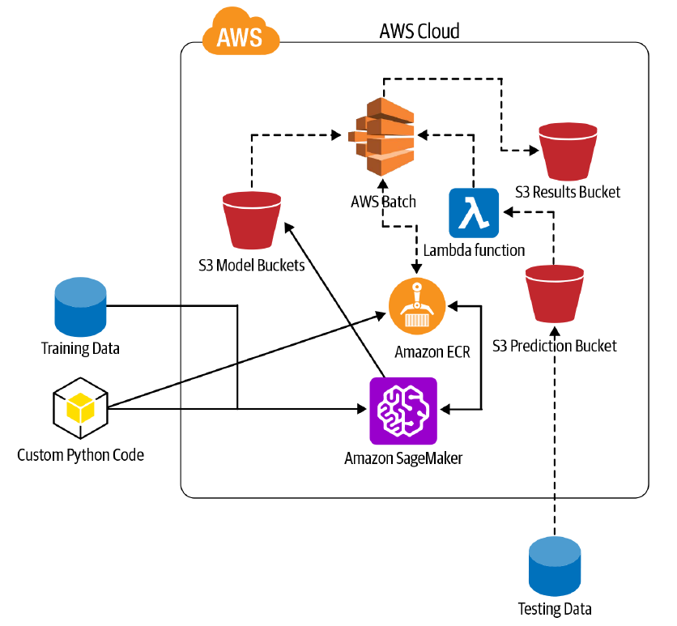
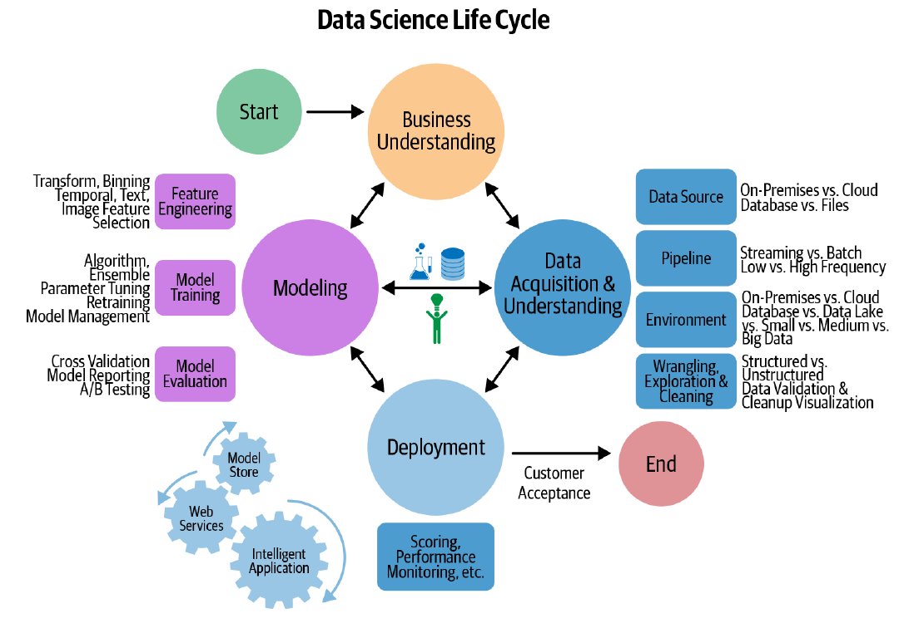
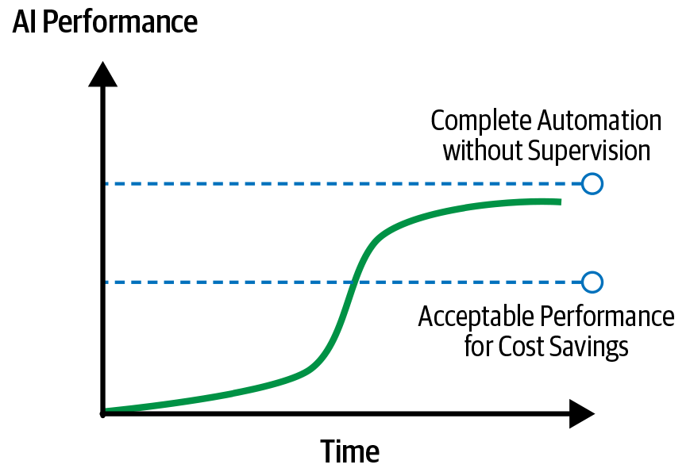

El Capítulo 11 de "Practical Natural Language Processing" es fundamental porque une todo lo aprendido y lo pone en el contexto del mundo real.

## La Idea Principal: Un Modelo de NLP no es el Producto Final, es Apenas el Comienzo

Hasta ahora, el libro ha enseñado a resolver problemas específicos de Procesamiento de Lenguaje Natural (NLP). Este capítulo da un paso atrás y nos muestra la imagen completa: ¿cómo se toma un modelo de NLP y se convierte en un producto de software robusto, escalable y que se mantiene en el tiempo?

La idea central es que el "proceso es más importante que la meta". Construir un modelo es solo una pequeña parte. El verdadero desafío está en el **proceso de extremo a extremo (end-to-end)**: desde la concepción del proyecto hasta su despliegue, monitoreo y actualización continua. Este capítulo es la guía para ese proceso.

---

## 1. Revisitando el Pipeline de NLP: Desplegando el Software

Los capítulos anteriores se centraron en las primeras etapas del pipeline: adquisición de datos, limpieza, preprocesamiento, ingeniería de características, modelado y evaluación. Ahora, nos enfocamos en las etapas finales, que son las que convierten un modelo en un producto real.

Antes de construir, hay que planificar. Los autores proponen una serie de preguntas clave que todo equipo debe hacerse al inicio:

*   **Datos**: ¿Qué datos necesitamos? ¿De dónde los sacamos? ¿Son suficientes? ¿Cómo los etiquetaremos?
*   **Métricas**: ¿Cómo mediremos el rendimiento del modelo?
*   **Despliegue**: ¿Cómo lo pondremos a disposición de los usuarios? ¿Será una API en la nube, un sistema monolítico, o correrá en un dispositivo (edge device)?
*   **Servicio**: ¿Las predicciones se entregarán en tiempo real (streaming) o por lotes (batch)?
*   **Mantenimiento**: ¿El modelo necesitará actualizarse? ¿Con qué frecuencia? ¿Cómo lo monitorearemos?

### ¿Qué Significa "Desplegar" (Deployment)?

Desplegar no es solo "encender" el modelo. Es integrarlo en un sistema de software más grande. Esto implica tres pasos clave:

1.  **Empaquetado del Modelo (Model packaging)**: El modelo entrenado se guarda y se "empaqueta" para que sea fácil de acceder y usar. A menudo se serializa (se convierte en un archivo) y se guarda en un almacenamiento en la nube (como AWS S3). Formatos como ONNX ayudan a que el modelo sea compatible con diferentes frameworks.
2.  **Servicio del Modelo (Model serving)**: El modelo se pone a disposición de otros servicios. La forma más común es exponerlo como un **servicio web (API)**. Otros componentes del software pueden "llamar" a esta API para obtener predicciones.
3.  **Escalado del Modelo (Model scaling)**: El sistema debe ser capaz de manejar un gran volumen de peticiones. Las plataformas en la nube (como AWS, Azure, Google Cloud) ofrecen herramientas para escalar automáticamente.

### Ejemplo Práctico: Un Clasificador de Comentarios Abusivos

*   **El Escenario**: Construimos un modelo que clasifica comentarios en "abusivo" o "seguro" para una red social.
*   **El Desafío**: Este modelo es solo una pequeña pieza de la plataforma. ¿Cómo lo integramos?
*   **La Solución**: Creamos un servicio web. Cuando un usuario publica un nuevo comentario, la plataforma principal envía el texto del comentario a nuestro servicio. Nuestro servicio, con el modelo dentro, devuelve una predicción ("abusivo"). La plataforma principal entonces decide qué hacer (ej: enviarlo a moderación humana).
*   **Retos Adicionales**:
    *   **Compatibilidad**: Se usan contenedores como **Docker** o **Kubernetes** para empaquetar el modelo y todas sus dependencias, asegurando que funcione en cualquier entorno.
    *   **Tamaño del Modelo**: Modelos modernos como BERT son gigantescos. Cargarlos en memoria puede ser lento y costoso. Hay mucho trabajo en **compresión de modelos** para hacerlos más ligeros y rápidos.

---

## 2. Construyendo y Manteniendo un Sistema Maduro

Un modelo de NLP en producción nunca es una tarea de una sola vez. El mundo cambia, y los datos también. Esto se conoce como **"covariate shift"**: los datos de producción empiezan a ser diferentes de los datos con los que se entrenó el modelo, y su rendimiento cae.

Para mantener un sistema de NLP maduro y útil, hay que abordar seis temas clave:

1.  **Encontrar Mejores Características (Features)**: El V1 de tu modelo es solo el comienzo. Siempre estarás buscando nuevas características (ya sea diseñadas a mano o usando representaciones más avanzadas) para mejorar el rendimiento.
2.  **Iterar Modelos Existentes**: Constantemente compararás tu nuevo modelo con el anterior para asegurarte de que realmente aporta una mejora. Esto se puede hacer con métricas de NLP (precisión) y, más importante, con métricas de negocio (KPIs) a través de pruebas A/B.
3.  **Reproducibilidad de Código y Modelo**: ¡Esto es crucial! Debes ser capaz de recrear exactamente un modelo y sus resultados. Para ello:
    *   **Separa código, datos y modelo**.
    *   **Versiona todo**: Usa Git para el código y herramientas como **DVC (Data Version Control)** para los datos y los modelos.
    *   Guarda todos los parámetros y "semillas" aleatorias para garantizar resultados idénticos.
4.  **Resolución de Problemas e Interpretabilidad (Troubleshooting and Interpretability)**: Probar un modelo de ML es difícil porque es probabilístico.
    *   **Análisis de Errores**: Es fundamental analizar dónde se equivoca el modelo.
    *   **Herramientas de Interpretabilidad**: Herramientas como **TFMA (TensorFlow Model Analysis)**, **Lime** y **Shap** nos ayudan a entender *por qué* el modelo toma ciertas decisiones, tanto a nivel global como para predicciones individuales.

5.  **Minimizar la Deuda Técnica**: En ML, la deuda técnica se acumula rápidamente. Características que ya no se usan, modelos demasiado complejos para la ganancia que aportan, etc. La regla de oro es: **opta por el modelo más simple que ofrezca un rendimiento comparable**.
6.  **Automatizar el Proceso de ML**: A medida que el sistema madura, los procesos manuales se vuelven insostenibles. Aquí es donde entra la automatización.

---

## 3. Automatizando el Machine Learning (AutoML)

AutoML es un área del ML que busca automatizar las partes más tediosas del proceso, como la ingeniería de características, la selección de modelos y el ajuste de hiperparámetros.

*   **El Objetivo**: Hacer el ML más accesible para no expertos y más eficiente para los expertos.
*   **Ejemplos**:
    *   **auto-sklearn**: Una biblioteca que busca automáticamente el mejor modelo de Scikit-learn para un problema dado.
    *   **Google Cloud AutoML**: Un servicio en la nube que permite entrenar modelos de alta calidad (para clasificación de texto, traducción, etc.) simplemente subiendo los datos etiquetados.

---

## 4. El Proceso de Ciencia de Datos

Más allá de los pasos técnicos, es vital seguir un proceso de gestión de proyectos estructurado. Los autores presentan dos de los más populares:

1.  **El Proceso KDD (Knowledge Discovery in Databases)**:
    *   Creado en los años 90, es uno de los procesos más antiguos y respetados. Consiste en una serie de pasos iterativos: entender el dominio, seleccionar y preprocesar los datos, aplicar algoritmos de minería de datos, interpretar los resultados y consolidar el conocimiento.

2.  **Microsoft Team Data Science Process (TDSP)**:
    *   Es un proceso más moderno, ágil e iterativo, diseñado para equipos de ciencia de datos en empresas. Define un ciclo de vida con 5 etapas:
        1.  Comprensión del Negocio
        2.  Adquisición y Comprensión de los Datos
        3.  Modelado
        4.  Despliegue
        5.  Aceptación del Cliente

---

## 5. Haciendo que la IA Tenga Éxito en tu Organización

Según Gartner, más del 85% de los proyectos de IA fracasan. ¿Por qué? No es solo un problema técnico. Los autores dan varias claves para el éxito:

*   **El Equipo Correcto**: Necesitas una mezcla de perfiles: científicos que construyan modelos, ingenieros que los operacionalicen, y líderes que entiendan tanto la tecnología como el negocio.
*   **El Problema Correcto y las Expectativas Correctas**:
    *   No todos los problemas son problemas de IA. A veces, una solución basada en reglas es mejor.
    *   Gestionar las expectativas es crucial. La IA no es magia, no es 100% precisa. La realidad del rendimiento de la IA sigue una **curva en S**, mientras que las expectativas suelen ser una línea que sube infinitamente.

*   **Los Datos y el Timing Correctos**: Tener petabytes de datos no significa que estés listo para la IA. Se necesitan **datos de alta calidad, representativos y etiquetados**. La analogía es perfecta: los datos brutos son petróleo crudo; los modelos de IA son aviones de combate. Necesitas una refinería (un largo y costoso proceso de ingeniería de datos) para convertir el petróleo en combustible de aviación.
*   **Un Buen Proceso**:
    *   **Define las métricas correctas**: No solo métricas de IA (precisión, F1), sino métricas de **negocio** (ej: en un chatbot, la tasa de abandono del usuario es más importante que la precisión de la intención).
    *   **Empieza simple**: Construye una base sólida y funcional antes de probar técnicas complejas.
    *   **Ciclos de entrega cortos**: Es mejor tener un modelo aceptable en producción rápidamente que pasar un año buscando un modelo perfecto.

*   **Otros Aspectos**: Considera el **costo computacional** (el entrenamiento de modelos grandes puede costar millones de dólares) y el **ROI** (retorno de la inversión).

---

## 6. Mirando hacia el Horizonte

El capítulo concluye reflexionando sobre la evolución del ML, destacando dos perspectivas:

*   **La Académica/Científica**: Enfocada en construir máquinas verdaderamente inteligentes y aplicar la IA para el bien social.

](./vf11-11.png)

*   **La Empresarial**: Enfocada en el impacto práctico, los modelos de negocio y la creación de valor.

El éxito futuro de la IA en la industria provendrá de la intersección de ambas.
