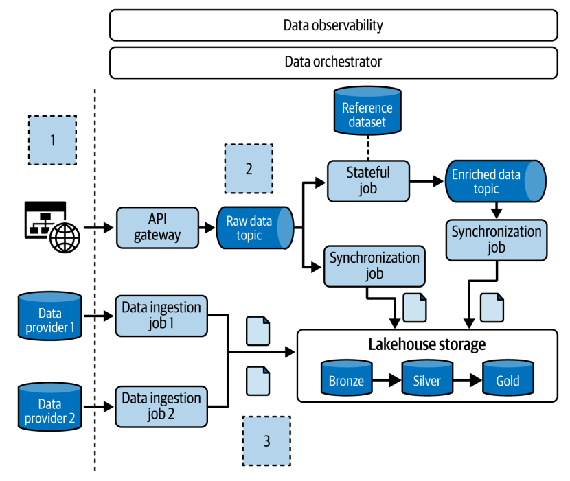

# Capítulo 1. Introducción a los Patrones de Diseño de Ingeniería de Datos

Los patrones de diseño, aunque ya están bien establecidos en la ingeniería de software, recién comienzan a ganar popularidad en el mundo de la ingeniería de datos. Por ello, es necesaria una introducción para explicar qué son en este contexto específico.

## ¿Qué son los Patrones de Diseño?

Los patrones se utilizan en la vida diaria con más frecuencia de lo que parece. El autor utiliza el ejemplo de una receta de flan para ilustrar el concepto. Una receta es una excelente representación de lo que debe ser un patrón de diseño: una plantilla predefinida y personalizable para resolver un problema.

Esta analogía con la receta del flan se aplica de la siguiente manera:

 * **Plantilla predefinida:** La lista de ingredientes y los pasos de preparación constituyen la plantilla. Siguen siendo personalizables, ya que se podría usar azúcar morena en lugar de blanca.
 * **Contextualización:** Un patrón de diseño responde a un problema específico. El flan puede ser un postre para compartir en familia o un producto para vender. El problema es cómo compartir un postre agradable o cómo producirlo para generar ingresos.
 * **Reutilización:** Si el postre es un éxito, es probable que se vuelva a utilizar la misma receta en el futuro sin "reinventar la rueda". Esta es la esencia de la reutilización de un patrón.
 * **Consecuencias:** La implementación de un patrón tiene implicaciones. Preparar y comer flan todos los días puede reducir el tiempo para otras actividades y, a largo plazo, afectar la salud.
 * **Ahorro de tiempo y lenguaje común:** La receta ahorra tiempo porque ha sido probada por otros. Además, introduce un vocabulario común; es más fácil encontrar una receta para "flan" que para "crema de caramelo".

### Relación con la Ingeniería de Datos

Para trasladar la analogía al campo técnico, se plantea un ejemplo: procesar un conjunto de datos semiestructurados de una tarea en ejecución continua. Ocasionalmente, un registro con un formato no válido puede provocar una excepción y detener todo el trabajo.

 * **Contextualización:** El problema es cómo manejar un registro mal formado sin que falle todo el proceso.
 * **Plantilla predefinida:** La solución es aplicar un conjunto de buenas prácticas, como envolver la transformación de datos en un bloque `try-catch` para capturar los registros erróneos y enviarlos a otro destino para su análisis. Esta plantilla es adaptable; por ejemplo, se podría decidir simplemente contar los errores en lugar de almacenarlos.
 * **Reutilización:** Este patrón tiene un nombre específico: *dead-lettering*. Se puede aplicar la misma lógica en contextos diferentes, como en un pipeline ELT.
 * **Consecuencias:** Implementar este patrón añade lógica extra y, por tanto, complejidad al código base.

Un patrón de diseño en ingeniería de datos ofrece una visión integral de una solución, ahorra tiempo e introduce un lenguaje común que simplifica la comunicación entre equipos.

## ¿Más Patrones de Diseño?

Quienes tienen experiencia en desarrollo de software conocen los patrones de diseño del "Gang of Four". Sin embargo, aunque son pilares para un código limpio y mantenible, no son suficientes para los proyectos de ingeniería de datos.

Patrones como *Singleton* ayudan a que el código sea comprensible, pero la ingeniería de datos debe considerar aspectos adicionales relacionados con los datos, como la gestión de fallos, el *backfilling* (relleno de datos históricos), la idempotencia y la corrección de los datos.

## Patrones Comunes de Ingeniería de Datos

El libro se estructura siguiendo un flujo de datos típico, desde la ingesta hasta la exposición final, presentando diferentes patrones en cada etapa:

 * **Capítulo 2, "Patrones de Diseño de Ingesta de Datos":** La ingesta de datos en el sistema es el primer paso técnico de cualquier arquitectura.
 * **Capítulo 3, "Patrones de Diseño de Gestión de Errores":** Los errores son una parte intrínseca de la ingeniería de datos, ya sea por fallos en el código o por datos incorrectos proporcionados por las fuentes.
 * **Capítulo 4, "Patrones de Diseño de Idempotencia":** Los errores a menudo llevan a reintentos (automáticos o manuales). La idempotencia asegura que múltiples ejecuciones de un pipeline generen salidas únicas y consistentes.
 * **Capítulo 5, "Patrones de Diseño de Valor de Datos":** Una vez gestionados los errores y reintentos, el siguiente paso es generar conjuntos de datos significativos para los usuarios de negocio, a menudo resumiendo o combinando datos.
 * **Capítulo 6, "Patrones de Diseño de Flujo de Datos":** Define cómo un pipeline que genera valor interactúa con otros componentes de datos en la organización.
 * **Capítulo 7, "Patrones de Diseño de Seguridad de Datos":** Es crucial asegurar que los datos se almacenen de forma segura y cumplan con los requisitos de privacidad.
 * **Capítulo 8, "Patrones de Diseño de Almacenamiento de Datos":** Aprovechar las técnicas de almacenamiento de datos es importante para reducir la latencia y mejorar la experiencia del usuario.
 * **Capítulo 9, "Patrones de Diseño de Calidad de Datos":** La mala calidad de los datos puede hacer que sean irrelevantes para los consumidores. Es fundamental identificar y solucionar estos problemas.
 * **Capítulo 10, "Patrones de Diseño de Observabilidad de Datos":** Es el último paso, donde se definen métricas de monitoreo para garantizar la confiabilidad de los datos y alertar cuando algo funciona mal.

## Caso de Estudio Utilizado en el Libro

Para facilitar la comprensión de los patrones, el libro los introduce en el contexto de un caso de estudio: una plataforma de análisis de datos para un blog. El proyecto se divide en las capas presentadas en la siguiente figura.

Este proyecto destaca tres partes importantes:

### 1. Componentes de ingesta de datos en línea y fuera de línea
 * La parte **en línea** corresponde a los datos generados por la interacción de los usuarios con los blogs.
 * La parte **fuera de línea** (marcada como "Proveedor de datos") se refiere a conjuntos de datos estáticos, externos o internos, que se producen con menor frecuencia (por ejemplo, una vez por hora).

### 2. La capa en tiempo real
Aquí se procesan los eventos de datos desde un *broker* de *streaming*. Las tareas pueden ser de dos tipos:

 * Una orientada al negocio, como una agregación de sesiones en tiempo real.
 * Una de carácter técnico, como la sincronización de datos con el almacenamiento para consultas ad hoc.

### 3. La capa de organización de datos
Esta capa sigue la arquitectura Medallion, que estructura los conjuntos de datos en tres niveles de madurez:

 * **Capa Bronce (Bronze):** Almacena los datos en su formato crudo, sin alteraciones y probablemente con problemas de calidad.
 * **Capa Plata (Silver):** Contiene conjuntos de datos limpios y enriquecidos.
 * **Capa Oro (Gold):** Expone los datos en el formato esperado por los usuarios finales, como *data marts* o conjuntos de datos de referencia.

Cada capa representa un nivel de madurez diferente y servirá de referencia en capítulos posteriores para explicar mejor los problemas que los patrones de diseño buscan resolver.

## Resumen

Al finalizar el capítulo, queda claro que una receta de flan es una gran analogía para los patrones de diseño en ingeniería de datos. Los próximos capítulos explorarán estos patrones en detalle, ofreciendo un viaje de aprendizaje a través de las distintas facetas de la disciplina.
