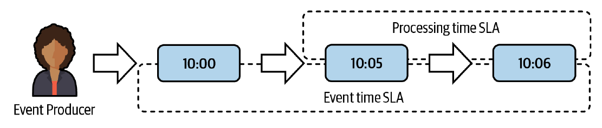
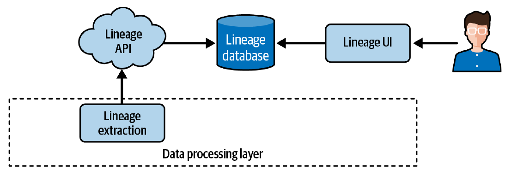
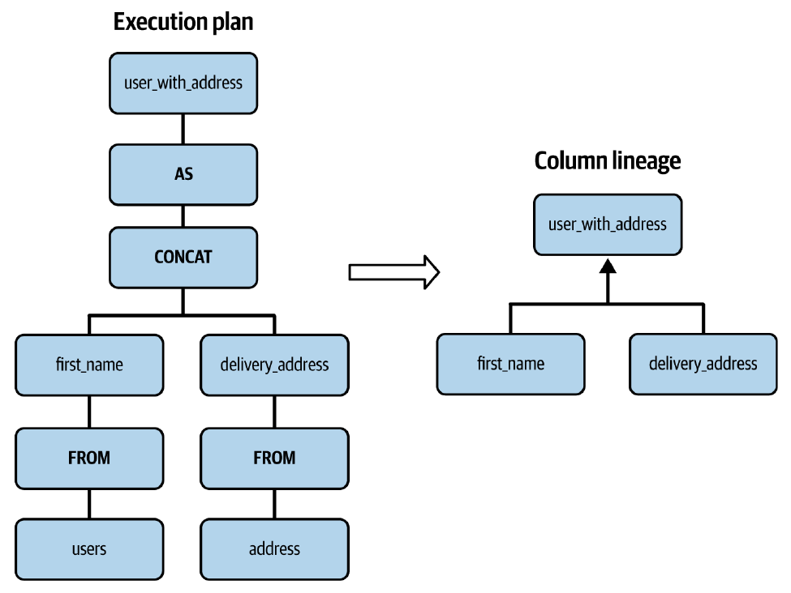

¡Claro! Aquí tienes un resumen completo y detallado del Capítulo 10 del libro "Data Engineering Design Patterns", manteniendo la estructura del libro y el formato de listas que solicitaste.

***

# Capítulo 10. Patrones de Diseño de Observabilidad de Datos

Los patrones de diseño de calidad de datos del capítulo anterior son cruciales para garantizar la relevancia de tus conjuntos de datos. Sin embargo, como se centran principalmente en los datos en sí, depender únicamente de soluciones de calidad de datos no será suficiente para tener un control de extremo a extremo de tu pila de ingeniería de datos.

Para entender esto mejor, tomemos un ejemplo. El patrón *Audit-Write-Audit-Publish (AWAP)* es un gran mecanismo de protección contra el procesamiento de datos de mala calidad. Desafortunadamente, incluso si tu trabajo AWAP detecta perfectamente todos los problemas, aún puedes estar en problemas. Un ejemplo de esto ocurre cuando tu trabajo AWAP no se ejecuta debido a una interrupción del flujo ascendente y no te das cuenta.

Sin embargo, hay buenas noticias: los patrones de diseño de observabilidad de datos de este capítulo llenan los vacíos dejados por sus contrapartes de calidad de datos al agregar capacidades de monitoreo y alerta al sistema. Para abordar estos problemas adicionales, las soluciones de patrones de observabilidad se basan en dos pilares: **detección y seguimiento**.

 * **Patrones de diseño de detección:** detectan cualquier problema relacionado con los datos o el tiempo.
 * **Patrones de diseño de seguimiento:** se centran en comprender las relaciones entre conjuntos de datos, columnas y la capa de procesamiento de datos.

## Detectores de Datos

Los ingenieros de datos procesan datos. Como era de esperar, la primera categoría de observabilidad ayuda a analizar la salud de nuestros sistemas desde el punto de vista de los datos.

### Patrón: Detector de Interrupción de Flujo (*Flow Interruption Detector*)

El primer problema grave relacionado con los datos es la falta de disponibilidad del conjunto de datos. Este problema tendrá un fuerte impacto en tus sistemas porque, sin datos, tu trabajo de procesamiento de datos no se ejecutará, lo que llevará a la falta de disponibilidad de datos en sus dependencias descendentes.

#### Problema

Uno de tus trabajos de *streaming* está sincronizando datos a un almacenamiento de objetos. El conjunto de datos sincronizado es la fuente de datos para muchos trabajos por lotes gestionados por diferentes equipos. Funcionó muy bien durante siete meses hasta que un día, procesó los registros de entrada sin escribirlos en el almacenamiento de objetos. Como el trabajo no falló, no te diste cuenta del problema.

#### Solución

Para capturar cualquier error de indisponibilidad de datos y, como resultado, aumentar la confianza en tus datos, puedes confiar en el patrón *Flow Interruption Detector*. La implementación del patrón variará dependiendo del contexto técnico y el modo de procesamiento.

Sin embargo, la interrupción del flujo de datos también puede ocurrir en *pipelines* por lotes y bases de datos en reposo. Detectar la falta de disponibilidad aquí consiste en analizar la frescura de los datos de la capa de metadatos, datos o almacenamiento:

 * **Capa de metadatos:** Esta capa almacena toda la información adicional sobre la tabla observada, como la hora de creación y la última hora de modificación.
 * **Capa de datos:** Generalmente, las interacciones con la capa de metadatos serán menos costosas en la mayoría de los escenarios debido a un acceso más directo a la información y, por lo tanto, a la falta de necesidades de procesamiento de datos.
 * **Capa de almacenamiento:** La última estrategia de detección de interrupción de flujo se basa en la capa de almacenamiento.

#### Consecuencias

La detección de interrupción de flujo puede parecer simple, pero desafortunadamente, la implementación esconde algunas trampas como el umbral, los metadatos y los falsos positivos.

 * **Umbral:** Encontrar el umbral perfecto para las implementaciones por minuto y por ventana no es fácil.
 * **Metadatos:** La solución basada en los metadatos es barata pero puede no ser perfecta.
 * **Falsos positivos para el almacenamiento:** Si confías en la capa de almacenamiento para la detección de interrupciones de flujo, ten cuidado con todas las operaciones de mantenimiento, como la compactación.

### Patrón: Detector de Sesgo (*Skew Detector*)

Además de los problemas de interrupción de datos, puedes enfrentarte a problemas de sesgo de datos que impactarán directamente en tu capa de procesamiento. Un conjunto de datos desequilibrado y, por lo tanto, sesgado puede aumentar el tiempo de procesamiento o, peor aún, activar un *pipeline* por lotes en un conjunto de datos incompleto.

#### Problema

Después de poner en marcha el *Flow Interruption Detector*, algunos consumidores se quejaron de nuevo. Esta vez, estaban descontentos porque tu trabajo por lotes procesó un conjunto de datos incompleto. Descubriste que tu trabajo funcionó correctamente, pero el *pipeline* procesó un conjunto de datos medio vacío.

#### Solución

La situación descrita en el enunciado del problema es un ejemplo típico de **sesgo de datos (*data skew*)**. Afortunadamente, el patrón *Skew Detector* te brinda más control sobre este fenómeno. Esta solución consta de tres pasos:

1.  Identificar la ventana de comparación.
2.  Establecer un umbral de tolerancia.
3.  Implementar el cálculo del sesgo.

#### Consecuencias

Aunque la solución parece simple, la práctica revela algunos puntos complicados relacionados con el propio conjunto de datos.

 * **Estacionalidad:** La estacionalidad es probablemente el mayor desafío con el patrón *Skew Detector*.
 * **Comunicación:** Aunque puedas definir el umbral en el entorno cambiante presentado en el párrafo anterior, todavía queda algo de espacio para los falsos positivos.
 * **Bucle de fatalidad:** Una comparación de ventana a ventana puede introducir algunos bucles de fatalidad en casos de sesgo.

## Detectores de Tiempo

Además de los datos, el tiempo es una métrica importante para los *pipelines* de datos. Te ayuda a detectar problemas de latencia en tu capa de procesamiento de datos.

### Patrón: Detector de Retraso (*Lag Detector*)

Hablando de latencia, el primer patrón de esta categoría define qué tan atrás puede estar un consumidor de datos con respecto al productor de datos. Esta medida es a menudo un indicador de problemas de calidad de datos futuros, como la frescura de los datos y la falta de disponibilidad de los datos.

#### Problema

Ha pasado una semana desde que uno de tus trabajos de *streaming* procesó un 30% más de datos que el trabajo anterior. Desafortunadamente, te perdiste el correo electrónico que anunciaba este aumento, y ahora, uno de tus consumidores *downstream* se queja de una entrega de datos más lenta.

#### Solución

Una buena manera de medir cómo le está yendo a tu consumidor es usar el patrón *Lag Detector*. Lo primero que hay que hacer es definir la unidad de retraso. Esta elección dependerá del almacén de datos.

#### Consecuencias

Los datos sesgados son una consecuencia grave para muchas cosas en la ingeniería de datos. El patrón *Lag Detector* no es una excepción aquí, como leerás a continuación.

 * **Sesgo de datos:** Si decides representar el retraso como una sola unidad con la función `MAX(...)`, ten cuidado, porque un resultado pobre puede no estar directamente relacionado con tu consumidor.

### Patrón: Detector de Incumplimiento de SLA (*SLA Misses Detector*)

Usar el patrón *Lag Detector* de la sección anterior es una excelente manera de medir el ritmo de procesamiento de un consumidor de datos. Sin embargo, no es la única medida basada en el tiempo que puedes añadir a tus trabajos de procesamiento de datos.

#### Problema

Tu tarea es completar un trabajo por lotes programado a las 6:00 a.m. en 40 minutos. Tus consumidores *downstream* son *pipelines* de datos críticos. Deben generar varias estadísticas de negocio antes de las 8:00 a.m. Hiciste todo lo posible para optimizar el trabajo y respetar el SLA de 40 minutos, pero sabes que suceden cosas impredecibles y que el SLA puede romperse algún día.

#### Solución

Para asegurarte de que tus consumidores sean notificados sobre cualquier problema de latencia con tu trabajo por lotes, puedes usar el patrón *SLA Misses Detector*.

#### Consecuencias

El patrón *SLA Misses Detector* es relativamente sencillo cuando se trata de *pipelines* por lotes. Sin embargo, es más desafiante para los *pipelines* de *streaming*, especialmente debido a la semántica de llegada de los datos.

 * **Datos tardíos y tiempo de evento:** Aunque el tiempo de procesamiento es una unidad de medida común para calcular los incumplimientos de SLA y la más simple también, no es la única.

## Linaje de Datos

Hasta ahora, has visto soluciones para observar los datos que estás procesando. Pero, ¿qué sucede si los problemas detectados no son tu culpa? Viste esto en el patrón *SLA Misses Detector*, donde los eventos tardíos pueden romper el SLA basado en el tiempo del evento. En este caso, necesitas saber a quién pedir ayuda para comprender mejor las razones de la latencia.

### Patrón: Rastreador de Conjuntos de Datos (*Dataset Tracker*)

Los patrones de linaje de datos operan a nivel de conjunto de datos y de entrada de datos. Comencemos descubriendo el seguimiento de conjuntos de datos que, como su nombre indica, se aplica a varios contenedores de datos, como tablas, carpetas, temas y colas.

#### Problema

Estás consumiendo un conjunto de datos de mala calidad. Tu trabajo por lotes falla regularmente porque el esquema no es consistente. Después de investigar, descubres que uno de los campos ha tenido diferentes tipos de datos a lo largo del tiempo. Tu proveedor de datos *upstream* no está al tanto de estos cambios porque no es el que genera el conjunto de datos.

#### Solución

Analizar la composición del conjunto de datos es un buen ajuste para el patrón *Dataset Tracker*. La solución crea un árbol genealógico de conjuntos de datos dentro de tu organización que puedes usar para descubrir fácilmente las dependencias entre los conjuntos de datos y, por lo tanto, también entre los equipos.

#### Consecuencias

Aunque el linaje de datos se está volviendo cada vez menos oscuro hoy en día gracias a los avances más recientes en tecnologías de nube y de código abierto, también tiene algunos inconvenientes.

 * **Bloqueo de proveedor (*Vendor lock*):** Las soluciones totalmente gestionadas como las presentadas con Databricks y GCP a menudo funcionan dentro del propio alcance del servicio.
 * **Trabajo personalizado:** A veces, los *frameworks* de orquestación de datos abstraen la declaración de entrada/salida, ya que pueden deducirla de las configuraciones de las tareas.

### Patrón: Rastreador de Grano Fino (*Fine-Grained Tracker*)

El seguimiento de conjuntos de datos resuelve el problema de dependencia de conjuntos de datos, pero automáticamente plantea otra pregunta: ¿cómo rastreamos la(s) columna(s)? Dicho de otra manera, ¿cómo determinamos qué columnas de entrada componen cada columna de salida?

#### Problema

Implementaste el patrón *Denormalizer* para evitar uniones costosas en una tabla. La tabla ha crecido a más de 30 columnas en tres años. La composición de tu equipo cambia con bastante frecuencia, y cada vez, los nuevos miembros te hacen preguntas sobre las dependencias de la tabla.

#### Solución

Este detalle de seguimiento a nivel de columna es un escenario ideal para usar el patrón *Fine-Grained Tracker*. Proporciona detalles de bajo nivel a nivel de columna o fila sobre el origen de los datos.

#### Consecuencias

El *Fine-Grained Tracker* proporciona algunos *insights* adicionales, pero también tiene algunas limitaciones.

 * **Código personalizado:** El linaje a nivel de columna analiza los nodos del plan de ejecución para detectar dependencias.
 * **Visualización a nivel de fila:** El linaje a nivel de conjunto de datos y a nivel de columna son dos categorías comunes en el mundo del linaje de datos que están ampliamente soportadas tanto por las partes de extracción como de visualización.

## Resumen

En este capítulo, aprendiste cómo añadir protección extra a tus cargas de trabajo de datos mediante el uso de detectores y rastreadores. La primera sección presentó dos patrones de detectores de datos. El *Flow Interruption Detector* fue el primero de ellos. Si tienes alguna duda sobre la continuidad de los datos que estás procesando, el *Flow Interruption Detector* es una solución de observabilidad. También en esta sección, aprendiste sobre el patrón *Skew Detector* que puedes emplear para detectar conjuntos de datos y particiones desequilibrados.

En la siguiente sección, aprendiste sobre los detectores de tiempo. Operan en el espacio-tiempo y ayudan a detectar cualquier problema de latencia. El primero de los patrones descritos fue el *Lag Detector*. Es particularmente interesante de usar con *pipelines* de *streaming* para detectar cada vez que un trabajo de *streaming* se retrasa con respecto al productor de datos. La detección de retrasos se puede extender con el patrón *SLA Misses Detector*, que asegura que cada tarea de procesamiento de datos se complete dentro de un período de tiempo especificado.

Finalmente, en la última sección, aprendiste sobre la porción de seguimiento de la observabilidad de datos con dos patrones de linaje de datos. El primero de ellos se centra en los conjuntos de datos, de ahí su nombre, el *Dataset Tracker*. Lo encontrarás útil en grandes organizaciones donde varios equipos intercambian conjuntos de datos entre sí y donde al final, es posible que no conozcas el alcance de las responsabilidades de cada equipo. El *Dataset Tracker* proporcionará un grafo de dependencia global entre esos equipos y sus conjuntos de datos. Si necesitas más detalles, puedes aprovechar el segundo patrón, el *Fine-Grained Tracker*. Te ayuda a ver no solo la imagen completa, sino también los detalles de bajo nivel de las transformaciones aplicadas a cada columna o los trabajos que producen filas particulares.
