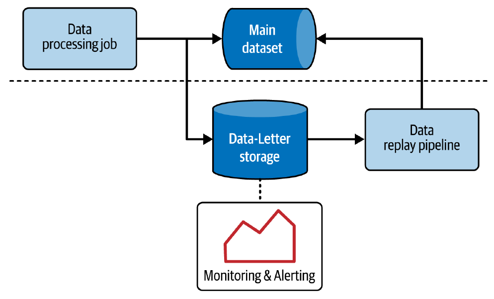
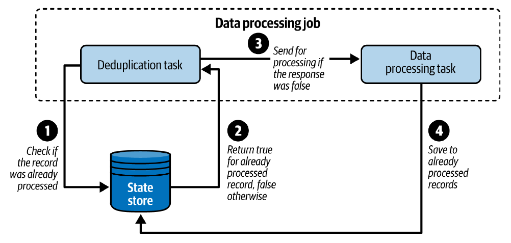
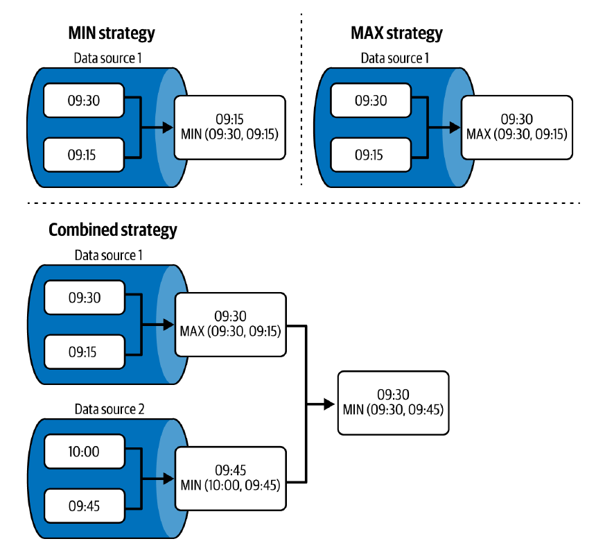
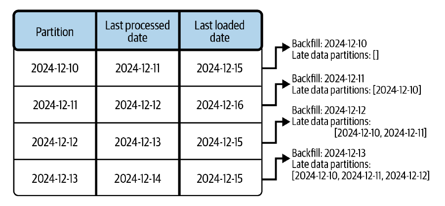

# Capítulo 3. Patrones de Diseño de Gestión de Errores

Benjamin Franklin escribió en 1789: *"en este mundo no se puede decir que nada sea seguro, excepto la muerte y los impuestos"*. Si hubiera sido un ingeniero de datos, probablemente habría añadido *"errores y problemas de calidad de los datos"*.

La vida de la ingeniería de datos rara vez es un camino de rosas. Los datos son dinámicos y las expectativas cambian. Además, al procesar datos generados por otros, se heredan directamente sus problemas de ingeniería, como redes poco fiables que provocan entregas tardías o fallos temporales que causan duplicados.

Este capítulo se centra en la gestión de errores, el siguiente paso lógico después de la ingesta de datos. Los patrones aquí presentados abordan los problemas que se enfrentan como consumidor de datos e infraestructura, tales como registros no procesables, datos tardíos, duplicados y fallos de hardware en trabajos de *streaming*.

## Registros no Procesables

La calidad de los datos es un problema recurrente. La primera cuestión a tratar son los registros que no se pueden procesar, los cuales a menudo causan fallos fatales que detienen el trabajo de procesamiento. Mantener un enfoque de "fallo rápido" (*fail-fast*) no siempre es posible, especialmente en trabajos de *streaming* de larga duración.

### Patrón: Dead-Letter

Una solución sencilla es ignorar los registros erróneos y continuar con los correctos, pero esto implica perderlos para siempre. Una mejor aproximación es guardar estos registros en otro lugar para su investigación posterior.

#### Problema

Un trabajo de procesamiento en *streaming* lee eventos de visita desde un tópico de Apache Kafka y los escribe en un almacenamiento de objetos. Recientemente, los productores de datos han comenzado a generar registros no procesables, provocando que el trabajo falle. Durante tres días consecutivos, se ha tenido que solucionar el problema manualmente relanzando el trabajo. Se necesita una solución mejor que mantenga el *pipeline* en funcionamiento a pesar de los registros fallidos y que permita investigar los errores más tarde.

#### Solución

El patrón **Dead-Letter** (carta muerta) permite que un trabajo continúe procesando los registros válidos aunque no pueda procesar uno en particular.

El patrón comienza identificando los puntos del código donde el trabajo puede fallar. Luego, se añaden controles de seguridad, como un bloque `try-catch`, sobre esos puntos. Si se produce un error, en lugar de detener el trabajo, el registro fallido se redirige a una salida diferente, conocida como almacenamiento *dead-letter*. Es recomendable decorar el registro fallido con metadatos sobre el error para facilitar el análisis posterior (usando el patrón *Metadata Decorator*).

Al elegir un destino para los registros *dead-letter*, se debe considerar:

 * **Resiliencia:** Para no tener que diseñar una estrategia de *dead-letter* para el propio almacenamiento de *dead-letter*.
 * **Facilidad de monitoreo:** Es clave saber cuándo el trabajo empieza a encontrar errores y cuántos se han escrito.
 * **Rendimiento de escritura:** Escribir en un lugar extra incurrirá en un costo en el tiempo de ejecución.

Buenos candidatos para este almacenamiento son los *object stores* en la nube o los *brokers* de *streaming*, ya que son altamente disponibles y fáciles de monitorear. Opcionalmente, se puede completar el patrón con un **pipeline de reproducción (*replay*)** que reingiera los registros fallidos (una vez corregidos) en el flujo de datos principal.

Este patrón es aplicable tanto a cargas de trabajo de *streaming* (operando registro por registro) como de *batch* (operando sobre un conjunto de registros).

#### Consecuencias

A pesar de su beneficio, ignorar errores tiene consecuencias serias:

 * **Efecto de bola de nieve en el *backfilling*:** Si se decide usar el *pipeline* de reproducción, los registros reingresados pueden pertenecer a particiones ya procesadas por los consumidores. Esto requeriría una acción de *backfilling* (reprocesamiento) por su parte, lo que podría iniciar un "efecto de bola de nieve" donde sus propios consumidores también deban reprocesar los datos.

 * **Identificación de registros *dead-lettered*:** Al reingresar los registros, es posible que se desee distinguirlos de los que se ingirieron normalmente. Se puede añadir una columna booleana (`was_dead_lettered`) o metadatos más completos.
 * **Orden y consistencia:** El patrón puede romper la consistencia del orden de los datos. Si un consumidor construye sesiones basadas en una ventana de inactividad de cinco minutos y los eventos de un usuario caen en el almacenamiento *dead-letter* durante ese tiempo, la sesión se cerrará prematuramente y será inconsistente con la realidad.
 * **Funciones a prueba de errores (*Error-safe functions*):** Estas funciones, que devuelven `NULL` en lugar de lanzar una excepción, hacen que la implementación del patrón sea más desafiante, ya que se debe comparar el valor de salida con el de entrada para detectar un posible error.
 * **¿Error o fallo?:** El patrón mantiene el trabajo en ejecución, pero oculta errores. Esto podría enmascarar un fallo fatal que debería detener el *pipeline*. Es crucial complementar la implementación con una capa de alertas apropiada que pueda detener el trabajo si se superan ciertos umbrales de error.

## Registros Duplicados

La captura de registros no procesables es solo el primer paso. El siguiente desafío se refiere a la semántica de entrega. En sistemas distribuidos, es muy raro ver registros entregados "exactamente una vez" (*exactly-once*). Lo más común es un entorno de "al menos una vez" (*at-least-once*). ¿Qué hacer si la lógica de negocio debe procesar cada ocurrencia solo una vez?

### Patrón: Deduplicador con Ventana (*Windowed Deduplicator*)

La deduplicación de datos es la respuesta más común para asegurar que la lógica procese cada ocurrencia solo una vez. La clave es considerar los datos como limitados. Para trabajos de *streaming*, los límites serán ventanas basadas en tiempo; para trabajos de *batch*, el alcance se reducirá al conjunto de datos actualmente procesado.

#### Problema

Un trabajo por lotes necesita procesar eventos de visita que han sido sincronizados desde una capa de *streaming* a un almacenamiento de objetos. El trabajo expone los datos directamente a los usuarios de negocio, por lo que debe garantizar el procesamiento "exactamente una vez" para cada registro distinto. El problema es que la capa de *streaming* a menudo tiene eventos duplicados debido a los reintentos automáticos de los productores de datos.

#### Solución

Los datos duplicados pueden llevar a resultados inconsistentes. Para evitarlo, se utiliza el patrón *Windowed Deduplicator*. El primer paso es identificar los atributos que garantizan la unicidad de un registro. Luego, se define el alcance de la deduplicación.

 * **En *Batch*:** El alcance suele ser el conjunto de datos actual. La implementación utiliza una expresión `DISTINCT` o una función de ventana (`WINDOW`) con una condición sobre `row_number()`.
 * **En *Streaming*:** Los trabajos operan sobre un conjunto de registros no acotado. El patrón simula un conjunto de datos completo creando **ventanas basadas en tiempo**. El trabajo debe mantener un **almacén de estado (*state store*)** para recordar las claves ya procesadas dentro de la duración de la ventana.

Existen tres tipos de almacenes de estado, con diferentes compromisos entre rendimiento y consistencia:

 * **Local:** El estado vive solo en memoria. Es la solución más rápida, pero no es una buena opción para producción si no se puede aceptar la pérdida del estado en caso de fallo.
 * **Local con tolerancia a fallos:** El estado vive principalmente en memoria, pero se persiste en un almacenamiento remoto. La acción de persistencia tiene un costo en tiempo o consistencia.
 * **Remoto:** El estado solo está presente en un almacén de datos remoto. Ofrece tolerancia a fallos de forma nativa, pero puede impactar negativamente la latencia y el costo.

#### Consecuencias

 * **Compensación entre espacio y tiempo:** En *streaming*, una ventana de deduplicación corta probablemente omitirá algunos duplicados, pero tendrá un bajo impacto en los recursos. Una ventana más larga necesitará más recursos para persistir y gestionar más claves únicas en el almacén de estado.
 * **Productor idempotente:** La deduplicación correcta no garantiza una entrega "exactamente una vez" de los registros procesados. Esto a menudo no es posible debido a errores transitorios y sus reintentos automáticos.

## Datos Tardíos (*Late Data*)

Aunque los registros no procesables y duplicados son errores graves, los datos tardíos pueden tener un impacto igualmente serio en los *pipelines*.

### Patrón: Detector de Datos Tardíos (*Late Data Detector*)

El primer aspecto a tratar con los datos tardíos es su detección.

#### Problema

La mayoría de las veces, los visitantes de la plataforma de blogs generan eventos casi en tiempo real (en 15 segundos). Sin embargo, a veces los usuarios pierden su conexión de red y los eventos se almacenan localmente antes de ser enviados. Los trabajos de procesamiento de datos deben detectar estos eventos tardíos para aplicar una estrategia dedicada.

#### Solución

El primer paso es definir un atributo basado en el tiempo para rastrear los datos tardíos. Existen dos conceptos de tiempo:

 * **Tiempo del evento (*Event time*):** Indica cuándo ocurrió una acción.
 * **Tiempo de procesamiento (*Processing time*):** Indica cuándo el *pipeline* interactuó con el dato.

Luego, se debe definir una estrategia de agregación de latencia que sea monotónicamente creciente (nunca retroceda en el tiempo). Por ello, la estrategia más común usa la función `MAX` sobre el tiempo del evento para cada partición. Finalmente, para permitir cierta latencia inesperada, el patrón requiere un atributo de **retraso permitido (*allowed lateness*)**. El resultado de `MAX(tiempo del evento) - retraso permitido` se llama **marca de agua (*watermark*)**, y define el tiempo mínimo de evento para considerar un evento como "a tiempo".

Para entender mejor el *watermark*, veamos un ejemplo en la **Tabla 3-1**.

**Tabla 3-1. Watermark de 30 minutos**

| Tiempos del Evento | Watermark de Entrada | Candidato a Watermark | Watermark de Salida | Registros Ignorados |
| :--- | :--- | :--- | :--- | :--- |
| 10:00, 10:05, 10:06 | - | MAX(10:00, 10:05, 10:06) – 30' = 9:36 | MAX(9:36) = 9:36 | - |
| 9:20, 9:31, 10:07 | 9:36 | MAX(10:07) – 30' = 09:37 | MAX(9:36, 9:37) = 9:37 | 9:20, 9:31 |

Una vez que se detecta un evento como tardío, la acción más simple es ignorarlo. Sin embargo, si los registros tardíos son valiosos, se necesitará escribirlos en el sistema usando el patrón *Late Data Integrator*.

#### Consecuencias

 * **Captura de datos tardíos:** Algunos *frameworks* de procesamiento (como Apache Spark Structured Streaming) tienen la capacidad de detectar e ignorar eventos tardíos, pero no exponen una API para capturarlos fácilmente. Otros (como Apache Flink) ofrecen más flexibilidad.
 * **Estrategia MIN y trabajos con estado:** Usar la función `MIN` para rastrear el tiempo del evento puede llevar a una situación de "atrapado en el pasado" (*stuck-in-the-past*), donde la marca de agua nunca avanza si llegan datos tardíos continuamente, haciendo que el estado de los trabajos crezca indefinidamente.
 * **Estrategia MAX y sesgo de eventos:** Usar `MAX` puede ser demasiado agresivo si algunas fuentes de datos son mucho más lentas que otras, causando que sus datos se descarten como "tardíos".

#### Ejemplos

El patrón *Late Data Detector* está presente principalmente en el procesamiento de *streams*. A continuación se muestra un ejemplo con Apache Spark Structured Streaming. La **Tabla 3-2** muestra las ventanas almacenadas en búfer y emitidas para cada hora de evento recibida.

**Tabla 3-2. El impacto del watermark en los datos tardíos para la hora del evento de 2023-06-30**

| Hora del Evento (s/s) | Watermark Actual (segundos) | Ventanas en Búfer | Ventanas Emitidas |
| :--- | :--- | :--- | :--- |
| 03:15 | 1970-01-01T00:00 a 2023-06-30T02:15 | [03:10-03:20] | [] |
| 03:00 | 02:15 a 02:15 | [03:00-03:10, 03:10-03:20] | [] |
| 01:50 | 02:15 a 02:15 | [03:00-03:10, 03:10-03:20] | [] |
| 03:11 | 02:15 a 02:15 | [03:00-03:10, 03:10-03:20] | [] |
| 04:31 | 02:15 a 03:31a | [04:30-04:40] | [03:00-03:10, 03:10-03:20] |

a. Técnicamente, Apache Spark Structured Streaming redondea el watermark hacia el límite superior de la ventana. El ejemplo aquí utiliza una versión simplificada para facilitar la comprensión.

### Patrón: Integrador de Datos Tardíos Estático (*Static Late Data Integrator*)

#### Problema

Un trabajo diario genera estadísticas y los resultados se consideran aproximados durante 15 días, que es el retraso máximo permitido para integrar datos tardíos. El lote solo procesa el día actual e ignora los datos tardíos. Se desea adaptar el trabajo para incluir datos tardíos como parte del *pipeline* diario sin tener que ejecutar 15 trabajos individuales por separado cada día. Por ejemplo, con una ventana de 14 días, la ejecución actual reprocesará las particiones de los últimos 14 días más el día actual.

#### Solución

Un retraso fijo para la ingesta de datos tardíos es un escenario perfecto para el patrón *Static Late Data Integrator*. La implementación comienza definiendo una **ventana de retrospectiva estática (*static lookback window*)**, es decir, qué tan atrás en el tiempo se buscarán datos tardíos en una ejecución dada.

#### Consecuencias

 * **Efecto de bola de nieve en el *backfilling*:** Si los consumidores se preocupan por la consistencia, necesitarán reproducir todas las particiones con los datos tardíos, lo que puede desencadenar un efecto en cascada.
 * **Ejecuciones superpuestas y *backfilling*:** Debido a la naturaleza estática de la ventana, no se deben hacer *backfills* de la manera tradicional. Reejecutar varios días generará ejecuciones superpuestas, como se muestra en la **Tabla 3-3**. Para hacer un *backfill*, solo se necesita reiniciar la última ejecución.

**Tabla 3-3. Ejemplos de backfilling superpuesto**

| Fecha de Ejecución | Fechas Ejecutadas |
| :--- | :--- |
| 2024-10-10 | 2024-10-09, 2024-10-08, 2024-10-07, 2024-10-06 |
| 2024-10-11 | 2024-10-10, 2024-10-09, 2024-10-08, 2024-10-07 |
| 2024-10-12 | 2024-10-11, 2024-10-10, 2024-10-09, 2024-10-08 |

 * **Disparador del *pipeline*:** Los trabajos de *backfilling* deben ser parte del *pipeline* principal para evitar problemas de superposición.

### Patrón: Integrador de Datos Tardíos Dinámico (*Dynamic Late Data Integrator*)

#### Problema

El patrón estático ya no es suficiente. El *product owner* quiere enriquecer las estadísticas con todos los datos tardíos, incluso más allá de la ventana inicial de 15 días. Se necesita adaptar el *pipeline* para evitar reproducir ciegamente solo las dos semanas anteriores.

#### Solución

Para manejar la variabilidad e integrar solo las particiones con datos tardíos, se puede usar el patrón *Dynamic Late Data Integrator*. La implementación aprovecha una ventana de retrospectiva que es dinámica, lo que significa que todas las particiones con *backfill* realmente contienen datos tardíos. Para que esto suceda, el enfoque dinámico requiere una estructura de datos adicional (una **tabla de estado**) para almacenar la última hora de ejecución y la última hora de actualización para cada partición, como se muestra en la **Tabla 3-4**.

**Tabla 3-4. Estructura de datos (también conocida como tabla de estado) para el Integrador Dinámico de Datos Tardíos**

| Partición | Último tiempo procesado | Último tiempo de actualización |
| :--- | :--- | :--- |
| 2024-12-17 | 2024-12-17T10:20 | 2024-12-17T03:00 |
| 2024-12-18 | 2024-12-18T09:55 | 2024-12-20T10:12 |

Basado en esta tabla, se puede realizar una consulta para obtener las particiones a las que hacer *backfill*.

#### Consecuencias

 * **Concurrencia:** Si el *pipeline* admite ejecuciones concurrentes, la integración dinámica de datos tardíos puede generar ejecuciones duplicadas de integración de datos tardíos. Para evitar esto, se necesita añadir una columna extra a la tabla de estado que mantenga el estado de la partición.

 * **Pipelines con estado y datos muy tardíos:** Para trabajos con estado (depende de ejecuciones anteriores) y se detectan datos muy tardíos (por ejemplo, de hace un mes), será necesario regenerar todas las ejecuciones desde ese punto para garantizar la corrección del conjunto de datos.

## Filtrado

Un error en las tareas de ingeniería de datos no siempre significa un fallo técnico. Los errores también incluyen errores humanos, como la implementación incorrecta de filtros, que pueden llevar a la exposición de datos parciales o incorrectos a los usuarios finales.

### Patrón: Interceptor de Filtros (*Filter Interceptor*)

Una de las operaciones de datos más comunes es el filtrado. Sin embargo, a menudo es difícil saber qué condición particular ha filtrado la mayoría de las filas.

#### Problema

Uno de los trabajos por lotes utiliza un *framework* de procesamiento de datos distribuido. Recientemente, se lanzó una nueva versión a producción y se notó un aumento repentino del volumen de datos filtrados del 15% al 90%. Se sospecha si el cambio proviene de los datos o de una regresión del software, pero no se puede determinar simplemente mirando el plan de ejecución, ya que el motor de procesamiento colapsa todas las expresiones de filtrado en una sola.

#### Solución

El patrón *Filter Interceptor* supera esta limitación. La implementación consiste en envolver la condición de filtrado con una lógica de contador.

 * **Con una API programática:** Se envuelve la condición de filtrado con un contador que se incrementa si la condición se evalúa como verdadera. Al final de la ejecución del trabajo, se recopilan explícitamente todos los contadores de filtro.
 * **Con lenguajes declarativos como SQL:** La solución consiste en usar una subconsulta o una tabla temporal que expone el resultado de cada filtro como una columna booleana separada antes de aplicar el filtro final.

#### Consecuencias

 * **Impacto en el tiempo de ejecución:** Envolver la condición de filtrado impactará el tiempo de ejecución y los recursos del trabajo, aunque el impacto debería ser pequeño.
 * **Lenguajes declarativos:** A veces es mejor codificar aunque uno esté acostumbrado a trabajar solo con SQL. El Interceptor de Filtros es uno de los ejemplos donde los lenguajes declarativos son menos potentes que la API programática.
 * **Streaming:** La implementación es desafiante para trabajos de *streaming*, ya que puede requerir transformar un trabajo sin estado en uno con estado para contar el número de filtros aplicados.

## Tolerancia a Fallos

El error fatal es particularmente crítico en el procesamiento de flujos. Estas aplicaciones trabajan con eventos que llegan continuamente y que a menudo se almacenan en un registro de solo adición. A diferencia de los *pipelines* por lotes, no se pueden reiniciar simplemente, ya que el conjunto de datos no tiene una estructura organizativa particular que ayude a averiguar qué procesar a continuación.

### Patrón: Checkpointer

#### Problema

Se está procesando eventos de visita en *streaming*. El trabajo cuenta el número de visitas únicas en ventanas de 10 minutos. Preocupa que cualquier fallo fatal detenga el trabajo y lo haga reprocesar los datos desde el principio. Para mitigar ese riesgo, se busca una solución que persista los resultados a medida que la consulta avanza.

#### Solución

Para evitar el reprocesamiento de datos pasados, el trabajo debe mantener un registro de la posición más reciente en la fuente de datos consumida, así como del estado computado. El patrón **Checkpointer** implementa este mecanismo de seguimiento. El *checkpointing* consiste en registrar el proceso de procesamiento de datos en un almacenamiento más persistente que el entorno del trabajo.

#### Consecuencias

 * **Compensación entre garantía de entrega y latencia:** El seguimiento de la posición no es una operación costosa en términos de latencia. Sin embargo, el patrón también se aplica al estado en casos de aplicaciones con estado. El seguimiento del estado puede tener un impacto de latencia más significativo.
 * **Sensación de "exactamente una vez":** El patrón da la sensación de una entrega "exactamente una vez", pero es solo una impresión. Para lograr una entrega verdaderamente "exactamente una vez", se necesitará aplicar uno de los patrones de idempotencia.
 * **Modos de entrega:** Existen otros dos modos de entrega disponibles que se ven afectados por el *checkpointing*: *At least once* (al menos una vez) y *At most once* (como máximo una vez).

## Resumen

Los errores son inevitables. Pueden provenir de código con errores, mala calidad de los datos ingeridos o simplemente problemas de hardware temporales. Los patrones de diseño de gestión de errores están ahí para ayudarte a lidiar con lo inevitable.

Al principio del capítulo, descubriste tres patrones que se adaptan a los problemas de calidad de los datos. Aprendiste a usar el patrón *Dead-Letter* para manejar registros no procesables con elegancia, el patrón *Windowed Deduplicator* para reducir el riesgo de duplicados, y el patrón *Late Data Detector* con *Integrator* para identificar y procesar datos tardíos.

A continuación, descubriste el *Filter Interceptor* que puede ayudarte a comprender mejor cómo se comporta tu código en una operación de filtrado. Finalmente, viste que los fallos pueden ser críticos para las aplicaciones de larga duración y que, afortunadamente, los servicios modernos de procesamiento de datos gestionan la tolerancia a fallos en tu nombre con el patrón *Checkpointer*.
