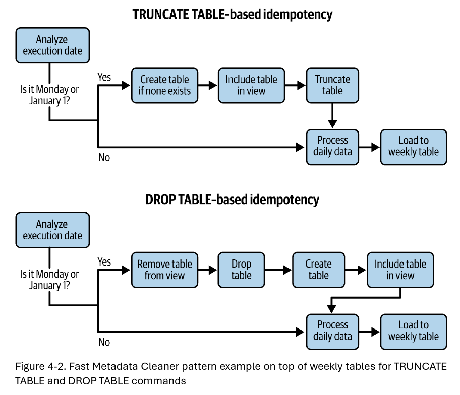
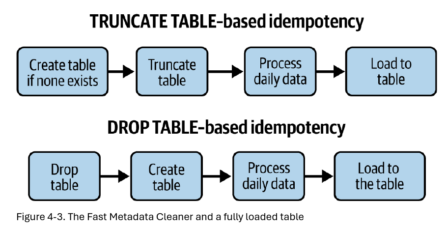
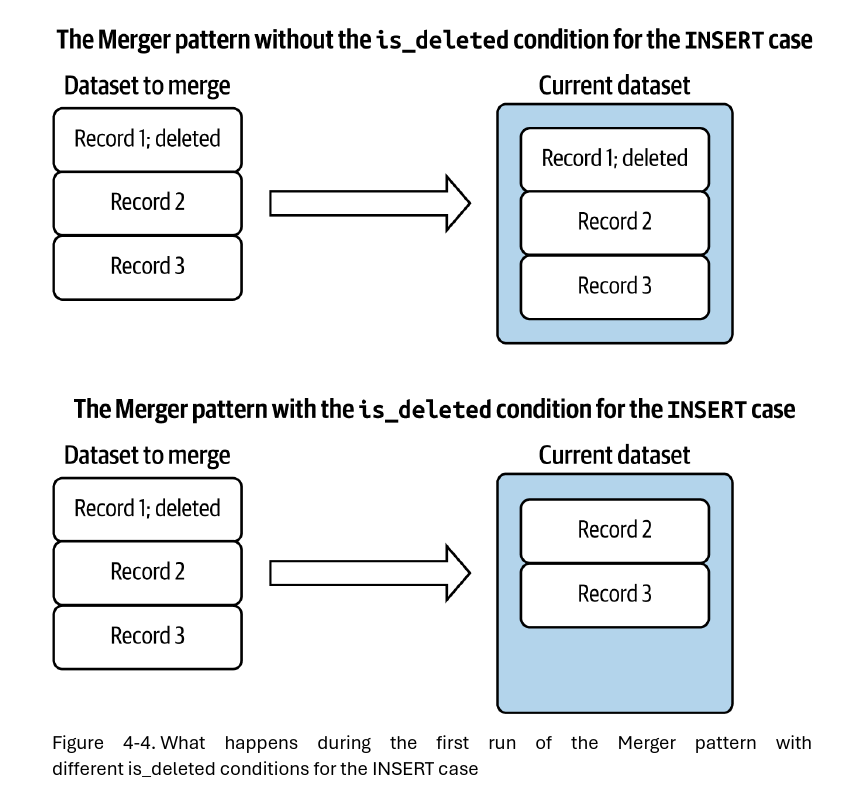
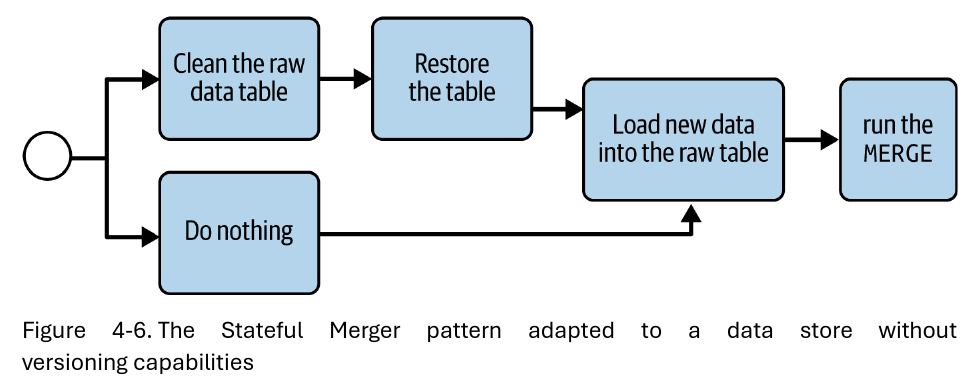
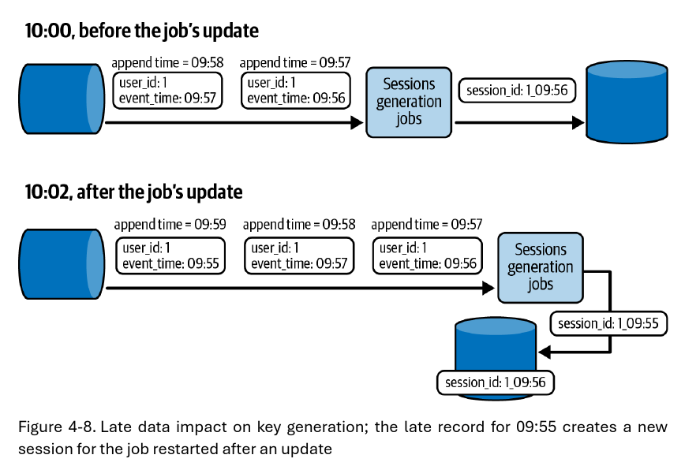

# Capítulo 4. Patrones de Diseño de Idempotencia

Cada actividad de ingeniería de datos eventualmente conduce a errores. Aunque los patrones de gestión de errores del capítulo anterior abordan la mayoría de los problemas, no los resuelven todos.

Un reintento automático tras un fallo temporal es una gran característica desde el punto de vista de la ingeniería, pero desde la perspectiva de los datos, plantea un serio desafío para la consistencia. Una tarea reintentada podría repetir operaciones de escritura ya exitosas, llevando a la duplicación de datos en el mejor de los casos. En el peor, genera duplicados que no se pueden eliminar porque ni siquiera se puede determinar que representan los mismos datos.

La **idempotencia** es la solución a estos problemas. En el contexto de la ingeniería de datos, es una forma de asegurar que, sin importar cuántas veces se ejecute un trabajo de procesamiento de datos, siempre se obtendrá un resultado consistente, ya sea sin duplicados o con duplicados claramente identificables.

Este capítulo explora varios enfoques de idempotencia:

 * Sobrescribir conjuntos de datos completos o subconjuntos.
 * Aprovechar las bases de datos para implementar estrategias de idempotencia.
 * Mantener un conjunto de datos inmutable pero idempotente.

## Sobrescritura (*Overwriting*)

La primera familia de patrones de idempotencia cubre el escenario de eliminación de datos. Eliminar datos existentes antes de escribir nuevos es el enfoque más fácil, pero puede ser intensivo en cómputo para grandes conjuntos de datos. Para manejar la eliminación, se pueden usar soluciones basadas en datos o en metadatos.

### Patrón: Limpiador Rápido de Metadatos (*Fast Metadata Cleaner*)

Las operaciones de metadatos suelen ser las más rápidas, ya que operan en una capa lógica que describe los archivos de datos, en lugar de interactuar directamente con ellos.

#### Problema

Un trabajo por lotes diario procesa entre 500 GB y 1.5 TB de datos de visitas. Para garantizar la idempotencia, se definen dos pasos: una operación `DELETE` para eliminar las filas del día anterior y una operación `INSERT` para las nuevas filas. Después de tres semanas, el trabajo sufre problemas de latencia debido al crecimiento de la tabla, que degrada el rendimiento de la tarea `DELETE`. Se necesita un diseño de *pipeline* más escalable e idempotente.

#### Solución

La operación `DELETE` puede tener un rendimiento deficiente en grandes volúmenes de datos. Afortunadamente, existen alternativas más rápidas que se basan en operaciones de metadatos, como `DROP TABLE` y `TRUNCATE TABLE`.

La idea es cambiar la percepción del conjunto de datos. En lugar de verlo como una unidad monolítica, se puede pensar en él como múltiples conjuntos de datos divididos físicamente (por ejemplo, tablas semanales) que juntos forman una unidad lógica completa (expuesta a través de una vista).

Para lograr la idempotencia, el patrón se basa en la partición del conjunto de datos y en la orquestación de datos. Se debe definir cuidadosamente la **granularidad de la idempotencia** (por ejemplo, una semana), que a su vez define las unidades sobre las cuales se pueden aplicar las operaciones de metadatos.

#### Consecuencias

 * **Límite de granularidad y *backfilling*:** El patrón define una granularidad de idempotencia que también es una granularidad de *backfilling*. Si se necesita hacer un *backfill* de un solo día en una partición semanal, se debe volver a ejecutar toda la semana.
 * **Límites de metadatos:** El patrón se basa en la creación de particiones o tablas dedicadas, pero los almacenes de datos modernos tienen límites (por ejemplo, 4,000 particiones en BigQuery). Para superar esto, se puede añadir un paso de "congelación" (*freezing*) para transformar tablas mutables en inmutables (por ejemplo, convertir tablas semanales en mensuales o anuales).
 * **Capa de exposición de datos:** Como el conjunto de datos ya no vive en un solo lugar, los usuarios finales pueden preferir acceder a los datos desde un único punto de entrada, como una vista de base de datos.
 * **Evolución del esquema:** Si las tablas de idempotencia obtienen un nuevo campo opcional, se necesitará un *pipeline* separado para actualizar el esquema de las tablas ya existentes, lo que implica un reprocesamiento de datos.

## Sobrescritura de Datos (*Data Overwrite*)

Si usar una operación de metadatos no es una opción (por ejemplo, porque se trabaja en un almacenamiento de objetos que no tiene comandos `TRUNCATE` y `DROP`), la única opción es aplicar una operación de datos.

#### Problema

Uno de los trabajos por lotes se ejecuta diariamente sobre un conjunto de datos de visitas almacenado en ubicaciones particionadas por tiempo de evento en un almacenamiento de objetos. Al *pipeline* todavía le falta una estrategia de idempotencia adecuada, ya que cada acción de *backfilling* genera registros duplicados. No se puede usar el patrón *Fast Metadata Cleaner* por la falta de una capa de metadatos adecuada.

#### Solución

Cuando la capa de metadatos no está disponible, se puede confiar en la capa de datos y en el patrón **Data Overwrite**. La implementación depende de la tecnología, pero típicamente se basa en un comando nativo de reemplazo de conjunto de datos.

 * **Si se usa un *framework* de procesamiento de datos (como Spark o Flink):** Simplemente se necesita establecer una opción al configurar el escritor de datos (por ejemplo, modo de guardado `overwrite`).
 * **Si se trabaja directamente con SQL, hay múltiples opciones:**
    *   Una combinación de `DELETE FROM` e `INSERT INTO`.
    *   El comando `INSERT OVERWRITE`.
    *   Comandos de carga de datos como `LOAD DATA OVERWRITE` en BigQuery.

#### Consecuencias

 * **Sobrecarga de datos:** El patrón puede tener un rendimiento deficiente si el conjunto de datos sobrescrito es grande y no está particionado. Se puede mitigar este problema aplicando optimizaciones de almacenamiento, como el particionamiento.
 * **Necesidad de *Vacuum*:** Una operación `DELETE` podría no eliminar los datos inmediatamente del disco. Se necesitará ejecutar un proceso de *vacuum* para reclamar el espacio ocupado por estas filas "muertas".

## Actualizaciones (*Updates*)

Eliminar un conjunto de datos completo para garantizar la idempotencia es un enfoque fácil, pero algunos tipos de conjuntos de datos no son buenos candidatos para un reemplazo total, como los conjuntos de datos incrementales actualizados.

### Patrón: Fusionador (*Merger*)

Si la identidad del conjunto de datos es estática (es decir, no hay riesgo de modificar la identidad de las filas) y el conjunto de datos solo admite actualizaciones o inserciones, el mejor enfoque es fusionar los cambios con el conjunto de datos existente.

#### Problema

Se está escribiendo un *pipeline* para gestionar un flujo de cambios sincronizados desde un tópico de Apache Kafka a través del patrón *Change Data Capture*. El nuevo *pipeline* por lotes debe replicar todos los cambios en el conjunto de datos existente almacenado como una tabla Delta Lake. La tabla debe reflejar completamente los datos presentes en un momento dado en la fuente, por lo que no puede contener duplicados.

#### Solución

Si no se tiene el conjunto de datos completo disponible, se necesita considerar la combinación de cambios con un conjunto de datos existente. En pocas palabras, eso es lo que hace el patrón *Merger*.

La parte más importante de la implementación es el primer paso, cuando se definen los atributos que se van a utilizar para combinar el nuevo conjunto de datos con el antiguo. La mayoría de las soluciones ampliamente utilizadas admiten el comando `MERGE` (también conocido como `UPSERT`), que es la mejor manera de implementar el patrón *Merger*. Una vez que se encuentra el método de ejecución correcto, se necesita definir el comportamiento para cada uno de los escenarios posibles:

 * **Insertar:** La entrada del nuevo conjunto de datos no existe en el conjunto de datos actual.
 * **Actualizar:** Ambos conjuntos de datos almacenan un registro determinado, pero es muy probable que el nuevo conjunto de datos proporcione una versión actualizada.
 * **Eliminar:** Este es el caso más complicado porque el patrón *Merger* no admite eliminaciones. Las eliminaciones solo son posibles si se expresan como eliminaciones lógicas (*soft deletes*).

#### Consecuencias

 * **Unicidad:** El proveedor de datos debe definir algunos atributos inmutables que se puedan usar para identificar de forma segura cada registro.
 * **E/S:** A diferencia del *Fast Metadata Cleaner*, *Merger* es un patrón basado en datos. Funciona directamente a nivel de bloques de datos, lo que lo hace más intensivo en cómputo.
 * **Conjuntos de datos incrementales con *backfilling*:** El patrón *Merger* tiene una deficiencia en el contexto del *backfilling*. La **Tabla 4-1** muestra cómo un trabajo que implementa el patrón *Merger* cambió un conjunto de datos a lo largo del tiempo.

**Tabla 4-1. Carga de conjunto de datos incremental con el patrón Merger (U significa actualización y D significa eliminación)**

| Hora de Ingesta | Nuevas Filas | Filas de la Tabla de Salida |
| :--- | :--- | :--- |
| 07:00 | A | A |
| 08:00 | A-U, B | A-U, B |
| 09:00 | B-D, C | A-U, C |
| 10:00 | M, N, O | A-U, C, M, N, O |

Ahora, si se necesita reproducir el *pipeline* desde las 08:00, el *backfill* comenzará desde la versión más reciente. Como se puede ver en la **Tabla 4-2**, durante el *backfilling*, los consumidores no verán los mismos datos que durante la ejecución normal.

**Tabla 4-2. Conjunto de datos incremental después del backfilling con el patrón Merger**

| Hora de Ingesta | Nuevas Filas | Filas Actuales | Filas de la Tabla de Salida |
| :--- | :--- | :--- | :--- |
| 08:00 | A-U, B | A-U, C, M, N, O | A-U, B, C, M, N, O |
| 09:00 | B-D, C | A-U, B, C, M, N, O | A-U, C, M, N, O |
| 10:00 | M, N, O | A-U, C, M, N, O | A-U, C, M, N, O |

### Patrón: Fusionador con Estado (*Stateful Merger*)

Si la consistencia durante los *backfillings* es importante, se debe probar el patrón alternativo presentado en esta sección.

#### Problema

Se logró sincronizar los cambios entre dos tablas Delta Lake con la ayuda del patrón *Merger*. Una semana después, se detectó un problema en el conjunto de datos fusionado y los usuarios de negocio pidieron hacer un *backfill*. Como se preocupan por la consistencia, quieren que se restaure el conjunto de datos a la última versión válida antes de activar cualquier *backfilling*.

#### Solución

El patrón *Merger* no es suficiente porque solo se enfoca en la acción de fusionar. Pero existe una alternativa llamada patrón **Stateful Merger** que proporciona la capacidad de restauración de datos a través de una **tabla de estado** extra.

Para entender la lógica, comencemos con la última tarea. Una vez que la operación de fusión se completa, crea una nueva versión de la tabla fusionada. La finalización también desencadena otra tarea que recupera la versión de la tabla creada y la asocia con el tiempo de ejecución del *pipeline*. Por ejemplo, si la ejecución a las 09:00 crea la versión 5 y la ejecución a las 10:00 escribe la versión 6, la tabla de estado se verá como la **Tabla 4-3**.

**Tabla 4-3. Tabla de estado después de ejecutar el pipeline a las 09:00 y 10:00**

| Hora de Ejecución | Versión de la Tabla |
| :--- | :--- |
| 08:00 | 4 |
| 09:00 | 5 |
| 10:00 | 6 |

Sabiendo cómo se ve la tabla, ahora podemos comprender mejor el papel del paso de restauración. El proceso de restauración solo ocurrirá cuando el *pipeline* se ejecute en modo de *backfilling*. La lógica de alto nivel consiste en:

1.  Obtener la versión de la tabla creada por la ejecución anterior del *pipeline*.
2.  Comparar la versión actual del conjunto de datos con la versión del conjunto de datos creada por la ejecución anterior del *pipeline*.

Asumamos que nuestra tabla de estado se ve como la **Tabla 4-4**.

**Tabla 4-4. Una tabla de estado después de cuatro ejecuciones de un trabajo diario**

| Hora de Ejecución | Versión |
| :--- | :--- |
| 2024-10-05 | 1 |
| 2024-10-06 | 2 |
| 2024-10-07 | 3 |
| 2024-10-08 | 4 |

Veamos qué sucede en cada escenario:

 * El siguiente *pipeline* se ejecuta. La hora de ejecución es 2024-10-09, y la versión creada por la ejecución anterior (2024-10-08) es la misma que la versión más reciente de la tabla. El *pipeline* no necesita restaurar la tabla y puede pasar directamente a la operación de fusión.
 * El *pipeline* se ejecuta para 2024-10-05 por segunda vez. No hay una versión creada para 2024-10-04, por lo que antes de proceder a la operación de fusión, la tarea de restauración necesita truncar la tabla.
 * El *pipeline* se ejecuta para 2024-10-07 por segunda vez. La versión creada por la ejecución de 2024-10-06 es diferente de la versión más reciente de la tabla, por lo que la tarea de restauración necesita revertir la tabla a la versión 2. Una vez que el *pipeline* para 2024-10-07 se completa, actualizará su versión y la tabla de estado se verá como la **Tabla 4-5**.

**Tabla 4-5. Tabla de estado después del backfilling de 2024-10-07**

| Hora de Ejecución | Versión |
| :--- | :--- |
| 2024-10-05 | 1 |
| 2024-10-06 | 2 |
| 2024-10-07 | 5 |
| 2024-10-08 | 4 |

#### Consecuencias

 * **Almacenes de datos versionados:** La implementación presentada requiere que su almacén de datos sea versionado (es decir, cada escritura debe crear una nueva versión de la tabla).

 * **Operaciones de *Vacuum*:** Aunque los conjuntos de datos versionados permiten implementar la tabla de estado, también esconden una trampa. Después de la duración de retención configurada, eliminan los archivos que ya no son utilizados por el conjunto de datos.
 * **Operaciones de metadatos:** Además del *vacuum*, hay otras operaciones que pueden ejecutarse en su tabla, como la compactación, que también crea una nueva versión de la tabla.

### Base de Datos

Los patrones anteriores requieren un trabajo extra de tu parte. Si esto parece mucho trabajo, a veces puedes tomar atajos y confiar en las bases de datos para garantizar la idempotencia.

### Patrón: Idempotencia por Clave (*Keyed Idempotency*)

Este patrón utiliza almacenes de datos basados en claves y una estrategia de generación de claves idempotente. Esta mezcla da como resultado la escritura de datos exactamente una vez, sin importar cuántas veces intentes guardar un registro.

#### Problema

Tu *pipeline* de *streaming* procesa eventos de visita para generar sesiones de usuario. La lógica almacena en búfer todos los mensajes para una ventana de tiempo dedicada por usuario y escribe una sesión actualizada en un almacén de datos de clave-valor. Quieres asegurarte de que este *pipeline* sea idempotente para evitar duplicados en caso de reintentos de una tarea.

#### Solución

En el contexto de una base de datos basada en claves, la idempotencia se aplica a la lógica de generación de claves en el lado del procesamiento de datos. En nuestro problema, resultará en la generación del mismo ID de sesión para todos los eventos de visita de un usuario dado, escribiéndolo así solo una vez.

#### Consecuencias

 * **Dependiente de la base de datos:** Aunque tu trabajo genera las mismas claves cada vez, no significa que el patrón se aplicará en todas partes. Funciona bien para bases de datos con soporte basado en claves, como las soluciones NoSQL (Apache Cassandra, ScyllaDB, HBase, etc.).
 * **Fuente de datos mutable:** La compactación del último ejemplo introduce el segundo problema. Además de las entradas duplicadas, la compactación se puede configurar para eliminar eventos que son demasiado antiguos.

### Patrón: Escritor Transaccional (*Transactional Writer*)

Además de la unicidad de la clave, las transacciones son otra capacidad poderosa de la base de datos que puede ayudarte a implementar productores de datos idempotentes. Las transacciones proporcionan semántica de todo o nada, donde los cambios son completamente visibles para los consumidores solo cuando el escritor los confirma.

#### Problema

Uno de tus trabajos por lotes aprovecha la capacidad de cómputo no utilizada de tu proveedor de la nube para reducir el costo total de propiedad (TCO). Sin embargo, tus consumidores *downstream* comienzan a quejarse de la calidad de los datos. Cada vez que el proveedor de la nube quita un nodo de tu clúster, todas las tareas en ejecución fallan y se reintentan en un nodo diferente. Debido a esta reprogramación, las tareas escriben los datos nuevamente y tus consumidores ven duplicados y registros incompletos.

#### Solución

La mejor manera de proteger a tus consumidores del problema de los datos incompletos es aprovechar las transacciones con el patrón *Transactional Writer*. Se basa en la capacidad transaccional nativa de la base de datos para que cualquiera de los cambios en progreso pero no confirmados no sea visible para los lectores *downstream*.

#### Consecuencias

 * **Paso de confirmación (*Commit*):** A diferencia de una escritura no transaccional, una transaccional implica dos pasos adicionales, que son abrir y confirmar la transacción, junto con la resolución de conflictos de datos en ambas etapas.
 * **Procesamiento distribuido:** El soporte de los *frameworks* de procesamiento de datos distribuidos para las transacciones no es global.
 * **Alcance de la idempotencia:** ¡Recuerda, la idempotencia se limita a la transacción en sí!

### Conjunto de Datos Inmutable

Hasta ahora, has visto patrones que funcionan en conjuntos de datos mutables. Pero, ¿qué haces si no puedes eliminar o actualizar los datos existentes? También existe un patrón dedicado para esa categoría.

### Patrón: Proxy

Este patrón se inspira en uno de los dichos más conocidos de la ingeniería: "Podemos resolver cualquier problema introduciendo un nivel extra de indirección". De ahí su nombre, el Proxy.

#### Problema

Uno de tus trabajos por lotes genera un conjunto de datos completo cada vez. Como solo necesitas la versión más reciente de los datos, has estado sobrescribiendo el conjunto de datos anterior hasta ahora. Sin embargo, tu departamento legal te ha pedido que guardes copias de todas las versiones pasadas y, en consecuencia, tu enfoque mutable actual ya no es válido.

#### Solución

El requisito espera que el conjunto de datos sea inmutable y, por lo tanto, se escriba solo una vez. Para lograr esto, puedes implementar el patrón Proxy. Es un componente intermedio entre los usuarios finales y el almacenamiento físico real.

#### Consecuencias

 * **Soporte de la base de datos:** No todas las bases de datos tienen esta gran característica de vista, que será un punto de acceso inmutable para exponer conjuntos de datos cambiantes subyacentes.
 * **Configuración de la inmutabilidad:** Puedes forzar la inmutabilidad a nivel de orquestación de datos configurando la salida de la tarea de escritura activada.

## Resumen

Siempre esperar lo peor probablemente no sea la mejor manera de vivir, pero definitivamente es uno de los mejores enfoques que puedes tomar para tus proyectos de ingeniería de datos. Como sabes del capítulo anterior, los errores son inevitables y es mejor estar preparado. La columna vertebral de esta preparación consiste en los patrones de diseño de gestión de errores. Sin embargo, mitigan el impacto del fallo solo en la capa de procesamiento.

Para completar el ciclo de manejo de la gestión de errores, necesitas idempotencia y típicamente los patrones de diseño descritos en este capítulo. Para empezar, viste patrones de sobrescritura de datos que reemplazan automáticamente el conjunto de datos, ya sea aprovechando operaciones rápidas de metadatos como `TRUNCATE` o `DROP` o simplemente reemplazando físicamente los archivos del conjunto de datos.

Estos patrones de sobrescritura y actualización dependen principalmente de la capa de orquestación de datos. Si no tienes una, tal vez porque tu trabajo es un trabajo de *streaming*, no te preocupes, ya que siempre puedes confiar en la propia base de datos para la idempotencia. Esa es la siguiente categoría, donde puedes usar la generación de claves de fila idempotentes o transacciones para asegurar una entrega de registros única, incluso bajo reintentos.

Finalmente, a veces, tus datos deben permanecer inmutables (es decir, debes poder escribirlos solo una vez). Este escenario no es compatible con los patrones presentados hasta ahora. En su lugar, debes optar por el patrón Proxy y usar una capa intermediaria para exponer los datos.
