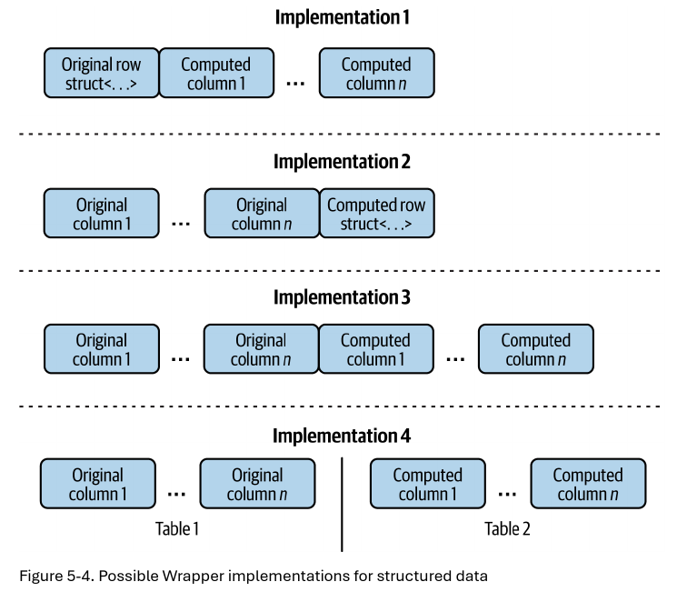
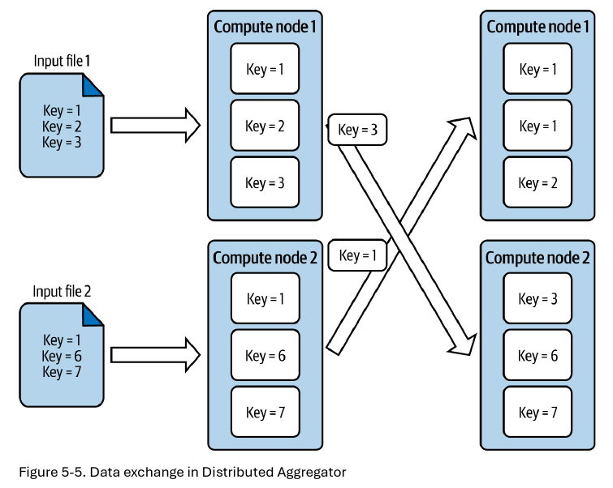
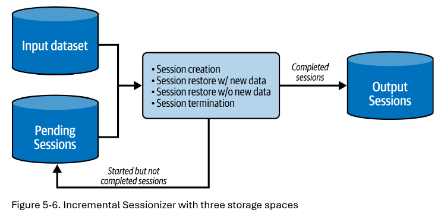
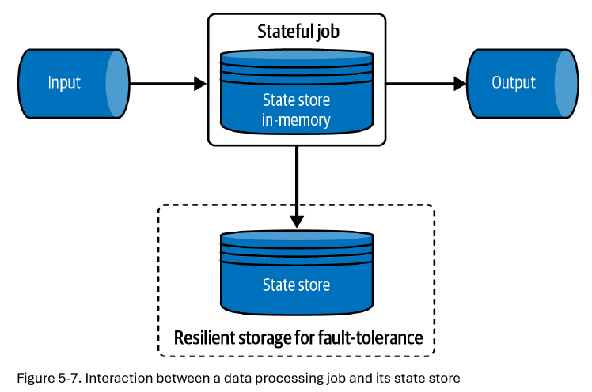
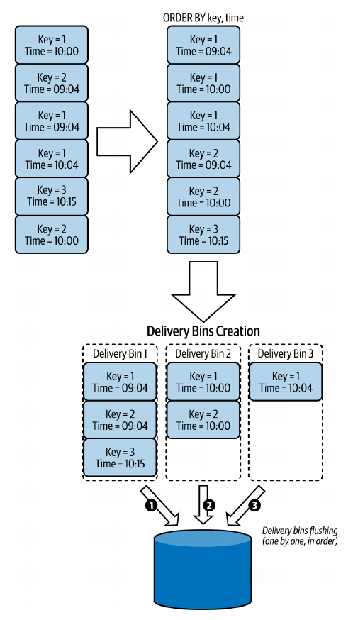

# Capítulo 5. Patrones de Diseño de Valor de Datos

Tener datos almacenados no los convierte en un activo real. La mayoría de las veces, después de ser ingeridos, los datos serán de baja calidad y tendrán varios problemas. Por ejemplo, los eventos de visita de un navegador web pueden contener información técnica valiosa (versión del navegador, idioma), pero carecen de un contexto más amplio, como las características comunes de los visitantes que usan un navegador específico. Correlacionar esta información es imposible sin un esfuerzo adicional.

Este es un escenario típico donde los patrones de diseño de valor de datos son útiles. Su propósito es **aumentar el conjunto de datos para mejorar su utilidad para los usuarios finales**. Este capítulo explora diferentes soluciones para lograrlo:

 * **Enriquecimiento y Decoración de Datos:** Combinar dos conjuntos de datos o calcular atributos individuales.
 * **Agregación y Sesionización de Datos:** Obtener una visión general de grandes volúmenes de datos.
 * **Patrones de Ordenamiento de Datos:** Para situaciones donde el orden de los registros es lo más importante.

## Enriquecimiento de Datos (*Data Enrichment*)

A menudo, los datos crudos son pobres debido a restricciones técnicas. Los eventos son una representación perfecta de atributos de tiempo y espacio, pero frecuentemente carecen de un contexto extendido. Los patrones de enriquecimiento de datos superan esta limitación y hacen que los datos sean más útiles.

### Patrón: Static Joiner

Si el conjunto de datos de enriquecimiento tiene una naturaleza estática, la situación es más sencilla y se puede optar por el patrón *Static Joiner*.

#### Problema

Los conjuntos de datos desarrollados por tu equipo son ampliamente utilizados por los *stakeholders* del negocio. En un nuevo proyecto, te han pedido crear un conjunto de datos para simplificar la comprensión de la dependencia entre la fecha de registro de un usuario y su actividad diaria. Desafortunadamente, tu conjunto de datos crudo no incluye el contexto del usuario; solo se encuentra en un conjunto de datos de referencia de usuario estático.

#### Solución

El carácter "en reposo" (*at-rest*) del conjunto de datos a unir presenta la condición perfecta para usar el patrón *Static Joiner*. Sorprendentemente, a pesar de la naturaleza estática de estos datos, el patrón también funciona para *pipelines* de *streaming*. La implementación requiere una lista de atributos de ambos conjuntos de datos que se pueden usar para combinarlos (por ejemplo, el `user_id`).

#### Dimensiones de Cambio Lento (*Slowly Changing Dimensions - SCD*)

Si se necesita un enriquecimiento de datos sensible al tiempo, se puede implementar como una forma de **dimensiones de cambio lento (SCD)**, que es una estrategia de modelado de datos para conjuntos de datos que cambian lentamente y que pueden soportar la evolución de una entidad a lo largo del tiempo. En nuestra solución, el conjunto de datos de enriquecimiento debería implementar SCD tipo 2 o 4, como se muestra en la **Figura 5-1**.

La implementación del código a menudo se expresa con una sentencia `SQL JOIN`. Además de esta manera declarativa, también se puede enriquecer el conjunto de datos desde una API programática, por ejemplo, usando una biblioteca HTTP, como se muestra en la **Figura 5-2**.

#### Consecuencias

 * **Datos tardíos y consistencia:** En un escenario ideal, los datos evolucionarían al mismo ritmo. Sin embargo, esto rara vez ocurre. Para mitigar el problema de latencia en los *pipelines* de *streaming*, se puede usar el patrón *Dynamic Joiner*.
 * **Idempotencia:** Si se realiza un *backfill* de un *pipeline* por lotes, se debe considerar si el resultado debe ser idempotente para el conjunto de datos de enriquecimiento.

### Patrón: Dynamic Joiner

El patrón *Static Joiner*, debido a su carácter estático, no es el más adecuado para combinar dos conjuntos de datos en *streaming*. El problema radica en la percepción de los datos. El *streaming* representa un conjunto de datos en continuo movimiento, mientras que las cargas de trabajo estáticas por lotes operan con datos que evolucionan más lentamente.

#### Problema

Aunque se ha implementado el *Static Joiner* para el caso de uso de usuarios y visitas, el resultado final no es satisfactorio. Con miles de nuevos usuarios llegando cada semana, el número de cambios de perfil ha aumentado. Como resultado, el conjunto de datos enriquecido es irrelevante y problemático para los consumidores *downstream*.

#### Solución

Como ambos conjuntos de datos están en movimiento, no se puede usar el *Static Joiner*. En su lugar, se debe considerar su alternativa, el patrón **Dynamic Joiner**, que está mejor adaptado para ese tipo de datos. La implementación comparte algunos puntos con el *Static Joiner* —a saber, la identificación de las claves y la definición del método de unión— pero hay un requisito extra: **límites de tiempo**.

#### Consecuencias

 * **Compensación entre espacio y exactitud:** Debido a la marca de agua de recolección de basura (GC) y los límites de tiempo, es posible que no se obtengan todas las uniones posibles.
 * **Datos tardíos:** Los datos tardíos son otra razón para las uniones perdidas. El procesamiento de *streams*, debido a su semántica de procesamiento de latencia inherentemente más baja, tiene una tolerancia más débil para la integración de datos tardíos en los *pipelines*.

## Decoración de Datos (*Data Decoration*)

Una vez que el conjunto de datos ha ganado un mayor valor a través de un patrón de enriquecimiento de datos, la siguiente pregunta es, ¿es suficiente? En el escenario de enriquecimiento, donde los datos todavía están crudos o no estructurados, raramente están en su forma final. Aquí es donde los patrones de decoración de datos pueden ayudar.

### Patrón: Wrapper

En ingeniería de software, *wrapping* consiste en añadir un comportamiento o atributo(s) extra a un objeto. Esta misma definición es válida en el mundo de los datos, donde el *wrapping* también ayuda a separar las partes originales de un registro de las partes transformadas.

#### Problema

La capa de *streaming* procesa los datos de visitas. Las visitas provienen de diferentes proveedores de datos y, como consecuencia, resultan en diferentes esquemas de salida. Se necesita escribir un trabajo que extraiga los diferentes campos y los ponga en un solo lugar para que los consumidores *downstream* puedan confiar en él para un procesamiento fácil.

#### Solución

El requisito de mantener el registro original intacto reduce el alcance de la transformación. No se puede simplemente analizar la fila y generar una nueva estructura porque se perderían los valores iniciales. Para preservarlos, se debe usar el patrón *Wrapper*. La idea es añadir una abstracción extra a nivel de registro. La abstracción envuelve los valores originales con un sobre de alto nivel.

#### Consecuencias

 * **División de dominio:** Esta es la implicación lógica porque el patrón divide los atributos para un dominio dado.
 * **Tamaño:** Los valores decorados forman una parte intrínseca del registro procesado y, por lo tanto, impactan el tamaño general y el tráfico de red.

### Patrón: Metadata Decorator

El patrón *Wrapper* es universal, ya que siempre es posible envolver un registro. Sin embargo, cuando los valores añadidos no deben exponerse directamente a los usuarios finales, puede ser engañoso para los consumidores. Para superar este problema, se puede ocultar los registros adicionales en la capa de metadatos de tu almacén de datos.

#### Problema

Los trabajos de *streaming* evolucionan con bastante frecuencia y se lanza una nueva versión casi una vez a la semana. Aunque el proceso de despliegue es fluido, se carece de visibilidad sobre el impacto de la versión lanzada en los datos generados. Para simplificar la actividad de mantenimiento, se necesita añadir un contexto técnico a cada registro generado, como la versión del trabajo.

#### Solución

Incluir el contexto técnico en el registro con el patrón *Wrapper* no es una opción aquí. En su lugar, se puede aprovechar la capa de metadatos de tu almacén de datos para aplicar el patrón **Metadata Decorator**. La implementación dependerá de las capacidades de tu almacén de datos para manejar metadatos.

**Tabla 5-1. Una tabla con una columna de Metadata Decorator, a la que los consumidores deberían acceder a través de una vista o con privilegios para leer todas las columnas excepto las de metadatos**

| event_id | event_time | ... | processing_context |
| :--- | :--- | :--- | :--- |
| 1 | 2023-06-10T10:00:59Z | ... | {"job_version": "v1.0.3", "processing_time":"2023-06-10T10:02:00Z"} |

**Tabla 5-2. Enfoque de tabla de contexto de procesamiento, tabla de datos**

| event_id | event_time | ... | processing_context_id |
| :--- | :--- | :--- | :--- |
| 1 | 2023-06-10T10:00:59Z | ... | 1 |

**Tabla 5-3. Enfoque de tabla de contexto de procesamiento, tabla técnica**

| processing_context_id | job_version | ... | processing_time |
| :--- | :--- | :--- | :--- |
| 1 | v1.0.3 | ... | 2023-06-10T10:02:00Z |

#### Consecuencias

 * **Implementación:** Incluso los *brokers* de *streaming* del enunciado del problema pueden carecer de soporte nativo para metadatos, haciendo imposible su implementación.
 * **Datos:** Aunque no hay limitación técnica sobre qué tipo de información se puede poner en la capa de metadatos, se debe evitar escribir atributos relacionados con el negocio allí.

## Agregación de Datos (*Data Aggregation*)

Hasta ahora, has estado "añadiendo" información. Pero, ¿puedes imaginar que eliminarla también es una forma de generar valor de datos? Si no, los dos patrones de esta sección deberían demostrarte que estás equivocado.

### Patrón: Agregador Distribuido (*Distributed Aggregator*)

Este patrón aprovecha los *frameworks* de procesamiento de datos distribuidos. Una de sus grandes características es la capacidad de combinar múltiples elementos físicamente aislados pero lógicamente similares.

#### Problema

Has escrito un trabajo que limpia los eventos de visita crudos de la capa Bronce y los escribe en la capa Plata. A partir de ahí, muchos consumidores implementan varios casos de uso de negocio finales. Uno de los casos de uso requiere construir un cubo de procesamiento analítico en línea (OLAP), reduciendo así todas las visitas a un formato agregado que se adapta bien a tus escenarios de *dashboarding*.

#### Solución

Para conjuntos de datos que caben en una sola máquina, no se necesita ninguna herramienta específica para realizar la agregación. Sin embargo, en la era del big data, donde los registros relacionados pueden estar divididos en múltiples lugares físicos, este requisito no siempre se cumple. Ahí es donde ayuda el patrón *Distributed Aggregator*.

#### Consecuencias

 * **Intercambio de red adicional:** El patrón implica dos intercambios de red. El primero trae los datos de entrada a cada nodo. El segundo proviene del patrón *Distributed Aggregator* porque es un paso requerido para reunir los datos relacionados en el mismo servidor.
 * **Sesgo de datos (*Data skew*):** Es un término que describe conjuntos de datos no balanceados en los que al menos una clave tiene muchas más ocurrencias que las demás.
 * **Escalado:** Además de este impacto en el tráfico de red, el *shuffle* también tiene otra implicación: el escalado.

### Patrón: Agregador Local (*Local Aggregator*)

El intercambio de red puede no ser necesario si los datos están correctamente particionados en la entrada o cuando el conjunto de datos cabe en una sola máquina. Ambos escenarios pueden abordarse con un nuevo patrón de agregación.

#### Problema

Tienes un trabajo de *streaming* que genera ventanas para las visitas entrantes almacenadas en un *broker* de *streaming* particionado. El volumen de datos es estático y no esperas ninguna variación o cambio repentino en la partición subyacente. Como resultado, el número de particiones nunca cambiará. Estás buscando una forma de optimizar el trabajo y eliminar el paso de *shuffle* de agrupación que se añade automáticamente por tu *framework* de procesamiento de datos.

#### Solución

Un *shuffle* costoso, una partición de fuente de datos estática y atributos relacionados almacenados juntos son tres factores a favor de la alternativa al *Distributed Aggregator*, que es el patrón *Local Aggregator*. Aunque en la superficie, el patrón todavía realiza algunas agregaciones, lo hace localmente con el único intercambio de red de leer los datos de entrada.

#### Consecuencias

 * **Escalado:** El escalado es el problema más visible. El patrón depende de la naturaleza estática de la fuente de datos y de la partición consistente.
 * **Claves de agrupación:** Para fuentes de datos particionadas con números estáticos de particiones, el patrón también espera una lógica de clave de agrupación para todos los consumidores.

## Sesionización (*Sessionization*)

Las sesiones son tipos especiales de agregadores, ya que combinan eventos relacionados con la misma actividad. En un contexto de ingeniería de datos, dependiendo de la naturaleza de tus datos, que pueden estar en reposo o en movimiento, puedes elegir entre dos patrones de sesionización disponibles.

### Patrón: Sesionizador Incremental (*Incremental Sessionizer*)

Una sesión suena como un componente en tiempo real. De hecho, la mayoría de las veces, resulta de datos en tiempo real, pero el método de generación también admite el procesamiento por lotes. El patrón que vas a ver ahora está adaptado a los *pipelines* por lotes.

#### Problema

El equipo de ingesta de datos almacena eventos de visita de nuestra arquitectura de caso de uso en una ubicación particionada por hora. Quieres agregarlos en sesiones que comiencen con la primera visita y terminen si no hay nuevas visitas del usuario dado en un plazo de dos horas.

#### Solución

Dado que los registros de una sesión pueden estar presentes en múltiples particiones consecutivas, el problema pertenece a la familia de procesamiento incremental. Para resolverlo, puedes aprovechar el patrón *Incremental Sessionizer*. La implementación requiere la configuración de los siguientes tres espacios de almacenamiento:

 * Almacenamiento del conjunto de datos de entrada.
 * Almacenamiento de sesiones completadas.
 * Almacenamiento de sesiones pendientes.

#### Consecuencias

 * **Período de inactividad:** El período de inactividad define cuánto tiempo puedes mantener una sesión abierta. Cuanto más largo sea, más datos tardíos podrás incluir en la sesión.
 * **Frescura de los datos:** El *Incremental Sessionizer* funciona para *pipelines* por lotes, que siguen siendo la primera opción de modo de procesamiento para los equipos de datos.
 * **Datos tardíos, particiones de tiempo de evento y *backfilling*:** Si tu lógica de sesionización se basa en el particionamiento por tiempo de evento, los datos tardíos serán un problema, ya que puedes perder sesiones para particiones ya procesadas.

### Patrón: Stateful Sessionizer

Si la frescura de los datos es un problema, el *Incremental Sessionizer* no te ayudará. En su lugar, deberías usar otro patrón de sesionización que funciona muy bien sobre la capa de procesamiento de *streams*, gracias a sus iteraciones más frecuentes y más pequeñas.

#### Problema

Los *stakeholders* ahora están bastante contentos con la disponibilidad de la sesión. Sin embargo, cada vez más de ellos necesitan acceder a la sesión con una latencia menor. Eso es imposible de lograr con el *Incremental Sessionizer*, ya que las particiones son por hora y la mejor latencia que puedes proporcionar es de una hora.

#### Solución

Lograr la garantía de "tan pronto como sea posible" para las sesiones es difícil con los *pipelines* por lotes, pero los *pipelines* de *streaming* predeterminados tampoco ayudarán porque no tienen estado. Por esa razón, necesitas usar una versión más avanzada y resolver el problema con el patrón *Stateful Sessionizer*.

La lógica de procesamiento de datos puede basarse en las siguientes abstracciones de procesamiento de datos:

 * **Ventanas de sesión:** Una ventana de sesión es una ventana creada para cada clave de sesión. Su longitud se especifica por una duración de brecha (*gap duration*).

 * **Procesamiento con estado arbitrario:** Este enfoque requiere más esfuerzo de implementación que la ventana de sesión, pero también proporciona más flexibilidad.

#### Consecuencias

 * **Procesamiento al menos una vez (*At-least-once*):** Guardar el estado en el almacenamiento de tolerancia a fallos no ocurre durante cada actualización de estado. En cambio, el proceso de escritura, que se llama *checkpointing*, ocurre de forma irregular.
 * **Escalado:** Cambiar la capacidad de cómputo en este contexto con estado puede implicar un reequilibrio del estado.
 * **Duración del período de inactividad:** Al igual que para el *Incremental Sessionizer*, aquí también necesitarás encontrar el equilibrio adecuado para mantener el costo total aceptable e incluir tantas sesiones como sea posible.
 * **Tiempo del período de inactividad:** Además de emitir las sesiones al almacenamiento de salida, la solución también necesitará gestionar la expiración del estado para todas las sesiones completadas.

#### Ejemplos

**Tabla 5-4. Estrategias de expiración de tiempo de evento y marca de agua para un trabajo con una marca de agua de 1 minuto y una expiración de estado de 10 minutos**

| Clave de Estado | Hora del Evento | Tiempos de Expiración | Nuevo Watermark |
| :--- | :--- | :--- | :--- |
| A | 10:00 | Watermark: 10:10, Hora-evento: 10:10 | 09:59 |
| A | 10:01 | Watermark: 10:09, Hora-evento: 10:11 | 10:00 |
| A | 10:08 | Watermark: 10:10, Hora-evento: 10:18 | 10:07 |
| B | 10:15 | Watermark: 10:17, Hora-evento: 10:25 | 10:14 |

## Ordenamiento de Datos (*Data Ordering*)

La transformación de datos resultante de la agregación y combinación no es la única propiedad valiosa con la que puedes mejorar tu conjunto de datos. Otra es el orden. Es por eso que los últimos patrones de valor de datos que vas a ver tratan sobre el ordenamiento.

### Patrón: Bin Pack Orderer

Una de las pesadillas para la entrega de datos ordenados a escala son los *commits* parciales. Algunas bases de datos proporcionan una API masiva para escribir múltiples elementos a la vez y, en consecuencia, optimizar la comunicación de red. Sin embargo, esta característica puede venir con *commits* parciales.

#### Problema

Tu plataforma de blogs del caso de uso permite que sitios web externos incrusten tus páginas. Los eventos de visita generados por estas incrustaciones llegan a tu sistema y los estás procesando como tus propios eventos. Además de mantenerlos internamente, necesitas exponerlos desde una API externa a sitios web externos para fines analíticos.

#### Solución

Puedes resolver el problema si entregas cada registro individualmente. Sin embargo, eso implica una sobrecarga de red significativa, ya que necesitarás inicializar tantas solicitudes como registros haya. Puedes mitigar el problema confiando en las operaciones masivas que, junto con el patrón *Bin Pack Orderer*, pueden garantizar una entrega ordenada en el contexto de *commits* parciales.

#### Consecuencias

 * **Reintentos:** El patrón garantiza el orden dentro de la misma ejecución. Si todo tu *pipeline* falla, el reintento implicará resultados ya emitidos.
 * **Complejidad:** El *bin packer* es definitivamente más difícil de implementar que una clasificación clásica.

### Patrón: FIFO Orderer

El *Bin Pack Orderer* es un patrón que mantiene los almacenes de datos en el orden adecuado con semántica de *commit* parcial y optimiza el rendimiento gracias a las operaciones masivas. Sin embargo, existe una alternativa más simple que puede ser buena para casos de uso que no requieren baja latencia o un gran volumen de datos.

#### Problema

Uno de tus trabajos de *streaming* se ejecuta sobre el conjunto de datos de visitas. Necesita detectar un subconjunto de eventos particulares y reenviarlos en orden de procesamiento a un *stream* diferente. El requisito es entregar cada registro tan pronto como sea posible, por lo que cualquier almacenamiento en búfer para optimizar el tráfico de red no es una opción.

#### Solución

El almacenamiento en búfer y las solicitudes masivas ayudan a reducir la sobrecarga de la red en la transmisión de datos. Sin embargo, en entornos con restricciones de entrega más relajadas, es posible que desees considerar una alternativa más simple, como el patrón *FIFO Orderer*. La implementación es más sencilla que la del *Bin Pack Orderer*. No requiere ningún algoritmo de clasificación específico, ya que el requisito es enviar los datos en el modo *first in, first out* (FIFO).

#### Consecuencias

 * **Sobrecarga de E/S y latencia:** El mayor inconveniente de esta implementación simple, a pesar de la posibilidad de usar API masivas bajo ciertas condiciones en algunos almacenes de datos, es la sobrecarga de E/S y el consiguiente aumento de la latencia.
 * **FIFO no es exactamente una vez:** No te equivoques: FIFO solo significa entregar primero los registros más antiguos, y no garantiza la entrega exactamente una vez por sí mismo.

## Resumen

En este capítulo, descubriste formas comunes de aumentar el valor de tu conjunto de datos. Generalmente, son posibles dos escenarios de mejora:

 * Cuando añades información a los datos de entrada.
 * Cuando reduces la información para hacerla más comprensible.

En el primer escenario, puedes usar los patrones de enriquecimiento y decoración de datos. En el segundo, los patrones de agregación de datos funcionan en un entorno distribuido o local. Además, aquí es donde podrás resumir la experiencia de tus usuarios con patrones de *Sessionization* que se adaptan a cargas de trabajo por lotes incrementales o *pipelines* de *streaming* en tiempo real.

Finalmente, aprendiste sobre dos soluciones para preservar el orden correcto en los patrones de ordenamiento de datos. El *Bin Pack Orderer* muestra cómo abordar este requisito en el contexto de almacenes de datos con semántica de *commit* parcial. El segundo patrón, *FIFO Orderer*, es una alternativa que sacrifica el intercambio de red por la simplicidad.
