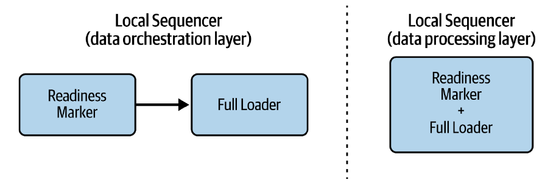
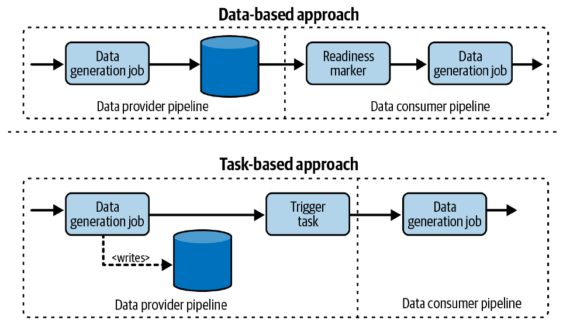
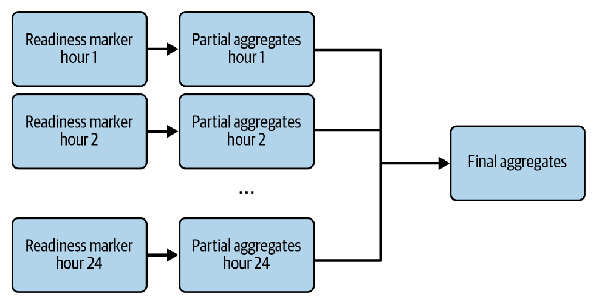
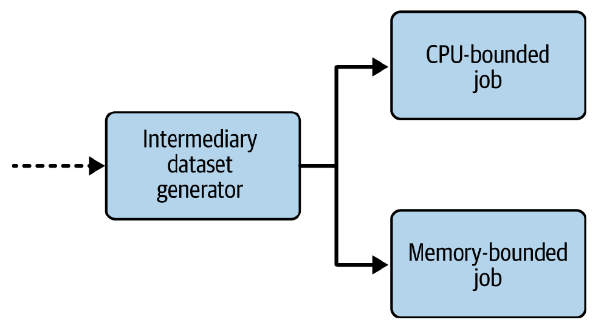
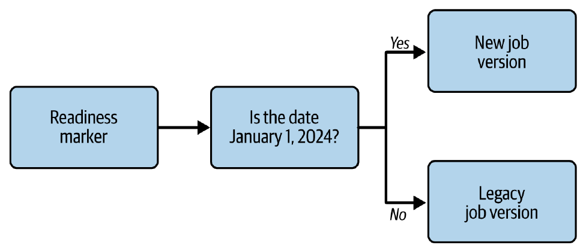

# Capítulo 6. Patrones de Diseño de Flujo de Datos

Generar valor de negocio a partir de datos crudos permite un proceso de decisión basado en hechos. Sin embargo, en esta etapa, los *insights* generados permanecen locales. Se pueden obtener aún más beneficios al abrir estos datos a una escala mucho más amplia. Por ejemplo, al exponer conjuntos de datos valiosos a otros equipos para que enriquezcan sus propios casos de uso, o viceversa.

El objetivo de los patrones de diseño de flujo de datos es **diseñar y coordinar todos los pasos necesarios para generar un conjunto de datos**. Esto incluye acciones como encadenar tareas en un *pipeline*, crear ramas de ejecución paralelas o exclusivas, e incluso gestionar la dependencia de *pipelines* físicamente separados.

Estos patrones operan en dos niveles diferentes:

 * **Orquestación de datos:** Trabajan en uno o varios *pipelines* de datos, útil para la colaboración entre equipos.
 * **Capa de procesamiento de datos:** Ayudan a organizar mejor la lógica de negocio para que sea más fácil de mantener en el tiempo.

Este capítulo explora los patrones de secuencia, *fan-in*, *fan-out* y orquestación.

## Secuencia

La primera categoría de patrones se refiere a la secuencia de pasos, un factor importante que impactará la complejidad, el rendimiento y el mantenimiento de los *pipelines*.

### Patrón: Secuenciador Local (*Local Sequencer*)

Este es probablemente el patrón más fácil, ya que orquesta tareas localmente (dentro del mismo *pipeline* o trabajo de procesamiento de datos).

#### Problema

Estás a cargo de uno de los trabajos más antiguos del departamento de análisis. Con el tiempo, el código ha crecido enormemente y el número de transformaciones se ha triplicado. El trabajo falla muy a menudo y cada vez debe reiniciarse desde el principio, lo que lleva a largos procesos de depuración. Se te ha encargado simplificar el código y mejorar el mantenimiento diario, sin eliminar ninguna lógica de negocio.

#### Solución

Una buena práctica de ingeniería de software para simplificar la lógica compleja consiste en descomponerla en pasos más pequeños y manejables. Esto también es válido para la ingeniería de datos, donde la reorganización mejora la legibilidad y resalta la separación de responsabilidades. Aquí es donde brilla el patrón *Local Sequencer*.

El objetivo final es desacoplar un gran componente en múltiples elementos más pequeños pero conectados que se ejecutarán secuencialmente. La dependencia entre tareas debe organizarse de acuerdo con las dependencias del conjunto de datos.

Los siguientes tres criterios deberían ayudarte a decidir si la secuencia debe basarse en la capa de orquestación de datos o en la capa de procesamiento de datos:

 * **Separación de responsabilidades:** Poner todas las operaciones en el mismo elemento puede dificultar la comprensión.
 * **Mantenibilidad:** Confiar en la secuencialidad del procesamiento de datos también es un desafío para el mantenimiento. En casos de *backfilling* o reintentos automáticos, se volverán a calcular todas las tareas exitosas anteriores a la que falló.
 * **Esfuerzo de implementación:** El orquestador de datos puede proporcionar diferentes abstracciones para realizar tareas comunes listas para usar.

#### Consecuencias

Definir límites sigue siendo un desafío.

 * **Límites:** Si se definen los límites incorrectamente, el tiempo de ejecución puede crecer demasiado o incluso impactar otros *pipelines*. Una buena regla general es pensar en los límites de reinicio (es decir, cuáles son las tareas que deberían poder reiniciarse individualmente).

### Patrón: Secuenciador Aislado (*Isolated Sequencer*)

A menudo, los *pipelines* que implementan el *Local Sequencer* no son los pasos finales. En su lugar, son parte de un flujo de trabajo más complejo donde múltiples flujos de trabajo aislados deben colaborar para generar el *insight* final.

#### Problema

Tu equipo es responsable de limpiar y enriquecer conjuntos de datos crudos para exponerlos como varias vistas utilizadas en una herramienta de visualización de datos. Después de una reunión técnica con el equipo de visualización, acordaste que no es una buena idea incluir la transformación del conjunto de datos de los *dashboards* directamente en tu *pipeline* de preparación de datos. En su lugar, el equipo de visualización de datos te pidió que solo proporciones el conjunto de datos limpio y enriquecido.

#### Solución

El enunciado del problema introduce dos *pipelines* donde uno proporciona datos a otro. Sin embargo, debido a la separación organizacional, no es posible fusionarlos en un único proceso. Ese es el escenario perfecto en el que usar el patrón *Isolated Sequencer*.

El objetivo aquí es encontrar una manera de combinar *pipelines* físicamente aislados. La solución más fácil consiste en dividir el *pipeline* en términos de consumidores y proveedores, o equipos.

Definir los límites es solo el primer paso. El segundo consiste en encontrar el mecanismo de activación. Hay dos estrategias aquí: basada en datos y basada en tareas.

#### Consecuencias

 * **Programación:** La solución basada en tareas no solo afecta la parte de la evolución. También implica algo importante, que es la frecuencia de programación.
 * **Comunicación:** El *Isolated Sequencer* aborda *pipelines* gestionados por diferentes equipos, entre otras cosas. Eso puede ser un problema si la organización no tiene una buena cultura de comunicación.

## Fan-In

Los dos patrones anteriores implican una secuencia. Pero los *pipelines* de datos no son tan simples todo el tiempo. A menudo, crean ramas que eventualmente se fusionan de nuevo en algún punto. Aquí es donde interviene la familia de patrones *fan-in*.

### Patrón: Fan-In Alineado (*Aligned Fan-In*)

El patrón de *fan-in* más fácil de explicar es el *Aligned Fan-In*. Simplemente asume que todas las tareas padre directas deben tener éxito antes de continuar.

#### Problema

Tu *pipeline* genera un agregado diario de las visitas a tu blog a partir de eventos de visita crudos. Sin embargo, el conjunto de datos está particionado por hora, ya que esa lógica organizativa se ajusta a la mayoría de los casos de uso dentro de tu organización. No tiene sentido procesar el *pipeline* diariamente por tu cuenta, ya que los consumidores de tu conjunto de datos solo están interesados en la vista completa. Sin embargo, te gustaría aprovechar el particionamiento por hora para evitar procesar demasiados datos en un solo trabajo.

#### Solución

El caso de uso introducido anteriormente implica una dependencia entre múltiples tareas padre y una tarea que se ejecuta después de ellas. Para resolver esta dependencia, ya sea en la capa de orquestación de datos o en la capa de procesamiento de datos, puedes usar el patrón *Aligned Fan-In*.

#### Consecuencias

 * **Picos de infraestructura:** Una desventaja del patrón *Aligned Fan-In* es la carga de infraestructura. Como puedes ver en el enunciado del problema, nuestro trabajo de agregación diario ejecutará 24 trabajos simultáneamente.
 * **Sesgo de programación:** Dado que las tareas hijas requieren que todos los padres se ejecuten con éxito, tener un tiempo de ejecución desequilibrado para los padres conducirá a un sesgo de programación.
 * **Sobrecarga de programación:** Las tareas padre más largas no son lo único que puede ser problemático. También debes ser consciente de que los *pipelines* que son demasiado granulares también implican una sobrecarga de programación.
 * **Complejidad:** Cuanto más desacoplas, más largo será el *pipeline* que crearás. Esto puede llevar a algunos efectos negativos como una legibilidad y comprensión reducidas.

### Patrón: Fan-In No Alineado (*Unaligned Fan-In*)

A veces, tener una condición de que todos los padres deben tener éxito no solo puede añadir latencia, sino que también puede ser semánticamente incorrecto. Por lo tanto, es posible que necesites una variación del patrón *Aligned Fan-In*.

#### Problema

Tu procesamiento por hora de las agregaciones de visitas con el patrón *Aligned Fan-In* ha estado funcionando muy bien durante varias semanas. Sin embargo, la implementación carece de un método adecuado para gestionar las tareas fallidas. Algunas veces, una hora no se ha procesado correctamente y, por lo tanto, no has producido las vistas agregadas para tus consumidores *downstream*.

#### Solución

La solución consiste en relajar la dependencia del resultado de los padres y transformar el patrón *Aligned Fan-In* en el patrón *Unaligned Fan-In*. Con este patrón, una tarea hija puede ejecutarse incluso cuando algunos de los padres no tienen éxito. Esto permite diferentes escenarios:

 * Si algunos padres tienen éxito y los fallos restantes son aceptables, puedes activar la tarea hija de todos modos.
 * Si todos los padres fallan, en lugar de ejecutar la tarea basada en el criterio de éxito, puedes programar una tarea basada en los criterios de fallo.

#### Consecuencias

 * **Legibilidad:** El patrón *Unaligned Fan-In* puede disminuir la legibilidad y la comprensión general del flujo de datos.

 * **Datos parciales:** Si decides generar el conjunto de datos a partir de padres parcialmente exitosos, es importante compartir este hecho con los consumidores del conjunto de datos.

## Fan-Out

Hasta ahora, has visto *pipelines* que siempre se fusionan en una tarea común. Pero todavía nos falta el último tipo, en el que una tarea es la entrada para otras. Este enfoque puede ser útil cuando un conjunto de datos es utilizado por múltiples equipos para diferentes propósitos, como análisis de datos o ciencia de datos.

### Patrón: División Paralela (*Parallel Split*)

En el primer patrón de *fan-out*, una tarea padre es un requisito para al menos dos tareas hijas. Pueden ejecutarse en paralelo porque su lógica está aislada y el único punto común es el mismo requisito padre.

#### Problema

Estás a punto de reemplazar un *framework* de procesamiento de datos heredado escrito en C#, que nadie en tu organización conoce ya. Todos los mantenedores dejaron la empresa sin dejar ninguna documentación útil. Has realizado un paso de ingeniería inversa y ahora estás reescribiendo la lógica con una moderna biblioteca de Python de código abierto. En este punto, necesitas migrar los *pipelines*, pero como tu enfoque de ingeniería inversa puede no ser perfecto, prefieres mantener los *pipelines* antiguos en funcionamiento hasta que sus consumidores tengan que cambiar a la nueva solución.

#### Solución

El problema establece que dos operaciones diferentes dependen de una tarea padre común. Ese es el tipo de situación en la que deberías usar patrones de *fan-out*. El primero de ellos es el patrón *Parallel Split* y, como su nombre indica, divide el trabajo en partes paralelas.

#### Consecuencias

 * **Ejecución bloqueada:** Este inconveniente es válido para la capa de orquestación de datos y los *pipelines* dependientes del tiempo, donde cada ejecución se ejecuta solo si la anterior tuvo éxito.
 * **Hardware:** Volvamos a la capa de procesamiento de datos. Si el trabajo principal necesita generar un conjunto de datos intermedio para otros dos trabajos, entonces deberían tener las mismas expectativas de hardware.

### Patrón: Elección Exclusiva (*Exclusive Choice*)

El segundo patrón de *fan-out* también se basa en un padre común, pero en lugar de ejecutar tareas *downstream* paralelas, elige solo una.

#### Problema

La migración que realizaste con el patrón *Parallel Split* funciona perfectamente. Ahora, necesitas evolucionar el *pipeline* y comenzar a ejecutar la nueva versión del trabajo solo a partir del 1 de enero de 2024. En caso de *backfilling*, los días anteriores aún deberían ejecutar el trabajo anterior. Quieres hacer esta evolución sin crear un nuevo *pipeline* para mantener el historial de ejecución completo.

#### Solución

Como puedes ver en el enunciado del problema, todavía hay dos tareas hijas, pero esta vez, solo una debe ejecutarse a la vez. Estas son excelentes condiciones para usar el patrón *Exclusive Choice*.

#### Consecuencias

 * **Fábrica de complejidad:** Dado que no es raro ver aplicaciones con múltiples sentencias if-else, puede ser tentador repetir esta práctica en la capa de orquestación de datos.
 * **Lógica oculta:** Esto se aplica a la implementación de procesamiento de datos. Si tu trabajo incluye sentencias y ramas condicionales, posiblemente generando diferentes conjuntos de datos o interactuando con diferentes almacenes de datos de salida, esto puede volverse problemático en el futuro.
 * **Condiciones pesadas:** Si implementas el patrón en la capa de procesamiento de datos y tu condición necesita procesar los datos, ten en cuenta que esto impactará el tiempo de ejecución del trabajo.

## Orquestación

Hasta ahora, solo has estado organizando flujos individuales junto con sus dependencias internas y externas. En esta etapa, son simples recursos estáticos que se encuentran sobre tu capa de orquestación de datos. Con la última familia de patrones, se convertirán en componentes dinámicos que ejecutan tareas de procesamiento de datos.

### Patrón: Ejecutor Único (*Single Runner*)

El orquestador de datos debe ejecutar cada uno de los *pipelines* declarados. La pregunta es, ¿cómo? El primer patrón es el más universal, pero esta universalidad tiene algunos costos de tiempo de ejecución.

#### Problema

En tu proyecto más reciente, implementaste el *pipeline* de sesionización con el patrón *Incremental Sessionizer* del Capítulo 5. Como era una prueba de concepto (POC), la orquestación no estaba en el alcance. Para validar las sesiones con los dueños del negocio, has estado ejecutando el trabajo manualmente, bajo demanda. Como el proyecto está a punto de entrar en el ciclo de lanzamiento, necesitas trabajar en la orquestación de datos.

#### Solución

La solución es simple: ¡necesitas un ejecutor! El problema de la sesionización implica una ejecución incremental, por lo tanto, secuencial. Como resultado, no puedes ejecutar más de un *pipeline* a la vez. El patrón *Single Runner* asegura que siempre haya una sola ejecución de un *pipeline* dado.

#### Consecuencias

 * **Backfilling:** La concurrencia limitada probablemente no será problemática mientras no necesites hacer *backfill*. Sin embargo, si lo haces, el reprocesamiento será muy lento debido al carácter secuencial del *pipeline*.
 * **Latencia:** El *backfilling* es el peor escenario para el patrón *Single Runner*. Un caso menos grave es uno con rezagados, en el que algunos *pipelines* se ejecutan más lentamente que otros.

### Patrón: Ejecutor Concurrente (*Concurrent Runner*)

Los problemas de *backfilling* y latencia del patrón *Single Runner* se pueden abordar fácilmente con el siguiente patrón. Todo lo que necesitas hacer es relajar la restricción de concurrencia.

#### Problema

Estás en el equipo de ingesta de datos y tu objetivo es llevar datos de fuentes externas en reposo a tu base de datos interna lo antes posible. Por lo general, la frecuencia de ingesta va de 30 minutos a 1 hora, pero a veces todo el proceso tarda más. Como se está ejecutando con el patrón *Single Runner*, todas las entregas posteriores se retrasan. Te preguntas si se requiere una ejecución secuencial, porque los conjuntos de datos cargados no dependen unos de otros.

#### Solución

Los conjuntos de datos ingeridos por tu equipo son independientes. Eso significa que puedes ingerir en cualquier momento y, por lo tanto, con una restricción de concurrencia relajada. Aquí es donde puedes usar el patrón *Concurrent Runner*. La implementación es bastante simple. Consiste en definir una concurrencia superior a 1.

#### Consecuencias

 * **Inanición de recursos:** Esto es particularmente cierto si trabajas en un entorno multi-inquilino (es decir, si tu orquestador es utilizado por muchos equipos diferentes).
 * **Estado compartido:** El estado compartido es un problema bastante común para todo lo que permite la ejecución concurrente.
