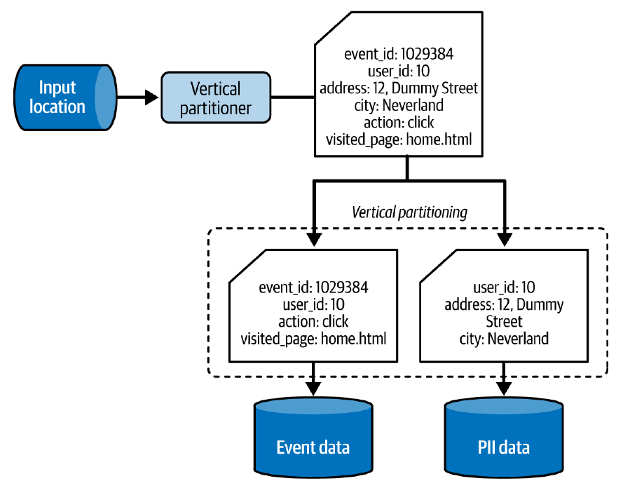
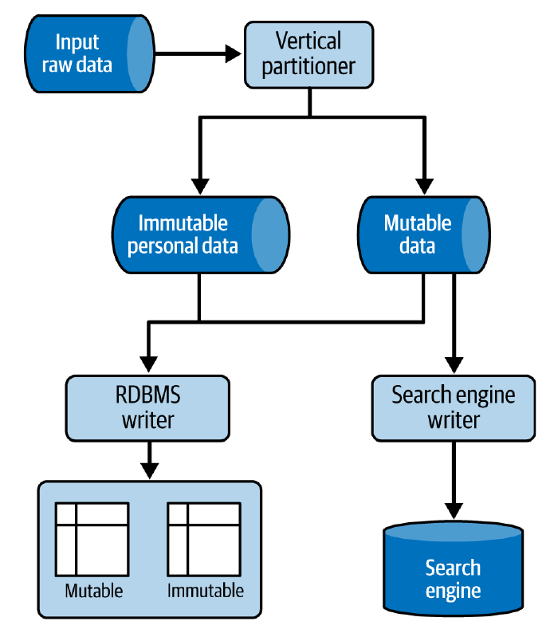
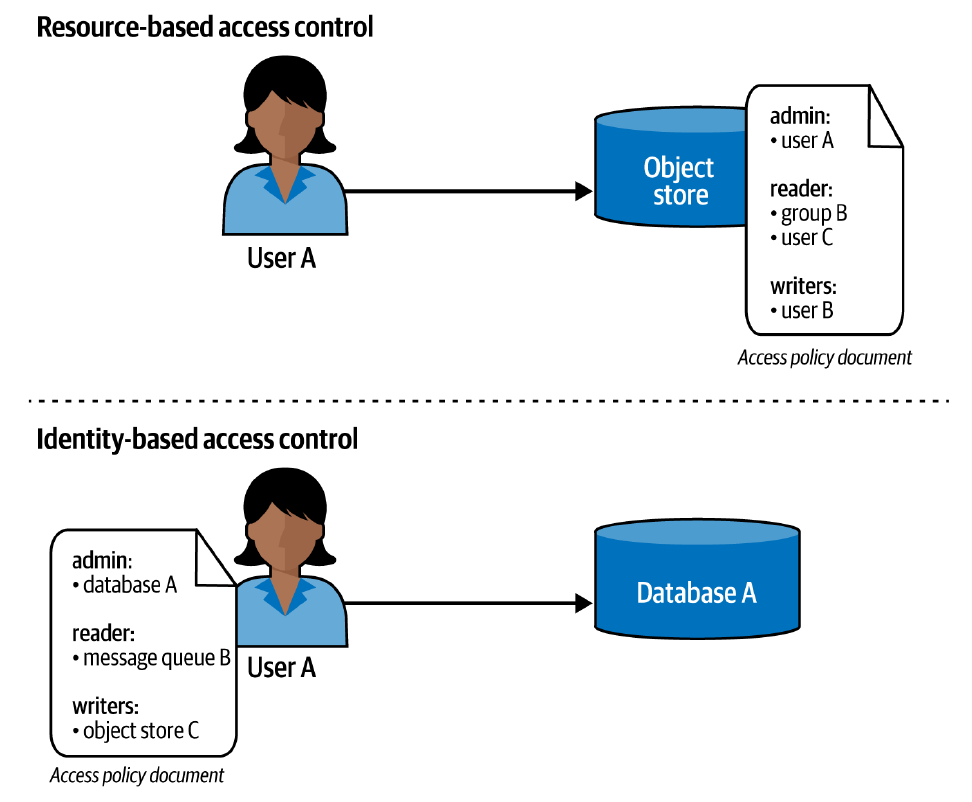
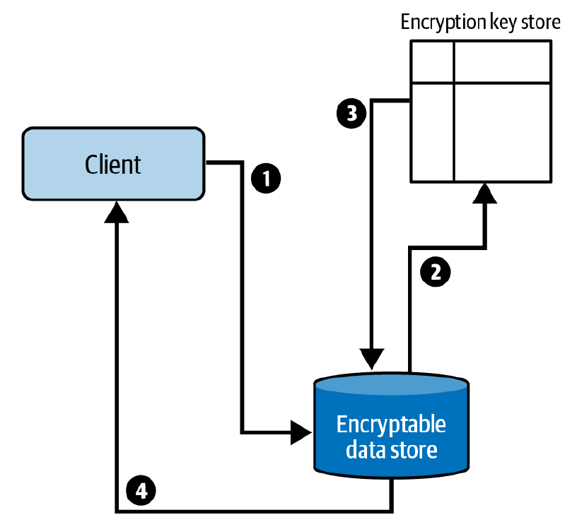

¡Claro! Aquí tienes un resumen completo y detallado del Capítulo 7 del libro "Data Engineering Design Patterns", manteniendo la estructura del libro y el formato de listas que solicitaste, incluyendo las tablas en Markdown.

***

# Capítulo 7. Patrones de Diseño de Seguridad de Datos

Los conjuntos de datos accesibles y valiosos que hemos creado son importantes activos de negocio, pero también son objeto de envidia para actores maliciosos. Por ello, la ingeniería de datos debe abordar los aspectos de seguridad.

Este capítulo explora varios patrones de diseño de seguridad, cubriendo:

 * **Cumplimiento y Eliminación de Datos:** Cómo cumplir con el "derecho al olvido" de los usuarios según leyes como GDPR y CCPA.
 * **Control de Acceso de Grano Fino:** Para tablas y recursos en la nube.
 * **Protección de Datos:** Asegurar conjuntos de datos con técnicas de encriptación y anonimización.
 * **Conectividad Segura:** Dos enfoques que abordan el problema de la conectividad, uno usando referencias en lugar de credenciales reales y otro basado en acceso por identidad.

## Eliminación de Datos (*Data Removal*)

Las regulaciones de privacidad como CCPA y GDPR definen requisitos importantes de cumplimiento, como las solicitudes de eliminación de datos personales.

### Patrón: Particionador Vertical (*Vertical Partitioner*)

Una organización inteligente de los datos o el aislamiento del flujo de trabajo a menudo puede resolver incluso los problemas más desafiantes.

#### Problema

Presentaste un documento de diseño para un nuevo *pipeline* de eliminación de datos personales. Tus colegas señalaron una sobrecarga de almacenamiento importante: varias columnas de tu conjunto de datos son inmutables (nunca cambian), pero están presentes en cada registro. Te pidieron que almacenes cada propiedad inmutable solo una vez para reducir la cantidad de datos a eliminar.

#### Solución

El problema implica dividir el conjunto de datos en dos partes: una mutable y otra inmutable. Aquí es donde ayuda el patrón *Vertical Partitioner*.

En ingeniería de datos, se puede particionar un conjunto de datos horizontal o verticalmente.

 * **Particionamiento horizontal:** Agrupa todos los registros con atributos relacionados.
 * **Particionamiento vertical:** Divide cada fila y escribe las partes en lugares diferentes.

El primer paso consiste en identificar las columnas a dividir y un atributo que se utilizará para volver a unir las filas divididas. Luego, se adapta el trabajo de ingesta de datos para dividir cada fila en dos partes y escribir cada una en un espacio de almacenamiento separado.

#### Consecuencias

 * **Rendimiento de las consultas:** El particionamiento vertical introduce una especie de normalización de datos. Esto optimiza el rendimiento de la escritura al reducir el volumen, pero también reduce el rendimiento de la lectura, ya que cada lector necesitará unir las filas divididas.
 * **Complejidad de las consultas:** La separación de datos también introduce una complejidad extra en las consultas.
 * **Complejidad en un mundo políglota:** Otro desafío afecta al mundo de la persistencia políglota, donde un conjunto de datos vive en diferentes tipos de almacenamiento al mismo tiempo.

 * **Datos crudos:** Si necesitas mantener los datos crudos (no divididos) durante algún tiempo, necesitarás una solución complementaria para lidiar con la eliminación de datos.

### Patrón: Sobrescribidor In-Situ (*In-Place Overwriter*)

El patrón *Vertical Partitioner* es excelente si comienzas un nuevo proyecto o tienes suficientes recursos. Sin embargo, si no te encuentras en una de estas cómodas posiciones, es posible que no tengas otra opción que confiar en la estrategia de sobrescritura probada y verdadera.

#### Problema

Heredaste un sistema heredado en el que terabytes de datos se almacenan en particiones horizontales basadas en el tiempo. No hay una estrategia de gestión de datos personales definida. A pesar de este carácter heredado, el proyecto todavía se utiliza ampliamente dentro de tu organización y, por eso, necesita cumplir con las nuevas regulaciones de privacidad de tu gobierno.

#### Solución

La arquitectura y la falta de recursos para la refactorización te dejan sin otra opción que aplicar el patrón *In-Place Overwriter*. La implementación depende en gran medida de la tecnología de almacenamiento de datos.

#### Consecuencias

 * **Sobrecarga de E/S:** La lectura y sobrescritura de archivos incurre en una sobrecarga de E/S grave. Con el tiempo, el espacio de almacenamiento puede casi duplicarse y llevar a un aumento del rendimiento.
 * **Costo:** Como el patrón requiere leer todos los datos, es una solución más costosa que el patrón *Vertical Partitioner*.

## Control de Acceso

Incluso el patrón de eliminación de datos más eficiente no será suficiente para proporcionar la seguridad básica que debería venir con el control de acceso.

### Patrón: Acceso de Grano Fino para Tablas (*Fine-Grained Accessor for Tables*)

El primer patrón encaja perfectamente en el mundo analítico clásico, donde se crean usuarios o grupos y se les asignan permisos para acceder a tablas particulares.

#### Problema

Después de migrar tus cargas de trabajo HDFS/Hive a un *data warehouse* en la nube, necesitas implementar una política de acceso segura. La primera parte del requisito es relativamente fácil de cumplir, ya que el nuevo *data warehouse* admite usuarios clásicos y la creación de grupos para gestionar el acceso a las tablas. Sin embargo, hay una demanda adicional de tus *stakeholders*.

#### Solución

El patrón *Fine-Grained Accessor for Tables* resuelve el problema del acceso a datos de bajo nivel.

#### Consecuencias

 * **Límites de seguridad a nivel de fila:** La mayoría de las implementaciones de seguridad a nivel de fila tienen un alcance limitado de aplicaciones que consisten en los atributos que puedes obtener directamente de la sesión de conexión, como el nombre de usuario, el grupo de usuarios y la IP.
 * **Tipo de datos:** Si tu columna es de un tipo complejo, como una estructura anidada, es posible que no puedas aplicar la estrategia de acceso simple basada en columnas.
 * **Sobrecarga de consultas:** Como viste en la sección de Solución, las protecciones de seguridad a nivel de fila y columna pueden expresarse como funciones SQL añadidas dinámicamente a las consultas ejecutadas contra la tabla segura.

### Patrón: Acceso de Grano Fino para Recursos (*Fine-Grained Accessor for Resources*)

El patrón basado en el acceso es excelente cuando se trata de conjuntos de datos basados en tablas. Sin embargo, las bases de datos no son los únicos almacenes de datos utilizados por los ingenieros de datos.

#### Problema

Una auditoría de seguridad detectó permisos demasiado amplios en tu cuenta de la nube. Uno de los peligros detectados es la posibilidad de que un trabajo de procesamiento de datos pueda sobrescribir todos los conjuntos de datos que están disponibles en tu almacenamiento de objetos. El auditor te presentó una mejor práctica de seguridad llamada privilegio mínimo, que asigna los permisos mínimos requeridos para cada componente de tu sistema.

#### Solución

La buena noticia para ti es que todos los principales proveedores de la nube —incluidos AWS, Azure y GCP— vienen con una implementación del principio de privilegio mínimo, que es la columna vertebral del patrón *Fine-Grained Accessor for Resources*.

#### Consecuencias

 * **Compensación de seguridad por manual:** Una regla de oro de seguridad es el principio de privilegio mínimo, que sostiene que un usuario o grupo debe tener acceso solo a los recursos que necesita en el momento.
 * **Complejidad:** Si utilizas enfoques basados en recursos y en identidad en el mismo proyecto, puedes estar aumentando inadvertidamente la complejidad de tu sistema.
 * **Cuotas:** Como cualquier otro recurso en la nube, incluso las políticas de acceso tienen limitaciones.

## Protección de Datos

Podrías pensar que controlar el acceso a los datos a nivel lógico, es decir, el alcance de la base de datos o de los servicios en la nube, es suficiente para construir un sistema totalmente seguro. Desafortunadamente, es solo una parte de la solución.

### Patrón: Encriptor (*Encryptor*)

Aunque ejecutes tu infraestructura en la nube, los datos todavía se almacenan físicamente en algún lugar, y personas no autorizadas pueden intentar leerlos. Si necesitas reducir el riesgo de acceso, primero puedes implementar las políticas de acceso de la sección anterior y luego asegurarte de que los datos serán inutilizables si los controles de acceso se ven comprometidos.

#### Problema

Después de implementar políticas de acceso de grano fino tanto para tus tablas como para tus recursos en la nube, se te encarga hacer cumplir la seguridad de tus datos en reposo y en tránsito. A tus *stakeholders* les preocupa que una persona no autorizada pueda interceptar los datos transferidos entre tus *brokers* de *streaming* y trabajos, o que la misma persona pueda robar físicamente tus datos de los servidores.

#### Solución

Una forma de reducir este riesgo de intrusión de datos es con el patrón *Encryptor*. Como se requieren dos niveles de protección, el patrón tiene dos implementaciones.

#### Consecuencias

 * **Sobrecarga de encriptación/desencriptación:** La sobrecarga de la CPU es probablemente la primera consecuencia que viene a la mente.
 * **Riesgo de pérdida de datos:** Aunque el patrón *Encryptor* tiende a proteger los datos en reposo contra el acceso no autorizado, también puede, como efecto secundario, bloquear el acceso a los usuarios autorizados.
 * **Actualizaciones de protocolo:** La encriptación en tránsito es mucho más fácil de configurar que la encriptación en reposo.

### Patrón: Anonimizador (*Anonymizer*)

Como viste en el Capítulo 6, puedes mejorar el valor de un conjunto de datos si lo compartes con otros *pipelines*. Sin embargo, no siempre es tan simple. Si tu conjunto de datos contiene atributos PII y el usuario no ha aceptado compartir esos detalles con tus socios, necesitarás realizar un paso de preparación especial antes de compartir el conjunto de datos.

#### Problema

Tu organización contrató a una empresa externa de análisis de datos para analizar el comportamiento de tus clientes y optimizar tu estrategia de comunicación. Dado que el conjunto de datos contiene muchos atributos PII y algunos de tus usuarios no aceptaron compartirlos con terceros, a tu equipo de ingeniería de datos se le encargó escribir un *pipeline* para que el conjunto de datos compartido cumpla con las regulaciones de privacidad.

#### Solución

El enunciado del problema establece que algunas partes de tu conjunto de datos no se pueden compartir. Dicho de otra manera, necesitas eliminarlas o transformarlas. Esa es la tarea perfecta para el patrón *Anonymizer*. El objetivo de este patrón es eliminar los datos sensibles del conjunto de datos, transformando así cada fila en información anónima.

El patrón *Anonymizer* admite varias implementaciones:

1.  Eliminación de datos
2.  Perturbación de datos
3.  Reemplazo de datos sintéticos

#### Consecuencias

 * **Pérdida de información:** Está claro que cuando eliminas o reemplazas información, tu conjunto de datos se convierte en algo nuevo.

### Patrón: Pseudo-Anonimizador (*Pseudo-Anonymizer*)

El "Patrón: Anonimizador" ofrece una fuerte protección de datos. Sin embargo, el impacto del patrón en los *pipelines* de ciencia de datos y análisis de datos puede ser muy malo debido a los valores faltantes o alterados. El patrón *Pseudo-Anonymizer* reduce este impacto.

#### Problema

Un conjunto de datos anonimizado que compartiste con la empresa de analistas de datos externa no contiene todas las columnas. Elegiste eliminarlas porque esa era la estrategia de anonimización de datos más simple. Sin embargo, debido a eso, el equipo no puede responder a la mayoría de las consultas de negocio.

#### Solución

El intercambio de datos, los datos PII y el requisito de mantener cierto significado empresarial son condiciones perfectas en las que aplicar el patrón *Pseudo-Anonymizer*. Dependiendo de tu contexto, puedes usar una de sus cuatro implementaciones:

1.  Enmascaramiento de datos
2.  Tokenización de datos
3.  Hashing
4.  Encriptación

#### Consecuencias

 * **Falsa sensación de seguridad:** El *Pseudo-Anonymizer*, aunque difumina los datos personales, proporciona una garantía de seguridad más débil que el patrón descrito en el *Anonymizer*. Uno de los mayores problemas proviene de la combinación de conjuntos de datos, en la que una columna pseudoanonimizada puede convertirse en una columna PII que identifica a una persona.

Veamos un ejemplo de un *framework* de procesamiento de datos imaginario pero muy popular llamado Cheetach Processor, inventado por un ingeniero de datos llamado John Doe que vivía en San Marino, un pequeño país de Europa. Tu base de datos tiene dos tablas pseudoanonimizadas. La primera, la **Tabla 7-1**, almacena las preferencias alimentarias de los usuarios, y la segunda, la **Tabla 7-2**, persiste la información de registro de los usuarios.

**Tabla 7-1. Tabla de preferencias de alimentos**

| User ID | Alimentos preferidos | Alimentos no preferidos |
| :--- | :--- | :--- |
| 1000 | zanahoria, brócoli, patata | patatas fritas, barra de chocolate |

**Tabla 7-2. Tabla de registro de usuarios**

| User ID | País | Rol |
| :--- | :--- | :--- |
| 1000 | S*n M****o | C******h P*******r j******r |

 * **Pérdida de información:** El mejor ejemplo que ilustra esto es la estrategia de enmascaramiento de datos.

## Conectividad

Hasta ahora, has aprendido cómo proteger tus datos. Aunque esta es la parte central de la seguridad de los datos, puede que no sea suficiente. ¿Recuerdas los patrones de flujo de datos del capítulo anterior? Los datos fluyen continuamente dentro del mismo sistema o a través de diferentes sistemas, y necesitarás acceder a ellos. En esta sección, aprenderás sobre estrategias de acceso seguro.

### Patrón: Puntero de Secretos (*Secrets Pointer*)

El método de autenticación de usuario/contraseña sigue siendo probablemente el más utilizado para acceder a las bases de datos. Es simple pero también peligroso si se usa sin precauciones, y el patrón presentado a continuación es una de las precauciones que puedes aplicar.

#### Problema

El *pipeline* de procesamiento en tiempo real de visitas de nuestro caso de uso aprovecha una API externa para enriquecer cada evento con información de geolocalización. Esta API te la proporciona una empresa externa, y el único método de autenticación es un par de usuario/contraseña.

#### Solución

Las credenciales son parámetros sensibles. Una de las mejores formas de asegurarlas es... evitar almacenarlas en cualquier lugar. En su lugar, puedes usar una referencia (también conocida como puntero). Eso es lo que hace el patrón *Secrets Pointer*.

#### Consecuencias

 * **Invalidación de caché y trabajos de *streaming*:** Si almacenas en caché las credenciales, nunca sabrás si estás usando las más actualizadas, lo que puede llevar a problemas de conexión.
 * **Registros (*Logs*):** El patrón *Secrets Pointer* te da una falsa sensación de seguridad de que las credenciales no se filtrarán.
 * **Un secreto sigue siendo un secreto:** Aunque los consumidores no necesitan lidiar con las credenciales, no significa que no haya credenciales en absoluto.

### Patrón: Conector sin Secretos (*Secretless Connector*)

El patrón *Secrets Pointer* muestra cómo asegurar las credenciales, pero ¿y si te dijera que es aún mejor no tener ninguna credencial que gestionar? Eso es lo que hace posible el siguiente patrón.

#### Problema

Uno de los equipos de tu organización ha comenzado a integrar un nuevo servicio de procesamiento de datos. Todos los ejemplos de código que encontró usan claves de API para interactuar con los recursos gestionados en la nube disponibles del servicio. El equipo es pequeño y le gustaría evitar la gestión de estas API.

#### Solución

Si trabajas con servicios en la nube y no quieres gestionar las credenciales, puedes implementar el patrón *Secretless Connector*. ¿Cómo? Hay dos enfoques principales.

#### Consecuencias

 * **Impresión de "sin trabajo":** Aunque no hay credenciales involucradas, todavía hay trabajo por hacer.
 * **Rotación:** Este punto es esencialmente válido para la autenticación basada en certificados.

## Resumen

En este capítulo, aprendiste sobre varios aspectos de la seguridad de la identidad. En la primera sección, aprendiste cómo cumplir con una solicitud de eliminación de datos, que es una de las partes importantes de las políticas de regulación de datos como el GDPR y la CPPA. Hay dos soluciones posibles. La primera es el *Vertical Partitioner*, que aprovecha el diseño de datos para realizar operaciones de eliminación más baratas en un número reducido de ocurrencias. Una alternativa es el patrón *In-Place Overwriter*, que cambia los datos en el lugar para almacenes de datos sin ninguna estrategia de organización de datos previa.

A continuación, aprendiste sobre el acceso de grano fino. En el patrón *Fine-Grained Accessor for Tables*, viste cómo implementar controles de acceso a nivel de columna y fila en entornos orientados a tablas, como *data warehouses* y *lakehouses*.

En la tercera parte vino la protección de datos. Primero, aprendiste cómo proteger tus datos en reposo y en movimiento con el patrón *Encryptor*. Luego, aprendiste sobre los patrones *Anonymizer* y *Pseudo-Anonymizer*, que son excelentes formas de asegurar el conjunto de datos en escenarios de intercambio de datos.

Finalmente, aprendiste sobre dos patrones de conectividad que pueden ayudarte a asegurar mejor tus aplicaciones de datos. El patrón *Secrets Pointer* te ayudará a usar credenciales como contraseñas y claves de autorización, sin mantenerlas directamente en tu repositorio de Git. Pero como la mejor estrategia es no tener ninguna credencial que gestionar, también está el patrón *Secretless Connector* que puedes aprovechar para las interacciones sin inicios de sesión y contraseñas.
