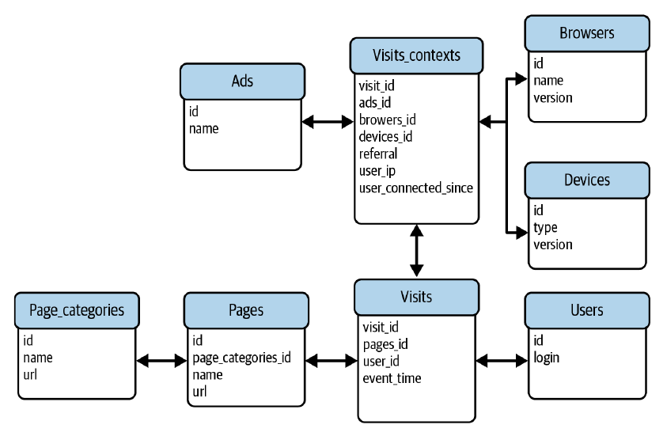
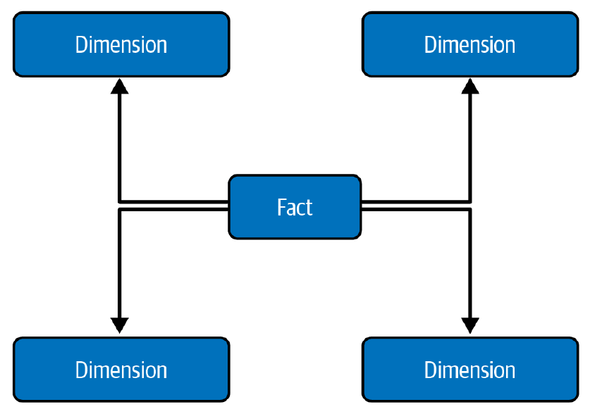

# Capítulo 8. Patrones de Diseño de Almacenamiento de Datos

¿Alguna vez has esperado más de dos minutos por el resultado de una consulta o un trabajo en un entorno de big data? El factor tiempo es un aspecto importante en el trabajo de ingeniería de datos. Cuanto más rápido se ejecuta una consulta, antes obtenemos la respuesta y, con suerte, menor será el costo.

Se puede optimizar este factor tiempo de dos maneras:

 * **Añadir más recursos de cómputo:** Un método rápido y fácil, pero a menudo es una medida reactiva que se toma bajo presión.
 * **Organización inteligente de los datos:** Tomar acciones preventivas que se basan en una organización de datos bien pensada, utilizando los patrones de diseño de almacenamiento de datos cubiertos en este capítulo.

Este capítulo explora:

 * **Estrategias de particionamiento:** Para reducir el volumen de datos a procesar, ideales para valores de baja cardinalidad.
 * **Estrategias de optimización local:** Como *bucketing* y ordenamiento, para valores de alta cardinalidad.
 * **Otros enfoques para mejorar la experiencia del usuario:** Aprovechar la capa de metadatos, ejecutar operaciones costosas una sola vez y simplificar la preparación de datos.
 * **Enfoques de representación de datos:** El *Normalizer* que favorece la consistencia y el *Denormalizer* que intercambia consistencia por un mejor tiempo de ejecución.

## Particionamiento

Al definir el diseño de tu capa de almacenamiento, la primera pregunta es: ¿cuáles son las mejores formas de dividir el conjunto de datos para hacerlo fácilmente accesible?

### Patrón: Particionador Horizontal (*Horizontal Partitioner*)

Entre los enfoques de organización de datos, la organización horizontal es probablemente la más utilizada debido a la simplicidad de su implementación y su popularidad a largo plazo.

#### Problema

Creaste un trabajo por lotes que calcula agregados móviles para los últimos cuatro días. Funcionó bien durante unos meses, pero a medida que llegaban más datos, el rendimiento del trabajo disminuyó. El mayor problema que detectaste es el aumento del tiempo de ejecución para la operación de filtrado que ignora los registros de más de cuatro días.

#### Solución

La agregación móvil es un ejemplo de procesamiento de datos incremental que utiliza solo una porción de todo el conjunto de datos. Es una condición perfecta para usar el patrón *Horizontal Partitioner* y equilibrar el tiempo de ejecución con los costos.

La solución requiere identificar un **atributo de particionamiento**, también conocido como clave de distribución. El proceso de ingesta de datos o el almacén de datos utilizará más tarde este atributo para guardar el conjunto de datos en un espacio de almacenamiento físicamente aislado para cada valor de particionamiento.

#### Consecuencias

Paradójicamente, la mayor desventaja del *Horizontal Partitioner* son... las particiones horizontales y, más específicamente, su carácter estático.

 * **Granularidad y sobrecarga de metadatos:** Una partición es una ubicación física que almacena entidades similares. Tener demasiadas particiones (por ejemplo, al particionar por un atributo de alta cardinalidad como un nombre de usuario) tendrá un impacto negativo en la base de datos, resultando en operaciones de listado lentas y muchos archivos pequeños que leer.
 * **Sesgo (*Skew*):** El particionamiento horizontal no garantiza una distribución uniforme de los datos. Las particiones sesgadas pueden ser una fuente de latencia. Por ejemplo, en un modelo de procesamiento por micro-lotes, una partición desequilibrada determinará la duración de todo el micro-lote, bloqueando a las particiones más cortas. Para mitigar esto, se puede aplicar un mecanismo de **contrapresión (*backpressure*)** que almacena los registros sobrantes de la partición sesgada en un búfer separado para procesarlos en el siguiente micro-lote. La **Figura 8-1** muestra este mecanismo.

 * **Mutabilidad:** Cambiar una clave de partición es difícil. Requiere mover todos los datos ya escritos a una nueva ubicación, lo cual es costoso y consume mucho tiempo.

### Patrón: Particionador Vertical (*Vertical Partitioner*)

Como has visto, el patrón *Horizontal Partitioner* procesa filas enteras cada vez. El siguiente patrón de particionamiento es su alternativa porque divide cada fila y escribe las partes separadas en diferentes lugares, como tablas o archivos.

#### Problema

En uno de tus *pipelines*, rastreas las visitas de los usuarios a tu sitio web. El conjunto de datos de visitas tiene dos categorías de atributos: los mutables que cambian en cada visita (como la hora de la visita o la página visitada) y los inmutables que permanecen iguales durante toda la visita (como la dirección IP). Estás buscando una forma de evitar duplicar la información inmutable y almacenarla solo una vez por cada visita.

#### Solución

Tener dos tipos de atributos como en nuestro enunciado del problema es la condición perfecta para usar el patrón *Vertical Partitioner*. La implementación comienza con la clasificación de los datos, donde necesitas agrupar los atributos relacionados. Para el problema anunciado, dividirías los atributos en los grupos mutable e inmutable.

#### Consecuencias

 * **División de dominio:** Dado que cada fila se divide, puede haber atributos lógicamente relacionados que se almacenan en dos lugares separados.
 * **Consultas:** Este inconveniente resulta de la división del dominio. A medida que cada fila se separa, se vuelve más difícil obtener la imagen completa que en un conjunto de datos particionado horizontalmente.
 * **Productor de datos:** Además de los consumidores, el *Vertical Partitioner* impacta a los productores, que a partir de ahora no pueden simplemente tomar una fila y escribirla en otro lugar.

## Organización de Registros

El particionamiento es a menudo el primer paso en la organización de los datos. Pero como has visto, es bastante rudimentario. La siguiente categoría de patrones va un paso más allá porque aplica algunas optimizaciones inteligentes para la coubicación de registros.

### Patrón: Bucket

Si, por cualquier razón, necesitas mejorar el acceso a una columna con alta cardinalidad, como un ID de usuario único, hay esperanza. En lugar de coubicar filas en el mismo espacio de almacenamiento con particionamiento, puedes coubicar grupos de filas.

#### Problema

El conjunto de datos que estás modelando tiene un atributo de negocio que se utiliza con frecuencia en las consultas como parte del predicado. Inicialmente, querías usar este atributo como una columna de particionamiento, pero su cardinalidad es demasiado alta. Resultaría en demasiadas particiones que en algún momento podrían alcanzar los límites de metadatos de tu almacén de datos.

#### Solución

El hecho de que tengas una columna de alta cardinalidad que a menudo está involucrada en consultas es una buena razón para usar el patrón *Bucket*. Aunque en la superficie también almacena registros en una ubicación dedicada, a diferencia del *Horizontal Partitioner*, coubica diferentes valores en la misma área de almacenamiento.

#### Consecuencias

 * **Mutabilidad:** El esquema de *bucketing* es inmutable. Técnicamente, es posible modificarlo cambiando la columna o el tamaño del *bucket*, pero es una operación costosa que requiere hacer *backfilling* del conjunto de datos.
 * **Tamaño del bucket:** El patrón *Bucket* requiere establecer el tamaño del *bucket*. Desafortunadamente, encontrar el tamaño correcto es un desafío si esperas obtener más datos en el futuro.

### Patrón: Sorter

Coubicar grupos de registros en *buckets* no es la única técnica de optimización de almacenamiento. Otra técnica que ayuda a eliminar bloques de datos que son irrelevantes para las consultas se basa en el orden de almacenamiento de los datos.

#### Problema

Decidiste almacenar los datos en tablas semanales para aprovechar el patrón *Fast Metadata Cleaner*. Aunque hizo tu tarea de mantenimiento diario menos dolorosa, no mejoró el tiempo de ejecución de las consultas. No quieres cambiar esta estrategia de idempotencia, pero al mismo tiempo, te gustaría reducir la latencia de acceso a los datos.

#### Solución

Saber qué columna o columnas se usan comúnmente en el ordenamiento o filtrado es una buena manera de implementar el patrón *Sorter* para optimizar el acceso a los datos. Gracias al almacenamiento ordenado, cualquier consulta que apunte a la(s) columna(s) de ordenamiento podrá omitir bloques de datos irrelevantes, muy a menudo gracias a la información de metadatos asociada a cada uno de ellos.

#### Consecuencias

 * **Segmentos no ordenados:** El ordenamiento puede no ser siempre una actividad instantánea. Esto significa que cada vez que escribes nuevos registros, habrá algunos bloques no ordenados que no se beneficiarán de las optimizaciones del patrón *Sorter*.
 * **Claves de ordenamiento compuestas:** Cuando usas claves de ordenamiento compuestas en el método de orden lexicográfico, ten en cuenta que las consultas siempre deben hacer referencia a las columnas de ordenamiento que preceden a la(s) que estás apuntando.
 * **Mutabilidad:** Aunque a menudo es posible cambiar las claves de ordenamiento después de crearlas, debes ser consciente de que la operación puede necesitar ordenar toda la tabla.

## Optimización del Rendimiento de Lectura

Los patrones de esta sección amplían las técnicas de organización de datos presentadas hasta ahora para optimizar el acceso a los datos.

### Patrón: Metadata Enhancer

La primera técnica que puedes aprovechar para optimizar el rendimiento de la lectura utiliza metadatos. Esta es una de las razones por las que los formatos de archivo columnares como Apache Parquet han sido vistos como cambios disruptivos en el campo de la ingeniería de datos durante muchos años.

#### Problema

Particionaste tu conjunto de datos JSON horizontalmente por tiempo de evento, con la esperanza de reducir el tiempo de ejecución de los trabajos por lotes. ¡Y funcionó! Sin embargo, tu empresa contrató a nuevos analistas de datos que también están trabajando en el mismo conjunto de datos particionado pero que solo apuntan a un pequeño subconjunto de filas de una partición.

#### Solución

Una forma fácil de optimizar el tiempo de ejecución de la consulta y el costo es omitir todos los archivos de datos irrelevantes antes de cargarlos para su procesamiento. Ahí es donde entra en juego el patrón *Metadata Enhancer*. La implementación consiste en recopilar y persistir estadísticas sobre los registros almacenados en un archivo o base de datos.

#### Consecuencias

 * **Sobrecarga:** Cuando se trata de formatos de archivo columnares, la construcción de estadísticas en el momento de la escritura es una operación adicional que el trabajo de escritura debe realizar.
 * **Estadísticas desactualizadas:** Aunque las estadísticas se actualizan automáticamente para las bases de datos relacionales y los *data warehouses*, el proceso de actualización puede no ser inmediato.

### Patrón: Dataset Materializer

Las operaciones costosas plantean otro desafío para mejorar el acceso a los datos. Si necesitas escribir una consulta que implique algún *shuffle* y transformaciones intensivas en CPU, y si necesitas ejecutar la misma consulta una y otra vez, el rendimiento puede verse afectado.

#### Problema

Querías simplificar el proceso de consulta de múltiples tablas particionadas del mismo conjunto de datos para obtener las últimas tres semanas de datos. Creaste una vista, pero los consumidores no estaban completamente satisfechos. Se quejaron de la latencia, y como la vista ejecuta la consulta subyacente cada vez, puedes entender su punto.

#### Solución

Cuando el cálculo de los resultados es lento, la solución más simple es evitar el problema materializando los datos. Eso es lo que hace el patrón *Dataset Materializer*. La implementación comienza identificando los conjuntos de datos que deben materializarse.

#### Consecuencias

 * **Costo de actualización:** Como puedes imaginar, cada vez que necesites actualizar la vista, necesitarás volver a ejecutar la consulta de creación.
 * **Acceso a los datos:** Debido a que el conjunto de datos materializado combina múltiples tablas, puede ser un desafío aplicar una gestión de datos consistente, incluida la retención o la configuración de acceso.
 * **Sobrecarga de almacenamiento:** La materialización optimiza el acceso, pero intercambia optimización por almacenamiento.

### Patrón: Manifest

El último desafío de rendimiento de acceso a la lectura se refiere al listado de datos, que puede ser lento, especialmente para almacenamientos de objetos con muchos archivos, ya que esto resultará en muchas llamadas a la API.

#### Problema

Has creado un conjunto de datos Apache Parquet en tu almacenamiento de objetos. Tus trabajos por lotes ahora funcionan muy bien, y su tiempo de ejecución reducido también ha reducido tu factura de la nube. Como resultado, tu empresa te ha pedido que crees una capa de *data warehouse*. Uno de los requisitos es la exposición de este conjunto de datos Apache Parquet al equipo de analistas de datos.

#### Solución

Para superar un problema de operación de listado repetido, es mejor listar los archivos solo una vez o no hacerlo en absoluto si el productor de datos puede registrar los nombres de los archivos de antemano. Esa es la premisa del patrón *Manifest*.

#### Consecuencias

 * **Complejidad:** Si necesitas añadir el paso de creación del manifiesto, añadirás una complejidad extra al flujo de ejecución.
 * **Tamaño:** Los manifiestos pueden crecer mucho.

## Representación de Datos

El almacenamiento de datos no solo consiste en organizar el almacenamiento u optimizar el rendimiento de la lectura. Ambos son pasos cruciales para hacer útil un conjunto de datos, pero les falta una pieza: la representación de los datos, que responde a la pregunta crucial de qué atributos se almacenarán juntos y, por lo tanto, qué tablas vas a crear.

### Patrón: Normalizer

El primer patrón de representación de datos favorece el desacoplamiento, lo cual es excelente para mantener un conjunto de datos consistente al no duplicar la información.

#### Problema

Definiste un modelo de datos para los eventos de visita de la Figura 1-1. Un colega señaló cierta duplicación de datos. De hecho, tu tabla de visitas almacena atributos impulsados por eventos, como la hora de la visita y la página visitada, pero también atributos inmutables, como el nombre del dispositivo, el nombre del sistema operativo y la versión.

#### Solución

En el contexto de nuestro problema, la separación puede entenderse como normalización, ya que intentamos reducir la repetición representando cada pieza de información solo una vez. De ahí viene el nombre del siguiente patrón, el patrón *Normalizer*.

Para ayudarte a entender mejor estas formas normales (NF), veamos tres ejemplos, cada uno de los cuales muestra una versión rota de una de las formas:

1.  La primera NF. La **Tabla 8-1** contiene atributos repetidos en la columna de comentarios. Para normalizar esta tabla, deberías extraer cada comentario a una tabla dedicada `games_comments`.

**Tabla 8-1. La primera NF, rota**

| Nombre (clave primaria) | Comentarios |
| :--- | :--- |
| Puzzle Tour | ["...", "..."] |
| Runner | ["..."] |

2.  La segunda NF. Aquí, tienes una tabla con una clave primaria compuesta. Como puedes ver en la **Tabla 8-2**, nuestra tabla de juegos tiene una clave primaria (PK) compuesta por el nombre y la plataforma.

**Tabla 8-2. La segunda NF, rota**

| Nombre (PK) | Plataforma (PK) | Año de lanzamiento | Lenguaje de la plataforma |
| :--- | :--- | :--- | :--- |
| Puzzle Tour | iOS | 2023 | Swift |
| Puzzle Tour | Android | 2024 | Kotlin |
| Runner | Android | 2024 | Kotlin |

3.  La tercera NF. Para ayudarte a entender la última forma, quedémonos con nuestro ejemplo de juegos. La **Tabla 8-3** muestra el esquema que rompe la tercera NF debido a una dependencia transitiva.

**Tabla 8-3. La tercera NF, rota**

| Nombre (PK) | Estudio | País del estudio |
| :--- | :--- | :--- |
| Puzzle Tour | Studio A | Italy |
| Runner | Studio B | Portugal |

#### Consecuencias

 * **Costo de consulta:** El patrón *Normalizer* favorece la división de datos en múltiples lugares. Eso se traduce en depender a menudo de operaciones `JOIN` para consultar los datos.
 * **Archivo:** El siguiente desafío proviene de las necesidades de archivo. Una tabla de dimensión o entidad puede ser sensible al tiempo.

### Patrón: Denormalizer

Sabiendo que las uniones pueden ser costosas, una técnica de optimización simple es reducirlas o evitarlas. Desafortunadamente, eso causa efectos secundarios de los que aprenderás más en unos minutos, después de descubrir el siguiente patrón.

#### Problema

Te llamaron para ayudar a una empresa que implementó un modelo relacional sobre su almacenamiento de *data warehouse* para analytics. No notaron ningún problema en los primeros meses, ya que el volumen de datos era bajo. Pero luego su producto se volvió increíblemente exitoso, y su departamento de análisis de datos comenzó a quejarse del tiempo de ejecución de las consultas.

#### Solución

El problema planteado es un escenario típico donde el patrón *Denormalizer* puede ayudar. A diferencia del *Normalizer*, tiende a reducir e incluso eliminar todas las uniones de la consulta.

**Tabla 8-4. Tabla de visitas desnormalizada**

| visit_id | user_id | user_name | device_id | device_full_name | visit_time | visited_page |
| :--- | :--- | :--- | :--- | :--- | :--- | :--- |
| 1 | 409 | user ABC | 10000 | local computer | 2024-07-01T09:00:00Z | home.html |

#### Consecuencias

 * **Actualizaciones costosas:** Dado que todos los atributos ahora son duplicados, actualizar uno potencialmente requerirá cambiar múltiples filas en lugar de una en casos de almacenamiento normalizado.
 * **Almacenamiento:** El almacenamiento es otra preocupación. Probablemente repetirás la misma información de las tablas unidas varias veces, lo que puede terminar ocupando algo de espacio en tu base de datos.
 * **Un gran antipatrón:** La solución *One Big Table*, a pesar de sus buenas intenciones de aplanar registros y reducir el tiempo de consulta, puede terminar como un antipatrón si no sigue ninguna lógica orientada al dominio.

## Resumen

En este capítulo, aprendiste sobre los patrones de diseño de almacenamiento de datos. La primera sección se dedicó a las estrategias de particionamiento. Viste dos enfoques, horizontal y vertical.

Aunque el particionamiento es una gran estrategia de optimización del almacenamiento de datos, no funcionará bien para valores de alta cardinalidad. Aquí, un mejor enfoque será el patrón *Bucket* que agrupa múltiples filas similares en contenedores llamados *buckets*. Además, puedes aprovechar un *Sorter* para permitir un procesamiento más rápido sobre los datos ordenados.

La tercera sección cubrió otras estrategias de optimización de acceso. La primera de ellas es *Metadata Enhancer*, que intenta reducir el volumen de datos a procesar filtrando archivos o filas irrelevantes de la capa de metadatos. A continuación, viste el patrón *Dataset Materializer*, que es ideal para materializar consultas complejas y, por lo tanto, optimizar la ruta de lectura sacrificando el almacenamiento. Finalmente, viste el patrón *Manifest*, que puedes usar para mitigar las operaciones de listado a menudo costosas.

En la última sección, viste dos patrones de representación de datos. El primero es el patrón *Normalizer*, que favorece la consistencia de los datos pero implica uniones. La alternativa es el patrón *Denormalizer*, que introduce un riesgo de inconsistencia de datos pero elimina por completo la necesidad de unir múltiples conjuntos de datos.
