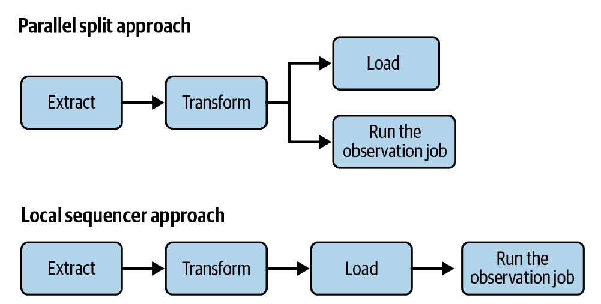
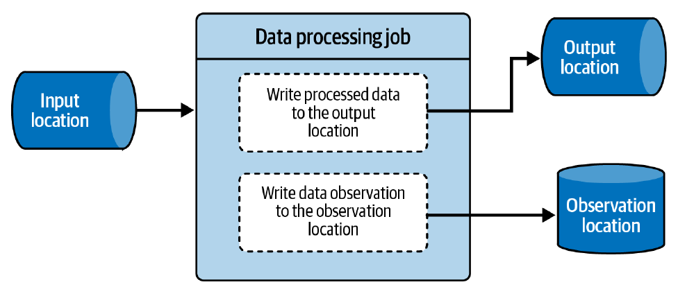

# Capítulo 9. Patrones de Diseño de Calidad de Datos

La confianza es un valor importante de un conjunto de datos. El intercambio de datos es como una transacción mutua, en la que se proporciona o se consume un servicio (conjunto de datos). El objetivo final es que tanto el productor como el consumidor estén contentos con este intercambio. Desafortunadamente, rara vez estarás entusiasmado trabajando con un conjunto de datos en el que no se puede confiar, ya que cualquier *insight* extraído de él podría ser erróneo en cualquier momento.

Una de las causas de la pérdida de confianza es la mala calidad del conjunto de datos, lo que significa problemas de incompletitud, inexactitud y/o inconsistencia. Pero la buena noticia es que estos problemas no son nuevos, y aunque los ingenieros de datos continúan luchando contra ellos, existen algunos patrones de diseño para mitigar los problemas de calidad de los datos.

En este capítulo, abordaremos los problemas de calidad de los datos con la ayuda de patrones de diseño organizados en tres categorías diferentes:

 * **Aplicación de la Calidad (*Quality Enforcement*):** Cómo hacer cumplir la calidad y así evitar exponer datos de mala calidad a tus consumidores *downstream*.
 * **Nivel de Esquema:** Cómo abordar los problemas de calidad de los datos a nivel de esquema. A menudo, tus productores pueden generar datos sin problemas aparentes, hasta el día en que deciden modificar el esquema.
 * **Observación de la Calidad (*Quality Observation*):** Cómo garantizar que nuestras reglas de cumplimiento de hoy sigan siendo relevantes para los datos de mañana.

## Aplicación de la Calidad (*Quality Enforcement*)

Asegurar la calidad de tu conjunto de datos significa que evitarás compartir un conjunto de datos incompleto, inconsistente o inexacto. La aplicación de la calidad es, por lo tanto, la primera categoría de patrones de calidad de datos que aplicarás a tus *pipelines* con el objetivo de compartir datos confiables.

### Patrón: Audit-Write-Audit-Publish

La primera forma de asegurar una buena calidad del conjunto de datos es añadir controles al flujo de datos. Este enfoque es similar a las aserciones en las pruebas unitarias que verifican si tu código se está comportando correctamente frente a una entrada esperada.

#### Problema

Tu trabajo diario de ETL por lotes genera estadísticas para las visitas de los usuarios presentadas en la Figura 1-1 del Capítulo 1. Los resultados no han sido buenos durante la última semana. De hecho, el número de visitantes únicos se redujo en un 50%, y el equipo de producto considera que esto es un problema. Como resultado, ha iniciado una nueva campaña de marketing para atraer visitantes al sitio web.

#### Solución

Un volumen de datos generado que cae un 50% en comparación con días anteriores es un caso de uso perfecto donde el patrón *Audit-Write-Audit-Publish* puede brillar.

El patrón **Audit-Write-Audit-Publish (AWAP)** es una evolución del patrón *Write-Audit-Publish (WAP)*. A diferencia de WAP, AWAP completa la lógica de validación con la verificación de los datos de entrada para realizar alguna validación generalmente ligera sobre el conjunto de datos de entrada.

La idea detrás de AWAP es añadir controles (también conocidos como pasos de auditoría) para asegurar que tanto los conjuntos de datos de entrada como de salida cumplan con los requisitos técnicos y de negocio definidos, como la completitud y la exactitud.

Como puedes ver en la **Figura 9-1**, la principal diferencia entre las dos tareas de auditoría es el almacén de datos auditado:

1.  El primer trabajo de auditoría es responsable de analizar la fuente de datos de entrada antes de comenzar a transformar el conjunto de datos.
2.  El segundo trabajo de auditoría valida los datos transformados. Se puede considerar como una extensión de tus pruebas unitarias locales que se ejecutarán en el conjunto de datos real.

La validación en los pasos de auditoría puede operar a nivel de registros y, por lo tanto, validar atributos de registros particulares, o puede operar a nivel de conjunto de datos para verificar propiedades generales, como el volumen de datos, la distintividad de columnas particulares o incluso la proporción de NULLs en una columna.

#### Consecuencias

El patrón AWAP aporta seguridad extra, pero incurre en algunos costos adicionales.

 * **Costo de cómputo:** Dependiendo de la naturaleza de tus pasos de auditoría, puedes tener un costo de cómputo adicional.
 * **Cobertura de reglas:** Mantente en el ejemplo de validación de filas aquí. Si necesitas verificar valores para cada fila entrante, definirás un conjunto de reglas de negocio.
 * **Latencia de *streaming*:** AWAP en un contexto de *streaming* puede añadir algo de latencia extra.
 * **Un problema puede no ser un problema:** Ten en cuenta que un problema detectado por los pasos de auditoría puede no ser un problema real.

### Patrón: Constraints Enforcer

El patrón AWAP valida los datos directamente desde tu *pipeline* de procesamiento de datos. Dicho de otra manera, el esfuerzo de implementación recae en tu lado. Sin embargo, hay una forma más fácil de crear conjuntos de datos confiables delegando esos controles de calidad a la base de datos o al formato de almacenamiento, basándose así en un enfoque más declarativo.

#### Problema

Un *pipeline* por lotes procesa las visitas de la Figura 1-1 y escribe los resultados en una tabla. Aunque ha estado funcionando sin problemas durante varios meses, ahora estás obteniendo valores NULL aleatorios para varios campos requeridos. El trabajo de procesamiento de datos ya es complejo y quieres evitar añadirle complejidad de validación de datos.

#### Solución

Delegar la responsabilidad de la validación a la base de datos es de lo que se encarga el patrón *Constraints Enforcer*. La implementación comienza identificando los atributos que deben tener las reglas de restricción asignadas.

#### Consecuencias

 * **Semántica de todo o nada:** La mayoría de las veces, las restricciones definidas a nivel de base de datos siguen una semántica transaccional de todo o nada.
 * **Cambio del productor de datos:** El patrón *Constraints Enforcer* está orientado al productor de datos, ya que expone las restricciones al escritor de datos.
 * **Cobertura de restricciones:** No siempre es posible cubrir todas las reglas de validación.

## Consistencia del Esquema

Las restricciones de esquema que descubriste con el patrón *Constraints Enforcer* resuelven el problema de consistencia de los datos. Sin embargo, los esquemas tienen un lugar especial en la ingeniería de datos que es mucho más complejo que simplemente definir los tipos de campo de una tabla.

### Patrón: Schema Compatibility Enforcer

Los conjuntos de datos son dinámicos porque sus valores pueden cambiar con el tiempo, y el patrón *Constraints Enforcer* valida estas entradas evolucionadas contra un conjunto de reglas predefinidas. Pero, ¿y si te dijera que los esquemas también pueden tener esta validación?

#### Problema

Estás ejecutando un trabajo de sesionización que implementaste con el patrón *Stateful Sessionizer*. Funcionó muy bien durante meses, pero luego el equipo que genera tus datos de entrada hizo varios cambios y, como resultado, el trabajo ha fallado muchas veces en el último mes. Resulta que el nuevo equipo eliminó los campos utilizados por tu aplicación, pensando que eran obsoletos.

#### Solución

Para asegurarte de que tú, como productor de datos, no introduces ningún cambio disruptivo, puedes usar el patrón *Schema Compatibility Enforcer*. Dependiendo de tu almacén de datos, usarás uno de los tres modos de aplicación de compatibilidad de esquema disponibles:

 * **A través de un servicio o biblioteca externa**
 * **Implícito con inserciones**
 * **Impulsado por eventos para el lenguaje de definición de datos (DDL)**

Completemos esta sección de implementación con un análisis de varios modos de compatibilidad que puedes definir para tus esquemas.

**Tabla 9-1. Resumen de acciones de compatibilidad de esquemas**

| Modos de compatibilidad | Acciones permitidas | Semántica |
| :--- | :--- | :--- |
| **Backward nontransitive** | Eliminar campo, Añadir campo opcional | Los consumidores con una versión más nueva pueden leer datos producidos con una versión anterior. |
| **Backward transitive** | | |
| **Forward nontransitive** | Añadir campo, Eliminar campo opcional | Los consumidores con una versión anterior pueden leer datos producidos con una versión nueva. |
| **Forward transitive** | | |
| **Full nontransitive** | Añadir campo opcional, Eliminar campo opcional | Los consumidores con una versión más nueva pueden leer datos producidos con una versión anterior. Los consumidores con una versión anterior pueden leer datos producidos con una nueva versión. |
| **Full transitive** | | |

#### Consecuencias

 * **Sobrecarga de interacción:** La gestión de esquemas, particularmente a través de un componente de registro de esquemas externo, añade una sobrecarga adicional a la generación de datos.
 * **Evolución del esquema:** La evolución del esquema será más difícil con el patrón *Schema Compatibility Enforcer*.

### Patrón: Schema Migrator

Asegurar la corrección del esquema evita que los productores realicen cambios incompatibles y evita que los consumidores se vean interrumpidos si esas modificaciones incompatibles son posibles. Sin embargo, todavía queda un problema relacionado con el esquema: cómo mantener seguros a los consumidores mientras se les da la capacidad de realizar cambios disruptivos en el esquema, como la evolución del tipo de campo y el cambio de nombre.

#### Problema

Estás buscando mejorar la estructura de los eventos de visita que tus trabajos están generando *downstream*. Desde el primer día, querías ser amigable con el usuario, y por esa razón has estado añadiendo nuevos campos sin molestar a tus consumidores. Como resultado, algunos de tus campos relacionados con el dominio están dispersos por todo un mensaje que a veces tiene hasta 60 atributos, lo cual es demasiado para la mayoría de los usos y hace que la comprensión del dominio sea muy desafiante.

#### Solución

No puedes resolver el problema con el patrón *Schema Compatibility Enforcer*, ya que solo controla los tipos de cambios que se pueden realizar. La solución se basa en el patrón de diseño *Schema Migrator* que permite la evolución del esquema.

#### Consecuencias

 * **Impacto en el tamaño:** Esta es una consecuencia natural del *Schema Migrator*, que proporciona algunos mecanismos de seguridad para realizar la migración del esquema, pero también incurre en costos en forma de espacio de almacenamiento, transferencia de red y E/S, ya que hay más datos que guardar.
 * **Eliminación imposible:** El patrón *Schema Migrator* tiene algunos límites de implementación en el escenario de eliminación de campos.

## Observación de la Calidad (*Quality Observation*)

Recuerda, los conjuntos de datos son dinámicos. Cambian, y las reglas de restricción que defines hoy pueden no ser válidas mañana. Por eso es importante observar lo que está sucediendo con los conjuntos de datos y estar listo para adaptar las reglas existentes o añadir nuevas restricciones.

### Patrón: Observador Fuera de Línea (*Offline Observer*)

Los patrones de observación se pueden organizar según su lugar en el *pipeline* de datos. El primer tipo de patrón vive como un componente de observación separado que no interfiere con el flujo de trabajo de procesamiento de datos.

#### Problema

Comenzaste un nuevo *pipeline* de datos este mes y no has encontrado muchos problemas de calidad de datos. El conjunto de datos está completamente estructurado y todas las reglas de negocio se aplican correctamente mediante patrones de aplicación de la calidad. Sin embargo, por tu proyecto anterior, sabes que esto no durará, ya que el conjunto de datos *upstream* evolucionará en los próximos meses.

#### Solución

En un escenario en el que el monitoreo no debe bloquear el flujo de trabajo de procesamiento, es mejor optar por el patrón *Offline Observer*. La implementación consiste en crear un trabajo de observabilidad de datos que analizará los registros procesados y mejorará la capa de monitoreo existente con *insights* adicionales.

#### Consecuencias

 * **Precisión del tiempo:** Dado que un trabajo de observación fuera de línea puede ejecutarse en cualquier horario, incluso mucho más tarde que el generador de datos, puede que no ocurra de manera oportuna.
 * **Recursos de cómputo:** Como el trabajo de observación de datos se ejecutará en un segundo plano, puedes sentirte tentado a programarlo con menos frecuencia que el trabajo de generación de datos.

### Patrón: Observador en Línea (*Online Observer*)

Si la latencia entre el procesamiento de datos y la observación de datos a través del patrón *Offline Observer* es un problema, puedes optar por un patrón alternativo más en tiempo real, que es el *Online Observer*.

#### Problema

La semana pasada, tus colegas de análisis de datos se quejaron de un formato inesperado en el campo del código postal. Resulta que hay alguna regresión de datos en el conjunto de datos *upstream*, y no pudiste evitarlo con las reglas de confianza de datos existentes. Tu *Offline Observer* sí descubrió el problema, pero como se ejecuta una vez por semana, no pudiste detectar el problema antes que tus usuarios.

#### Solución

El problema que hemos presentado es un ejemplo perfecto de las limitaciones del *Offline Observer*. Afortunadamente, superarlo es relativamente simple con el patrón opuesto, que se llama el patrón *Online Observer*.

#### Consecuencias

 * **Retrasos adicionales:** Si utilizas el enfoque de *Local Sequencer* para integrar el trabajo de observación de datos, lo añadirás como un paso extra al final del *pipeline*.
 * **Divisiones paralelas:** El enfoque de *Parallel Split* añade un paralelismo extra al *pipeline* al ejecutar los pasos de observación y carga de datos al mismo tiempo.

## Resumen

En este capítulo, aprendiste sobre tres componentes importantes que puedes usar para construir conjuntos de datos confiables. La primera sección cubrió patrones de diseño relacionados con la aplicación de la calidad. Viste cómo mejorar la calidad en diferentes capas.

Aunque la aplicación de restricciones y controles previene la publicación de conjuntos de datos de mala calidad, no garantiza que no habrá problemas. De hecho, solo garantiza que no habrá problemas con las reglas que definiste. Para superar el problema de mantenerse actualizado, confiarás en los patrones de "Observación de la Calidad". Allí, aprendiste sobre los patrones *Offline Observer* y *Online Observer*, que funcionan en diferentes niveles. El primero es un componente separado que se ejecuta de forma independiente en el *pipeline* de generación de datos, mientras que el segundo es lo contrario. Qué enfoque es el adecuado para ti depende de tu disposición a cambiar tiempo por precisión.
