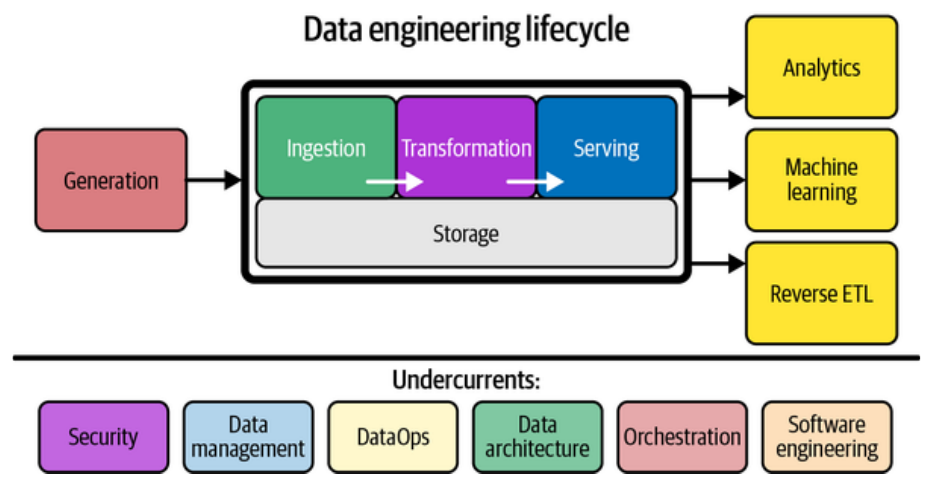
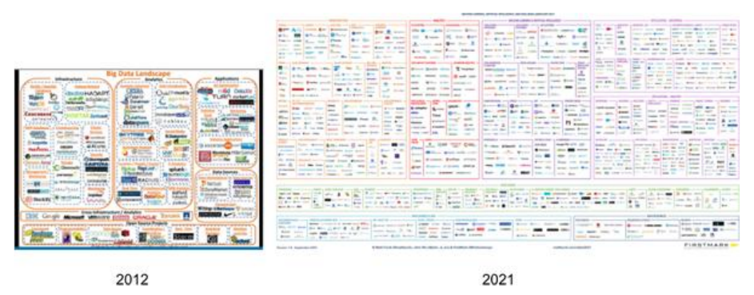
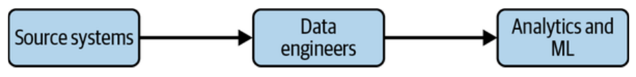

# Capítulo 1: Descripción de la Ingeniería de Datos

La ingeniería de datos ha salido de las sombras para compartir el escenario con la ciencia de datos. Es uno de los campos más populares porque **construye los cimientos** para la ciencia de datos y la analítica en producción.

## ¿Qué es la Ingeniería de Datos?

Existe mucha confusión sobre qué significa este término. Históricamente, ha existido en formas como análisis predictivo, descriptivo e informes, pero cobró relevancia con el auge de la ciencia de datos en la década de 2010.

Para definirla, el libro primero revisa definiciones existentes que varían desde "operaciones para el flujo de información" hasta enfoques centrados exclusivamente en SQL o Big Data.

### Definición de Ingeniería de Datos (Según los autores)
Los autores sintetizan las definiciones en un patrón claro: un ingeniero de datos obtiene datos, los almacena y los prepara para su consumo.

> **Definición Formal:**
> La ingeniería de datos es el desarrollo, implementación y mantenimiento de sistemas y procesos que toman datos crudos y producen información consistente y de alta calidad que soporta casos de uso posteriores (downstream), como el análisis y el aprendizaje automático (ML).
>
> La ingeniería de datos es la intersección de:
>
> *   Seguridad
> *   Gestión de datos
> *   DataOps
> *   Arquitectura de datos
> *   Orquestación
> *   Ingeniería de software

Un ingeniero de datos gestiona el **Ciclo de Vida de la Ingeniería de Datos**.

### El Ciclo de Vida de la Ingeniería de Datos
Este es el concepto central del libro. Aleja la conversación de la tecnología específica y la centra en los datos y sus objetivos.

**Etapas del ciclo de vida:**

1.  Generación
2.  Almacenamiento (Storage)
3.  Ingesta (Ingestion)
4.  Transformación
5.  Servicio (Serving)

**Corrientes subyacentes (Undercurrents):**
Son ideas críticas que atraviesan todo el ciclo: Seguridad, gestión de datos, DataOps, arquitectura de datos, orquestación e ingeniería de software.

---

## Evolución del Ingeniero de Datos

Entender la historia es vital para comprender el presente ("La historia no se repite, pero rima").

### 1. Los primeros días: 1980 a 2000 (Del Data Warehousing a la Web)
*   **Raíces:** Nacen en el *Data Warehousing* (término acuñado por Bill Inmon en 1989).
*   **Tecnología:** Bases de datos relacionales (IBM, Oracle) y SQL.
*   **Roles:** Ingeniero de BI, desarrollador ETL, ingeniero de Data Warehouse.
*   **Modelado:** Se desarrollan las técnicas de Ralph Kimball y Bill Inmon.
*   **Hito:** Bases de datos MPP (Procesamiento Masivo Paralelo) para escalar análisis.
*   **La Web:** A mediados de los 90, el auge de las ".com" (AOL, Yahoo, Amazon) generó escalas de datos que los sistemas monolíticos y costosos no podían manejar.

### 2. Principios de los 2000: El nacimiento de la ingeniería de datos contemporánea
*   **Contexto:** Las empresas web crecieron masivamente (Google, Amazon, Yahoo) y los sistemas tradicionales fallaron.
*   **Innovación:** Hardware "commodity" (barato y ubicuo) permitió la computación distribuida.
*   **Big Data:** Definido por las 3 Vs (Volumen, Velocidad, Variedad).
*   **El "Big Bang":**
    *   2003: Paper de Google File System (GFS).
    *   2004: Paper de MapReduce.
    *   2006: Lanzamiento de **Apache Hadoop** (Yahoo), inspirado en los papers de Google.
*   **La Nube:** Amazon lanza AWS (EC2, S3, DynamoDB), permitiendo alquilar cómputo y almacenamiento en lugar de comprar hardware.

### 3. Los 2000s y 2010s: Ingeniería de Big Data
*   **Herramientas:** Ecosistema Hadoop (Pig, Hive, HBase, Storm, Cassandra, Spark).
*   **El Ingeniero de Big Data:** Requería conocimientos de bajo nivel, infraestructura y programación (Java/Scala). Se enfocaba en mantener clusters masivos y escribir trabajos MapReduce.
*   **Problema:** "Big Data" se volvió una víctima de su propio éxito. Muchas empresas usaban herramientas complejas para problemas de datos pequeños ("Big data is like teenage sex...").

### 4. Los 2020s: Ingeniería para el ciclo de vida de datos
*   **Tendencia:** Simplificación y abstracción. Movimiento de marcos monolíticos de bajo nivel a herramientas modulares, gestionadas y descentralizadas.
*   **Modern Data Stack:** Colección de herramientas *off-the-shelf* para facilitar la vida de los analistas.
*   **Rol actual:** El ingeniero ya no se preocupa por los detalles sangrientos de los frameworks de Big Data, sino que se enfoca en la cadena de valor: seguridad, DataOps, arquitectura.
*   **Cambio de actitud:** Menos enfoque en el tamaño de los datos, más enfoque en la calidad, privacidad (GDPR/CCPA) y gobernanza. Es un retorno a los temas "empresariales" pero con agilidad.

---

## Ingeniería de Datos y Ciencia de Datos

La ingeniería de datos **es distinta** de la ciencia de datos y la analítica, aunque se complementan.

*   **Ubicación:** La ingeniería de datos se sitúa **aguas arriba (upstream)** de la ciencia de datos.
*   **Función:** Los ingenieros proveen los inputs; los científicos los convierten en algo útil.

### Jerarquía de Necesidades de la Ciencia de Datos (Monica Rogati)
La IA y el Deep Learning están en la cima de la pirámide. La base (movimiento, almacenamiento, recolección, infraestructura) es territorio de la ingeniería de datos.

*   **Realidad:** Los científicos de datos a menudo pasan el 70-80% de su tiempo limpiando y recolectando datos (partes inferiores de la pirámide) debido a la falta de soporte de ingeniería.
*   **Ideal:** Los ingenieros de datos deben construir una base sólida para que los científicos dediquen el 90% de su tiempo a la analítica y ML.

---

## Habilidades y Actividades de la Ingeniería de Datos

El ingeniero de datos actúa como puente entre obtener datos y obtener valor de ellos.

Sus habilidades abarcan las "corrientes subyacentes" (seguridad, arquitectura, etc.) y el ciclo de vida. Deben optimizar constantemente a lo largo de varios ejes:

**Ejes de optimización:**

*   Costo
*   Agilidad
*   Escalabilidad
*   Simplicidad
*   Reutilización
*   Interoperabilidad

**Lo que un Ingeniero de Datos NO hace típicamente:**

*   Construir modelos de ML directamente.
*   Crear informes o dashboards.
*   Realizar análisis de datos.
*   Desarrollar aplicaciones de software (aunque deben entender de esto).

---

## Madurez de Datos y el Ingeniero de Datos

La complejidad del trabajo depende de la madurez de datos de la empresa (no necesariamente de su edad o ingresos).

### Etapa 1: Empezando con datos (Starting with data)
*   **Características:** Etapa temprana, objetivos difusos, equipo pequeño (generalistas).
*   **Objetivo del Ingeniero:** Moverse rápido, conseguir tracción y agregar valor.
*   **Trampa común:** Saltar a ML sin una base sólida de datos.
*   **Enfoque:**
    *   Conseguir apoyo de los stakeholders (patrocinador ejecutivo).
    *   Definir la arquitectura de datos correcta.
    *   Identificar y auditar datos clave.
    *   Construir una base sólida para futuros analistas.
*   **Consejos:** Buscar victorias rápidas (quick wins) pero gestionar la deuda técnica; evitar trabajar en silos; usar soluciones "llave en mano" en lugar de construir complejidad innecesaria.

### Etapa 2: Escalando con datos (Scaling with data)
*   **Características:** Prácticas de datos formales, alejamiento de solicitudes ad-hoc. Roles especializados.
*   **Objetivos del Ingeniero:**
    *   Establecer prácticas formales.
    *   Crear arquitecturas escalables y robustas.
    *   Adoptar DevOps y DataOps.
    *   Construir sistemas que soporten ML.
*   **Advertencia:** Evitar tecnologías de vanguardia (*bleeding-edge*) solo por moda. El cuello de botella suele ser el equipo de ingeniería, no la tecnología. Enfocarse en liderazgo pragmático.

### Etapa 3: Liderando con datos (Leading with data)
*   **Características:** Empresa impulsada por datos (*data-driven*). Pipelines automatizados, analítica de autoservicio.
*   **Objetivos del Ingeniero:**
    *   Crear automatización para el uso continuo de nuevos datos.
    *   Construir herramientas personalizadas que den ventaja competitiva.
    *   Enfoque en Gobernanza, Calidad y DataOps.
    *   Implementar catálogos de datos y linaje.
*   **Peligros:** Complacencia (riesgo de caer de nivel) y distracciones tecnológicas (proyectos hobby caros).

---

## Antecedentes y Habilidades de un Ingeniero de Datos

### ¿Deben saber programar?
**Sí.** Deben tener habilidades de ingeniería de software de nivel de producción. Aunque las herramientas abstraen mucho, las mejores prácticas de software (control de versiones, pruebas) son una ventaja competitiva.

### Lenguajes de Programación
*   **Primarios:**
    *   **SQL:** La *lingua franca* de los datos. Esencial para bases de datos, lagos de datos y herramientas modernas (Spark SQL, BigQuery, etc.).
    *   **Python:** El lenguaje puente entre ingeniería y ciencia de datos. "El segundo mejor lenguaje para todo". Pegamento para herramientas (Airflow, Pandas, PySpark).
    *   **Lenguajes JVM (Java/Scala):** Prevalentes en proyectos Apache open source (Spark, Hive, Flink). Útiles para entender frameworks a bajo nivel.
    *   **Bash:** Interfaz de línea de comandos. Crítico para scripting y operaciones de SO.

### Tipos de Ingenieros de Datos
Se propone un continuo similar al de los científicos de datos (Tipo A análisis / Tipo B construcción):

*   **Ingeniero de Datos Tipo A (Abstracción):** Evita el trabajo pesado indiferenciado. Mantiene la arquitectura simple usando productos *off-the-shelf*, servicios gestionados y SaaS. Funciona en todos los niveles de madurez.
*   **Ingeniero de Datos Tipo B (Construcción - Build):** Construye herramientas y sistemas de datos personalizados que escalan y aprovechan la competencia central de la empresa. Común en etapas de madurez 2 y 3, o casos de uso muy innovadores.

---

## Ingenieros de Datos dentro de una Organización

Los ingenieros de datos no trabajan en el vacío; interactúan con personas técnicas y no técnicas y miran hacia diferentes direcciones (interna y externa).

### Orientación del Ingeniero
Dependiendo de los casos de uso finales, las responsabilidades son de cara al exterior, al interior o una mezcla:

*   **De cara al exterior (External-facing):** Atiende a usuarios de aplicaciones externas (redes sociales, IoT, plataformas de e-commerce). Maneja alta concurrencia, límites de consultas y seguridad compleja (multitenencia).

    

*   **De cara al interior (Internal-facing):** Se enfoca en las necesidades del negocio y stakeholders internos (BI, dashboards, analistas).

    

### Ingenieros de Datos y otros roles técnicos

**Aguas Arriba (Upstream Stakeholders):**

*   **Arquitectos de Datos:** Diseñan el plano de la gestión de datos. Puente entre técnico y negocio. Con la nube, la arquitectura es más fluida.
*   **Ingenieros de Software:** Construyen los sistemas que generan los datos internos. Es vital coordinar con ellos para diseñar los datos de aplicación.
*   **Ingenieros DevOps / SRE:** Producen datos de monitoreo y colaboran en la operación de sistemas de datos.

**Aguas Abajo (Downstream Stakeholders):**

*   **Científicos de Datos:** Construyen modelos predictivos. Los ingenieros deben automatizar su trabajo de limpieza y recolección para hacerlos eficientes.
*   **Analistas de Datos:** Se enfocan en el desempeño pasado/presente (reportes, SQL). Expertos en el dominio de los datos. Ayudan a mejorar la calidad.
*   **Ingenieros de Machine Learning (MLE):** Desarrollan técnicas avanzadas de ML y mantienen la infraestructura de producción. Solapan con ingenieros de datos y científicos.
*   **Investigadores de IA:** Trabajan en técnicas novedosas (OpenAI, DeepMind). En entornos académicos o grandes tecnológicas.

---

## Ingenieros de Datos y Liderazgo Empresarial

Los ingenieros de datos actúan como conectores organizacionales.

### Datos en la C-Suite (Ejecutivos)
*   **CEO (Chief Executive Officer):** Define la visión. Los ingenieros proveen una ventana a lo que es posible con los datos.
*   **CIO (Chief Information Officer):** Responsable de TI interna. Colabora en migraciones a la nube y sistemas ERP/CRM.
*   **CTO (Chief Technology Officer):** Responsable de la tecnología externa (producto). Posee la estrategia tecnológica.
*   **CDO (Chief Data Officer):** Responsable de los activos y estrategia de datos de la empresa. Enfocado en la utilidad del negocio, gobernanza y calidad.
*   **CAO (Chief Analytics Officer):** Variante del CDO, enfocado en analítica y toma de decisiones.
*   **CAO-2 (Chief Algorithms Officer):** Rol reciente, altamente técnico, enfocado en productos de ML e IA.

### Gestión de Proyectos y Productos
*   **Gestores de Proyectos:** Dirigen el tráfico y actúan como guardianes en grandes iniciativas (migraciones, *greenfield*). Manejan Agile/Scrum.
*   **Gestores de Producto (Product Managers):** Supervisan el desarrollo de productos. En este contexto, los productos son **"productos de datos"**. Balancean la tecnología con las necesidades del cliente.

---

## Conclusión del Capítulo
El capítulo ha proporcionado una visión general del paisaje:

1.  Definición centrada en el ciclo de vida y la entrega de valor, no solo en herramientas.
2.  Evolución desde el Data Warehouse monolítico -> Big Data complejo -> Modern Data Stack simplificado.
3.  Diferenciación clara entre Ciencia de Datos (consumidores) e Ingeniería de Datos (productores/facilitadores).
4.  Importancia de la madurez de datos para definir las tareas del ingeniero.
5.  Las habilidades clave son tanto técnicas (SQL, Python, Arquitectura) como de negocio (comunicación, gestión de costos).
