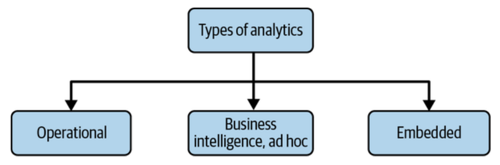

# Capítulo 2: El Ciclo de Vida de la Ingeniería de Datos

Este capítulo presenta el tema central del libro: el **Ciclo de Vida de la Ingeniería de Datos**. El objetivo es ir más allá de las tecnologías específicas (que cambian rápido) y enfocarse en los principios de gestión del ciclo de vida de los datos ("de la cuna a la tumba").

## ¿Qué es el Ciclo de Vida de la Ingeniería de Datos?

Es el proceso que convierte ingredientes de datos crudos en un producto final útil para analistas, científicos de datos e ingenieros de ML.

Se divide en **cinco etapas principales**:

1.  **Generación**
2.  **Almacenamiento (Storage)**
3.  **Ingesta (Ingestion)**
4.  **Transformación**
5.  **Servicio (Serving)**

Aunque se presentan como etapas distintas, en la práctica pueden superponerse o ocurrir fuera de orden. El diagrama muestra el **Almacenamiento** como una base que sustenta a las demás etapas, ya que los datos se almacenan a lo largo de todo el ciclo.

Además, existen las **corrientes subyacentes (undercurrents)**, que son ideas críticas que atraviesan todas las etapas:

*   Seguridad
*   Gestión de datos
*   DataOps
*   Arquitectura de datos
*   Orquestación
*   Ingeniería de software

### El Ciclo de Vida de los Datos vs. El Ciclo de Vida de la Ingeniería de Datos
Hay una distinción sutil. El ciclo de vida de los datos abarca toda la vida útil del dato. El ciclo de vida de la ingeniería de datos es un **subconjunto** que se enfoca en las etapas que el ingeniero de datos controla directamente.

---

## 1. Generación: Sistemas Fuente

Un **sistema fuente** es el origen de los datos (ej. dispositivo IoT, cola de mensajes, base de datos transaccional). El ingeniero de datos consume datos de aquí pero típicamente no es dueño del sistema.

Es crucial entender cómo funciona la fuente: frecuencia, velocidad y variedad de los datos. Los ingenieros deben comunicarse con los dueños de las fuentes para evitar que cambios en el código "rompan" los pipelines.

**Ejemplos de sistemas fuente:**

1.  **Base de datos de aplicación:** Servidores conectados a una base de datos relacional (RDBMS).

    

2.  **Enjambre IoT (IoT Swarm):** Flota de dispositivos enviando mensajes a una cola central.

    

### Consideraciones clave al evaluar fuentes:
*   **Características:** ¿Es una aplicación, IoT, web?
*   **Persistencia:** ¿Se guardan los datos a largo plazo o se borran rápido?
*   **Tasa de generación:** Eventos por segundo, GB por hora.
*   **Consistencia:** ¿Calidad de datos, nulos, formato?
*   **Errores y Duplicados:** Frecuencia.
*   **Latencia:** ¿Llegan datos tarde (*late arriving data*)?
*   **Esquema:** ¿Estático o cambia? ¿Cómo se comunican los cambios?

### Esquema (Schema)
El esquema define la organización jerárquica de los datos.

*   **Sin esquema (Schemaless):** La aplicación define el esquema al escribir (ej. MongoDB, logs).
*   **Esquema fijo:** La base de datos fuerza la estructura (ej. RDBMS SQL).

El trabajo del ingeniero a menudo implica transformar datos crudos del esquema de la fuente a un formato valioso para analítica.

---

## 2. Almacenamiento (Storage)

Elegir la solución de almacenamiento es clave y complejo. A menudo se usan múltiples soluciones (Data Warehouse, Data Lake, Object Storage). El almacenamiento toca casi todas las etapas (ingesta, transformación, servicio).

### Consideraciones clave de ingeniería:
*   **Velocidad:** ¿Compatible con las necesidades de lectura/escritura?
*   **Cuello de botella:** ¿El almacenamiento frenará procesos downstream?
*   **Uso óptimo:** Evitar "actos antinaturales" (ej. altas actualizaciones aleatorias en Object Storage).
*   **Escalabilidad:** Límites de capacidad y volumen.
*   **Metadatos:** Captura de esquema, linaje, evolución.
*   **Tipo:** ¿Puro almacenamiento (S3) o con motor de consulta (Warehouse)?

### Frecuencia de Acceso a Datos (Temperatura)
*   **Datos Calientes (Hot Data):** Accedidos muchas veces por segundo. Requieren almacenamiento rápido (y caro).
*   **Datos Tibios (Lukewarm Data):** Accedidos cada semana o mes.
*   **Datos Fríos (Cold Data):** Rara vez consultados. Para auditoría o recuperación ante desastres. Almacenamiento barato y lento (ej. S3 Glacier).

---

## 3. Ingesta (Ingestion)

Es el proceso de mover datos desde la fuente al almacenamiento o sistema de procesamiento. Suele ser el mayor cuello de botella por la falta de control sobre la fuente.

### Consideraciones clave:
*   **Casos de uso:** ¿Para qué se usarán los datos? ¿Reutilizables?
*   **Fiabilidad:** ¿Está disponible la fuente?
*   **Destino y Frecuencia:** ¿A dónde van y qué tan seguido?
*   **Volumen y Formato.**
*   **Calidad:** ¿Necesita limpieza inmediata?

### Batch vs. Streaming
*   **Streaming (Tiempo real):** Los datos se procesan continuamente, poco después de generarse (baja latencia). Es complejo y costoso.
*   **Batch (Lotes):** Los datos se procesan en intervalos o por tamaño acumulado. Es más simple y estándar para reportes y entrenamiento de modelos.
    *   *Consejo:* No adoptar streaming "porque sí". Evaluar si el negocio realmente necesita latencia de milisegundos.

### Push vs. Pull
*   **Push:** La fuente envía los datos al destino (ej. IoT enviando a una cola, CDC enviando cambios).
*   **Pull:** El sistema de ingesta consulta y extrae los datos de la fuente (ej. ETL tradicional consultando una DB cada noche).

---

## 4. Transformación

Aquí es donde los datos comienzan a generar valor. Se convierten de su forma original a algo útil para análisis o ML. Sin transformación, los datos son inertes.

**Tipos de transformación:**

*   **Básica:** Mapeo de tipos de datos, estandarización de formatos.
*   **Normalización/Modelado:** Estructuración según lógica de negocio (Data Modeling).
*   **Agregación/Featurization:** Resumen para reportes o creación de *features* para ML.

### Consideraciones clave:
*   **Costo/ROI:** ¿Vale la pena el proceso?
*   **Lógica de negocio:** La transformación traduce reglas de negocio (ej. qué define una "venta") en código reutilizable. Es vital para tener una "única fuente de verdad".

---

## 5. Servicio de Datos (Serving Data)

La etapa final: entregar valor a los usuarios. Los datos no consumidos son "proyectos de vanidad".

**Usos populares:**

1.  **Analítica (Analytics):**
    *   **Business Intelligence (BI):** Reportes sobre el pasado/presente. Lógica de negocio centralizada.
    *   **Analítica Operacional:** Detalles de grano fino en tiempo real para acción inmediata (ej. monitoreo de servidores).
    *   **Analítica Embebida:** Datos para clientes dentro de un producto (SaaS). Requiere seguridad robusta y multitenencia.

    

2.  **Machine Learning (ML):**
    *   Los ingenieros de datos proveen la infraestructura para entrenar y servir modelos.
    *   **Feature Store:** Herramienta que une ingeniería de datos y ML para gestionar y compartir *features*.

3.  **Reverse ETL:**
    *   Mover datos procesados *desde* el almacén de datos *hacia* sistemas operativos (ej. Salesforce, Google Ads).
    *   Permite "operacionalizar" los insights analíticos.

    

---

## Corrientes Subyacentes (Undercurrents)

Son prácticas transversales esenciales que soportan el ciclo de vida.

### 1. Seguridad
Es la prioridad número uno. Principio de **menor privilegio** (dar acceso solo a lo necesario).

*   La seguridad es técnica (encriptación, control de acceso) y cultural (educar a la gente).
*   Incluye gestión de identidad (IAM), seguridad de red, enmascaramiento de datos.

### 2. Gestión de Datos (Data Management)
Prácticas para asegurar que los datos son un activo valioso, seguro y accesible.

*   **Gobernanza de Datos:** Asegurar calidad, integridad y seguridad. Categorías:
    *   *Descubribilidad:* Hacer que los datos sean fáciles de encontrar (Catálogos de datos).
    *   *Metadatos:* "Datos sobre los datos". Crucial para la gobernanza.
        *   *Metadatos de Negocio:* Definiciones, dueños.
        *   *Metadatos Técnicos:* Esquemas, linaje, pipelines.
        *   *Metadatos Operacionales:* Logs de ejecución, errores.
    *   *Responsabilidad (Accountability):* Asignar dueños a los datos.
    *   *Calidad de Datos:* Precisión, Completitud, Oportunidad (Timeliness).
*   **Master Data Management (MDM):** Crear "Golden Records" (definiciones únicas) de entidades como clientes o productos.
*   **Linaje de Datos:** Rastro de auditoría de dónde viene el dato y cómo se transformó.

### 3. DataOps
Aplicación de prácticas ágiles, DevOps y control estadístico a los datos.

*   **Objetivo:** Innovación rápida, alta calidad, colaboración.
*   **Tres pilares técnicos:**
    1.  **Automatización:** CI/CD, control de versiones, infraestructura como código.
    2.  **Observabilidad y Monitoreo:** Detectar problemas antes que el usuario.
    3.  **Respuesta a Incidentes:** Resolver fallos rápidamente y sin culpa.

### 4. Arquitectura de Datos
Diseño de sistemas que soportan las necesidades a largo plazo.

*   El ingeniero debe traducir requisitos de negocio en diseños técnicos, balanceando costo y simplicidad (Trade-offs).

### 5. Orquestación
El proceso de coordinar múltiples trabajos (jobs) para que se ejecuten eficiente y puntualmente.

*   Herramientas como **Airflow**, Dagster, Prefect.
*   Gestiona dependencias (DAGs), reintentos, backfilling y alertas.

### 6. Ingeniería de Software
Habilidad central. Los ingenieros de datos deben escribir código de calidad, usar control de versiones y pruebas.

*   **Código de procesamiento:** SQL, Python, Spark.
*   **Infraestructura como Código (IaC):** Gestionar nubes mediante código (Terraform).
*   **Pipelines como Código:** Definir flujos de orquestación en código.

---

## Conclusión
El capítulo establece que la ingeniería de datos no es solo usar herramientas, sino gestionar un ciclo de vida complejo para entregar valor.
El modelo mental es:
**Etapas (Generación -> Almacenamiento -> Ingesta -> Transformación -> Servicio) + Corrientes Subyacentes (Seguridad, DataOps, etc.).**
