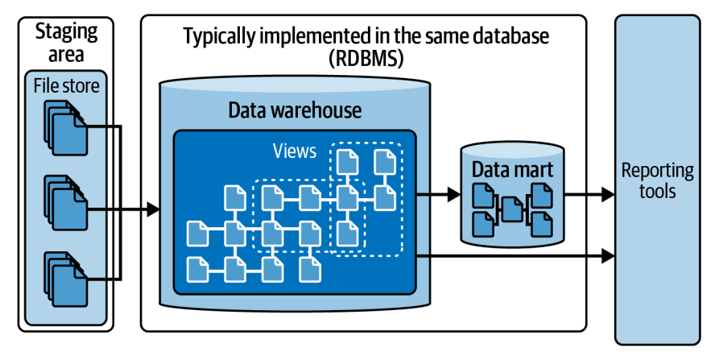

# Capítulo 1. La Evolución de la Arquitectura de Datos

Crear una arquitectura de datos robusta es uno de los aspectos más desafiantes de la gestión de datos. El proceso abarca desde la recolección hasta la transformación, distribución y consumo final, variando según la gobernanza, herramientas, perfil de riesgo y madurez de la organización.

A pesar de estas diferencias, el autor propone una metáfora fundamental para estructurar cualquier estrategia de datos: el **Diseño de Arquitectura de Tres Capas**.

Este diseño consta de:

1.  **Capa 1: Proveedores de Datos (Data Providers):** Son las diversas fuentes de donde se extrae la información. Se caracterizan por tener una mezcla de tipos de datos, formatos y ubicaciones dispersas.
2.  **Capa 2: Capa de Distribución (Distribution Layer):** Representa la plataforma de distribución. Es compleja debido a la inmensa cantidad de herramientas y tecnologías disponibles (propietarias y open source) para la integración.
3.  **Capa 3: Consumidores de Datos (Data Consumers):** Quienes consumen los servicios de datos. Incluye Business Intelligence (BI), Machine Learning (ML) e Inteligencia Artificial (AI) para predicciones y automatización.
4.  **Capa Transversal:** Metadatos y Gobernanza, crucial para supervisar toda la arquitectura.

El desafío actual es el **"Modern Data Stack"** (pila de datos moderna). Aunque ofrece herramientas open source adaptables, no es una plataforma completa por sí sola. Requiere integrar muchos servicios independientes, cada uno con sus propios estándares y protocolos, lo cual crea una barrera de entrada significativa.

Para solucionar esto, tecnologías como **Apache Spark** y **Delta Lake** han estandarizado el desarrollo, llevando a la creación de la **Arquitectura Medallion**.

## ¿Qué es una Arquitectura Medallion?

Es un patrón de diseño de datos utilizado para organizar lógicamente los datos, generalmente en un *Lakehouse*. Su objetivo es mejorar incremental y progresivamente la estructura y calidad de los datos a medida que fluyen a través de tres capas principales.

| Capa | Descripción y Función |
| :--- | :--- |
| **Bronze (Bronce)** | Almacena datos crudos (raw) de varias fuentes en su estructura nativa. Sirve como registro histórico y almacenamiento inicial confiable. |
| **Silver (Plata)** | Refina y estandariza los datos crudos. Aplica deduplicación, limpieza y validación. Actúa como etapa transicional para datos granulares y consistentes. |
| **Gold (Oro)** | Optimiza los datos refinados para insights de negocio específicos. Agrega, resume y enriquece datos para reportes de alto nivel y analítica, priorizando el rendimiento. |

Aunque las etiquetas son intuitivas, muchas empresas fallan al modelar sus datos dentro de estas capas, confundiendo objetivos y estrategias de gobernanza. Para entender cómo aplicar esto correctamente, es vital comprender primero la historia de las arquitecturas de datos.

## Una Breve Historia de la Arquitectura de Data Warehouse

En los años 90, el **Data Warehousing** surgió para crear una "versión única de la verdad" integrando datos en una colección unificada.

La arquitectura clásica fluye de izquierda a derecha:

1.  **Sistemas OLTP (Fuentes)**.
2.  **Staging Area (Área de preparación)**.
3.  **Data Warehouse (Almacén central)**.
4.  **Data Marts (Presentación)**.

### Sistemas OLTP (Online Transaction Processing)
La mayoría de los sistemas fuente son transaccionales. Sus cargas de trabajo son predecibles (leer, actualizar o borrar un registro).

*   **Diseño:** Están altamente **normalizados** (generalmente 3NF - Tercera Forma Normal) para reducir redundancia y asegurar la integridad de los datos.
*   **Propiedades ACID:** Atomicidad, Consistencia, Aislamiento, Durabilidad. Cruciales para transacciones bancarias u operativas.
*   **Problema para analítica:** Extraer datos para consultas complejas (que requieren muchos *joins*) es difícil y sobrecarga el sistema. Además, los OLTP suelen borrar datos antiguos para mantener el rendimiento, perdiendo historia valiosa.

### Normalización de Base de Datos vs. Desnormalización
*   **Normalización:** Reestructuración para reducir redundancia. Eficiente para almacenamiento y mantenimiento (escrituras), pero complejo para lecturas masivas.
*   **Desnormalización:** Introducir redundancia intencional para mejorar el rendimiento de las consultas (lecturas), reduciendo la necesidad de *joins*. Común en Data Warehousing.

### Data Warehouses
El Data Warehouse es el hub central para **OLAP (Online Analytical Processing)**.

*   A diferencia de OLTP, aquí se optimiza para el rendimiento analítico (lecturas repetidas).
*   Los datos suelen estar **desnormalizados**: tablas grandes, aplanadas y con datos duplicados para facilitar diferentes patrones de lectura.

### El Área de Staging (Staging Area)
Es el paso intermedio entre la fuente y el warehouse.

*   **Función:** Extracción (parte del ETL). Puede ser una base de datos relacional o almacenamiento de archivos (más barato).
*   **Importancia:** Permite guardar copias históricas de las entregas de datos, útil si el warehouse se corrompe y necesita reconstruirse. Aísla el proceso de extracción de las transformaciones complejas.

### Metodología Inmon
Creada por Bill Inmon (diseño **Top-Down**).

1.  Se extraen datos al Staging.
2.  Se cargan en un **Enterprise Data Warehouse (EDW)** centralizado con un modelo **normalizado (3NF)**.
3.  Luego, se crean **Data Marts** departamentales derivados del EDW, usualmente desnormalizados (esquemas de estrella) para reportes.

*   **Desventaja:** Doble esfuerzo de ETL (Fuente -> EDW Normalizado -> Data Mart Desnormalizado). Mayor tiempo de desarrollo y redundancia.

### Metodología Kimball
Creada por Ralph Kimball (diseño **Bottom-Up**). Introducida en 1996.

*   Se enfoca en tablas dimensionales para procesamiento analítico eficiente.
*   Utiliza el **Modelo Dimensional (Esquema de Estrella)**: Tablas de Hechos (métricas) rodeadas de Tablas de Dimensiones (contexto).
*   La capa de integración es una colección de tablas dimensionales y tablas de hechos. Los Data Marts son subconjuntos lógicos o físicos de estas tablas.

#### Dimensiones Conformadas y SCDs
Kimball introdujo conceptos clave que aún se usan:

*   **Dimensiones Conformadas:** Dimensiones compartidas y estandarizadas entre diferentes áreas (ej. una tabla "Tiempo" o "Cliente" idéntica para Ventas y Marketing).
*   **SCD (Slowly Changing Dimensions):** Técnicas para manejar cambios históricos en los datos.

| Tipo SCD | Nombre | Descripción | Pros/Contras |
| :--- | :--- | :--- | :--- |
| **SCD1** | Sobrescribir (Overwrite) | Actualiza el registro existente con el nuevo valor. | Simple, pero pierde la historia. |
| **SCD2** | Añadir nueva fila (Add row) | Crea un nuevo registro para el cambio, manteniendo el viejo. Usa claves subrogadas y fechas de vigencia. | Mantiene historia completa. Aumenta el tamaño de la tabla. |
| **SCD3** | Añadir nueva columna (Add column) | Agrega una columna para el valor anterior (ej. "Dirección_Anterior"). | Solo guarda una versión histórica limitada. |

### Conclusiones sobre Data Warehouses Tradicionales
Aunque efectivos para datos estructurados y consultas rápidas (gracias a la integración estrecha de hardware y software en sistemas on-premise), tienen problemas de escalabilidad. Escalar verticalmente (más hardware en una máquina) es costoso y tiene límites físicos. Además, no manejan bien datos no estructurados o ML.

## Una Breve Historia de los Data Lakes

Los Data Lakes surgieron a mediados de los 2000 como solución a las limitaciones del Warehouse, impulsados por el software open source (**Hadoop**) y hardware commodity (barato).

### Hadoop y sus Componentes
El ecosistema Hadoop fue la base de la primera generación de Data Lakes:

1.  **HDFS (Hadoop Distributed File System):**
    *   Sistema de archivos distribuido. Divide archivos grandes en bloques (ej. 128 MB) y los replica en varios nodos para tolerancia a fallos.
    *   Escala horizontalmente (añadir más máquinas baratas).
    *   **Problema de archivos pequeños:** HDFS está optimizado para archivos grandes. Muchos archivos pequeños (KB) saturan la memoria del *NameNode* (que guarda los metadatos) y matan el rendimiento.
    *   **Inmutabilidad:** Los bloques son inmutables (solo *append*). No se puede hacer un "UPDATE" de SQL tradicional; se debe reescribir el archivo o gestionar logs complejos, dificultando la implementación de SCDs.

2.  **MapReduce:**
    *   Modelo de programación para procesar datos en paralelo. Fases: *Map* (dividir), *Shuffle* (ordenar/transferir), *Reduce* (agregar).
    *   **Problema:** Muy lento debido a la intensa lectura/escritura en disco en cada etapa.

3.  **Apache Hive:**
    *   Capa SQL sobre Hadoop. Traduce consultas *HiveQL* a trabajos MapReduce.
    *   **Schema-on-read:** Permite guardar datos sin esquema definido y aplicarlo al leer. Esto da flexibilidad pero **NO** elimina la necesidad de modelado de datos (un error común). Sin modelado, el rendimiento y la integración sufren.
    *   **Metastore:** Repositorio central de metadatos (tablas, columnas, ubicación) que persiste hasta hoy en arquitecturas modernas.

### Proyecto Spark
Nacido en 2009 en UC Berkeley para solucionar la lentitud de MapReduce.

*   **Diferencia clave:** Procesamiento **en memoria**. Lee del disco una vez, procesa en RAM y escribe el resultado. Hasta 100 veces más rápido que MapReduce.
*   **Spark SQL:** Reemplazó a Shark, manteniendo compatibilidad con Hive Metastore.
*   **Limitación:** Tiene un tiempo de inicio (*cold start*). Necesita cargar datos del disco a memoria antes de ser rápido.

### Aprendizajes de los Data Lakes
Los Data Lakes son excelentes para almacenar volúmenes masivos de datos crudos (estructurados y no estructurados) a bajo costo. Sin embargo, transformarlos para entregar valor de negocio es complejo. Tienen problemas de latencia, falta de soporte transaccional (ACID) y rendimiento de consultas. Esto llevó al patrón de "dos niveles": Data Lake para almacenamiento + Data Warehouse para consumo, lo cual es complejo de mantener.

## Una Breve Historia de la Arquitectura Lakehouse

La arquitectura **Lakehouse** combina lo mejor de ambos mundos: la escalabilidad y flexibilidad del Data Lake (almacenamiento en objetos en la nube barato) con la confiabilidad y rendimiento del Data Warehouse (transacciones ACID).

### Fundadores de Spark y Databricks
Los creadores de Spark fundaron **Databricks** en 2013. A diferencia de sus competidores (Cloudera/Hortonworks que se enfocaron en on-premise), Databricks apostó por la **Nube** y la separación de cómputo y almacenamiento.

### Evolución Tecnológica
*   **Almacenamiento de Objetos:** Reemplazo de HDFS por S3 (AWS), ADLS (Azure), GCS (Google). Más barato y escala a petabytes.
*   **Spark en la Nube:** Clusters elásticos que se crean y destruyen según demanda (Kubernetes), sin estar atados a un cluster físico gigante.

### Emergencia de Formatos de Tabla Abiertos (Open Table Formats)
Para solucionar la falta de transacciones ACID y la gestión de metadatos en los Data Lakes, surgieron nuevos formatos:

1.  **Apache Hudi (2017, Uber):** Enfocado en upserts eficientes.
2.  **Apache Iceberg (2018, Netflix):** Enfocado en corrección y rendimiento en grandes escalas.
3.  **Delta Lake (2019, Databricks):** Trajo transacciones ACID, manejo escalable de metadatos, unificación de batch/streaming y "Time Travel". Usa archivos **Parquet** más una capa de metadatos transaccionales.

#### Cómo funciona Delta Lake
Usa un **Transaction Log (DeltaLog)**.

*   Cada cambio (insert, update, delete) se registra como un commit atómico en archivos JSON secuenciales (`000000.json`).
*   Permite **Time Travel**: Consultar cómo estaba la tabla en el pasado.
*   Usa archivos Parquet para los datos físicos.

### Proveedores de Lakehouse
El mercado ha adoptado el concepto:

*   **Databricks:** Pionero, fuerte integración Spark + Delta Lake.
*   **Microsoft Fabric / Synapse / HDInsight:** Integran Spark y Delta.
*   **Snowflake, AWS, Google:** También han adoptado terminología y funcionalidades Lakehouse.
*   **Cloudera, Dremio, Starburst:** Ofrecen plataformas sobre estos formatos abiertos.

## Arquitectura Medallion y sus Desafíos Prácticos
Databricks y Microsoft promueven la Arquitectura Medallion como la mejor práctica para organizar datos en este entorno.
Sin embargo, el libro señala un problema crítico: **Falta de orientación práctica**.

*   Aunque los términos Bronce/Plata/Oro suenan bien, no hay consenso universal sobre qué transformación exacta ocurre en cada capa.
*   La confusión sobre el modelado de datos persiste. ¿Dónde aplico reglas de negocio? ¿Dónde hago *joins*?

### Conclusión del Capítulo
Hemos evolucionado de almacenes rígidos on-premise a sistemas distribuidos y flexibles en la nube.

*   **Data Warehouse:** Gran control, gran rendimiento, difícil escalado, caro.
*   **Data Lake:** Gran escalado, barato, difícil gestión y calidad (pantano de datos).
*   **Lakehouse:** Intenta unificar ambos mediante formatos de tabla modernos (Delta, Iceberg) y motores rápidos (Spark).

El desafío actual no es solo tecnológico, sino de **diseño y modelado**. La velocidad de entrega exigida por el negocio presiona a los equipos a saltarse el modelado (a veces bajo la excusa de "Data Mesh" mal implementado), creando silos y deuda técnica. La Arquitectura Medallion ofrece un marco, pero requiere una ejecución disciplinada que se detallará en los próximos capítulos (2 y 3) del libro.
