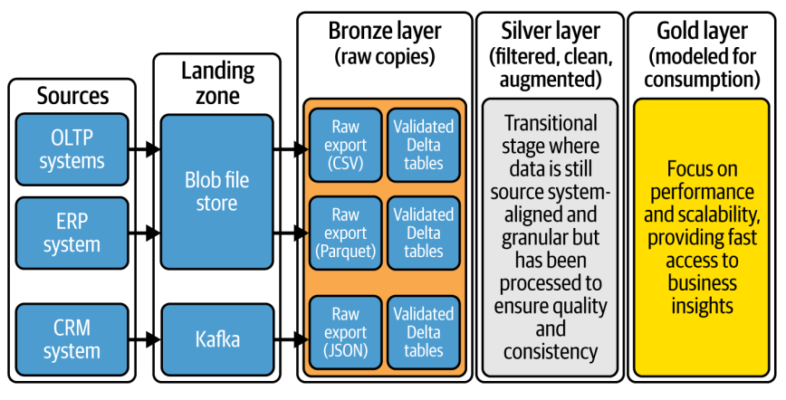
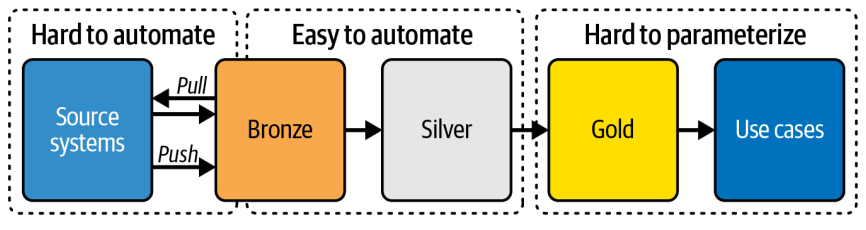
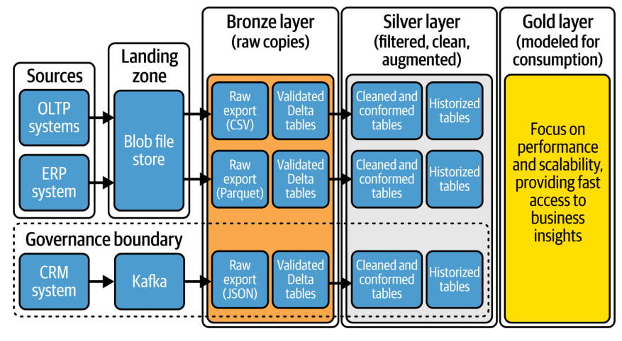

# Capítulo 3. Desmitificando la Arquitectura Medallion

En el Capítulo 1, exploramos la evolución de Spark y Delta Lake y te presentamos la arquitectura Medallion. Este patrón de diseño ayuda a organizar los datos lógicamente dentro de las arquitecturas modernas de *lakehouse*. Utiliza tres capas (Bronce, Plata y Oro) para refinar progresivamente los conjuntos de datos a lo largo de los ciclos de vida de la ingesta de datos, la transformación de datos y la carga de datos en varios destinos.

Explicar la arquitectura Medallion a las organizaciones a menudo se siente como abrir una caja de pandora, ya que cada capa, destinada a abordar diferentes preocupaciones, carece de definiciones claras y directrices descriptivas. Esta ambigüedad conduce a más preguntas que respuestas, creando un ciclo de confusión e ineficiencia.

A pesar de la popularidad de este diseño de tres capas, existe un debate significativo sobre el alcance, el propósito y las mejores prácticas para cada capa. Además, la brecha entre la teoría y la aplicación práctica es sustancial. En este capítulo, compartiré ideas de mis experiencias prácticas sobre el diseño de cada capa de la arquitectura Medallion utilizando un punto de vista teórico.

## El Diseño de Tres Capas

Antes de discutir los detalles de cada capa en la arquitectura Medallion, es crucial entender los propósitos y funciones de alto nivel de las tres capas primarias: Bronce, Plata y Oro. La Figura 3-1 ilustra el flujo de datos desde la capa Bronce a través de la Plata y hacia la capa Oro, destacando procesos clave como la ingesta, el procesamiento y el uso para análisis.

En la Figura 3-1, cada capa juega un rol distinto en la transformación y refinamiento de los datos, facilitando una progresión estructurada desde la recolección de datos crudos hasta datos que pueden ser utilizados para la creación de valor impulsada por datos. A continuación se detallan las características clave de cada capa:

 * **Capa Bronce:** Actúa como la zona para los datos crudos recolectados de diversas fuentes. Los datos en la capa Bronce se almacenan en su estructura original sin ninguna transformación, sirviendo como un registro histórico y una única fuente de verdad. Asegura que los datos se capturen y almacenen de manera fiable, haciéndolos disponibles para su posterior procesamiento. Sus características clave son alto volumen, variedad y veracidad. Los datos son inmutables para mantener la integridad de su estado original.
 * **Capa Plata:** Refina, limpia y estandariza los datos crudos, preparándolos para tareas operativas y analíticas más complejas. En esta capa, los datos se someten a controles de calidad, estandarización, deduplicación y otras mejoras que aumentan su fiabilidad y usabilidad. La capa Plata actúa como una etapa de transición donde los datos todavía son granulares pero han sido procesados para asegurar calidad y consistencia. Sus características clave son que los datos en la capa Plata están más estructurados y son más amigables para las consultas, facilitando el trabajo de analistas y científicos de datos.
 * **Capa Oro:** Entrega datos refinados optimizados para *insights* de negocio específicos y toma de decisiones. La capa Oro implica agregar, resumir y enriquecer datos para soportar informes y análisis de alto nivel. Esta capa se enfoca en el rendimiento, la usabilidad y la escalabilidad, proporcionando acceso rápido a métricas e *insights* clave. Sus características clave son que está altamente curada y optimizada para el consumo, por lo que los datos en la capa Oro apoyan las operaciones y decisiones estratégicas de negocio.

> **Nota:** Aunque el cambio de RDBMS locales a arquitecturas desacopladas y distribuidas ha transformado la tecnología, las metodologías fundamentales de almacenamiento de datos y modelado de datos siguen siendo relevantes. Si no tienes confianza en estas habilidades, recomiendo repasar los conceptos básicos.

Antes de sumergirnos en los detalles de cada capa, es crucial pensar en estas capas como **lógicas**, no físicas. Por lo tanto, al hablar, por ejemplo, de la capa Bronce, no la enmarques como una sola capa física. En su lugar, considérala como una capa lógica que podría extenderse a través de varias capas físicas.

## Capa Bronce

La arquitectura Medallion comienza con la capa Bronce. El objetivo principal de esta capa es almacenar datos de diversas fuentes en su estado original sin ninguna modificación. Asegura que los datos sean fácilmente accesibles para su posterior procesamiento y permite a los usuarios explorarlos y analizarlos al instante. Esencialmente, sirve como un reservorio consultable de datos crudos.

### Jerarquía de Procesamiento

Si la capa Bronce consiste en una sola capa física o múltiples subcapas depende de la complejidad de las fuentes de datos y las necesidades de la organización. Un flujo de proceso típico es: el proceso comienza preparando los datos en una zona de aterrizaje, donde se realizan tareas de procesamiento mínimas como descomprimir archivos, comparar sumas de verificación y generar metadatos. A continuación, se copian los datos a la capa Bronce, convirtiéndolos a un formato como Delta Lake para mejorar el rendimiento. En esta etapa, también se realizan validaciones básicas para asegurar la integridad de los datos.

> **Nota:** Encriptar los datos crudos es esencial para proteger la información personalmente identificable (PII) del acceso no autorizado. Por lo tanto, no es raro encriptar los datos antes de que lleguen a la capa Bronce.

### Procesando Cargas Completas de Datos

Las cargas completas de datos implican transferir todo el conjunto de datos desde el sistema fuente, en lugar de solo los cambios, asegurando que todos los datos estén disponibles para el procesamiento posterior. Al procesar cargas completas, grandes lotes de datos se manejan típicamente a intervalos fijos.

### Procesando Cargas Incrementales de Datos

El patrón de cargar incrementos, o "cargas delta", se emplea a menudo en escenarios donde solo se necesitan procesar cambios o actualizaciones en los datos, permitiendo un manejo de datos más eficiente y un tiempo de procesamiento reducido en comparación con las cargas completas. En este enfoque, típicamente solo se recibe la data que ha cambiado. Esta data se prepara usualmente en una capa preliminar, donde se pueden aplicar algunas transformaciones ligeras. Después de estos pasos iniciales, se pueden utilizar las operaciones de modo `append` o `merge` para integrar estos nuevos datos entrantes con los datos ya existentes en la capa Bronce.

 * **Modo *Append*:** En el contexto de Delta Lake, "modo append" significa que se añaden nuevos datos a una tabla Delta existente sin modificar o eliminar los datos existentes.
 * **Modo *Merge*:** En Delta Lake, el "modo merge" proporciona una forma de realizar *upserts* (una combinación de actualizaciones e inserciones) en una tabla Delta.

### Historización de Datos Dentro de la Capa Bronce

La capa Bronce está diseñada principalmente para almacenar instantáneas completas o copias de datos, similar a lo que se encontraría en un entorno de preparación en arquitecturas de *data warehouse* tradicionales. Esta capa es especialmente útil si tu método implica extraer y sobrescribir completamente los datos, ya que te permite mantener un historial completo de todas las entregas de datos.

> **Nota:** Puedes aplicar el versionado de datos utilizando la función de **viaje en el tiempo (*time travel*)** de Delta Lake. Está diseñada principalmente para la recuperación de datos, auditoría y reproducción de experimentos o informes, en lugar de para un archivado de datos a largo plazo completo.

### Evolución y Gestión de Esquemas

La capa Bronce es crucial para gestionar esquemas de datos muy variados y en constante cambio a medida que los datos entran en el sistema. Al gestionar esquemas, las organizaciones se enfrentan a opciones de diseño, cada una con su propio enfoque para la evolución del esquema:

 * **Schema-on-read:** Este método aplica el esquema dinámicamente mientras se leen los datos. Con esto, los datos se almacenan sin un esquema estricto.
 * **Schema-on-write:** Este enfoque implica definir el esquema —como los nombres de las tablas y columnas, los tipos de datos y las claves primarias— a medida que se escriben los datos en el almacenamiento.

### MergeSchema y Cumplimiento de Esquema

Delta Lake ofrece un conjunto de características para gestionar esquemas de datos, como el manejo de la evolución del esquema y el cumplimiento del esquema. Por ejemplo, a medida que los datos evolucionan, puede haber una necesidad de modificar el esquema de la tabla para acomodar nuevos tipos de datos (por ejemplo, añadiendo nuevas columnas). `mergeSchema` simplifica este proceso.

### Chequeos de Validación Técnica

Los chequeos de validación técnica son cruciales, ya que los problemas con la integridad, precisión, completitud y consistencia de los datos pueden tener impactos operativos y estratégicos significativos en cualquier organización. Dentro de la arquitectura de *lakehouse*, la capa Bronce actúa como el repositorio inicial para datos crudos, típicamente no estructurados.

### Uso y Gobernanza

Para asegurar una gobernanza adecuada, implementa controles de acceso estrictos para prevenir el acceso, manipulación o eliminación no autorizados de datos. Los datos en la capa Bronce son inmutables, lo que significa que permanecen inalterados desde su estado original, aunque existen excepciones al manejar datos excesivamente técnicos.

### La Capa Bronce en la Práctica

La capa Bronce sirve como la base para capturar y almacenar datos crudos en su forma más auténtica. Funciona como la capa de entrada base que ingiere y preserva de manera fiable todos los datos fuente en un estado inalterado, protegiendo contra la pérdida y corrupción de datos.

## Capa Plata

Habiendo validado los datos en nuestra capa Bronce, donde ahora residen en un estado consultable, podemos progresar a la capa Plata. Esta capa se enfoca en limpiar y mejorar los datos. Aquí, los formatos se estandarizan para elementos como fecha y hora, se aplican datos de referencia, se conforman los estándares de nomenclatura, se eliminan duplicados y se realizan una serie de controles de calidad de datos funcionales.

### Actividades de Limpieza de Datos

Frecuentemente, las organizaciones encuentran datos de origen de mala calidad, lo que necesita una limpieza exhaustiva. Muchas tareas de limpieza de datos pueden automatizarse dentro de las fases de carga y procesamiento, aunque algunas se abordan más eficazmente en la fuente operativa.
Las siguientes actividades son ejemplos de aspectos de la limpieza de datos:

 * Reducir el ruido y eliminar datos no auténticos.
 * Manejar valores faltantes.
 * Eliminar duplicados.
 * Recortar espacios.
 * Correcciones de errores.
 * Chequeos de consistencia.
 * Estandarización de formatos.
 * Corrección de tipos.
 * Arreglar rangos.
 * Arreglar unicidad.
 * Arreglar restricciones.
 * Enmascarar datos sensibles.
 * Detección de anomalías.
 * Aplicar gestión de datos maestros.
 * Estandarización de datos.
 * Conformación de datos.

### Diseñando el Modelo de Datos de la Capa Plata

El diseño del modelo de datos de la capa Plata es un aspecto crítico de la arquitectura Medallion. A menudo es un tema candente, ya que hay muchas posibilidades. Está influenciado significativamente por el número de fuentes de datos recolectadas, la medida en que estas fuentes comparten los mismos elementos clave u objetos que pueden ser emparejados, relacionados y combinados a través de diferentes sistemas fuente, y la necesidad de armonizar estos elementos clave superpuestos para una perspectiva integrada.

 * **Conformación y renombrado de columnas:** En una arquitectura Medallion, es común que las capas Plata y Bronce se alineen (uno a uno) en términos de sus tablas, aunque la forma en que se presentan los datos en estas capas puede diferir ligeramente.
 * **Desnormalización:** Para optimizar el rendimiento de las consultas en el modelado de datos, puedes consolidar los datos en menos tablas y, al reducir la necesidad de uniones complejas, las consultas pueden ejecutarse más rápido.
 * **Dimensiones de cambio lento:** Para construir un registro histórico completo de todos los cambios a lo largo del tiempo, es necesario reprocesar los datos en lo que se conoce como dimensiones de cambio lento tipo 2 (SCD2).
 * **Claves subrogadas:** El debate sobre las SCD se relaciona con el de si incluir o no claves subrogadas en la capa Plata.
 * **Armonización con otras fuentes:** A menudo abordo preguntas sobre si las fuentes dentro de la capa Plata ya deberían estar integradas entre sí para que se pueda crear una vista integrada o empresarial.
 * **3NF y Data Vault:** El concepto de la tercera forma normal (3NF), como se mencionó en la "Metodología Inmon", es una técnica de modelado de datos que se utiliza a menudo en la normalización de bases de datos operativas o transaccionales para reducir la redundancia y la dependencia.

### Consultas Operacionales y Machine Learning

Los modelos de aprendizaje automático funcionan mejor cuando los datos de entrenamiento están estrechamente alineados con el contexto o dominio específico del problema de negocio que se está abordando. Por lo tanto, muchas organizaciones utilizan la capa Plata inmediatamente para consultas operativas y cargas de trabajo de aprendizaje automático.

### Gestión de Requisitos Superpuestos

Sigamos discutiendo los enriquecimientos. Hay un debate en curso entre los ingenieros sobre dónde aplicar las reglas de negocio, ¿debería ser en la capa Plata o en la Oro? Esta discusión a menudo gira en torno a temas de reutilización y estandarización. Generalmente, sugiero mantener las transformaciones mínimas en la capa Plata. La capa Oro, que está diseñada para el uso final, es donde deberías colocar las reglas de negocio.

### Tareas de Automatización

La clave de la escalabilidad reside en automatizar la mayoría de tus tareas. Sin embargo, es crucial reconocer que no todos los pasos de procesamiento a través de las diversas capas de la arquitectura Medallion pueden ser fácilmente estandarizados o automatizados en el mismo grado.

### La Capa Plata en la Práctica

En la arquitectura Medallion, el viaje de los datos comenzó en la capa Bronce, donde los datos crudos de diversas fuentes fueron ingeridos y almacenados sin alteración para preservar su estructura e integridad originales. Al pasar a la capa Plata, se limpian, estandarizan y (ligeramente) enriquecen los datos crudos.

## Capa Oro

Al llegar a la capa Oro, te encuentras con la parte más intrincada de tu arquitectura de datos. Esta capa es el pináculo del refinamiento de datos, diseñada específicamente para la toma de decisiones y la presentación de informes. Como tal, los datos en la capa Oro están optimizados para consultas y análisis de alto rendimiento, asegurando que soporten eficazmente las funciones críticas del negocio.

### Esquema de Estrella

Los esquemas de estrella probablemente abordarán la mayoría de tus necesidades. Sobresalen en la realización de análisis complejos sobre datos históricos y en la transformación de datos en entidades como un cubo OLAP (un arreglo de datos multidimensional basado en el procesamiento analítico en línea). Al diseñar esquemas de estrella, recuerda que su rol se extiende más allá de simplemente mejorar el rendimiento. Están moldeados en función de cómo los usuarios interactúan con los datos.

En la metodología de Kimball, hay dos tipos clave de tablas utilizadas para organizar y gestionar datos:

 * **Tabla de hechos (*Fact table*):** Es la tabla central en un esquema de estrella. Una tabla de hechos almacena datos cuantitativos para el análisis y está diseñada para ser compacta, rápida y adaptable.
 * **Tabla de dimensiones (*Dimension table*):** Las tablas de dimensiones se utilizan para describir las dimensiones de los hechos; proporcionan el contexto para los datos.

#### Matices del Diseño del Esquema de Estrella

La gestión del proceso ETL y la construcción de un esquema de estrella constituyen un proceso profundo y complejo; las secciones anteriores apenas han introducido algunos conceptos básicos. A medida que construyas tu propio esquema de estrella, encontrarás una variedad de matices y consideraciones de diseño inherentes a este enfoque de modelado de datos.

#### Capas Curadas, Semánticas y Platino

Aunque la implementación de un esquema de estrella con hechos y dimensiones es una estrategia popular para la capa Oro, pueden volverse cada vez más complejas a medida que los modelos dimensionales se expanden y se incorporan nuevas fuentes de datos. Por ejemplo, algunas organizaciones podrían añadir capas adicionales de conformación o curación, con capas separadas (semánticas) para los *data marts* que utilizan esquemas de estrella. Ocasionalmente, estas capas adicionales se denominan capas Platino, destacando su naturaleza especializada y altamente refinada.

### Diseño de Una Gran Tabla (One-Big-Table - OBT)

Aunque el diseño de esquemas de estrella puede ser muy beneficioso, el proceso también es laborioso. En consecuencia, algunos profesionales prefieren implementar un enfoque de una gran tabla (OBT) debido a su velocidad y simplicidad, que pueden superar las consideraciones de flexibilidad y extensibilidad del modelo.
Este enfoque se favorece por varias razones:

 * Más fácil de gestionar.
 * Mejor rendimiento.
 * Esquema flexible.
 * Preferido por los científicos de datos.
 * Excelente para análisis a largo plazo.

### Capa de Servicio

En el ámbito de la arquitectura tecnológica, especialmente en lo que respecta a la capa Oro, es posible que aún necesites replicar datos en otros tipos de bases de datos, además de los *lakehouses*, utilizando tablas Delta. En este escenario, los datos se transfieren desde la capa curada o de presentación del *lakehouse* a varios otros servicios como Azure Data Explorer, Azure SQL o un servicio de base de datos de grafos, por nombrar algunos.

### La Capa Oro en la Práctica

La capa Oro de la arquitectura Medallion juega un papel crucial en la optimización de los datos para la toma de decisiones y análisis de alto rendimiento. Para lograr esto, es fundamental una estrecha alineación con la gobernanza de datos para mantener el cumplimiento, la integridad y la seguridad.

## Conclusión

El viaje a través de la arquitectura Medallion y su enfoque en capas —Bronce, Plata y Oro— destaca que cada capa de esta arquitectura sirve a un propósito único, diseñado para refinar progresivamente los datos desde su forma cruda en la capa Bronce hasta un formato altamente procesado y listo para la decisión en la capa Oro. La Tabla 3-1 proporciona una visión general de alto nivel de las capas y sus características clave.

\begin{landscape}
\begin{table}[h]
\centering
\footnotesize
\begin{tabularx}{\linewidth}{|>{\centering\arraybackslash}p{1.2cm}|>{\centering\arraybackslash}p{2.8cm}|>{\centering\arraybackslash}p{2.2cm}|>{\centering\arraybackslash}p{2.8cm}|>{\centering\arraybackslash}X|>{\centering\arraybackslash}X|}
\hline
\textbf{Capa} & \textbf{Propósito} & \textbf{Modelo de datos} & \textbf{Transformaciones aplicadas} & \textbf{Formato de archivo y tabla} & \textbf{Tecnología ETL} \\
\hline
\textbf{Landing} & Zona de aterrizaje de datos crudos de sistemas fuente & Crudo, tal cual & Ninguna, tal cual & Formatos de archivo de entrega, ej., CSV, JSON, Parquet & Azure Data Factory, Kafka, Auto Loader, Azure Event Hubs, Databricks LakeFlow Connect \\
\hline
\textbf{Bronce} & Representación de datos crudos validados usando formatos de tabla estandarizados & Esquema del sistema fuente & Mínimas, como aplicar filtros y añadir metadatos & Formato nativo de lakehouse, ej., Delta Lake o Iceberg & SQL, Python con frameworks, como DLT \\
\hline
\textbf{Plata} & Versión limpia, historizada y optimizada para lectura, aunque todavía orientada a la fuente & Varía: refleja la capa Bronce, orientado al sujeto, 3NF o data vault & Historizado usando SCD2, transformaciones ligeras, alineado con datos de referencia, ingeniería de características, etc. & Formato nativo de lakehouse, ej., Delta Lake o Iceberg & SQL, Python con frameworks, como dbt o Great Expectations \\
\hline
\textbf{Oro} & Optimizado para la creación de valor & Modelo de datos Kimball u OBT & Armonizado, agregado y con lógica de negocio compleja aplicada & Formato nativo de lakehouse, ej., Delta & SQL, Python con frameworks, como dbt, modelos semánticos \\
\hline
\end{tabularx}
\caption{Tabla 3-1: Tabla de resumen de las capas Medallion.}
\label{tab:resumen-capas-medallion}
\end{table}
\end{landscape}
