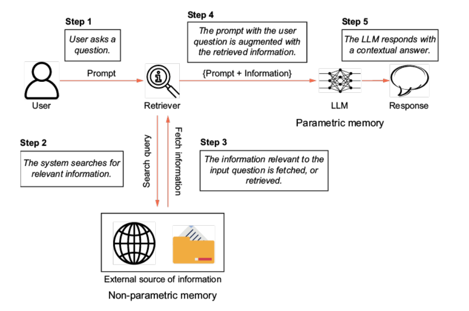
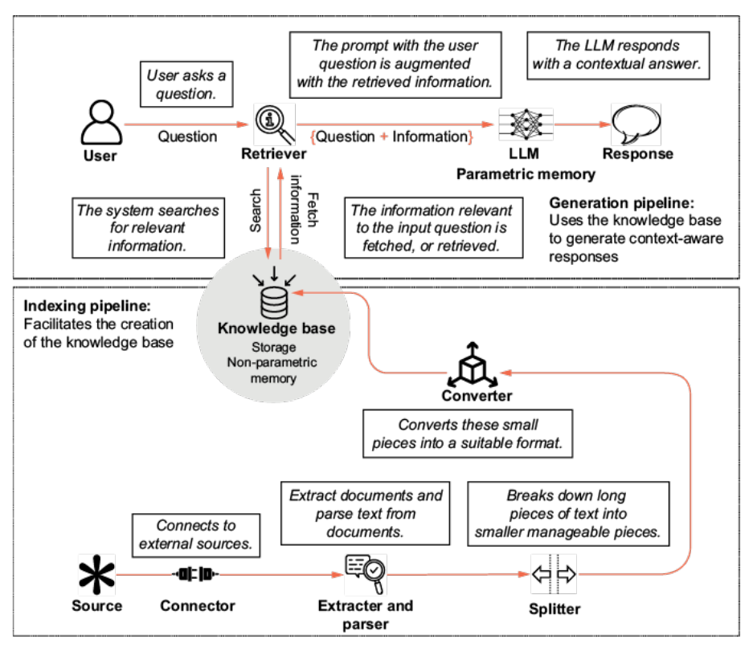
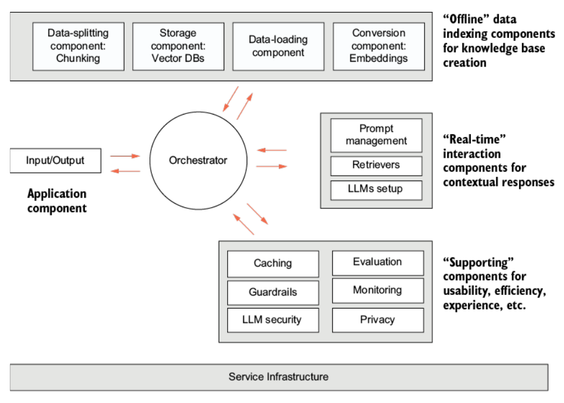
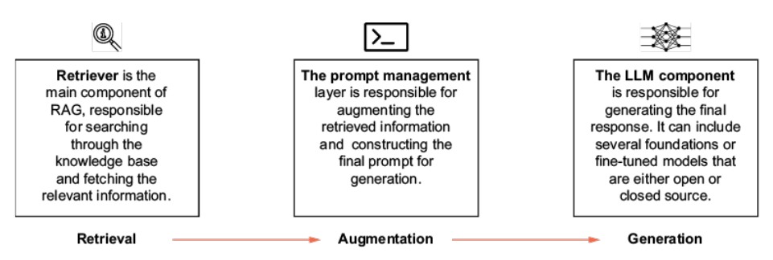

# Capítulo 2: Sistemas RAG y su diseño

Este capítulo profundiza en la arquitectura de los sistemas de Generación Aumentada por Recuperación (RAG). Mientras que el primer capítulo exploró los principios básicos, aquí nos centramos en el ensamblaje de los componentes necesarios para construir un sistema funcional.

El diseño fundamental se divide en dos grandes flujos de trabajo o "pipelines":

1.  **Pipeline de Indexación (Indexing Pipeline):** Encargado de crear y mantener la base de conocimientos (memoria no paramétrica).
2.  **Pipeline de Generación (Generation Pipeline):** Facilita la interacción en tiempo real con el usuario y el modelo de lenguaje (LLM).

Además, se introducen capas críticas como la evaluación, el monitoreo y la pila de operaciones (RAGOps).

## 2.1 ¿Cómo se ve un sistema RAG?

Para visualizar el sistema, retomamos el ejemplo del capítulo anterior: *"¿Quién ganó la Copa Mundial de Cricket 2023?"*.
El proceso que permite a un LLM responder esto correctamente (cuando originalmente no tenía el dato) implica pasos manuales que el sistema debe automatizar: buscar fuentes (ej. Wikipedia), extraer el párrafo relevante, y combinarlo con la pregunta original para enviárselo al LLM.

Este proceso se destila en **cinco pasos fundamentales** que el sistema debe facilitar:

1.  El usuario hace una pregunta.
2.  El sistema busca información relevante para esa pregunta.
3.  La información es obtenida (recuperada) y añadida a la pregunta del usuario.
4.  Esta combinación (pregunta + información) se pasa al LLM.
5.  El LLM responde con una respuesta contextual.

### Requisitos previos al Pipeline de Generación
Antes de poder ejecutar estos cinco pasos en tiempo real, hay decisiones de diseño críticas sobre la fuente externa de información. Debemos responder:

*   **Ubicación:** ¿Es internet abierto, almacenamiento interno de la empresa o bases de datos de terceros?
*   **Naturaleza:** ¿Son PDFs, documentos Word, o respuestas JSON de una API? ¿La información está centralizada o distribuida?

Si la información está dispersa y en formatos variados, buscar en tiempo real (cada vez que se hace una pregunta) sería ineficiente, lento y propenso a inconsistencias. Por ello, un sistema RAG funciona mejor si la información está **centralizada, en un formato único y dividida en piezas pequeñas**.

### La necesidad de un Pipeline de Indexación
Para lograr esa consolidación, necesitamos un proceso previo llamado **Pipeline de Indexación**. Este consta también de cinco pasos para crear la base de conocimientos:

1.  Conectarse a las fuentes externas identificadas.
2.  Extraer documentos y analizar (*parse*) el texto.
3.  Romper los textos largos en piezas más pequeñas y manejables (*chunking*).
4.  Convertir estas piezas a un formato adecuado (embeddings).
5.  Almacenar esta información.

Este pipeline es la base sobre la cual opera el sistema. Sin una base de conocimientos creada por la indexación, el pipeline de generación no tiene dónde buscar.

## 2.2 Diseño de sistemas RAG

Un sistema RAG listo para producción requiere más que solo los componentes básicos de indexación y generación. Se necesita considerar la precisión, observabilidad, escalabilidad y seguridad.

Podemos desglosar los componentes principales en tres grupos:

**1. Componentes del Pipeline de Indexación:**

*   **Componente de carga de datos:** Conecta, extrae y parsea datos externos.
*   **Componente de división de datos (Splitting):** Rompe el texto en fragmentos manejables.
*   **Componente de conversión de datos:** Convierte texto a formato numérico (embeddings).
*   **Componente de almacenamiento:** Guarda los datos en una base de conocimientos (Vector DB).

**2. Componentes del Pipeline de Generación:**

*   **Recuperadores (Retrievers):** Buscan y extraen información del almacenamiento.
*   **Configuración del LLM:** Genera la respuesta.
*   **Gestión de Prompts:** Aumenta la información recuperada con el input original.

**3. Componentes de Soporte y Orquestación:**

Incluyen evaluación, monitoreo, caché, guardrails (barreras de seguridad) y una capa de orquestación central que gestiona la interacción y secuencia de todos los elementos.

## 2.3 Pipeline de Indexación

El pipeline de indexación es, para fines prácticos, un proceso **offline o asíncrono**. No se activa cuando el usuario hace una pregunta, sino que funciona de antemano (y en intervalos definidos) para preparar la base de conocimientos.

Profundicemos en sus componentes clave:

*   **División de datos (Text Splitting):** Dividir documentos grandes en segmentos más pequeños mejora la eficiencia del procesamiento. En el lenguaje de procesamiento de lenguaje natural (NLP), estos segmentos se llaman **"chunks"** (fragmentos). El proceso se denomina *chunking*.
*   **Conversión de datos (Embeddings):** Los datos textuales deben convertirse a un formato numérico para que la computadora pueda realizar búsquedas y recuperaciones eficientes. El formato ideal para esto son los **"embeddings"** (incrustaciones vectoriales).
*   **Almacenamiento de datos (Vector DBs):** Una vez convertidos a embeddings, los datos se guardan en una memoria persistente. Las bases de datos especializadas para esto se llaman **Bases de Datos Vectoriales**, optimizadas para la búsqueda de embeddings.

### ¿Siempre necesitamos un pipeline de indexación?
Generalmente sí, especialmente para documentos empresariales o manuales. Sin embargo, hay excepciones.
Si el sistema RAG conecta directamente con una **API de terceros** para obtener información en tiempo real (por ejemplo, una API del clima que devuelve datos precisos según la ubicación del usuario), **no se requiere indexación**. En este caso, la búsqueda y recuperación se "externalizan" a la API.
Algunos puristas debaten si estos sistemas sin base de conocimientos propia son estrictamente RAG, pero conceptualmente siguen el patrón de aumentar la generación con datos externos.

## 2.4 Pipeline de Generación

Construido sobre los cimientos de la indexación, este pipeline facilita la interacción en tiempo real. Es el encargado de procesar la consulta del usuario, recuperar datos relevantes y generar la respuesta sin que el usuario interactúe con la indexación subyacente.

Sus componentes detallados son:

1.  **El Recuperador (Retriever):** Es posiblemente el componente más crítico. Usa algoritmos de búsqueda para escanear la base de conocimientos y encontrar la información más relevante. La efectividad del sistema depende de su precisión. Además, como la búsqueda es computacionalmente costosa, el retriever influye mucho en la latencia total del sistema.
2.  **Gestión de Prompts:** Una vez recuperada la información, debe combinarse ("aumentarse") con la consulta original. La construcción del prompt marca una gran diferencia en la calidad de la respuesta (Ingeniería de Prompts).
3.  **Configuración del LLM:** Es el modelo responsable de la respuesta final. Puede ser un modelo fundacional (base) open source (Meta, Mistral) o propietario (OpenAI, Anthropic), o incluso modelos ajustados (*fine-tuned*) para tareas específicas.

## 2.5 Evaluación y monitoreo

Tener los pipelines funcionando no garantiza calidad. Necesitamos saber si el sistema es preciso o si alucina. Para esto se implementa un marco de evaluación.

El texto destaca la **"Tríada de métricas RAG"** propuesta por TruEra, que evalúa tres dimensiones críticas:

Las tres comprobaciones de la tríada son:

1.  **Contexto vs. Consulta (Relevancia del contexto):** ¿La información recuperada es relevante para lo que preguntó el usuario? Si el recuperador falla aquí, el LLM no podrá dar una buena respuesta.
2.  **Respuesta vs. Contexto (Fundamentación / Groundedness):** ¿El LLM usó realmente la información recuperada para generar la respuesta? Esto mide si el sistema está alucinando o ignorando los datos provistos.
3.  **Respuesta vs. Consulta (Relevancia de la respuesta):** ¿La respuesta final contesta realmente a la pregunta original del usuario?

Para medir esto, a menudo se requieren conjuntos de datos de referencia llamados **"Ground Truth datasets"**, que sirven como estándar de oro para comparar las respuestas generadas.

## 2.6 La Pila de Operaciones RAG (RAGOps Stack)

Las aplicaciones RAG se apoyan en una infraestructura operativa en evolución conocida como RAGOps. El capítulo clasifica esta infraestructura en varias capas:

| Capa | Descripción |
| :--- | :--- |
| **1. Capa de Datos** | Herramientas y plataformas para procesar y almacenar datos (embeddings). |
| **2. Capa de Modelo** | Proveedores de LLMs (propietarios o código abierto). |
| **3. Capa de Prompt** | Herramientas para el mantenimiento y evaluación de prompts. |
| **4. Capa de Evaluación** | Herramientas que proporcionan métricas para RAG. |
| **5. Orquestación de App** | Marcos que facilitan la invocación de los diferentes componentes del sistema (ej. LangChain). |
| **6. Capa de Despliegue** | Proveedores de nube y plataformas para desplegar apps RAG. |
| **7. Capa de Aplicación** | Servicios de hosting para las apps. |
| **8. Capa de Monitoreo** | Plataformas para el monitoreo continuo de la app en producción. |

## 2.7 Caché, Guardrails, Seguridad y otras capas

Finalmente, existen componentes adicionales para abordar latencia, cumplimiento y seguridad:

*   **Caché (Caching):** A diferencia del caché tradicional, el **caché semántico** almacena respuestas de LLM. Si se hace una pregunta *similar* (no necesariamente idéntica) a una anterior, se recupera la respuesta del caché. Esto reduce latencia, costos de inferencia y carga en el LLM.
*   **Guardrails (Barreras de protección):** Son límites predefinidos para asegurar que la salida cumpla con políticas, regulaciones y guías éticas.
*   **Seguridad:** Protege contra nuevas amenazas específicas de los LLMs, como la inyección de prompts (*prompt injection*), envenenamiento de datos (*data poisoning*) y divulgación de información sensible.
