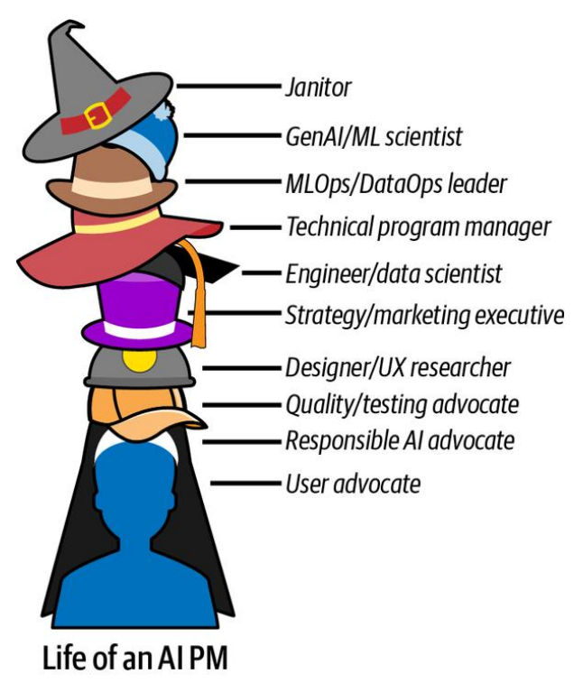

# Capítulo 1. El Rol de los Gerentes de Producto de IA (AI Product Managers)

El capítulo comienza con una anécdota personal de la autora trabajando en su primer equipo de IA: el diseño de asistentes inteligentes para el hogar capaces de reconocer acentos y hablantes específicos. Esto ilustra la complejidad de manejar enormes conjuntos de datos y refinar algoritmos para crear productos orientados al usuario, marcando la entrada al mundo de la gestión de productos de IA.

La IA existe desde la década de 1950 (Alan Turing), pero las limitaciones de hardware ocultaron su potencial hasta hace poco. Hoy, gracias a la potencia computacional, los avances en chips y la abundancia de datos, la IA permite a las máquinas realizar tareas cognitivas no triviales como razonar, sentir, procesar el habla y, lo más importante, **aprender de los datos y adaptarse**.

## Las Etapas de la Evolución de la IA

Es crucial distinguir entre la IA Generativa (GenAI) y la IA tradicional. GenAI es solo un subconjunto. La IA moderna se clasifica en cuatro grupos según su alcance y capacidad:

### 1. IA Tradicional (1950s–Presente)
Son las tecnologías fundamentales diseñadas para tareas específicas mediante reglas o reconocimiento de patrones.

*   **Visión:** Reconocimiento de imágenes, detección de objetos, reconocimiento facial (ej. etiquetado de fotos, imágenes médicas).
*   **Habla (Speech):** Reconocimiento de voz (Siri, Alexa) y síntesis de texto a voz (TTS).
*   **Procesamiento de Lenguaje Natural (NLP):** Traducción, análisis de sentimientos, chatbots (ej. Google Translate).
*   **Robótica:** Robots industriales, vehículos autónomos, drones.
*   **Análisis de datos:** Analítica predictiva, minería de datos, patrones ocultos para la toma de decisiones.

### 2. IA Generativa (GenAI) (Finales de 2010s–Presente)
No reemplaza a la IA tradicional, sino que abre nuevas dimensiones enfocadas en la **creación de contenido**.

*   **Creación de contenido:** Texto, imágenes, video, música a partir de prompts.
*   **Deepfakes:** Medios sintéticos que imitan voces o apariencias reales.
*   **Medios personalizados:** Recomendaciones a medida (Netflix, Spotify).
*   **Diseño y arte:** Herramientas como DALL-E o Adobe Firefly para conceptos y maquetas.
*   **Desarrollo de juegos:** Generación procedimental de mundos y personajes.

### 3. Inteligencia Artificial General (AGI) (¿2030s?)
La próxima frontera. Máquinas capaces de entender, aprender y aplicar conocimientos en una amplia gama de tareas, imitando la cognición humana.

*   **Resolución de problemas:** Abordar problemas multidominio complejos.
*   **I+D:** Acelerar descubrimientos científicos.
*   **Asistentes personales:** Gestión total de la vida diaria y resolución creativa de problemas.
*   **Salud:** Medicina personalizada y diagnósticos complejos.

### 4. Superinteligencia Artificial (ASI) (~2040s?)
Hipotética. Superaría la inteligencia humana.

*   **Resolver desafíos globales:** Cambio climático, hambre mundial.
*   **Previsión fiable:** Predicciones futuras precisas (clima, mercados).
*   **Exploración espacial avanzada:** Misiones interestelares y gestión de recursos.

## Cómo los productos aprovechan la IA

Los AI PMs (Product Managers de IA) tienen el potencial de transformar industrias infundiendo IA estratégicamente.

*   **Google Photos:** Usa reconocimiento facial, detección de objetos y escenas para permitir búsquedas sin etiquetas manuales (ej. buscar "perro" o "boda").
*   **Tesla FSD (Conducción Autónoma):** Usa aprendizaje por refuerzo (ensayo y error) y visión por computadora para navegar y estacionar.
*   **Google Lens:** Usa visión por computadora y NLP para entender el mundo (traducción en vivo, compras, identificación de objetos).

## Características Únicas de la IA

La IA tiene características distintivas que la separan del software tradicional y que un AI PM debe gestionar:

| Característica | Descripción e Impacto para el PM |
| :--- | :--- |
| **Naturaleza Probabilística** | La IA opera con probabilidades, no certezas (ej. 80% seguro de que es un perro). El PM debe gestionar la incertidumbre y diseñar interfaces que reflejen esto (puntuaciones de confianza). |
| **Dependencia de los Datos** | "Basura entra, basura sale". El éxito depende de la calidad/cantidad de datos. Requiere estrategias de limpieza, validación y privacidad de datos. |
| **Deriva del Modelo (Model Drift)** | Los modelos no son estáticos; aprenden y cambian. Requieren mantenimiento a largo plazo, reentrenamiento continuo y monitoreo para evitar nuevos sesgos. |
| **Necesidad de Interpretabilidad** | Los modelos complejos (cajas negras) son difíciles de explicar. El PM debe equilibrar precisión vs. explicabilidad (crucial en salud/finanzas) usando técnicas como SHAP o LIME. |
| **Toma de Decisiones Automatizada** | La IA puede decidir autónomamente. El PM debe definir cuándo se necesita supervisión humana ("human-in-the-loop") y establecer protocolos de seguridad. |
| **Escalabilidad** | Puede tomar miles de decisiones por segundo. Requiere planificar la infraestructura (nube vs. on-premise) y optimización de costos desde el día uno. |

### Cómo estas características impactan la Experiencia de Usuario (UX)
*   **Gestionar expectativas:** Ser transparente sobre la naturaleza probabilística para generar confianza.
*   **Construir para la adaptabilidad:** El producto evoluciona con las preferencias del usuario.
*   **Priorizar la transparencia:** Comunicar cómo se toman las decisiones.
*   **Optimizar la eficiencia:** La automatización reduce la fricción.

## Superpoderes de la IA y GenAI

La autora lista siete "superpoderes" que la IA ofrece a los productos actuales:

1.  **Aprendizaje a partir de datos y contenido masivo:** Procesar vastos datasets para derivar insights (Spotify, Google Maps).
2.  **Personalización a escala:** Adaptarse dinámicamente a las preferencias de millones de usuarios individuales (Pinterest).
3.  **Automatización y optimización de flujos de trabajo:** No solo automatizar tareas, sino optimizarlas en tiempo real (Asistentes de agenda inteligente).
4.  **Generación de nuevo contenido y experiencias:** Crear texto, imágenes y video, revolucionando industrias creativas (ChatGPT, Adobe).
5.  **Predicción y pronóstico:** Usar datos históricos para predecir tendencias futuras o comportamientos de mercado.
6.  **Adaptación en tiempo real:** Interfaces de voz y chatbots que procesan inputs al instante y se adaptan al flujo de la conversación.
7.  **Desbloquear nuevos tipos de UX con nuevos factores de forma:** Gafas inteligentes, VR y wearables que mezclan lo físico y digital.

## El Rol del AI PM

La gestión de productos de IA trata de convertir la investigación de IA en funciones y productos del mundo real.

*   **PM Generalista:** Identifica necesidades de usuarios y las alinea con objetivos de negocio. Intersección de Negocios, UX e Ingeniería.
*   **AI PM:** Una versión "supercargada". Se sienta en la misma intersección pero incorpora **Investigación e Ingeniería de IA/ML**.

### Conjunto de Habilidades del AI PM

Si el rol fuera una receta, tendría cuatro ingredientes principales:

1.  **Oficio y prácticas centrales de gestión de productos:** Entender usuarios, visión, priorización (el "por qué" y el "qué").
2.  **Fundamentos de ingeniería para PMs:** Entender aspectos técnicos para comunicarse con el equipo y establecer expectativas realistas (no necesariamente codificar).
3.  **Habilidades esenciales de liderazgo y colaboración:** Comunicación, empatía, creatividad.
4.  **Ciclo de vida de IA y conciencia operativa:** Entender algoritmos ML, entrenamiento, qué es posible y qué no, trade-offs y métricas de calidad.

### Estructuras Organizacionales
La ubicación del AI PM varía.

*   **Sin experiencia interna:** Puede reportar a una agencia externa.
*   **Startups:** Reporta a CEO o CTO.
*   **Empresas maduras:** Reporta a un líder de negocio (VP de Producto).

## ¿Por qué convertirse en un AI PM?

Generalmente, los AI PMs provienen de tres grupos:

1.  **Desde campos relacionados:** PMs senior o técnicos que quieren aprovechar la IA en sus productos.
2.  **Entusiastas de la IA:** Recientes graduados o profesionales de otros campos que quieren entrar en el mundo de productos impulsados por IA.
3.  **Reclutadores/Managers:** Personas que buscan contratar y gestionar equipos de IA.

Lo grandioso del rol es la visión de "arquitecto", la adrenalina del lanzamiento, el aprendizaje continuo (nuevas curvas de aprendizaje constantes) y la accesibilidad (no requiere educación formal específica).

## Subtipos de Roles de Gestión de Productos de IA

Se distingue entre gestión de productos **"0-a-1"** (construir desde cero) y **"1-a-n"** (mejorar existentes).

Existen tres categorías principales de AI PMs:

| Categoría | Enfoque Principal | Ejemplos de Roles |
| :--- | :--- | :--- |
| **1. AI Builder PMs** (Constructores) | Desarrollan tecnologías fundacionales, modelos e infraestructura. Trabajan cerca de investigadores. | • PM de Infraestructura/Plataforma • PM de IA Generativa (modelos base) • PM de Visión por Computadora • PM de Seguridad de IA |
| **2. AI Experiences PMs** (Experiencias) | Construyen características impulsadas por IA que mejoran la interacción del usuario. Se enfocan en el viaje del usuario ("delightful user journey"). | • PM de Ranking (búsqueda, feeds) • PM de Recomendaciones • PM de IA Responsable • PM de IA Conversacional • PM de Personalización |
| **3. AI-Enhanced PMs** (Mejorados por IA) | Usan herramientas de IA dentro de sus propios flujos de trabajo para ser más eficientes (no necesariamente crean productos de IA). | Cualquier PM que usa herramientas para automatizar análisis, investigación, etc. |

**Ejemplos de títulos reales:**

*   Meta: Product Manager, AI Solutions.
*   Roblox: Principal Product Manager, Foundation AI.
*   Adobe: Principal Product Manager, Generative AI Models.

## Conclusión

El capítulo cierra indicando que en los siguientes apartados del libro se recorrerá la construcción de un producto de IA desde la concepción hasta la finalización. El trabajo de un AI PM es más que tecnología; se trata de **puentear esa tecnología para resolver problemas del mundo real para personas reales**.
