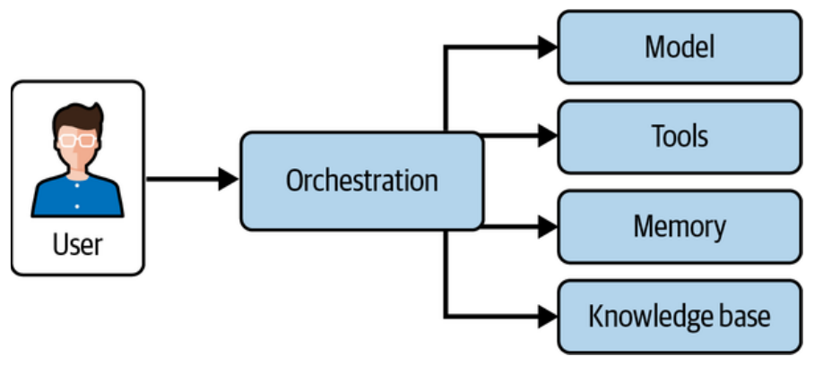

# Capítulo 2. Diseñando Sistemas de Agentes

La mayoría de los profesionales no comienzan el desarrollo de un agente con un gran documento de diseño arquitectónico. Por el contrario, suelen empezar con un problema desordenado, una clave de API de un modelo fundacional y una idea aproximada de la solución. Este capítulo actúa como una guía de inicio rápido para pasar de esa idea a la ejecución, utilizando como hilo conductor un ejemplo práctico: la gestión de soporte al cliente para una plataforma de comercio electrónico.

## Nuestro Primer Sistema de Agente

Para entender el diseño, primero debemos definir el problema. Imaginemos un equipo de soporte que recibe cientos de correos diarios solicitando reembolsos, cancelaciones o cambios de dirección. Un humano tarda unos dos minutos en leer el texto, buscar el pedido en el backend, llamar a la API correcta y redactar una confirmación.

El error común es intentar automatizarlo todo a la vez. La clave del éxito radica en **recortar la porción correcta del problema**. Si el alcance es demasiado estrecho (solo cancelaciones), el impacto es mínimo. Si es demasiado amplio ("mejorar la satisfacción del cliente"), el proyecto se ahoga en casos extremos. El equilibrio ideal es un flujo de trabajo de dos pasos: tomar el mensaje y el pedido, decidir qué herramienta invocar (`issue_refund`, `cancel_order`, etc.) y confirmar.

En términos de código (usando herramientas como LangChain y LangGraph), esto implica:

1.  Definir una herramienta de negocio (ej. una función `cancel_order`).
2.  Crear el "cerebro" del agente que invoca al LLM, ejecuta la herramienta y vuelve a invocar al LLM para generar la respuesta final.
3.  Conectar todo en un grafo de estado (`StateGraph`).

Este enfoque garantiza entradas concretas y salidas estructuradas, permitiendo un bucle de retroalimentación ajustado.

### Evaluación Inicial
Una vez que el agente funciona, surge la pregunta: ¿realmente funciona bien? Un agente no probado es un agente en el que no se puede confiar. En producción, necesitamos saber si llamó a la herramienta correcta, si pasó los parámetros adecuados y si la respuesta al cliente fue clara.
Incluso para un prototipo simple, es vital implementar scripts de evaluación mínimos (asserts) que verifiquen que la herramienta se ejecutó y que el mensaje final contiene la confirmación. Esto establece métricas medibles desde el primer día.

## Componentes Centrales de los Sistemas de Agentes

Diseñar un sistema efectivo requiere entender que un agente es más que solo un modelo de lenguaje. Es un ecosistema compuesto por cuatro pilares fundamentales que deben trabajar al unísono: **Modelo, Herramientas, Memoria y Orquestación**.

### 1. Selección del Modelo
El modelo es el corazón del sistema; determina cómo el agente razona, decide y aprende. No existe una elección única para todos los casos; depende de la complejidad de la tarea, la modalidad, la privacidad y el costo.

*   **Complejidad de la tarea:** Los modelos fundacionales grandes (como GPT-5 o Claude Opus) son ideales para entornos abiertos y ambiguos que requieren razonamiento flexible. Sin embargo, son costosos y lentos. Para tareas bien definidas y repetitivas, los modelos más pequeños (como ModernBERT o Phi-4) son más eficientes y económicos.
*   **Modalidad:** Si el agente debe procesar imágenes o audio, se requieren modelos multimodales. Si es solo texto, un modelo multimodal añade latencia innecesaria.
*   **Abierto vs. Propietario:** Los modelos de código abierto (Llama, DeepSeek) ofrecen privacidad y control total (se pueden alojar localmente), pero requieren gestión de infraestructura. Los modelos propietarios (OpenAI, Anthropic) son fáciles de desplegar y potentes, pero implican costos por uso y menor personalización profunda.
*   **Pre-entrenado vs. Personalizado:** Para dominios generales, un modelo pre-entrenado basta. Para dominios altamente especializados (medicina, legal), entrenar o ajustar finamente (fine-tuning) un modelo con datos curados otorga mayor precisión.

A continuación, se presenta una tabla con modelos de "peso abierto" (Open Weight) que ilustra la relación entre tamaño y hardware requerido:

| Modelo | Mantenedor | MMLU (Score) | Parámetros (billones) | VRAM (modelo precisión completa en GB) | Hardware de ejemplo requerido |
| :--- | :--- | :--- | :--- | :--- | :--- |
| **Llama 3.1 Instruct Turbo** | Meta | 56.1 | 8 | 20 | RTX 3090 |
| **Gemma 2** | Google | 72.1 | 9 | 22.5 | RTX 3090 |
| **NeMo** | Mistral | 65.3 | 12 | 24 | RTX 3090 |
| **Phi-3** | Microsoft | 77.5 | 14.7 | 29.4 | A100 |
| **Qwen1.5** | Alibaba | 74.4 | 32 | 60.11 | A100 |
| **Llama 3** | Meta | 79.3 | 70 | 160 | 4xA100 |

*Tabla 2-1: Selected open weight models by performance and size.*

El costo es otro factor determinante. Los modelos más grandes suelen ser más caros, pero el rendimiento no siempre escala linealmente con el precio. La siguiente tabla compara costos relativos:

| Modelo | Mantenedor | MMLU | Precio relativo por millón tokens entrada | Precio relativo por millón tokens salida |
| :--- | :--- | :--- | :--- | :--- |
| **DeepSeek-v3** | DeepSeek | 87.2 | 2.75 | 3.65 |
| **Claude 4 Opus** | Anthropic | 86.5 | 75 | 125 |
| **Gemini 2.5 Pro** | Google | 86.2 | 12.5 | 25 |
| **Llama 3.1 405B** | Meta | 84.5 | 1 | 1 |
| **o4-mini** | OpenAI | 83.2 | 5.5 | 7.33 |
| **Grok 3** | xAI | 79.9 | 15 | 25 |
| **Nova Pro** | Amazon | 82.0 | 4 | 5.33 |
| **Mistral Large 2** | Mistral | 80.0 | 10 | 10 |

*Tabla 2-2: Selected large models by performance and cost.*

### 2. Herramientas (Tools)
Las herramientas son las capacidades funcionales que permiten al agente actuar (interactuar con el mundo). Se dividen en tres categorías:

1.  **Herramientas Locales:** Acciones basadas en lógica interna sin dependencias externas (cálculos matemáticos, reglas de decisión simples).
2.  **Herramientas basadas en API:** Permiten interactuar con servicios externos (obtener el clima, consultar stock, publicar en redes sociales).
3.  **Protocolo de Contexto del Modelo (MCP):** Una forma estandarizada de inyectar contexto (historial de usuario, estado del mundo) directamente en el prompt del modelo sin necesidad de llamadas de ida y vuelta constantes. Esto reduce la redundancia y mejora la conciencia situacional del agente.

Un principio clave es la **modularidad**: cada herramienta debe ser un módulo autocontenido fácil de actualizar o reemplazar sin romper todo el sistema.

### 3. Memoria
La memoria permite a los agentes mantener el contexto y aprender.

*   **Memoria a Corto Plazo:** Generalmente implementada mediante ventanas de contexto deslizantes (rolling context windows). Mantiene la coherencia durante una sesión de conversación actual.
*   **Memoria a Largo Plazo:** Almacena conocimientos y experiencias extendidas (preferencias de usuario, historial médico). Se implementa mediante bases de datos, grafos de conocimiento o modelos ajustados.
*   **Gestión:** Es crucial diferenciar qué datos guardar y cuáles olvidar para evitar saturar al agente con "ruido" obsoleto.

### 4. Orquestación
La orquestación es la lógica que une todo. Evalúa secuencias de habilidades, pronostica resultados y elige el camino más probable para el éxito. Dado que el mundo real cambia (nueva información llega), el orquestador debe monitorear continuamente y ajustar el plan dinámicamente. Sin una buena orquestación, incluso las mejores herramientas fallarán al trabajar juntas.

## Trade-offs (Compromisos) de Diseño

Diseñar agentes implica equilibrar factores contrapuestos:

1.  **Rendimiento: Velocidad vs. Precisión:**
    En sistemas de trading o vehículos autónomos, la velocidad es crítica y se puede sacrificar algo de precisión. En diagnósticos médicos o legales, la precisión es innegociable. A veces se usan enfoques híbridos: una respuesta rápida y aproximada seguida de una refinada más tarde.

2.  **Escalabilidad:**
    El principal cuello de botella suelen ser las GPUs.
    *   *Asignación dinámica:* Usar GPUs solo cuando es necesario.
    *   *Escalado horizontal:* Añadir más nodos.
    *   *Nube híbrida:* Usar infraestructura local y "desbordar" (burst) a la nube en picos de demanda.
    *   *Ejecución asíncrona:* Procesar tareas en paralelo para no bloquear recursos.

3.  **Fiabilidad:**
    Implica tolerancia a fallos (recuperarse de errores de red) y consistencia (funcionar bien bajo estrés y casos extremos).

4.  **Costos:**
    *   *Costos de Desarrollo:* Talento especializado, limpieza de datos, entrenamiento.
    *   *Costos Operativos:* Inferencia (tokens), almacenamiento de memoria.
    El costo debe justificarse con el valor entregado. Para tareas simples, un modelo "lean" o incluso un sistema basado en reglas puede ser más rentable que un modelo masivo.

## Patrones de Diseño de Arquitectura

La estructura del sistema define su escalabilidad y complejidad.

*   **Arquitecturas de Agente Único:**
    Es el diseño más simple. Un solo agente maneja planificación, ejecución y herramientas. Ideal para tareas estrechas y bien definidas (chatbots simples, generación de código). Es fácil de mantener y no tiene problemas de coordinación.

*   **Arquitecturas Multi-Agente:**
    Múltiples agentes colaboran para un objetivo común.
    *   *Ventajas:* Especialización (un agente investiga, otro escribe), paralelismo (hacer varias cosas a la vez) y resiliencia (si uno falla, otro puede cubrirlo).
    *   *Desafíos:* Requieren coordinación compleja para evitar conflictos o duplicación de esfuerzos. A menudo son menos eficientes en costos porque los agentes "hablan" entre sí, consumiendo más tokens y aumentando la latencia.

## Mejores Prácticas

Para asegurar que el sistema sea adaptable y robusto, se recomiendan tres prácticas:

1.  **Diseño Iterativo:**
    No busques la perfección inicial. Construye un prototipo rápido (MVP), pruébalo, recibe feedback y refina. Esto permite detectar fallos de diseño temprano y alinear el agente con las necesidades reales del usuario.

2.  **Estrategia de Evaluación:**
    Se debe probar la **Corrección** (¿da la respuesta correcta?), los **Límites** (¿qué pasa con inputs extraños?) y métricas específicas de la tarea. Es vital usar tanto señales explícitas (feedback del usuario, "pulgar arriba") como implícitas (análisis de logs). En dominios críticos, la validación humana (human-in-the-loop) es necesaria para calibrar la evaluación automática.

3.  **Pruebas en el Mundo Real:**
    Los entornos controlados no predicen el caos de la realidad. Las pruebas reales exponen casos extremos y problemas de carga. Se recomienda un despliegue por fases: empezar con un grupo pequeño, monitorear KPIs (tiempo de respuesta, satisfacción) e iterar antes del lanzamiento total.

## Conclusión

El capítulo cierra enfatizando que el éxito no depende de un plan de 30 páginas, sino de la previsión y la capacidad de adaptación. Al elegir un problema tratable (como "cancelar pedidos") y aplicar una arquitectura sólida con bucles de retroalimentación estrictos, se pueden construir sistemas fiables. El siguiente paso (Capítulo 3) será enfocarse en el lado humano de la ecuación: la experiencia de usuario (UX).

# Ampliación Técnica del Capítulo 2

> *Añadí esto porque hay cosas del aspecto técnico que se dejaron de lado al hacer el resumen del capítulo, el cual está enfocado principalmente a comprender los temas desde un enfoque más conceptual. Dicho enfoque es al que se hace hincapié en los exámenes, además.*

## 1. El Caso de Estudio: "Cancel Order" (Detalle del Flujo)
*(Páginas 1-4 del PDF)*

El libro dedica varias páginas a diseccionar el ejemplo del agente de cancelación de pedidos. Aquí está el detalle lógico que no debes perder de vista sobre **por qué** se diseñó así:

*   **El problema del alcance (Scoping):** El autor enfatiza que elegir "Cancelar Pedido" no es aleatorio.
    *   Si eliges algo muy estrecho (solo "borrar de la base de datos"), es un script, no un agente.
    *   Si eliges algo muy amplio ("mejorar satisfacción"), el agente fallará por ambigüedad.
    *   **El punto justo:** Un flujo de dos pasos.
        1.  **Input:** Mensaje del cliente + Registro de la orden.
        2.  **Decisión (Primer paso del LLM):** El agente decide si llamar a la herramienta `cancel_order` basándose en el ID de la orden.
        3.  **Acción:** Ejecuta la función (API).
        4.  **Respuesta (Segundo paso del LLM):** Toma el resultado de la herramienta y redacta la confirmación.

*   **Validación inicial (Minimal Evaluation):**

    El código de evaluación en la página 4 introduce un concepto clave: **Asserts semánticos**.

    No solo verificamos que el código corra (HTTP 200), verificamos:

    1.  `"cancel_order" in tool_calls`: ¿El "cerebro" decidió llamar a la herramienta correcta?
    2.  `"cancelled" in final_response`: ¿El mensaje final confirma la acción al usuario?

## 2. Profundización en Escalabilidad y GPUs
*(Páginas 12-13 del PDF)*

Esta sección es técnicamente densa en el libro. Aquí está el desglose detallado de las estrategias de ingeniería para escalar agentes que usan modelos profundos:

El cuello de botella principal es la **GPU (Unidad de Procesamiento Gráfico)**. Como son caras y limitadas, el libro propone estrategias específicas de gestión:

1.  **Asignación Dinámica de GPU (Dynamic Allocation):**
    *   En lugar de reservar una GPU para un agente permanentemente (lo cual es costoso si el agente está inactivo esperando un input), se asignan recursos en tiempo real según la demanda.
    *   *Beneficio:* Reduce el tiempo de inactividad (idle time) y optimiza la utilización.

2.  **Aprovisionamiento Elástico (Elastic Provisioning):**
    *   Uso de clusters (en la nube o locales) que escalan automáticamente. Si la carga sube, se activan más instancias.

3.  **Colas de Prioridad (Priority Queuing):**
    *   No todas las tareas son iguales. Un agente de trading en tiempo real necesita acceso inmediato a la GPU. Un agente que analiza logs por la noche puede esperar.
    *   *Estrategia:* Dar acceso inmediato a tareas críticas y encolar las menos urgentes para los "valles" de demanda.

4.  **Ejecución Asíncrona:**
    *   Permitir que las tareas de GPU se procesen en paralelo sin bloquear el hilo principal. Mientras la GPU procesa una inferencia, el sistema puede estar preparando los datos del siguiente usuario.

5.  **Escalado de Ráfaga (Burst Scaling / Hybrid Cloud):**
    *   Mantener una infraestructura local (On-Premise) para la carga base (es más barato a largo plazo).
    *   Usar la nube pública solo para los picos de demanda (Burst), liberando esos recursos cuando baja el tráfico.

## 3. Profundización en la Estrategia de Evaluación
*(Páginas 18-20 del PDF)*

El libro distingue claramente entre evaluar en desarrollo y en el mundo real.

### A. Pruebas Funcionales (Development)
Se deben cubrir tres áreas:

1.  **Corrección (Correctness):** ¿El output es fácticamente cierto según el diseño?
2.  **Pruebas de Límites (Boundary Testing):**
    *   ¿Qué pasa si el dataset es enorme?
    *   ¿Qué pasa si la instrucción es ambigua?
    *   ¿Qué pasa si el input es malicioso (adversarial)?
3.  **Métricas Específicas de la Tarea:** Si es un agente legal, la precisión en la cita de leyes es la métrica clave.

### B. Métricas Centradas en el Usuario (User Experience)
No basta con que el código no falle. Se deben medir:

*   **NPS / CSAT:** Puntuaciones de satisfacción directa.
*   **Tasa de Finalización de Tareas (Task Completion Rate):** ¿Cuántas veces el usuario logró su objetivo sin pedir hablar con un humano?
*   **Señales Explícitas:** Botones de "pulgar arriba/abajo", estrellas, o si el usuario acepta/rechaza la respuesta generada.
*   **Señales Implícitas:** Análisis de logs. ¿El usuario repitió la pregunta tres veces? (Indica fallo de comprensión). ¿El sentimiento del texto del usuario se volvió negativo?

### C. Human-in-the-loop (Validación Humana)
Para dominios de alto riesgo (medicina, finanzas), la evaluación automática no sirve sola.

*   **Estrategia:** Los expertos humanos revisan una *muestra* de las salidas del agente.
*   **Calibración:** Esas revisiones humanas se usan para "calibrar" y mejorar los scripts de evaluación automática.
