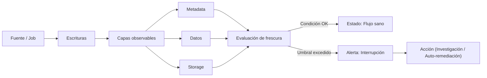
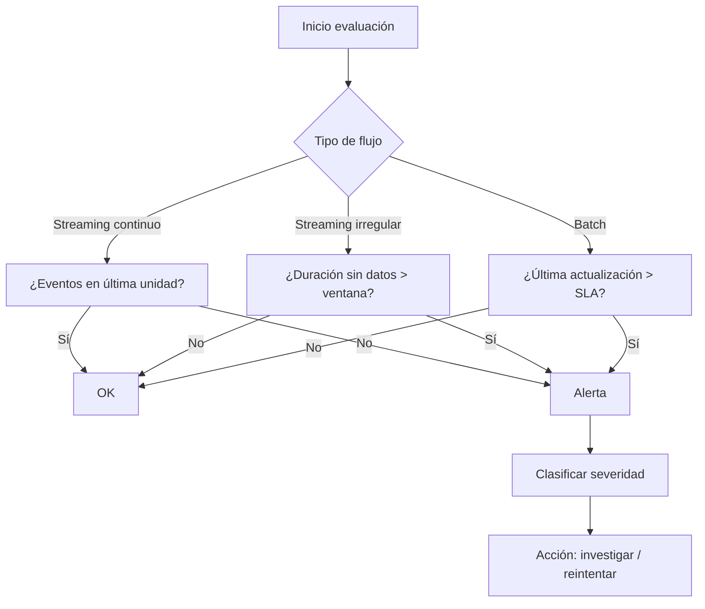

# Patrón: Flow Interruption Detector (Detector de Interrupción de Flujo)

> [!info] Objetivo
> Detectar a tiempo la falta de llegada de datos (data unavailability) antes de que los consumidores se quejen. Aumenta la confianza y la observabilidad del pipeline.

> [!summary] Idea central
> Si un flujo (streaming o batch) deja de generar nuevos datos pero el job no falla, se produce una interrupción silenciosa. Este patrón establece mecanismos para alertar cuando el flujo esperado se detiene según umbrales definidos.

---

## 1. Problema

Un job de streaming sincroniza datos hacia un objeto de almacenamiento. Muchos procesos batch dependen de ese dataset. El job sigue “corriendo” pero deja de escribir nuevos datos. Nadie lo nota hasta que un consumidor reclama.

> [!warning] Riesgo
> Sin detector: el sistema aparenta salud (sin errores) pero los downstream pierden frescura, generando retrasos, métricas vacías y pérdida de confianza.

---

## 2. Solución (Patrón)

Implementar mecanismos que verifiquen actividad y “frescura” del flujo y generen alertas si faltan datos dentro de un intervalo aceptable.

### Modos principales de llegada de datos (Streaming)

| Modo | Supuesto | Qué evaluar | Disparo de alerta |
|------|----------|-------------|-------------------|
| Entrega continua | Siempre al menos 1 evento por unidad de tiempo (seg/min) | Ausencia de eventos en la unidad | 1 minuto sin eventos (ejemplo) |
| Entrega irregular | Puede haber pausas benignas | Ventanas de tiempo (N unidades consecutivas) | Ausencia > ventana aceptada |

> [!tip] Selección de modo
> Si el flujo es naturalmente errático, usar entrega continua genera falsos positivos y fatiga de alertas.

![[Pasted image 20251125094232.png]]

Figura 10-1. Comparación entre monitoreo continuo y irregular.

---

## 3. Extensión a Batch y Data-at-Rest

La interrupción también se detecta chequeando la “frescura” en distintas capas:

| Capa | Qué se observa | Estrategia | Ejemplo |
|------|----------------|-----------|---------|
| Metadata | Timestamps de creación/modificación | Alerta si last_modified > umbral | Tabla que debería cambiar cada hora |
| Datos (contenido) | Columna de timestamp, conteo de filas | Comparar actualización o variación | Mismo count dos horas seguidas |
| Storage (archivos) | Hora del último archivo escrito | Monitorear aparición de nuevos archivos | No se escribe un .parquet en 3 horas |

> [!warning] Precaución
> Operaciones internas (compaction, schema changes) pueden actualizar metadata o archivos sin añadir datos nuevos → falsos positivos o negativos.

---

## 4. Flujo conceptual del detector

---

## 5. Umbrales (Thresholds)

> [!info] Definición
> El umbral es el límite de tiempo/volumen que determina cuándo considerar que el flujo se interrumpió.

| Desafío | Detalle | Riesgo |
|---------|---------|-------|
| Elegir valor | Minuto, 5 min, hora, X% variación | Demasiado estricto → ruido |
| Basado en histórico | Promedio pasado vs. actual | Estacionalidad rompe el modelo |
| Eventos atípicos | Picos por campañas | Falsos positivos/negativos |

> [!tip] Recomendación
> - Usar percentiles (p5–p95) de variación histórica.  
> - Ajustar por día/hora (patrones cronológicos).  
> - Revisar umbrales cada ciclo (ej. mensual).

---

## 6. Falsos Positivos Comunes

| Situación | Causa | Mitigación |
|-----------|-------|------------|
| Compaction | Reescritura de archivos sin nuevos datos | Filtrar operaciones técnicas |
| Schema evolution | Cambios de estructura actualizan metadata | Diferenciar escritura de datos vs. metadatos |
| Ventanas irregulares | Flujo naturalmente intermitente | Usar ventanas agregadas |
| Picos de marketing | Volumen extremo temporal | Modelos de baseline robustos |

> [!warning] Alerta de fatiga
> Demasiadas alertas irrelevantes llevan a ignorar las críticas.

---

## 7. Estrategias de Implementación por Capa

| Capa | Técnica | Ventajas | Limitaciones |
|------|---------|----------|--------------|
| Metadata | Leer last_modified | Barato y rápido | Puede incluir cambios no de datos |
| Datos | Columna de update o conteo incremental | Preciso sobre contenido | Costoso para tablas grandes |
| Storage | Timestamp de archivo | Universal (cualquier formato) | Engaños por housekeeping |

---

## 8. Checklists de Implementación

### Streaming continuo
- [ ] Determinar unidad de tiempo (seg/min)
- [ ] Obtener dimensión de volumen esperado
- [ ] Definir umbral (ej. 0 eventos en 1 min)
- [ ] Configurar alerta (Slack, PagerDuty, etc.)
- [ ] Registrar historiales para ajuste futuro

### Streaming irregular
- [ ] Calcular ventanas sin datos históricas aceptables
- [ ] Establecer “no-data-window” (ej. hasta 5 min)
- [ ] Alerta si > ventana tolerada
- [ ] Validar contra períodos de baja natural

### Batch / Data-at-rest
- [ ] Identificar frecuencia esperada (horaria, diaria)
- [ ] Preferir capa metadata (si existe)
- [ ] Fallback: conteo filas o timestamp columna
- [ ] Filtrar operaciones técnicas (compaction, vacuum)
- [ ] Registrar última ejecución + estatus

---

## 9. Métricas útiles

| Métrica | Qué mide | Uso |
|--------|----------|-----|
| Data Freshness | Tiempo desde último dato | SLA/SLO |
| Arrival Rate | Eventos / unidad tiempo | Anomalías |
| Idle Window | Duración sin datos | Interrupciones |
| False Alert Rate | % alertas no útiles | Calidad monitoreo |
| Recovery Time | Tiempo desde alerta a resolución | Eficiencia operativa |

---

## 10. Ejemplos de reglas (conceptual)

| Regla | Descripción |
|-------|-------------|
| “Si no hay nuevos archivos .parquet en la carpeta X en 30 min → alerta crítica.” |
| “Si el conteo de registros se mantiene igual 2 corridas consecutivas en job horario → alerta.” |
| “Si llegada de eventos < p5 histórico durante 10 min → alerta de degradación (no crítica).” |
| “Si last_modified > SLA (1h) → alerta de frescura.” |

---

## 11. Anti-patrones

> [!warning] Evitar
> - Umbrales fijos sin revisión.
> - Mezclar cambios técnicos con cambios de datos.
> - Alertar cada minuto sin consolidación (spam).
> - Falta de clasificación de severidad (todo crítico).
> - No registrar causa raíz y resolución (no se aprende).

---

## 12. Buenas prácticas

> [!tip] Recomendaciones
> - Clasificar alertas: informativa, warning, crítica.
> - Correlacionar con logs de pipeline (¿falló upstream?).
> - Mantener un historial de interrupciones y tiempos de recuperación.
> - Simular interrupciones para validar que el detector funciona.
> - Documentar dónde se mide la frescura (capa y método).

---

## 13. Diagrama de decisión de alerta (simplificado)

---

## 14. Resumen Final

> [!info] En una frase
> El Flow Interruption Detector verifica sistemáticamente la continuidad y frescura del flujo de datos (streaming o batch) usando umbrales calibrados en metadata, contenido o almacenamiento para alertar antes de que el negocio sufra.

---

## 15. Recordatorio rápido (mini ficha)

| Aspecto | Clave |
|---------|-------|
| Qué | Detectar interrupciones silenciosas |
| Dónde | Streaming + Batch + Data-at-rest |
| Cómo | Umbrales sobre eventos, timestamps, conteos, archivos |
| Riesgos | Falsos positivos (compaction, schema), umbral mal calibrado |
| Métrica central | Data Freshness |
| Objetivo | Confianza y reacción temprana |

---

## 16. Checklist de salud del detector

- [ ] Umbrales revisados último mes
- [ ] Clasificación de alertas funcionando
- [ ] Historial de incidentes documentado
- [ ] Pruebas de simulación realizadas
- [ ] Falsos positivos < X% aceptable
- [ ] Integración con canal de respuesta (On-call)

---

> [!quote] Esencial
> “Un pipeline que ‘corre’ pero no produce datos es tan problemático como uno que falla; la diferencia es que uno grita y el otro guarda silencio.”

---