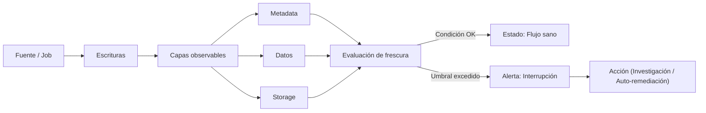
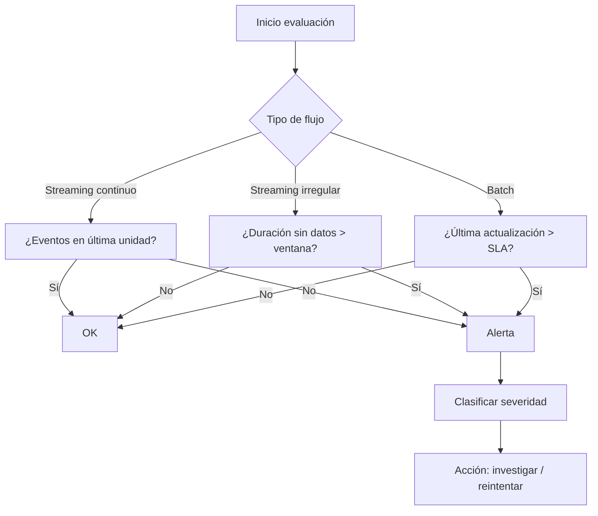

# Patrón: Flow Interruption Detector (Detector de Interrupción de Flujo)

### 1. ¿A qué se refiere con "el trabajo"? (The Job)

En el contexto de la Ingeniería de Datos, "el trabajo" (o _job_ en inglés) se refiere a un **programa, proceso o componente de software** encargado de una tarea específica en tu sistema de datos.

Es el elemento que realiza la acción de ***procesar la información***.

- **Ejemplo Común:** Si estás migrando datos de un sistema A a un sistema B, "el trabajo" es el _script_ o el programa que se ejecuta para leer de A, transformar los datos y luego escribir en B.
    
- **En el Patrón Flow Interruption Detector:** Cuando decimos que "el trabajo de procesamiento falla", nos referimos a que **el programa que procesa los datos se detiene inesperadamente** (por un error de código, falta de memoria, etc.). El patrón se enfoca en el caso en que **el trabajo _no_ falla, sino que simplemente deja de producir resultados**.
    

---

### 2. ¿A qué se refiere con "registro"? (Record)

Un "registro" es la **unidad mínima y fundamental de información** que maneja tu sistema de datos. Es un sinónimo de **fila** o **mensaje**.

Imagina una tabla en una base de datos o una hoja de cálculo.

- **Ejemplo 1 (Tabla):** Cada **fila** de la tabla es un registro. Si tienes una tabla de "Clientes", el registro podría ser: `{id: 101, nombre: Juan Pérez, ciudad: Santiago}`.
    
- **Ejemplo 2 (Streaming):** En sistemas de procesamiento continuo (streaming), un registro es un **mensaje individual** que viaja por la tubería, por ejemplo, `{evento: "click", usuario: 456, hora: 10:05}`.
    
- **En el Patrón Flow Interruption Detector:** El detector está contando estos registros. Si un trabajo de _streaming_ espera un registro cada segundo y de repente no recibe ni escribe **ningún registro** durante 60 segundos, el flujo está interrumpido.
    

---

### 3. ¿A qué se refiere con "escribir registros de salida"? (Writing Output Records)

Esta frase describe la **acción final y productiva** del trabajo que procesa los datos.

Significa que el programa ha terminado su tarea y está **guardando los resultados** para que otros sistemas o usuarios puedan verlos y utilizarlos.

- **Proceso Básico:**
    
    1. El trabajo **lee** registros (datos de entrada).
        
    2. El trabajo **procesa/transforma** esos registros (por ejemplo, calcula la edad a partir de la fecha de nacimiento).
        
    3. El trabajo **escribe** los **registros de salida** (los datos ya transformados) en el destino final (otra tabla, un archivo, un _data lake_, etc.).
        
- **En el Patrón Flow Interruption Detector:** El problema clave es que **el trabajo está ejecutándose** (no falló/no se detuvo), **pero por alguna razón interna** (por ejemplo, la fuente de datos se secó o la lógica de filtrado es muy estricta), **no está logrando escribir ningún dato nuevo en la salida**.

---
# Patrón: Flow Interruption Detector (Detector de Interrupción de Flujo)

## 1. ¿Qué problema resuelve?

Este patrón ataca el problema de la **indisponibilidad de datos silenciosa**.

- **El Escenario:** Tienes un trabajo de datos (un _job_ de streaming o batch) que parece estar funcionando bien: no da error, no se detiene y el sistema dice "Estado: OK".
- **El Problema:** Aunque el trabajo corre, **no está escribiendo datos nuevos**. La tubería está seca.    
- **La Consecuencia:** Como no hay error técnico, tú no te enteras. Te das cuenta días u horas después cuando un usuario o cliente se queja de que los reportes están vacíos o desactualizados. Esto daña tu reputación.

## 2. La Solución

*Implementar un mecanismo de observabilidad* que **vigile específicamente la llegada de datos**, independientemente de si el proceso técnico falló o no.

El objetivo es: **Detectar la ausencia de datos nuevos antes que el cliente.**

---

## 3. ¿Cómo se implementa? (Estrategias)

La forma de detectar el corte depende de cómo se mueven tus datos (Streaming vs. Batch).

### A. En Streaming (Datos en movimiento)

Aquí analizamos el flujo constante. Hay dos modos:

1. **Entrega Continua (El grifo abierto):**
    
    - _Suposición:_ Esperas datos constantemente (ej. 1 registro por segundo).
        
    - _Detección:_ Si pasa **un minuto** (o tu unidad de tiempo mínima) sin recibir nada -> **¡Alerta!**
        
2. **Entrega Irregular (El grifo que gotea):**
    
    - _Suposición:_ Es normal que a veces no lleguen datos. Si alertaras por cada segundo de silencio, tendrías "Fatiga de Alarmas" (demasiadas alertas falsas que terminas ignorando)1.
        
    - _Detección:_ Analizas una **ventana de tiempo** más amplia (ej. 5 minutos). Solo lanzas la alerta si el silencio dura más que esa ventana aceptable.
        

### B. En Batch / Data-at-rest (Datos guardados)

Aquí analizamos la **frescura** de los datos ya guardados. Tienes 3 capas donde mirar:

1. **Capa de Metadata (La etiqueta de la caja):**
    
    - _Cómo:_ Miras la propiedad "Última modificación" de la tabla.
        
    - _Pros:_ Es rápido y barato.
        
    - _Contras:_ A veces la metadata cambia (ej. cambio de esquema) sin que hayan entrado datos nuevos (Falso Positivo).
        
2. **Capa de Datos (El contenido de la caja):**
    
    - _Cómo:_ Haces una consulta real (`SELECT MAX(timestamp)` o `COUNT(*)`) para ver si cambió respecto a la hora anterior.
        
    - _Pros:_ Es lo más preciso.
        
    - _Contras:_ Es costoso y lento en sistemas grandes.
        
3. **Capa de Almacenamiento (El archivo físico):**
    
    - _Cómo:_ Miras si hay archivos nuevos (ej. JSON, Parquet) en el disco/bucket.
        
    - _Pros:_ Fácil de monitorear a nivel de infraestructura.
        
    - _Contras:_ Muy propenso a **Falsos Positivos** por tareas de mantenimiento (ver _Riesgos_ abajo).
        

---

## 4. Consecuencias y Riesgos (Gotchas)

Aunque parece simple, este patrón tiene trampas:

- **El problema del Umbral (Threshold):**
    
    - Definir "cuánto tiempo esperar antes de alertar" es difícil. Si es muy corto, te llenas de alertas falsas. Si es muy largo, detectas el problema tarde.
        
    - _Nota:_ Basarse en volúmenes pasados ayuda, pero eventos como campañas de marketing (picos de tráfico) pueden confundir al detector2.
        
- **Falsos Positivos por Mantenimiento (Compaction):**
    
    - Si usas la estrategia de **Capa de Almacenamiento**, ten cuidado con la "Compactación" (procesos que unen archivos pequeños en uno grande).
        
    - _El riesgo:_ La compactación crea archivos "nuevos" con datos "viejos". Tu detector verá actividad reciente y pensará que todo está bien, cuando en realidad el flujo de datos nuevos está interrumpido3.

# Visto de otra forma

---

> [!info] Objetivo
> Detectar a tiempo la falta de llegada de datos (data unavailability) antes de que los consumidores se quejen. Aumenta la confianza y la observabilidad del pipeline.

> [!summary] Idea central
> Si un flujo (streaming o batch) deja de generar nuevos datos pero el job no falla, se produce una interrupción silenciosa. Este patrón establece mecanismos para alertar cuando el flujo esperado se detiene según umbrales definidos.

---

## 1. Problema

Un job de streaming sincroniza datos hacia un objeto de almacenamiento. Muchos procesos batch dependen de ese dataset. El job sigue “corriendo” pero deja de escribir nuevos datos. Nadie lo nota hasta que un consumidor reclama.

> [!warning] Riesgo
> Sin detector: el sistema aparenta salud (sin errores) pero los downstream pierden frescura, generando retrasos, métricas vacías y pérdida de confianza.

---

## 2. Solución (Patrón)

Implementar mecanismos que verifiquen actividad y “frescura” del flujo y generen alertas si faltan datos dentro de un intervalo aceptable.

### Modos principales de llegada de datos (Streaming)

| Modo | Supuesto | Qué evaluar | Disparo de alerta |
|------|----------|-------------|-------------------|
| Entrega continua | Siempre al menos 1 evento por unidad de tiempo (seg/min) | Ausencia de eventos en la unidad | 1 minuto sin eventos (ejemplo) |
| Entrega irregular | Puede haber pausas benignas | Ventanas de tiempo (N unidades consecutivas) | Ausencia > ventana aceptada |

> [!tip] Selección de modo
> Si el flujo es naturalmente errático, usar entrega continua genera falsos positivos y fatiga de alertas.

![[Pasted image 20251125094232.png]]

Figura 10-1. Comparación entre monitoreo continuo y irregular.

---

## 3. Extensión a Batch y Data-at-Rest

La interrupción también se detecta chequeando la “frescura” en distintas capas:

| Capa | Qué se observa | Estrategia | Ejemplo |
|------|----------------|-----------|---------|
| Metadata | Timestamps de creación/modificación | Alerta si last_modified > umbral | Tabla que debería cambiar cada hora |
| Datos (contenido) | Columna de timestamp, conteo de filas | Comparar actualización o variación | Mismo count dos horas seguidas |
| Storage (archivos) | Hora del último archivo escrito | Monitorear aparición de nuevos archivos | No se escribe un .parquet en 3 horas |

> [!warning] Precaución
> Operaciones internas (compaction, schema changes) pueden actualizar metadata o archivos sin añadir datos nuevos → falsos positivos o negativos.

---

## 4. Flujo conceptual del detector

---

## 5. Umbrales (Thresholds)

> [!info] Definición
> El umbral es el límite de tiempo/volumen que determina cuándo considerar que el flujo se interrumpió.

| Desafío | Detalle | Riesgo |
|---------|---------|-------|
| Elegir valor | Minuto, 5 min, hora, X% variación | Demasiado estricto → ruido |
| Basado en histórico | Promedio pasado vs. actual | Estacionalidad rompe el modelo |
| Eventos atípicos | Picos por campañas | Falsos positivos/negativos |

> [!tip] Recomendación
> - Usar percentiles (p5–p95) de variación histórica.  
> - Ajustar por día/hora (patrones cronológicos).  
> - Revisar umbrales cada ciclo (ej. mensual).

---

## 6. Falsos Positivos Comunes

| Situación | Causa | Mitigación |
|-----------|-------|------------|
| Compaction | Reescritura de archivos sin nuevos datos | Filtrar operaciones técnicas |
| Schema evolution | Cambios de estructura actualizan metadata | Diferenciar escritura de datos vs. metadatos |
| Ventanas irregulares | Flujo naturalmente intermitente | Usar ventanas agregadas |
| Picos de marketing | Volumen extremo temporal | Modelos de baseline robustos |

> [!warning] Alerta de fatiga
> Demasiadas alertas irrelevantes llevan a ignorar las críticas.

---

## 7. Estrategias de Implementación por Capa

| Capa | Técnica | Ventajas | Limitaciones |
|------|---------|----------|--------------|
| Metadata | Leer last_modified | Barato y rápido | Puede incluir cambios no de datos |
| Datos | Columna de update o conteo incremental | Preciso sobre contenido | Costoso para tablas grandes |
| Storage | Timestamp de archivo | Universal (cualquier formato) | Engaños por housekeeping |

---

## 8. Checklists de Implementación

### Streaming continuo
- [ ] Determinar unidad de tiempo (seg/min)
- [ ] Obtener dimensión de volumen esperado
- [ ] Definir umbral (ej. 0 eventos en 1 min)
- [ ] Configurar alerta (Slack, PagerDuty, etc.)
- [ ] Registrar historiales para ajuste futuro

### Streaming irregular
- [ ] Calcular ventanas sin datos históricas aceptables
- [ ] Establecer “no-data-window” (ej. hasta 5 min)
- [ ] Alerta si > ventana tolerada
- [ ] Validar contra períodos de baja natural

### Batch / Data-at-rest
- [ ] Identificar frecuencia esperada (horaria, diaria)
- [ ] Preferir capa metadata (si existe)
- [ ] Fallback: conteo filas o timestamp columna
- [ ] Filtrar operaciones técnicas (compaction, vacuum)
- [ ] Registrar última ejecución + estatus

---

## 9. Métricas útiles

| Métrica | Qué mide | Uso |
|--------|----------|-----|
| Data Freshness | Tiempo desde último dato | SLA/SLO |
| Arrival Rate | Eventos / unidad tiempo | Anomalías |
| Idle Window | Duración sin datos | Interrupciones |
| False Alert Rate | % alertas no útiles | Calidad monitoreo |
| Recovery Time | Tiempo desde alerta a resolución | Eficiencia operativa |

---

## 10. Ejemplos de reglas (conceptual)

| Regla | Descripción |
|-------|-------------|
| “Si no hay nuevos archivos .parquet en la carpeta X en 30 min → alerta crítica.” |
| “Si el conteo de registros se mantiene igual 2 corridas consecutivas en job horario → alerta.” |
| “Si llegada de eventos < p5 histórico durante 10 min → alerta de degradación (no crítica).” |
| “Si last_modified > SLA (1h) → alerta de frescura.” |

---

## 11. Anti-patrones

> [!warning] Evitar
> - Umbrales fijos sin revisión.
> - Mezclar cambios técnicos con cambios de datos.
> - Alertar cada minuto sin consolidación (spam).
> - Falta de clasificación de severidad (todo crítico).
> - No registrar causa raíz y resolución (no se aprende).

---

## 12. Buenas prácticas

> [!tip] Recomendaciones
> - Clasificar alertas: informativa, warning, crítica.
> - Correlacionar con logs de pipeline (¿falló upstream?).
> - Mantener un historial de interrupciones y tiempos de recuperación.
> - Simular interrupciones para validar que el detector funciona.
> - Documentar dónde se mide la frescura (capa y método).

---

## 13. Diagrama de decisión de alerta (simplificado)

---

## 14. Resumen Final

> [!info] En una frase
> El Flow Interruption Detector verifica sistemáticamente la continuidad y frescura del flujo de datos (streaming o batch) usando umbrales calibrados en metadata, contenido o almacenamiento para alertar antes de que el negocio sufra.

---

## 15. Recordatorio rápido (mini ficha)

| Aspecto | Clave |
|---------|-------|
| Qué | Detectar interrupciones silenciosas |
| Dónde | Streaming + Batch + Data-at-rest |
| Cómo | Umbrales sobre eventos, timestamps, conteos, archivos |
| Riesgos | Falsos positivos (compaction, schema), umbral mal calibrado |
| Métrica central | Data Freshness |
| Objetivo | Confianza y reacción temprana |

---

## 16. Checklist de salud del detector

- [ ] Umbrales revisados último mes
- [ ] Clasificación de alertas funcionando
- [ ] Historial de incidentes documentado
- [ ] Pruebas de simulación realizadas
- [ ] Falsos positivos < X% aceptable
- [ ] Integración con canal de respuesta (On-call)

---

> [!quote] Esencial
> “Un pipeline que ‘corre’ pero no produce datos es tan problemático como uno que falla; la diferencia es que uno grita y el otro guarda silencio.”

---