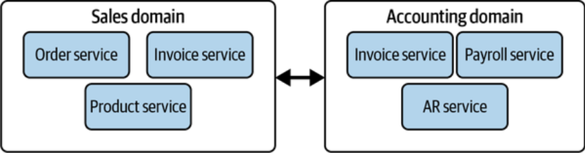
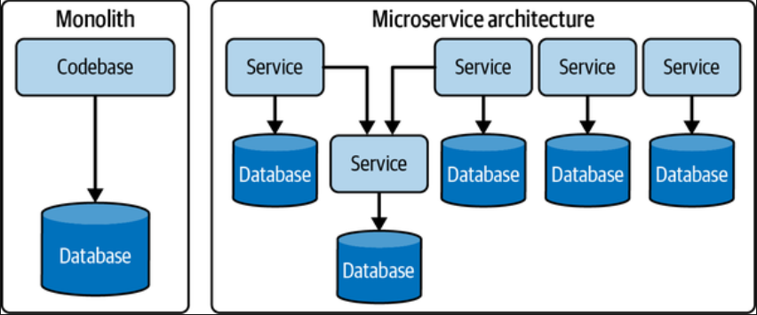
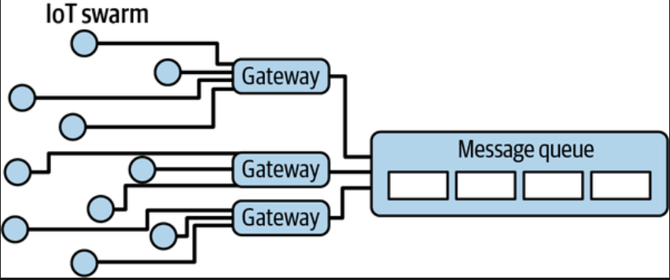
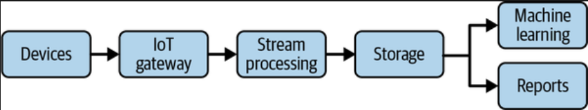

# Capítulo 3. Diseñando una Buena Arquitectura de Datos

Una buena arquitectura de datos proporciona capacidades fluidas a través de cada paso del ciclo de vida de la ingeniería de datos y sus corrientes subyacentes.

## ¿Qué es la Arquitectura de Datos?

La ingeniería de datos exitosa se construye sobre una arquitectura de datos sólida. Dado que el campo cambia constantemente, las definiciones suelen ser inconsistentes. Para definirla, primero debemos entender el contexto en el que se sitúa: la **Arquitectura Empresarial**.

### Arquitectura Empresarial Definida
La arquitectura empresarial tiene muchos subconjuntos, incluidos el negocio, la técnica, la aplicación y los datos.

El libro revisa definiciones de líderes de pensamiento:

*   **TOGAF:** Abarca toda la información, tecnología, procesos e infraestructura de la empresa o un dominio específico. Cruza múltiples sistemas y grupos funcionales.
*   **Gartner:** Disciplina para liderar respuestas proactivas y holísticas a fuerzas disruptivas, identificando y analizando la ejecución del cambio hacia la visión de negocio deseada.
*   **EABOK (Enterprise Architecture Book of Knowledge):** Modelo organizacional que alinea estrategia, operaciones y tecnología.

**Definición de los autores:**

> La arquitectura empresarial es el diseño de sistemas para **soportar el cambio** en la empresa, logrado mediante **decisiones flexibles y reversibles** alcanzadas a través de una evaluación cuidadosa de las **compensaciones (trade-offs)**.

Puntos clave de esta definición:

1.  **Decisiones flexibles y reversibles:**
    *   El mundo cambia constantemente; predecir el futuro es imposible.
    *   Evitan la "osificación empresarial" (rigidez).
    *   **Jeff Bezos y las puertas:**
        *   *Puertas de un solo sentido (One-way doors):* Decisiones casi imposibles de revertir (ej. vender una división). Requieren mucha cautela.
        *   *Puertas de dos sentidos (Two-way doors):* Decisiones reversibles (ej. elegir una base de datos para un microservicio). Si fallas, puedes volver atrás. Las organizaciones deben tomar estas decisiones rápidamente.
2.  **Gestión del cambio:** Las grandes iniciativas deben romperse en cambios más pequeños y reversibles.
3.  **Compensaciones (Trade-offs):** Las soluciones técnicas no existen por sí mismas, sino para apoyar objetivos de negocio. Los ingenieros deben gestionar límites físicos (latencia, confiabilidad) y no físicos (costo, complejidad), minimizando la deuda técnica de alto interés.

### Arquitectura de Datos Definida
Al igual que la ingeniería de datos es un subconjunto del ciclo de vida de los datos, la arquitectura de datos es un subconjunto de la arquitectura empresarial.

*   **TOGAF:** Descripción de la estructura e interacción de los principales tipos y fuentes de datos, activos lógicos y físicos.
*   **DAMA DMBOK:** Identificar necesidades de datos y diseñar planos maestros para cumplirlas.

**Definición de los autores:**

> La arquitectura de datos es el diseño de sistemas para soportar las **necesidades de datos en evolución** de una empresa, logrado mediante decisiones flexibles y reversibles alcanzadas a través de una evaluación cuidadosa de las compensaciones.

Aspectos de la arquitectura de datos:

*   **Arquitectura Operacional (El "Qué"):** Requisitos funcionales, personas, procesos. ¿Qué procesos de negocio sirve el dato? ¿Cuál es el requisito de latencia?
*   **Arquitectura Técnica (El "Cómo"):** Cómo se ingesta, almacena, transforma y sirve el dato.

## "Buena" Arquitectura de Datos

> *"Nunca busques la mejor arquitectura, sino la arquitectura menos mala."* — Mark Richards y Neal Ford.

Una buena arquitectura de datos sirve a los requisitos del negocio con un conjunto común y reutilizable de bloques de construcción, manteniendo la flexibilidad.

*   **Agilidad:** Es la base. La arquitectura debe evolucionar con el negocio.
*   **Mala arquitectura:** Estrechamente acoplada (tightly coupled), rígida, demasiado centralizada o usa herramientas incorrectas.
*   Las **corrientes subyacentes** (seguridad, DataOps, orquestación, etc.) forman la base de una buena arquitectura.

## Principios de una Buena Arquitectura de Datos

Los autores expanden los pilares de *AWS Well-Architected Framework* y los principios de *Google Cloud* para proponer **9 Principios de la Arquitectura de Ingeniería de Datos**:

### Principio 1: Elegir componentes comunes sabiamente
El ingeniero debe seleccionar componentes y prácticas que puedan usarse ampliamente en la organización para facilitar la colaboración y evitar silos.

*   Ejemplos: Almacenamiento de objetos, sistemas de control de versiones, orquestación.
*   **Equilibrio:** Usar componentes comunes para facilitar la interoperabilidad, pero evitar forzar soluciones "talla única" que obstaculicen la productividad en dominios específicos. Las plataformas en la nube son ideales para adoptar componentes comunes.

### Principio 2: Planificar para fallos (Plan for Failure)
"Todo falla, todo el tiempo" (Werner Vogels, AWS). Se deben considerar términos clave:

*   **Disponibilidad:** Porcentaje de tiempo que el servicio está operativo.
*   **Fiabilidad:** Probabilidad de que el sistema cumpla su función definida durante un intervalo.
*   **RTO (Recovery Time Objective):** Tiempo máximo aceptable para una interrupción (¿cuánto tiempo podemos estar caídos?).
*   **RPO (Recovery Point Objective):** Pérdida de datos máxima aceptable tras una recuperación (¿cuántos datos podemos perder?).

### Principio 3: Arquitectar para la Escalabilidad
*   **Scale up (Escalar hacia arriba):** Añadir capacidad para manejar picos (ej. entrenar un modelo con petabytes).
*   **Scale down (Escalar hacia abajo):** Reducir capacidad cuando la carga baja para ahorrar costos.
*   **Elasticidad:** Capacidad de escalar dinámicamente y automáticamente según la carga.
*   **Scale to zero:** Apagarse completamente cuando no está en uso (Serverless).

### Principio 4: La Arquitectura es Liderazgo
Los arquitectos deben ser técnicamente competentes pero delegar el trabajo individual.

*   No deben ser "cuellos de botella" que toman todas las decisiones (estilo comando y control).
*   **Architectus Oryzus (Martin Fowler):** El arquitecto ideal mentora al equipo de desarrollo para que puedan resolver problemas complejos ellos mismos.

### Principio 5: Siempre estar arquitectando (Always Be Architecting)
La arquitectura no es un estado estático; es un proceso continuo.

*   El arquitecto debe conocer la **arquitectura base** (estado actual), desarrollar una **arquitectura objetivo** (futuro) y un **plan de secuenciación** para llegar allí, ajustándose ágilmente a los cambios.

### Principio 6: Construir sistemas débilmente acoplados (Loosely Coupled)
Cuando la arquitectura permite a los equipos probar, desplegar y cambiar sistemas sin depender de otros equipos.

*   **Mandato API de Bezos (2002):** Todos los equipos deben exponer datos/funcionalidad a través de interfaces de servicio. No hay enlaces directos ni puertas traseras. Esto permitió a Amazon escalar masivamente (naciendo AWS).
*   **Características técnicas:** Sistemas rotos en componentes pequeños, interfaces abstractas (API), cambios internos no afectan a otros, actualizaciones separadas.
*   **Características organizacionales:** Equipos pequeños y autónomos que publican detalles abstractos y evolucionan independientemente.

### Principio 7: Tomar decisiones reversibles
Apunta siempre a "puertas de dos sentidos". La tecnología cambia rápido; lo que hoy es popular, mañana es obsoleto. Evita la irreversibilidad en el diseño de software.

### Principio 8: Priorizar la Seguridad
Responsabilidad compartida y seguridad de confianza cero (*Zero-Trust*).

*   **Zero-Trust:** El perímetro endurecido (firewall tradicional) ya no es suficiente. Se asume que las amenazas pueden ser internas y externas.
*   **Modelo de Responsabilidad Compartida:** El proveedor de la nube asegura la infraestructura ("seguridad *de* la nube"), el usuario asegura lo que pone dentro ("seguridad *en* la nube").
*   Todos los ingenieros de datos son ingenieros de seguridad.

### Principio 9: Abrazar FinOps
*FinOps* es la gestión financiera en la nube.

*   Cambio de **CapEx** (Gasto de capital, comprar servidores cada pocos años) a **OpEx** (Gasto operativo, pago por uso).
*   Permite escalar pero hace el gasto dinámico. Los ingenieros deben considerar el costo por consulta o procesamiento.
*   Cuidado con los "ataques de costo" (ej. descargas excesivas de S3 o bucles infinitos en funciones serverless).

## Conceptos Principales de Arquitectura

### Dominios y Servicios
*   **Dominio:** El área temática del mundo real para la que estás arquitectando (ej. Ventas, Contabilidad).
*   **Servicio:** Conjunto de funcionalidades cuyo objetivo es cumplir una tarea (ej. servicio de facturación).
    *   Un dominio puede contener múltiples servicios.
    *   Consejo: Para definir un dominio, habla con los usuarios y stakeholders, no copies ciegamente a otras empresas.

### Sistemas Distribuidos
Para lograr escalabilidad y fiabilidad, se usan sistemas distribuidos.

*   **Escalado horizontal:** Añadir más máquinas (nodos trabajadores) coordinadas por un nodo líder.
*   Provee redundancia (si una máquina muere, otra toma el trabajo).

### Acoplamiento Fuerte vs. Débil (Tight vs. Loose Coupling)

**Niveles de Arquitectura (Tiers):**

1.  **Capa Única (Single Tier):** Base de datos y aplicación en el mismo servidor. Simple pero riesgosa para producción (si falla el servidor, falla todo). No recomendada para producción.

    

2.  **Multicapa (Multitier):** Separa datos, aplicación y lógica.
    *   **Arquitectura de tres capas:** Capa de datos, Capa de aplicación/lógica, Capa de presentación.
    *   **Shared-nothing architecture:** Nodos independientes que no comparten memoria ni disco (reduce contención).
    *   **Shared-disk architecture:** Nodos comparten disco (útil para fallos de nodos).

    

**Monolitos:**

*   Todo bajo un mismo techo (código único, máquina única).
*   Acoplamiento técnico y de dominio.
*   Difícil de mantener, actualizar o reutilizar componentes.
*   A menudo degenera en una "gran bola de lodo" (*big ball of mud*).

**Microservicios:**

*   Servicios separados, descentralizados y débilmente acoplados.
*   Si uno cae, los otros siguen funcionando.
*   No siempre es necesario refactorizar un monolito completo; se pueden extraer servicios poco a poco.

**Consideraciones para datos:**
A menudo los Data Warehouses centrales son monolíticos. El enfoque moderno (como Data Mesh) busca descentralizar esto.

*   **Consejo:** Usa el acoplamiento débil como ideal pragmático, pero reconoce las limitaciones de las tecnologías.

### Acceso de Usuario: Single vs. Multitenant (Multitenencia)
*   **Multitenencia:** Compartir sistemas entre múltiples equipos o clientes.
    *   Casi todos los servicios en la nube son multitenant.
    *   Retos: **Vecinos ruidosos** (un usuario consume todos los recursos y afecta a otros) y **Seguridad** (aislamiento de datos para evitar fugas entre clientes).

### Arquitectura Orientada a Eventos (Event-Driven)
El negocio no es estático; ocurren "eventos" (nueva orden, nuevo cliente).

*   Workflow: Producción de evento -> Enrutamiento -> Consumo.
*   Ventaja: Desacopla servicios. Si un servicio cae, el evento sigue en la cola.

### Proyectos Brownfield vs. Greenfield
1.  **Brownfield (Campo marrón):** Refactorizar o reorganizar una arquitectura existente (legada).
    *   Restringido por decisiones pasadas.
    *   Requiere empatía para entender por qué se tomaron esas decisiones.
    *   **Estrategia:** Evitar el "Big Bang" (reescritura total). Usar el **Patrón Estrangulador** (*Strangler Pattern*): reemplazar el sistema viejo pieza por pieza incrementalmente.
2.  **Greenfield (Campo verde):** Empezar desde cero.
    *   Sin restricciones heredadas.
    *   **Peligro:** "Síndrome del objeto brillante" o "Desarrollo impulsado por el currículum" (usar tecnología nueva solo porque está de moda, sin justificación de negocio).

## Ejemplos y Tipos de Arquitectura de Datos

### Data Warehouse (Almacén de Datos)
Hub central para reportes y análisis. Datos altamente estructurados y limpios.

*   **Definición (Inmon):** Colección de datos orientada a temas, integrada, no volátil y variante en el tiempo.
*   **Arquitectura Organizacional:** Separa OLAP (análisis) de OLTP (transacción). Centraliza datos.
*   **Flujo Tradicional:** ETL (Extract, Transform, Load). Equipos de DBAs y desarrolladores ETL.

*   **Arquitectura Técnica:** Sistemas MPP (Procesamiento Masivo Paralelo). Han evolucionado a almacenamiento columnar.
*   **Data Warehouse en la Nube:** (BigQuery, Snowflake, Redshift). Separan cómputo de almacenamiento. Escalabilidad masiva y pago por uso.
*   **ELT (Extract, Load, Transform):** Cargar datos crudos al warehouse y transformar allí usando su poder de cómputo.

**Data Marts:**
Subconjunto del warehouse enfocado en una sola línea de negocio (ej. Marketing, Ventas).

*   Facilitan el acceso y mejoran el rendimiento (datos pre-agregados).

### Data Lake (Lago de Datos)
Surgió con el Big Data. Repositorio central para todos los datos (estructurados y no estructurados) a bajo costo (Object Storage).

*   **Promesa:** Democratizar datos.
*   **Realidad (Data Lake 1.0):** Se convirtieron en "Data Swamps" (pantanos de datos). Difícil gestión, "Write-Only", falta de esquema y calidad. Transformaciones complejas (MapReduce).
*   **Evolución:** Sigue siendo útil para empresas tecnológicas grandes, pero para muchas fue un fracaso costoso.

### Convergencia: Lakehouse y Plataformas de Datos
*   **Data Lakehouse:** (Concepto de Databricks). Combina la flexibilidad y bajo costo del Data Lake con la gestión, transacciones ACID y estructura del Data Warehouse.
*   **Convergencia:** Los warehouses en la nube ahora soportan datos no estructurados y separan cómputo/almacenamiento. Los lakes ahora tienen capas transaccionales (Delta Lake, Iceberg).
*   El futuro es una plataforma de datos convergente.

### Modern Data Stack (Pila de Datos Moderna)
Arquitectura de analítica de moda.

*   **Objetivo:** Modularidad, plug-and-play, componentes en la nube *off-the-shelf* (Fivetran, Snowflake, dbt, Looker).
*   **Ventajas:** Autoservicio, gestión ágil, barreras de entrada bajas.
*   La comunidad es un aspecto central.

### Arquitectura Lambda
Respuesta temprana al problema de unir Batch y Streaming.

*   Tres capas: Batch (histórico, preciso), Speed (tiempo real, baja latencia), Serving (combina ambas vistas).
*   **Problema:** Complejo de mantener (dos bases de código diferentes para batch y speed).

### Arquitectura Kappa
Respuesta a las deficiencias de Lambda.

*   **Tesis:** Todo es un stream. Usar una plataforma de procesamiento de streams como columna vertebral única.
*   Elimina la capa de Batch separada. Se reprocesan datos reproduciendo el stream.
*   **Problema:** Streaming es complejo y caro para grandes volúmenes históricos. No se ha adoptado masivamente.

### Modelo Dataflow y Unificación Batch/Streaming
Enfoque moderno (Google, Apache Beam, Flink, Spark).

*   Trata el "Batch" como un caso especial de "Streaming" (un stream finito/acotado).
*   Usa el mismo código para ambos.

### Arquitectura para IoT (Internet of Things)
*   **Dispositivos:** Hardware conectado (sensores, cámaras).
*   **Gateway IoT:** Hub que conecta dispositivos y enruta datos de forma segura.
*   **Ingesta/Almacenamiento:** Colas de mensajes (Kafka) o almacenamiento de objetos. Latencia es clave.
*   **Servicio:** Detección de anomalías en tiempo real o reportes batch.
*   **Patrón:** Datos se procesan y se envían de vuelta al dispositivo para optimizarlo (similar a Reverse ETL).

### Data Mesh (Malla de Datos)
Respuesta a los fallos de plataformas monolíticas centralizadas.

*   **Concepto:** Descentralización. Aplicar *Domain-Driven Design* a los datos.
*   **4 Principios (Zhamak Dehghani):**
    1.  Propiedad y arquitectura de datos descentralizada orientada al dominio.
    2.  Datos como producto.
    3.  Infraestructura de datos de autoservicio como plataforma.
    4.  Gobernanza computacional federada.
*   Invierte el modelo: en lugar de fluir a un lago central, los dominios hospedan y sirven sus propios datasets ("Data Products").

## ¿Quién está involucrado en el diseño?
La arquitectura de datos ya no se diseña en una torre de marfil.

*   Los ingenieros de datos deben trabajar junto a arquitectos dedicados (o asumir ese rol en empresas pequeñas).
*   Deben trabajar con stakeholders del negocio para evaluar compensaciones (trade-offs).
*   La distinción entre "arquitectura" e "ingeniería" está desapareciendo; se vuelve más ágil.

## Conclusión
Has aprendido cómo la arquitectura encaja en el ciclo de vida, qué define una "buena" arquitectura y los patrones principales (Warehouse, Lake, Lakehouse, Modern Stack, Lambda/Kappa, IoT, Data Mesh). La clave es estudiar profundamente las compensaciones (trade-offs) de cada una para tomar decisiones concretas y valiosas.
