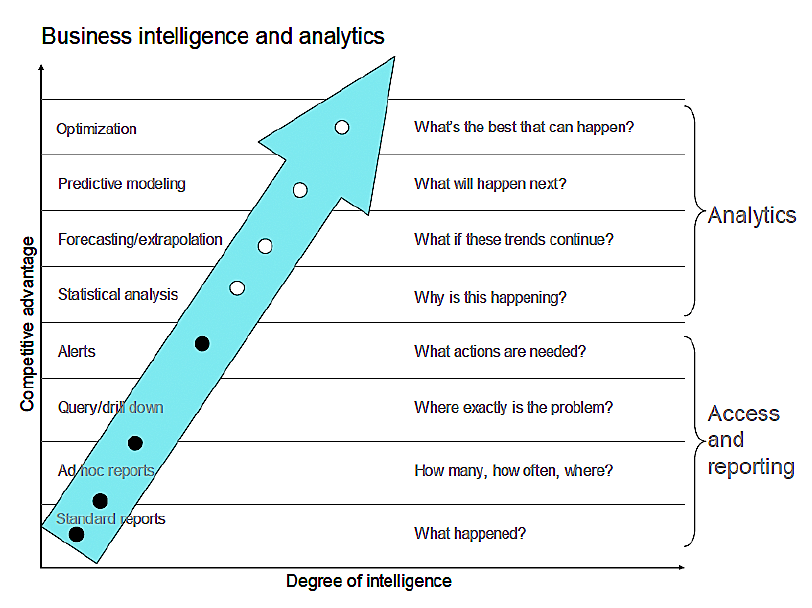

## La Idea Principal: "Sin datos, solo eres otra persona con una opinión"

El capítulo empieza con esta famosa cita de W. Edwards Deming, y esa es la esencia de todo. Ser una organización "Data-Driven" (impulsada por datos) no se trata de tener muchísimos datos ("Big Data") o herramientas caras. Se trata de construir una **cultura** donde las decisiones, desde las más pequeñas hasta las estratégicas, se toman basándose en **evidencia (datos)**, y no solo en la intuición, la jerarquía o la opinión personal.

El autor, Carl Anderson, nos llevará en un viaje para entender qué significa esto realmente, paso a paso.

---

## Parte 1: Los Prerrequisitos (Lo Mínimo Indispensable)

Antes de poder siquiera soñar con ser "data-driven", necesitas dos cosas básicas:

### Prerrequisito #1: Debes Recolectar Datos (¡Pero de los Buenos!)

*   **No se trata de la cantidad, sino de la calidad**: De nada sirve tener petabytes de datos "basura". Un puñado de datos limpios, precisos, relevantes y, sobre todo, **confiables**, es infinitamente más valioso.
*   **La dura realidad**: Los datos casi siempre están sucios y desordenados. El autor menciona la famosa "regla del 80/20": los científicos de datos pasan el 80% de su tiempo limpiando y preparando los datos, y solo el 20% analizándolos. Tener buenos datos es un trabajo difícil y costoso, pero es la base de todo.

### Prerrequisito #2: Los Datos Deben Ser Accesibles y "Utilizables"

Tener datos guardados en un rincón no sirve de nada. Deben ser accesibles y tener tres características clave:

1.  **Combinables (Joinable)**: Los datos de un área deben poder cruzarse con los de otra. El autor da un gran ejemplo de la empresa Warby Parker, donde los analistas tardaban 10 horas en cruzar datos en Excel con la función VLOOKUP. Cuando movieron todo a una base de datos real, pudieron hacer lo mismo en segundos. **Lección**: Necesitas herramientas que te permitan combinar fácilmente la información de ventas con la de marketing, por ejemplo.
2.  **Compartibles (Shareable)**: Debe existir una cultura de compartir datos entre departamentos. Los "silos de datos" (donde cada departamento guarda sus datos y no los comparte) son el enemigo. El autor usa la analogía de un paciente que va del hospital a una clínica: si los datos no se comparten, la atención será peor. Lo mismo pasa en una empresa.
3.  **Consultables (Queryable)**: Necesitas herramientas que permitan a los analistas "hacerle preguntas" a los datos de forma sencilla (filtrar, agrupar, agregar).

**Importante**: Incluso con buenos datos y acceso, no es suficiente. Se necesitan **humanos** que hagan las preguntas correctas y sepan cómo usar esas herramientas. Los datos por sí solos no salvan a ninguna organización.

---

## Parte 2: La Gran Diferencia: Reporting vs. Análisis

Este es el corazón del capítulo. Mucha gente confunde tener reportes con ser "data-driven". El autor deja claro que no es así.

### ¿Qué es el Reporting (y las Alertas)?

El reporting simplemente te dice **QUÉ pasó**. Es descriptivo y mira hacia el pasado.

*   **Ejemplo del reporte**: "Las ventas crecieron un 5.2% de abril a mayo". Suena bien, ¿verdad? Pero este número por sí solo no nos dice casi nada. ¿Por qué creció? ¿Es un crecimiento bueno o malo comparado con otros años? ¿Fue por una campaña de marketing o por pura suerte? **El reporte no tiene contexto.**
*   **Ejemplo de la alerta**: "¡Alerta! El uso de CPU del servidor 14 está al 98%". Esto te dice qué está pasando *ahora mismo*. Pero, ¿por qué? ¿Es un problema grave o es el backup semanal que se ejecuta todos los jueves a la 1 a.m. y es totalmente normal? **La alerta tampoco tiene contexto.**

**Conclusión**: El reporting y las alertas son necesarios y valiosos, pero son insuficientes. Son como mirar por el espejo retrovisor.

### ¿Qué es el Análisis?

El análisis va un paso más allá. Intenta explicar **POR QUÉ** algo pasó y, lo más importante, es **prescriptivo**: te dice **QUÉ deberías hacer al respecto**. El análisis mira hacia el futuro.

| Característica | Reporting | Análisis |
| :--- | :--- | :--- |
| **Pregunta** | ¿Qué pasó? | ¿Por qué pasó? |
| **Visión** | Hacia atrás (descriptivo) | Hacia adelante (prescriptivo) |
| **Resultado** | Información (datos organizados) | *Insights* (comprensión profunda) |
| **Contexto** | No tiene | Es fundamental (contexto + storytelling) |
| **Acción**| Levanta preguntas | Responde preguntas y recomienda acciones |

---

> *Aquí podemos ver las actividades insight-driving en la fila inferior. Como señalé anteriormente, el reporting (A) y las alertas (B) simplemente no son data-driven: declaran lo que sucedió en el pasado o que algo inusual o indeseable está sucediendo ahora; no hay explicación de por qué está sucediendo o por qué sucedió, y no hay recomendaciones sobre cómo resolver o reproducir la situación. Profundizar para entender los factores causales a través de modelos o experimentos (D) es un precursor de ser data-driven. Solo al entender por qué algo sucedió se puede formular un plan o un conjunto de recomendaciones (E). E) y F) son verdaderamente data-driven, pero única y exclusivamente si se actúa en base a la información —explicado en detalle más adelante. 
(C es una zona de peligro: puede ser bastante fácil extender una tendencia percibida hacia el futuro —en Excel, hacer clic en «Gráfico» y luego en «Agregar línea de tendencia»— es decir, extrapolar más allá del rango de datos actual y hacer una predicción ingenua. Incluso al tomar una decisión sensata sobre la forma funcional para el modelo, hay muchas razones por las que esa predicción puede ser engañosa o simplemente errónea. Para tener confianza en esas predicciones, se debe aspirar a tener un modelo causal. Los tipos de análisis se cubren en el Capítulo 5.)
En resumen, la fila inferior destaca actividades orientadas al futuro que incluyen elementos de explicación causal. Ahora estamos empezando a abordar lo que significa ser data-driven.*

## Parte 3: Los Rasgos de una Verdadera Organización Data-Driven

Una organización que ha superado el reporting y vive en el mundo del análisis hace cosas como estas:

1.  **Testing Continuo**: Siempre están experimentando. Por ejemplo, hacen pruebas A/B para ver qué versión de un botón en su web consigue más clics, o qué asunto de un email genera más aperturas.
2.  **Mejora Continua y Optimización**: Usan análisis para optimizar procesos clave, como reducir los tiempos de fabricación o bajar el costo de adquisición de clientes.
3.  **Modelado Predictivo**: Crean modelos para predecir el futuro (ej: pronosticar ventas, ingresos) y, crucialmente, usan los errores de esas predicciones para hacer los modelos cada vez mejores.
4.  **Toma de Decisiones Ponderada**: Cuando tienen que elegir entre varias opciones (ej: ¿en qué ciudad abrimos nuestra próxima oficina?), recopilan datos para cada variable importante (costo de vida, talento disponible, etc.), les dan un peso y toman la decisión basándose en ese análisis, no en una corazonada.

### El Paso Final y Más Importante: La "Cadena de Valor del Análisis"

Aquí llega el punto más crucial de todo el capítulo. Puedes tener los mejores datos y los analistas más inteligentes del mundo, pero si sus hallazgos no se usan para tomar decisiones, no eres data-driven. Es como "un árbol que cae en un bosque sin que nadie lo oiga".

La **Cadena de Valor del Análisis** lo resume perfectamente:
**Datos → Reportes → Análisis → Decisión/Acción → Valor**

Si la cadena se rompe antes de llegar a la **Acción**, todo el esfuerzo anterior fue en vano. El verdadero desafío es **cultural**: crear un entorno donde los líderes confíen en los análisis y estén dispuestos a actuar basándose en ellos.

---

## Parte 4: La Madurez Analítica

El autor introduce un modelo para medir qué tan "avanzada" es una organización en su uso de la analítica. Va desde lo más simple a lo más sofisticado:

> *Jim Davis enunció los siguientes puntos, los que él llama "los ocho niveles de analítica" (eight levels of analytics).*

1.  **Reportes Estándar**: ¿Qué pasó?
2.  **Reportes Ad-hoc / OLAP**: ¿Cuántos? ¿Dónde?
3.	**Query Drill Down**: ¿Dónde está exactamente el problema? ¿Cómo encuentro respuestas? Ejemplo: Descubrimiento de datos acerca de los tipos de usuarios de teléfonos móviles y su comportamiento o rutina de llamadas.
4.  **Alertas**: ¿Qué acciones se necesitan ahora?
5.  **Análisis Estadístico**: ¿Por qué está pasando esto?
6.  **Forecasting (Pronóstico)**: ¿Qué pasará si esta tendencia continúa?
7.  **Modelado Predictivo**: ¿Qué es lo más probable que pase después?
8.  **Optimización**: ¿Cuál es la mejor decisión posible?

**Este esquema se asocia comúnmente con la "Madurez Analítica" (*Analytics Maturity*), PERO Anderson argumenta que es un error verlo así.**

* **La Visión de "Madurez Analítica" (La que Anderson critica)**: Muchos proveedores y consultores presentan este esquema como una escalera rígida, como los niveles de un videojuego. La idea es que una organización tiene que "conquistar" el nivel 1 para pasar al 2, y así sucesivamente. No puedes hacer predicciones (nivel 7) si no eres perfecto haciendo reportes (nivel 1).

* **La Visión de "Capacidad Analítica" (La que Anderson defiende)**: Anderson dice que la realidad no es tan lineal. Una empresa podría ser muy buena haciendo modelado predictivo para una parte de su negocio, aunque sus reportes estándar sean un desastre. Por lo tanto, él prefiere interpretar el esquema de esta manera:

    > El **nivel máximo** que una organización es **capaz** de alcanzar de forma consistente está directamente relacionado con su ventaja competitiva.

En otras palabras, no es una jerarquía que debas escalar paso a paso. Es un espectro de **capacidades**. Si lo más sofisticado que tu empresa puede hacer son alertas y *drill downs*, entonces tu **capacidad analítica** es limitada y tu ventaja competitiva será menor. Si, en cambio, tienes equipos de Ph.D.s haciendo optimización de la cadena de suministro, tu **capacidad analítica** es muy alta, y eso te da una gran ventaja competitiva.

**Crítica importante del autor**: Él advierte que no debemos ver esto como un videojuego donde tienes que pasar un nivel para llegar al siguiente. Una organización puede estar haciendo pronósticos (nivel 5) sin ser perfecta en los reportes ad-hoc (nivel 2). Sin embargo, el **nivel máximo** que una empresa alcanza de forma consistente es un buen indicador de su competitividad y de cuánto invierte en datos.

Estudios (como uno del MIT y IBM) demuestran que las empresas que usan análisis más sofisticados (los niveles más altos) tienen muchas más probabilidades de superar a sus competidores.

## Parte 5: Las Capacidades Analíticas

Después de presentar el modelo de "Madurez Analítica", el autor se hace una pregunta clave: **¿Usar análisis más sofisticados realmente hace que una empresa sea más competitiva?**

Para responder a esto, presenta los hallazgos de un fascinante estudio realizado por el *MIT Sloan Management Review* y el *IBM Institute for Business Value*. Encuestaron a 3,000 gerentes y los dividieron entre "Top Performers" (empresas que superan sustancialmente a sus competidores) y "Lower Performers" (empresas que rinden por debajo de sus competidores).

Los resultados fueron contundentes. En comparación con las empresas de bajo rendimiento, las **empresas de alto rendimiento ("Top Performers") eran**:

*   **Cinco veces** más propensas a usar analítica.
*   **Tres veces** más propensas a ser usuarios **sofisticados** de la analítica.
*   **Dos veces** más propensas a usar la analítica para guiar tanto las **operaciones del día a día** como las **estrategias futuras**.

Esto demuestra que no es una coincidencia: hay una fuerte correlación entre el uso avanzado de la analítica y el éxito empresarial.

### Los Tres Niveles de Capacidad Analítica

El estudio identificó tres niveles de capacidad o "arquetipos" de organizaciones, que nos dan una imagen muy clara de cómo se ve el viaje para ser data-driven:

1.  **Aspiracional (Aspirational)**
    *   **Quiénes son**: Son los principiantes. Reconocen el valor de los datos, pero aún no saben bien cómo usarlos.
    *   **Cómo usan la analítica**: Principalmente para **justificar acciones ya tomadas** o para hacer reportes básicos (mirando hacia atrás).
    *   **Capacidad de gestión de datos**: Muy limitada. Les cuesta capturar, agregar y analizar la información.
    *   **Uso en la empresa**: La analítica, si existe, está confinada a departamentos muy específicos como Finanzas o Ventas.

2.  **Experimentada (Experienced)**
    *   **Quiénes son**: Son los intermedios. Ya han tenido algunos éxitos con la analítica y están empezando a integrarla más seriamente.
    *   **Cómo usan la analítica**: Empiezan a usarla para **guiar acciones futuras**, no solo para justificar el pasado.
    *   **Capacidad de gestión de datos**: Moderada. Han mejorado su capacidad para manejar y analizar datos.
    *   **Uso en la empresa**: El uso se expande más allá de Finanzas a áreas como Estrategia, Desarrollo de Negocio y Servicio al Cliente.

3.  **Transformada (Transformed)**
    *   **Quiénes son**: Son los expertos, las verdaderas organizaciones data-driven. La analítica es parte fundamental de su ADN y de su ventaja competitiva.
    *   **Cómo usan la analítica**: La usan para **prescribir acciones** (decir qué es lo mejor que se puede hacer) y para impulsar la estrategia de forma proactiva.
    *   **Capacidad de gestión de datos**: Alta. Son muy eficientes capturando, analizando y, sobre todo, **diseminando los insights** por toda la organización.
    *   **Uso en la empresa**: La analítica se utiliza en **casi todas las funciones de la empresa**, incluyendo áreas más avanzadas como gestión de riesgos, planificación de la fuerza laboral y marketing de marca.

### La Diferencia en la Práctica

El estudio también cuantificó las diferencias en las capacidades operativas. En comparación con las organizaciones "Aspiracionales", las organizaciones "Transformadas" eran:

*   **4 veces** más propensas a capturar información muy bien.
*   **9 veces** más propensas a agregar información muy bien.
*   **8 veces** más propensas a analizar información muy bien.
*   **10 veces** más propensas a diseminar (compartir) información e insights muy bien.

**Conclusión clave de esta sección**: Ser "data-driven" no es un estado binario (lo eres o no lo eres), sino un espectro de capacidad. Moverse a lo largo de este espectro, desde "Aspiracional" hasta "Transformado", requiere una inversión intencionada en habilidades, herramientas y, sobre todo, en una cultura que confíe y actúe sobre la base de la analítica.

## ¿Qué nos detiene? Los Obstáculos
El capítulo termina mostrando una encuesta sobre los principales obstáculos para ser data-driven. Los dos más importantes son:

1.  **Falta de entendimiento** de cómo usar la analítica para mejorar el negocio.
2.  **Falta de habilidades** analíticas dentro de los equipos de negocio.

De nuevo, vemos que el problema no es la tecnología, sino las personas y la cultura.
