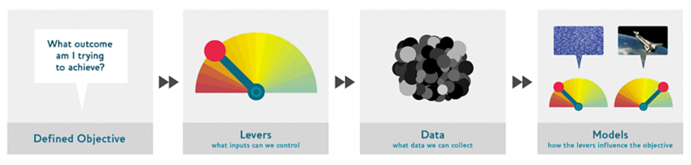
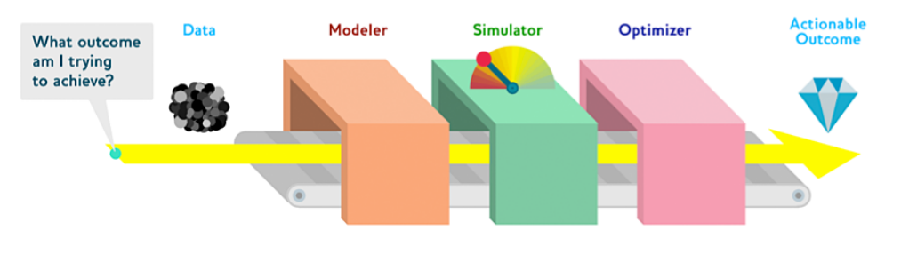

## La Idea Principal: Dejar de Predecir y Empezar a Actuar

El artículo argumenta que la comunidad de ciencia de datos está **obsesionada con la predicción**, pero la predicción por sí sola no sirve de mucho. Es como tener un meteorólogo que predice con un 99% de exactitud que va a llover, pero nunca te dice que lleves un paraguas.

El verdadero valor no está en predecir el futuro, sino en **tomar acciones para cambiarlo a nuestro favor**. Un producto de datos verdaderamente genial no solo te da una predicción, sino que te recomienda o ejecuta la **mejor acción posible** para lograr un objetivo.

Para lograr esto, los autores proponen el **"Drivetrain Approach" (Enfoque de Tren de Transmisión)**, un método sistemático inspirado en los coches autónomos, que no solo predicen el camino, sino que giran el volante y pisan el acelerador para llegar a su destino.

---

## Los 4 Pasos del Drivetrain Approach

Este es el corazón del método. En lugar de empezar por los datos o los algoritmos, se empieza por el final: el objetivo.

1.  **Paso 1: Definir un Objetivo Claro (Defined Objective)**
    *   **La Pregunta**: *¿Qué resultado estoy tratando de lograr?*
    *   **Explicación**: Este es el paso más importante. Debes empezar con un objetivo de negocio, claro y medible. El error común es definir el objetivo en términos del modelo (ej: "predecir qué clientes se darán de baja"). Un buen objetivo es definirlo en términos del negocio (ej: "maximizar el valor de vida del cliente").
    *   **Ejemplo de Google**: El objetivo no era "encontrar páginas relevantes", sino "mostrar al usuario el resultado más relevante en la primera posición".

2.  **Paso 2: Identificar las Palancas (Levers)**
    *   **La Pregunta**: *¿Qué entradas podemos controlar?*
    *   **Explicación**: Una vez que tienes el objetivo, debes identificar qué "botones" o "palancas" puedes accionar para influir en ese objetivo.
    *   **Ejemplo de una aseguradora**: Las palancas son el precio de la póliza, el gasto en marketing, los tipos de accidentes que se cubren, etc.

3.  **Paso 3: Recopilar los Datos (Data)**
    *   **La Pregunta**: *¿Qué datos necesitamos recolectar?*
    *   **Explicación**: Ahora necesitas datos que conecten tus palancas con tu objetivo. A menudo, los datos que ya tienes no son suficientes. Puede que necesites realizar experimentos para generar nuevos datos.
    *   **Ejemplo de Google**: Se dieron cuenta de que los enlaces entre páginas eran un dato crucial para entender la relevancia (si muchas páginas importantes enlazan a otra, esta debe ser importante).

4.  **Paso 4: Construir los Modelos (Models)**
    *   **La Pregunta**: *¿Cómo influyen las palancas en el objetivo?*
    *   **Explicación**: **Solo ahora**, al final del proceso, construyes los modelos predictivos. Estos modelos no son el producto final; son solo los engranajes del sistema. Su función es modelar la relación entre las palancas (y otras variables no controlables) y el objetivo.

---

## La Línea de Ensamblaje de Modelos: El Caso de Estudio de Seguros (ODG)

Para explicar el Paso 4 en detalle, los autores usan un caso de estudio real de una empresa que optimizó los precios de las pólizas de seguros. A este sistema lo llaman la **"Línea de Ensamblaje de Modelos" (Model Assembly Line)**.

El objetivo era **maximizar el beneficio a largo plazo por cada cliente**. Para lograrlo, no bastaba con predecir el riesgo de accidente de una persona. Construyeron una "línea de ensamblaje" con tres estaciones:

1.  **El Modelador (Modeler)**:
    *   **Función**: Crea los modelos predictivos individuales.
    *   **Ejemplos de modelos**:
        *   Un modelo de **elasticidad de precio** (¿cuál es la probabilidad de que un cliente acepte un precio determinado?).
        *   Un modelo de **rentabilidad esperada** (¿cuánto beneficio se espera de un cliente a ese precio, considerando el riesgo?).
        *   Un modelo de **retención de clientes** (¿cuál es la probabilidad de que el cliente renueve su póliza el próximo año?).

2.  **El Simulador (Simulator)**:
    *   **Función**: Es el motor de "What-if" (¿Qué pasaría si...?). Usa los modelos del *Modeler* para simular miles de escenarios posibles.
    *   **Preguntas que responde**: "¿Qué pasaría con nuestro beneficio si bajamos el precio un 10%?" o "¿Qué impacto tendría si un nuevo competidor entra al mercado y no hacemos nada?".

3.  **El Optimizador (Optimizer)**:
    *   **Función**: Es el "cerebro" del sistema. Analiza todos los resultados del *Simulador* y encuentra la **mejor combinación de palancas** para maximizar el objetivo.
    *   **La Salida Final**: No es una predicción, es una **acción**: "Para este cliente específico, el precio óptimo a cobrar es de $957 al año".

---

## Aplicando el Enfoque a Sistemas de Recomendación

Los autores critican los motores de recomendación tradicionales (como el de Amazon en esa época) por no seguir este enfoque.

*   **Problema**: Se centran en un objetivo simple: "predecir qué le gustará al usuario". El resultado es que te recomiendan cosas obvias que ya conoces (ej: si buscas un libro de Terry Pratchett, te recomienda más libros de Terry Pratchett). No aportan valor real y te encierran en una "burbuja de filtros".

*   **Solución con Drivetrain**:
    *   **Nuevo Objetivo**: "Impulsar ventas adicionales sorprendiendo al cliente con libros que **no habría comprado sin la recomendación**".
    *   **Nuevos Modelos**: Construir un modelo que calcule la "utilidad" de una recomendación (la probabilidad de compra *con* la recomendación menos la probabilidad de compra *sin* ella).
    *   **Optimización**: Mostrar las recomendaciones con la mayor utilidad, no las más obvias.

---

## Optimización del Valor de Vida del Cliente (Ejemplo de Marketing)

> *El "valor de vida del cliente" se refiere al beneficio neto total que una empresa espera obtener de un cliente durante toda su relación comercial.*

El enfoque se puede extender a toda la estrategia de marketing.

*   **Objetivo**: Optimizar el valor de vida de cada cliente.
*   **Palancas**: Recomendaciones, descuentos personalizados, promociones por email, etc.
*   **Datos**: Se pueden recolectar de formas creativas. El ejemplo de Zafu, una tienda de jeans online, es genial: en lugar de mostrar el catálogo, primero le hacen preguntas a la clienta sobre su tipo de cuerpo y sus preferencias. Convierten la experiencia de compra en un mecanismo de recolección de datos.

---

## Lecciones del Mundo Físico y el Coche Autónomo

*   **Ingeniería de Sistemas**: Los autores señalan que los ingenieros industriales y de sistemas han pensado de esta manera durante décadas. No construyen un motor y luego buscan un coche donde ponerlo; empiezan con el objetivo ("un coche que transporte personas") y diseñan todos los componentes para que trabajen juntos.

*   **El Coche Autónomo (La analogía completa)**:
    *   **Objetivo**: Construir un coche que se conduzca solo de forma segura.
    *   **Palancas**: Volante, acelerador, frenos.
    *   **Datos**: Sensores y cámaras que leen el entorno.
    *   **Modelos**: Modelos de física y reconocimiento de patrones.
    *   **El Salto Clave**: El coche no solo **predice** que va a haber un accidente. El **Optimizador** simula las posibles acciones (frenar, girar) y elige la **mejor acción para evitar el accidente**. La predicción está al servicio de la optimización.

## Conclusión: El Futuro de los Productos de Datos

El mensaje final es un llamado a la acción para la comunidad de ciencia de datos:

> ¿Queremos productos que entreguen más **datos** (predicciones), o queremos productos que entreguen **resultados basados en datos** (acciones)?

El futuro no está en construir modelos predictivos más precisos, sino en integrarlos en sistemas que **optimizan resultados y automatizan decisiones**, transformando industrias en el proceso.
