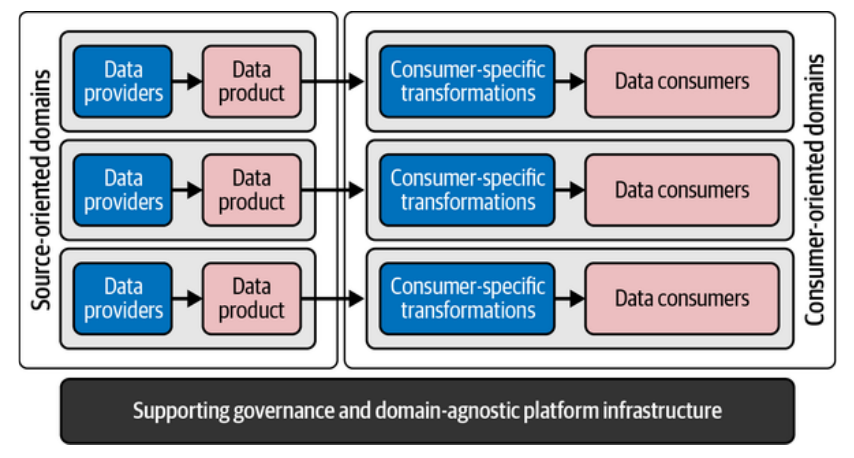
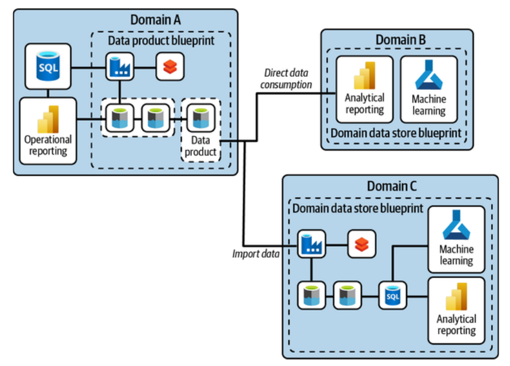
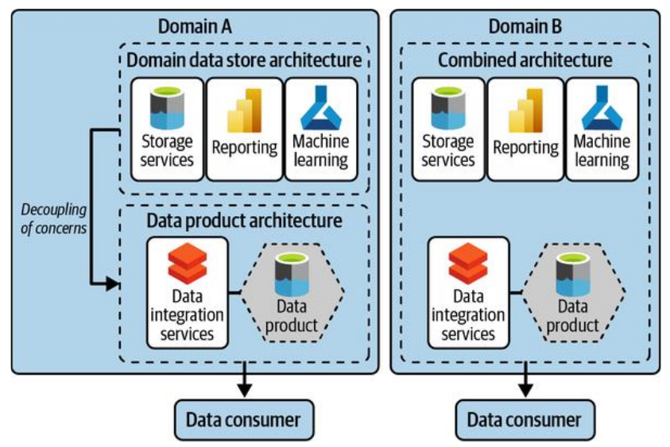
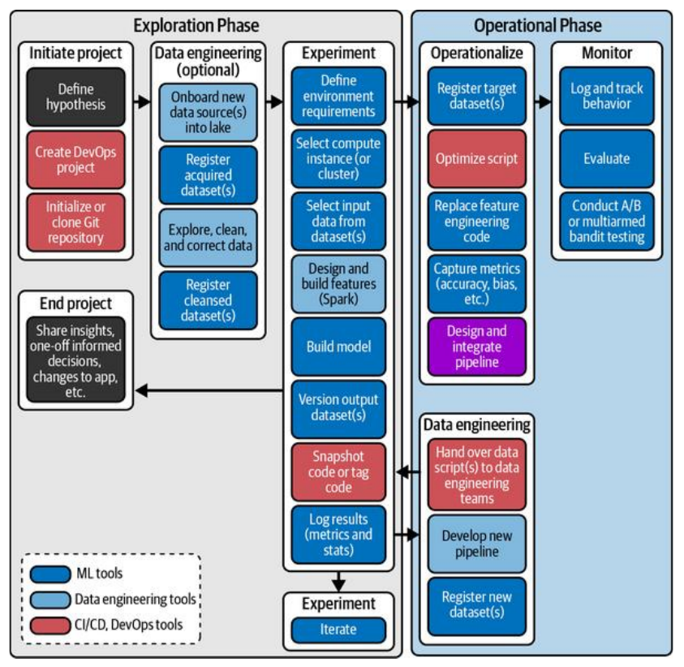

Este capítulo 11 de "Data Management at Scale" es crucial porque conecta los dos mundos que el libro ha estado desarrollando: el lado que **provee datos** (con los productos de datos) y el lado que los **consume para generar valor**.

## La Idea Principal: El Lado del Consumidor es un Mundo Diferente y Complejo

Hasta ahora, el libro se ha centrado en cómo **proveer datos de alta calidad** de manera ordenada y escalable a través de los "productos de datos". Este capítulo cambia el foco y se centra en el **lado del consumidor**: ¿qué pasa cuando alguien toma esos productos de datos para construir algo útil, como un informe de *Business Intelligence* (BI) o un modelo de *Machine Learning* (ML)?

La tesis del autor es clara: **consumir datos es fundamentalmente diferente a proveerlos**. El lado del consumidor es inherentemente más caótico, diverso y específico para cada caso de uso. Intentar aplicar las mismas reglas y arquitecturas a ambos lados es un error.

El objetivo de este capítulo es explicar cómo organizar y estandarizar este "lado del consumidor" para no caer en el caos, pero sin perder la flexibilidad necesaria para crear valor.

---

## 1. El Reto de Convertir Datos en Valor

El autor empieza describiendo un escenario de pesadilla que ha visto muchas veces:

*   **El Problema**: Los equipos de negocio necesitan respuestas rápidas. Como la arquitectura de datos central no se mueve a su velocidad, empiezan a comprar sus propias herramientas de análisis, a conectarse directamente a las bases de datos operacionales y a crear un "salvaje oeste" de flujos de datos punto a punto.
*   **El Resultado Inevitable**: La arquitectura se vuelve un caos complejo, caro y frágil, imposible de gestionar.

Para evitar esto, necesitamos un enfoque estructurado para el lado del consumidor, que se integre de forma controlada con el lado del proveedor.

### Recapitulación: La Arquitectura de Proveedores y Consumidores

El autor nos recuerda el diagrama conceptual que ha estado usando:

*   **Lado Izquierdo (Proveedores)**: Son los "dominios orientados a la fuente". Su trabajo es tomar los datos de los sistemas originales (sus *golden sources*) y empaquetarlos en **productos de datos** limpios, confiables y fáciles de usar. Su objetivo es la **estabilidad y la estandarización**.
*   **Lado Derecho (Consumidores)**: Son los "dominios orientados al consumidor". Su trabajo es tomar uno o varios productos de datos, **combinarlos, transformarlos y crear valor** para un caso de uso de negocio específico (ej: un modelo de predicción de fraude, un *dashboard* de ventas). Su objetivo es la **flexibilidad y la especificidad**.

---

## 2. Patrones de Consumo de Datos

Un consumidor tiene básicamente dos opciones al usar un producto de datos:

1.  **Consumo Directo (Sin Copia)**:
    *   **¿Cómo funciona?**: La aplicación consumidora (ej: una herramienta de BI) lee los datos directamente del producto de datos cada vez que los necesita. No se crea una copia persistente de los datos. Las transformaciones se hacen "al vuelo".
    *   **Ventajas**: Es simple, evita la duplicación de datos (lo que reduce costos y problemas de seguridad) y no requiere crear nuevos modelos de datos complejos.
    *   **Desventajas**: Solo funciona si el producto de datos subyacente es lo suficientemente rápido para las consultas del consumidor. Si necesitas combinar muchos productos de datos o hacer transformaciones muy pesadas, la experiencia del usuario será terrible.

2.  **Creación de "Domain Data Stores" (Con Copia)**:
    *   **¿Cómo funciona?**: Cuando el consumo directo no es suficiente, el consumidor debe **extraer los datos** de los productos de datos, combinarlos, transformarlos y **guardarlos en su propio almacén de datos**.
    *   **¿Cuándo es necesario?**:
        *   Cuando el rendimiento del consumo directo es demasiado lento.
        *   Cuando necesitas combinar múltiples productos de datos.
        *   Cuando aplicas una lógica de negocio compleja para generar nuevos *insights* que deben ser guardados para análisis futuros.

---

## 3. Introducción a los Domain Data Stores (DDS)

Este es el concepto central que el autor introduce en este capítulo para organizar el lado del consumidor.

*   **¿Qué es un DDS?**: Es un **bloque de construcción arquitectónico** diseñado para el lado del consumidor. Es un entorno o almacén de datos que pertenece a un dominio de negocio específico, donde ese dominio puede **consumir, integrar y transformar datos** para sus casos de uso.
*   **Diferencia Clave con los Productos de Datos**:
    *   **Producto de Datos**: Su objetivo es **proveer datos** de forma estable y genérica. Hereda el lenguaje y el contexto del dominio de origen.
    *   **Domain Data Store (DDS)**: Su objetivo es **consumir datos y convertirlos en valor**. Los datos dentro de un DDS están altamente especializados y optimizados para un caso de uso concreto. Están fuertemente acoplados a ese caso de uso.

### Clasificación de Datos dentro de un DDS
Dentro de un DDS, los datos ya no son "productos de datos" puros. El autor propone clasificarlos de la siguiente manera:

1.  **Datos Copiados (Copied Data)**: Datos que se han copiado de un producto de datos, quizás con cambios técnicos o estructurales menores.
2.  **Datos Integrados (Integrated Data)**: Datos que han sido consumidos, combinados y transformados en un nuevo contexto. Están diseñados específicamente para el caso de uso del consumidor. **¡Importante!** Estos datos integrados no deben ser compartidos directamente con otros dominios, porque son frágiles y específicos.
3.  **Nuevo Producto de Datos (Newly created data product data)**: Si un dato integrado resulta ser tan valioso que otros dominios quieren consumirlo, primero debe ser "promovido" y convertido en un producto de datos formal, siguiendo todos los principios de estabilidad y gobernanza.

### DDS vs. Productos de Datos: ¿Juntos o Separados?
Un mismo dominio puede ser a la vez consumidor (usando un DDS) y proveedor (creando productos de datos). El autor presenta dos patrones de diseño para organizar esto:

*   **Dominio A (Separados)**: El dominio tiene dos arquitecturas distintas: una para su DDS (consumir y crear valor) y otra para desarrollar sus productos de datos (proveer datos a otros). Esto **desacopla las preocupaciones** y es más limpio, pero puede duplicar esfuerzos.
*   **Dominio B (Combinados)**: El dominio usa una única arquitectura combinada tanto para consumir como para proveer. Esto crea **sinergias** (se pueden reutilizar servicios de ETL, por ejemplo), pero aumenta el riesgo de acoplamiento y hace más difícil distinguir qué datos son para consumo interno y cuáles para compartir.

---

## 4. Mejores Prácticas para Construir Soluciones de Consumo (DDSs)

El autor ofrece una guía práctica sobre cómo abordar el diseño de estas soluciones en el lado del consumidor.

### A. Requisitos de Negocio
*   **El punto de partida siempre es el negocio**. ¿Qué problema se está tratando de resolver? ¿Monetizar *insights*? ¿Reducir costos? ¿Mejorar la satisfacción del cliente?
*   Se debe tener un **plan a largo plazo** y evitar soluciones *ad hoc* para problemas puntuales.

### B. Audiencia y Modelo Operativo
*   Define claramente los **roles y responsabilidades** del equipo que trabajará en el DDS:
    *   **Domain Owner**: El dueño del negocio.
    *   **Application Owner**: El dueño técnico.
    *   **Analistas / SMEs**: Los expertos en la materia.
    *   **Data Engineers**: Los que construyen los *pipelines*.
    *   **Data Scientists**: Los que construyen los modelos.
    *   **Report Builder**: Los que crean los *dashboards*.
*   Estos roles suelen formar un **equipo de dominio pequeño y multifuncional** (5-10 personas).

### C. Requisitos No Funcionales (Elección de Tecnología)
*   **No hay una base de datos que sirva para todo**. La elección depende de muchos factores (estructura de los datos, tipo de consultas, consistencia, escalabilidad, etc.).
*   El autor recomienda **estandarizar y limitar las opciones** para no terminar con docenas de tecnologías diferentes, lo que sería un caos.

### D. Pipelines de Datos y Modelos
*   Construir un *pipeline* de datos es la parte más compleja. La famosa **"regla del 80/20"** aplica aquí: el 80% del tiempo se dedica a encontrar, limpiar y organizar los datos, y solo el 20% al desarrollo del modelo.
*   **Recomendación**: Construir los *pipelines* como una serie de transformaciones aisladas e inmutables, y versionarlo todo para asegurar la reproducibilidad.

---

## 5. Business Intelligence (BI) y Analítica Avanzada (MLOps)

Finalmente, el capítulo aborda las dos formas más comunes de generar valor a partir de los datos.

### Business Intelligence

> ***Business Intelligence (BI)**: Es el proceso de utilizar tecnología para analizar datos históricos y actuales con el fin de **presentar información accionable que ayude a los líderes de una empresa a entender el negocio y tomar decisiones estratégicas informadas**. Su foco principal es responder a las preguntas "¿qué pasó?" y "¿por qué pasó?".*

> *Es como el panel de control de un auto: te muestra la velocidad, la gasolina que queda y si el motor se está sobrecalentando. Te da la información para que tú tomes una decisión.*

De esta manera, entendemos entonces que el objetivo del BI es hacer que los datos sean comprensibles y accesibles para que los humanos puedan tomar mejores decisiones. Los siguientes conceptos son herramientas clave para lograrlo.

*   **Capas Semánticas**: Son una "traducción" de los datos técnicos a términos de negocio. Permiten a los usuarios finales hacer consultas sin tener que saber de `SQL` o `joins`. Son una abstracción crucial.
*   **Autoservicio (Self-Service)**: La clave es empoderar a los usuarios de negocio para que puedan explorar los datos y responder a sus propias preguntas sin depender de TI. Sin embargo, hay que distinguir entre:
    *   **Datos Gestionados (Managed data)**: Para necesidades de negocio recurrentes y estables (ej: reportes oficiales). Deben ser automatizados y gobernados.
    *   **Datos de Autoservicio (Self-service data)**: Para análisis *ad hoc* y exploraciones puntuales. Son temporales por naturaleza.

### Analítica Avanzada (MLOps)

> ***MLOps (Machine Learning Operations)**: Es una disciplina que combina Machine Learning, DevOps e Ingeniería de Datos con el objetivo de **desplegar, gestionar y monitorear modelos de *machine learning* en producción de forma confiable y eficiente**. Su foco es automatizar y optimizar el ciclo de vida completo de un modelo, desde el entrenamiento hasta su operación y reentrenamiento a escala.*

> *Siguiendo la analogía del auto, es el sistema de piloto automático del mismo: no solo te muestra la información, sino que toma el control del volante para llevarte a tu destino.*

*   **El Reto**: Construir un modelo de ML es una cosa, pero **desplegarlo y gestionarlo en producción a escala es un desafío enorme**.
*   **MLOps**: Es el marco de trabajo (una mezcla de *Machine Learning* y *DevOps*) que busca optimizar el ciclo de vida de los modelos de ML, desde el entrenamiento hasta el monitoreo en producción.
*   El proceso de MLOps es complejo e iterativo, e incluye fases como:
    1.  **Fase de Exploración**: Iniciar el proyecto, experimentar con datos y algoritmos.
    2.  **Fase de Operacionalización**: Automatizar todo el *pipeline* (desde la ingesta de datos hasta el despliegue del modelo) para que sea robusto y repetible.
    3.  **Fase de Monitoreo**: Vigilar el rendimiento del modelo, detectar si se degrada y reentrenarlo automáticamente.

---

## Conclusión (Wrapping Up)

*   **Convertir datos en valor es difícil**. Se requiere un enfoque serio en la gestión de datos y la automatización.
*   El lado del consumidor es diverso y requiere un enfoque diferente al del proveedor. Se necesitan **patrones y *blueprints* reutilizables** para no caer en el caos.
*   **La separación es clave**: El autor aboga por separar estrictamente el uso de datos (consumo) de la distribución de datos (provisión), utilizando dos tipos de *blueprints*: uno para la creación de productos de datos y otro para convertirlos en valor.
*   **Se necesita un cambio cultural**: Los arquitectos de datos deben convertirse también en ingenieros de software, abrazando la automatización y la gestión de procesos de extremo a extremo.
